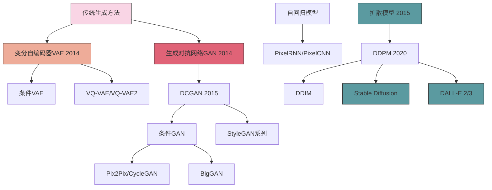
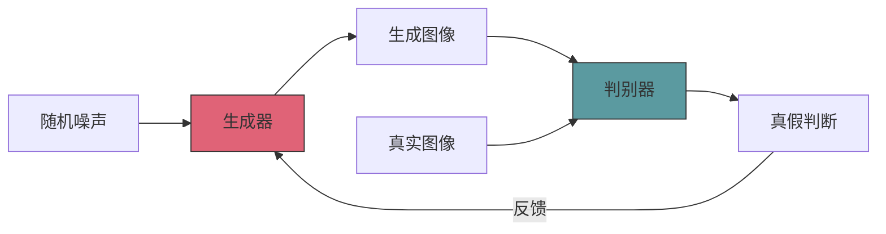
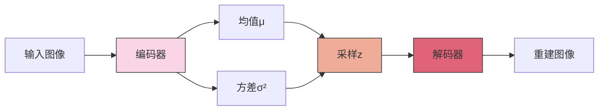
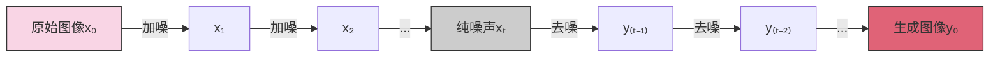

# 图像生成模型

## 目录
- [1. 图像生成概述](#1-图像生成概述)
- [2. 生成对抗网络(GAN)](#2-生成对抗网络gan)
- [3. 变分自编码器(VAE)](#3-变分自编码器vae)
- [4. 扩散模型](#4-扩散模型)
- [5. 评估指标](#5-评估指标)
- [6. 图像生成应用](#6-图像生成应用)

## 1. 图像生成概述

图像生成是深度学习的重要研究领域，旨在创造与真实图像难以区分的新图像。主要生成模型可分为三大类：生成对抗网络(GAN)、变分自编码器(VAE)和扩散模型。这些模型各有特点，应用于不同场景。

### 1.1 生成模型发展历程



### 1.2 生成模型比较

| 模型类型 | 优点 | 缺点 | 训练难度 | 生成质量 | 多样性 | 控制性 |
|---------|------|------|---------|---------|-------|-------|
| GAN | 生成质量高，锐利细节 | 训练不稳定，模式崩溃 | 高 | 高 | 中 | 中 |
| VAE | 训练稳定，潜空间连续 | 生成结果模糊 | 低 | 中 | 高 | 高 |
| 扩散模型 | 高质量，高多样性 | 推理速度慢 | 中 | 极高 | 极高 | 高 |

## 2. 生成对抗网络(GAN)

### 2.1 GAN基本原理

GAN由生成器(Generator)和判别器(Discriminator)组成，两者相互博弈：
- 生成器：尝试创建逼真的图像以欺骗判别器
- 判别器：尝试区分真实图像和生成图像



### 2.2 GAN的数学表示

GAN的训练过程可表示为一个极小极大博弈：

$$\min_G \max_D V(D,G) = \mathbb{E}_{x \sim p_{data}(x)}[\log D(x)] + \mathbb{E}_{z \sim p_z(z)}[\log(1 - D(G(z)))]$$

其中:
- $G$ 是生成器
- $D$ 是判别器
- $p_{data}$ 是真实数据分布
- $p_z$ 是输入噪声分布

### 2.3 经典GAN架构

#### 2.3.1 DCGAN (Deep Convolutional GAN)

DCGAN引入卷积结构，是第一个稳定训练的GAN架构：
- 使用卷积和反卷积(转置卷积)
- BatchNormalization层
- 去除全连接层
- 使用LeakyReLU激活函数

```python
# DCGAN生成器简化实现
import torch.nn as nn

class Generator(nn.Module):
    def __init__(self, z_dim=100, ngf=64, nc=3):
        super(Generator, self).__init__()
        self.main = nn.Sequential(
            # 输入是z，进入反卷积
            nn.ConvTranspose2d(z_dim, ngf * 8, 4, 1, 0, bias=False),
            nn.BatchNorm2d(ngf * 8),
            nn.ReLU(True),
            # 状态尺寸: (ngf*8) x 4 x 4
            nn.ConvTranspose2d(ngf * 8, ngf * 4, 4, 2, 1, bias=False),
            nn.BatchNorm2d(ngf * 4),
            nn.ReLU(True),
            # 状态尺寸: (ngf*4) x 8 x 8
            nn.ConvTranspose2d(ngf * 4, ngf * 2, 4, 2, 1, bias=False),
            nn.BatchNorm2d(ngf * 2),
            nn.ReLU(True),
            # 状态尺寸: (ngf*2) x 16 x 16
            nn.ConvTranspose2d(ngf * 2, ngf, 4, 2, 1, bias=False),
            nn.BatchNorm2d(ngf),
            nn.ReLU(True),
            # 状态尺寸: (ngf) x 32 x 32
            nn.ConvTranspose2d(ngf, nc, 4, 2, 1, bias=False),
            nn.Tanh()
            # 状态尺寸: (nc) x 64 x 64
        )

    def forward(self, input):
        input = input.view(input.size(0), input.size(1), 1, 1)
        return self.main(input)
```

#### 2.3.2 条件GAN

条件GAN通过引入标签信息，控制生成内容：
- 生成器和判别器都接收类别信息
- 实现了按条件生成不同类别图像

#### 2.3.3 StyleGAN系列

StyleGAN由NVIDIA开发，以出色的生成质量著称：
- 引入风格映射网络(mapping network)
- 自适应实例归一化(AdaIN)
- 渐进式增长生成高分辨率图像
- 解耦潜在空间，实现属性控制

### 2.4 图像转换GAN

#### 2.4.1 Pix2Pix

Pix2Pix用于成对数据的图像转换，如草图到照片：
- 使用条件GAN框架
- U-Net结构的生成器
- 使用PatchGAN判别器
- 结合L1重建损失和对抗损失

#### 2.4.2 CycleGAN

CycleGAN实现无需配对数据的跨域转换：
- 两个生成器(G:X→Y和F:Y→X)
- 两个判别器(Dx和Dy)
- 循环一致性损失：确保G(F(y))≈y和F(G(x))≈x

```python
# CycleGAN循环一致性损失
def cycle_consistency_loss(real_x, real_y, G_XtoY, G_YtoX, lambda_cycle=10.0):
    # 前向循环：X -> Y -> X
    fake_y = G_XtoY(real_x)
    reconstructed_x = G_YtoX(fake_y)
    
    # 反向循环：Y -> X -> Y
    fake_x = G_YtoX(real_y)
    reconstructed_y = G_XtoY(fake_x)
    
    # 循环一致性损失
    cycle_loss_X = torch.mean(torch.abs(reconstructed_x - real_x))
    cycle_loss_Y = torch.mean(torch.abs(reconstructed_y - real_y))
    
    # 总循环损失
    cycle_loss = lambda_cycle * (cycle_loss_X + cycle_loss_Y)
    
    return cycle_loss
```

### 2.5 高分辨率GAN

- **ProGAN**：渐进式GAN，逐步增加分辨率
- **BigGAN**：大批量训练、特殊归一化、截断技巧
- **StyleGAN2/3**：解决水滴伪影，改进细节生成

## 3. 变分自编码器(VAE)

### 3.1 VAE基本原理

VAE结合了自编码器架构和变分推断，学习数据的概率分布：
- 编码器：将输入映射到潜在空间分布(均值和方差)
- 解码器：从采样的潜在向量重建输入
- 通过重参数化技巧实现反向传播



### 3.2 VAE的数学表示

VAE优化两部分损失函数：

$$\mathcal{L}(\theta, \phi; x) = -\mathbb{E}_{z \sim q_{\phi}(z|x)}[\log p_{\theta}(x|z)] + D_{KL}(q_{\phi}(z|x) || p(z))$$

其中:
- 第一项是重建损失
- 第二项是KL散度，使编码分布接近先验分布(通常是标准正态分布)

```python
# VAE损失函数
def vae_loss(x_recon, x, mu, logvar):
    # 重建损失
    recon_loss = F.mse_loss(x_recon, x, reduction='sum')
    
    # KL散度
    kl_loss = -0.5 * torch.sum(1 + logvar - mu.pow(2) - logvar.exp())
    
    # 总损失
    total_loss = recon_loss + kl_loss
    
    return total_loss
```

### 3.3 VAE变种

#### 3.3.1 条件VAE (CVAE)

CVAE在潜在空间和解码过程中引入条件信息：
- 编码器：q(z|x,c)
- 解码器：p(x|z,c)
- 实现条件生成和控制

#### 3.3.2 VQ-VAE (Vector Quantized VAE)

VQ-VAE引入离散潜在表示：
- 将连续潜在空间离散化
- 编码为最近的离散码本向量
- 解决了标准VAE中的模糊问题
- 后续改进为VQ-VAE-2，生成更高质量图像

#### 3.3.3 β-VAE

β-VAE通过加权KL散度项，增强潜在空间解耦：
- 增加KL项的权重(β>1)
- 学习更具解释性的潜在表示
- 实现更好的属性控制

## 4. 扩散模型

### 4.1 扩散模型基本原理

扩散模型包含两个过程：
1. **前向扩散过程**：逐步向数据添加噪声，直至变为纯噪声
2. **反向扩散过程**：学习逐步去噪，从纯噪声恢复数据



### 4.2 扩散模型的数学表示

前向过程是马尔科夫链，每步添加高斯噪声：

$$q(x_t|x_{t-1}) = \mathcal{N}(x_t; \sqrt{1-\beta_t}x_{t-1}, \beta_t\mathbf{I})$$

反向过程学习去噪：

$$p_\theta(x_{t-1}|x_t) = \mathcal{N}(x_{t-1}; \mu_\theta(x_t, t), \Sigma_\theta(x_t, t))$$

其中$\beta_t$是噪声调度参数。

### 4.3 主要扩散模型

#### 4.3.1 DDPM (Denoising Diffusion Probabilistic Models)

DDPM是现代扩散模型的基础：
- 固定噪声调度
- U-Net架构预测噪声
- 长采样链(1000步)但生成质量高

```python
# DDPM采样伪代码
def ddpm_sample(model, noise_shape, num_steps=1000):
    # 从纯噪声开始
    x_t = torch.randn(noise_shape)
    
    for t in reversed(range(num_steps)):
        # 预测噪声
        predicted_noise = model(x_t, t)
        
        # 无噪声系数
        alpha_t = 1 - betas[t]
        alpha_bar_t = torch.prod(1 - betas[:t+1])
        
        # 采样噪声(仅用于t>0)
        z = torch.randn_like(x_t) if t > 0 else torch.zeros_like(x_t)
        
        # 更新x_t到x_{t-1}
        noise_scale = (1 - alpha_t) / torch.sqrt(1 - alpha_bar_t)
        x_t = (1 / torch.sqrt(alpha_t)) * (x_t - noise_scale * predicted_noise) + torch.sqrt(betas[t]) * z
    
    return x_t  # 最终生成的图像x_0
```

#### 4.3.2 DDIM (Denoising Diffusion Implicit Models)

DDIM通过确定性映射加速采样：
- 非马尔科夫链
- 大幅减少采样步骤(~50步)
- 支持从潜在表示进行插值

#### 4.3.3 Stable Diffusion

Stable Diffusion在压缩潜在空间上应用扩散：
- 先使用自编码器压缩图像到潜在空间
- 在潜在空间应用扩散模型
- 引入文本条件控制生成
- 大幅减少计算需求

```python
# Stable Diffusion简化推理流程
def stable_diffusion_generate(prompt, model, steps=50, guidance_scale=7.5):
    # 将提示转换为文本嵌入
    text_embeddings = text_encoder(prompt)
    
    # 生成初始噪声
    latent = torch.randn((1, 4, 64, 64))
    
    # 去噪过程
    for t in reversed(range(steps)):
        # 无条件和条件预测
        with torch.no_grad():
            noise_pred_uncond = unet(latent, t, encoder_hidden_states=null_text_embeddings)
            noise_pred_cond = unet(latent, t, encoder_hidden_states=text_embeddings)
        
        # 分类器自由引导
        noise_pred = noise_pred_uncond + guidance_scale * (noise_pred_cond - noise_pred_uncond)
        
        # 使用DDIM采样器更新潜在表示
        latent = ddim_step(latent, noise_pred, t)
    
    # 解码潜在表示到图像
    image = vae_decoder(latent)
    
    return image
```

#### 4.3.4 基于扩散的文本到图像模型

- **DALL-E 2/3**：OpenAI的文本到图像模型，使用CLIP引导
- **Imagen**：Google的高分辨率文本到图像模型
- **Midjourney**：产生艺术质感图像的闭源模型

### 4.4 扩散模型的改进技术

- **引导技术**：分类器引导、无分类器引导
- **采样加速**：DDIM、DPM-Solver、Euler采样器
- **控制方法**：ControlNet、T2I-Adapter、IP-Adapter

## 5. 评估指标

### 5.1 视觉质量评估

- **FID (Fréchet Inception Distance)**：测量生成分布与真实分布的距离
- **IS (Inception Score)**：评估多样性和质量
- **SSIM (Structural Similarity Index)**：评估结构相似性
- **LPIPS (Learned Perceptual Image Patch Similarity)**：感知相似性

```python
# 计算FID分数
def calculate_fid(real_features, generated_features):
    mu1, sigma1 = real_features.mean(axis=0), np.cov(real_features, rowvar=False)
    mu2, sigma2 = generated_features.mean(axis=0), np.cov(generated_features, rowvar=False)
    
    # 计算平方根差
    ssdiff = np.sum((mu1 - mu2) ** 2)
    
    # 计算协方差项
    covmean = sqrtm(sigma1.dot(sigma2))
    
    # 确保没有复数部分
    if np.iscomplexobj(covmean):
        covmean = covmean.real
    
    # 计算FID
    fid = ssdiff + np.trace(sigma1 + sigma2 - 2 * covmean)
    
    return fid
```

### 5.2 多样性评估

- **LPIPS距离**：在潜在空间中的平均距离
- **覆盖率与密度**：评估模式覆盖程度

### 5.3 条件生成评估

- **CLIP得分**：文本-图像对齐度
- **图像-文本相似度**：使用预训练多模态模型评估

## 6. 图像生成应用

### 6.1 艺术创作与设计

- **数字艺术创作**：生成新风格艺术作品
- **辅助设计**：产品、建筑和时尚设计辅助
- **创意激发**：为艺术家提供创意灵感

### 6.2 内容创建与编辑

- **图像编辑**：修复、增强、风格转换
- **内容填充(Inpainting)**：修复图像缺失区域
- **图像扩展(Outpainting)**：扩展图像边界

```python
# 使用扩散模型进行图像修复
def inpaint_image(original_image, mask, prompt, model):
    # 编码图像到潜在空间
    latent = vae_encoder(original_image)
    
    # 在掩码区域添加噪声
    noised_latent = latent.clone()
    noise = torch.randn_like(latent)
    noised_latent[mask] = noise[mask]
    
    # 条件扩散去噪
    for t in reversed(range(steps)):
        # 预测噪声
        noise_pred = model(noised_latent, t, prompt)
        
        # 更新潜在表示
        noised_latent = diffusion_step(noised_latent, noise_pred, t)
        
        # 保持未掩码区域不变
        noised_latent[~mask] = latent[~mask]
    
    # 解码回图像
    inpainted_image = vae_decoder(noised_latent)
    
    return inpainted_image
```

### 6.3 数据增强与合成

- **训练数据增强**：生成额外训练样本
- **合成数据生成**：创建难以获取的数据
- **领域适应**：生成目标域的数据样本

### 6.4 虚拟试验与仿真

- **虚拟试穿**：服装和配饰虚拟试穿
- **室内设计可视化**：家具布置与装修效果预览
- **场景合成**：电影和游戏场景生成

### 6.5 医学图像应用

- **跨模态转换**：MRI到CT等模态转换
- **病理图像合成**：生成罕见病例图像
- **数据匿名化**：保护隐私的图像变换

## 7. 伦理与挑战

### 7.1 技术挑战

- **计算资源需求**：高质量生成模型需要大量计算资源
- **训练稳定性**：GAN训练不稳定性，扩散模型训练耗时
- **评估标准**：缺乏统一的评估标准

### 7.2 伦理问题

- **深度伪造(Deepfake)**：生成虚假但逼真的内容
- **著作权问题**：生成模型使用的训练数据版权
- **偏见与公平性**：模型可能反映或放大数据集中的偏见

### 7.3 应对策略

- **水印技术**：为生成图像添加不可见水印
- **真实性检测**：开发识别生成内容的方法
- **负责任的AI原则**：建立负责任的生成AI开发和使用准则

---

图像生成模型已经成为人工智能领域中最令人兴奋的技术之一，扩散模型的兴起尤其引发了新一轮创新浪潮。随着技术的不断进步，我们可以期待更高质量、更可控、更具创造力的图像生成应用出现在各个领域。同时，负责任地开发和使用这些技术也变得越来越重要。

---

© AI技术知识库 2023 