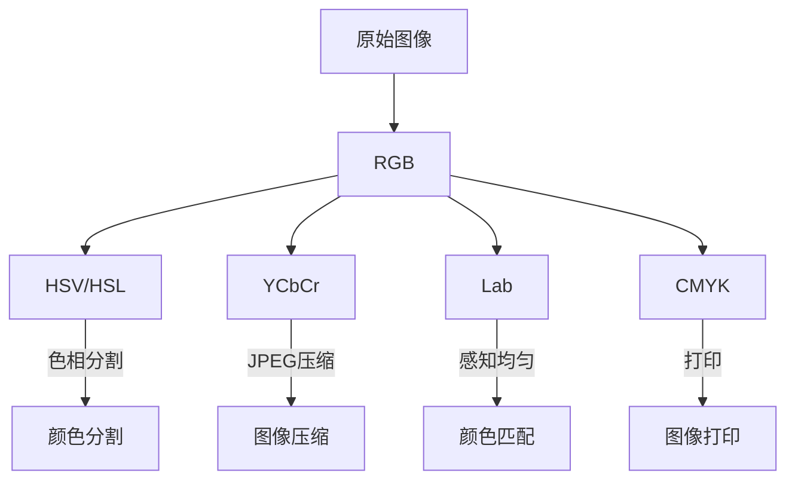

# 图像处理基础

## 目录
- [1. 图像表示与色彩空间](#1-图像表示与色彩空间)
- [2. 图像增强技术](#2-图像增强技术)
- [3. 图像滤波与平滑](#3-图像滤波与平滑)
- [4. 边缘检测](#4-边缘检测)
- [5. 形态学操作](#5-形态学操作)
- [6. 图像变换](#6-图像变换)
- [7. 特征提取](#7-特征提取)
- [8. 图像压缩](#8-图像压缩)
- [9. 深度学习在图像处理中的应用](#9-深度学习在图像处理中的应用)

## 1. 图像表示与色彩空间

### 1.1 数字图像表示

数字图像是由离散的像素点组成的二维矩阵。每个像素包含颜色信息，可以用不同的位深度(bit depth)表示，常见的有:

- 二值图像: 每个像素只有0或1两种值
- 灰度图像: 通常用8位(0-255)表示像素亮度
- 彩色图像: 常见的RGB模型使用3个通道，每个通道8位
- 高动态范围(HDR)图像: 每个通道使用16位或32位浮点数

```
灰度图像(8位):
[
  [125, 136, 140, ...],
  [115, 132, 145, ...],
  ...
]

RGB图像(每通道8位):
[
  [[125, 50, 200], [136, 55, 210], ...],
  [[115, 45, 195], [132, 52, 205], ...],
  ...
]
```

### 1.2 常见色彩空间

不同的色彩空间各有优缺点，适用于不同的图像处理任务:

| 色彩空间 | 描述 | 主要用途 |
|---------|------|---------|
| RGB | 红(R)、绿(G)、蓝(B)三个通道 | 显示设备，图像存储 |
| HSV/HSL | 色相(H)、饱和度(S)、明度(V/L) | 颜色分割，对光照变化更鲁棒 |
| YCbCr | 亮度(Y)、蓝色色度(Cb)、红色色度(Cr) | 视频压缩，JPEG压缩 |
| Lab | 亮度(L)与色度(a,b) | 颜色差异计算，颜色空间转换 |
| CMYK | 青(C)、品红(M)、黄(Y)、黑(K) | 印刷行业 |



### 1.3 色彩空间转换

色彩空间之间的转换是许多图像处理算法的基础。以RGB到HSV的转换为例:

```python
import cv2
import numpy as np

# 读取RGB图像
rgb_img = cv2.imread('image.jpg')

# RGB到HSV转换
hsv_img = cv2.cvtColor(rgb_img, cv2.COLOR_BGR2HSV)

# RGB到Lab转换
lab_img = cv2.cvtColor(rgb_img, cv2.COLOR_BGR2LAB)

# 显示H通道
h_channel = hsv_img[:,:,0]
```

## 2. 图像增强技术

图像增强旨在改善图像的视觉效果或突出特定特征，为后续处理提供更好的输入。

### 2.1 对比度调整

#### 线性对比度拉伸
```python
def linear_contrast_stretch(img, a=0, b=255):
    # 找到图像的最小值和最大值
    c = img.min()
    d = img.max()
    
    # 应用线性变换
    img_stretched = (img - c) * ((b - a) / (d - c)) + a
    return np.uint8(img_stretched)
```

#### 直方图均衡化
```python
# 使用OpenCV进行直方图均衡化
img_eq = cv2.equalizeHist(gray_img)

# 自适应直方图均衡化(CLAHE)
clahe = cv2.createCLAHE(clipLimit=2.0, tileGridSize=(8,8))
img_clahe = clahe.apply(gray_img)
```

### 2.2 亮度调整

```python
# 增加亮度
brighter_img = cv2.convertScaleAbs(img, alpha=1.0, beta=50)

# 减少亮度
darker_img = cv2.convertScaleAbs(img, alpha=1.0, beta=-50)
```

### 2.3 伽马校正

伽马校正通过非线性方式调整图像亮度:
```python
def gamma_correction(img, gamma=1.0):
    # 构建查找表
    inv_gamma = 1.0 / gamma
    table = np.array([((i / 255.0) ** inv_gamma) * 255 for i in range(256)]).astype(np.uint8)
    # 应用查找表
    return cv2.LUT(img, table)
```

### 2.4 颜色平衡

```python
# 调整各通道增益以校正颜色
def color_balance(img, r_gain=1.0, g_gain=1.0, b_gain=1.0):
    # 分离通道
    b, g, r = cv2.split(img)
    
    # 应用增益
    r = cv2.convertScaleAbs(r, alpha=r_gain, beta=0)
    g = cv2.convertScaleAbs(g, alpha=g_gain, beta=0)
    b = cv2.convertScaleAbs(b, alpha=b_gain, beta=0)
    
    # 合并通道
    return cv2.merge([b, g, r])
```

## 3. 图像滤波与平滑

图像滤波是通过卷积操作修改图像的像素值，用于噪声去除、边缘增强等任务。

### 3.1 线性滤波

#### 高斯滤波
```python
# 高斯滤波，用于平滑和去除高斯噪声
# ksize是滤波器大小，sigmaX是X方向的标准差
gaussian_img = cv2.GaussianBlur(img, (5, 5), sigmaX=1.0)
```

#### 均值滤波
```python
# 使用固定大小的滤波核进行平均
mean_img = cv2.blur(img, (5, 5))
```

#### 盒式滤波
```python
# 正规化处理的盒式滤波
box_img = cv2.boxFilter(img, -1, (5, 5), normalize=True)
```

### 3.2 非线性滤波

#### 中值滤波
特别适合去除椒盐噪声(salt-and-pepper noise)
```python
# 中值滤波
median_img = cv2.medianBlur(img, 5)
```

#### 双边滤波
保持边缘的同时平滑区域
```python
# 双边滤波
bilateral_img = cv2.bilateralFilter(img, d=9, sigmaColor=75, sigmaSpace=75)
```

### 3.3 自定义卷积核

```python
# 创建自定义卷积核
kernel = np.array([[-1, -1, -1],
                   [-1,  9, -1],
                   [-1, -1, -1]], dtype=np.float32)

# 应用卷积核(锐化)
sharpened = cv2.filter2D(img, -1, kernel)
```

## 4. 边缘检测

边缘是图像中亮度或颜色快速变化的区域，边缘检测是许多高级图像处理算法的基础。

### 4.1 梯度算子

#### Sobel算子
```python
# 计算x和y方向的梯度
sobelx = cv2.Sobel(gray_img, cv2.CV_64F, 1, 0, ksize=3)
sobely = cv2.Sobel(gray_img, cv2.CV_64F, 0, 1, ksize=3)

# 计算梯度幅值
sobel_mag = np.sqrt(sobelx**2 + sobely**2)
sobel_mag = np.uint8(np.clip(sobel_mag, 0, 255))
```

#### Scharr算子
Sobel的改进版本，对角度变化更敏感
```python
scharrx = cv2.Scharr(gray_img, cv2.CV_64F, 1, 0)
scharry = cv2.Scharr(gray_img, cv2.CV_64F, 0, 1)
```

### 4.2 Laplacian算子

Laplacian算子计算图像的二阶导数，对噪声更敏感
```python
laplacian = cv2.Laplacian(gray_img, cv2.CV_64F, ksize=3)
laplacian = np.uint8(np.clip(np.absolute(laplacian), 0, 255))
```

### 4.3 Canny边缘检测

Canny是一种多阶段边缘检测算法，包括高斯平滑、计算梯度、非最大抑制和滞后阈值处理
```python
# Canny边缘检测
# 参数1和2是低阈值和高阈值
edges = cv2.Canny(gray_img, 100, 200)
```

## 5. 形态学操作

形态学操作是基于形状的一组图像处理操作，通常应用于二值图像。

### 5.1 基本操作

#### 腐蚀(Erosion)
缩小前景物体
```python
# 定义结构元素
kernel = np.ones((5,5), np.uint8)
# 腐蚀操作
erosion = cv2.erode(binary_img, kernel, iterations=1)
```

#### 膨胀(Dilation)
扩大前景物体
```python
# 膨胀操作
dilation = cv2.dilate(binary_img, kernel, iterations=1)
```

### 5.2 复合操作

#### 开运算(Opening)
先腐蚀后膨胀，去除噪点
```python
# 开运算
opening = cv2.morphologyEx(binary_img, cv2.MORPH_OPEN, kernel)
```

#### 闭运算(Closing)
先膨胀后腐蚀，填充孔洞
```python
# 闭运算
closing = cv2.morphologyEx(binary_img, cv2.MORPH_CLOSE, kernel)
```

#### 形态学梯度
膨胀结果减去腐蚀结果，得到物体边界
```python
# 形态学梯度
gradient = cv2.morphologyEx(binary_img, cv2.MORPH_GRADIENT, kernel)
```

#### 顶帽(Top Hat)
原图像减去开运算结果
```python
# 顶帽
tophat = cv2.morphologyEx(binary_img, cv2.MORPH_TOPHAT, kernel)
```

#### 黑帽(Black Hat)
闭运算结果减去原图像
```python
# 黑帽
blackhat = cv2.morphologyEx(binary_img, cv2.MORPH_BLACKHAT, kernel)
```

## 6. 图像变换

### 6.1 几何变换

#### 缩放
```python
# 缩放图像
resized = cv2.resize(img, (width, height), interpolation=cv2.INTER_CUBIC)
```

#### 旋转
```python
# 获取图像中心
center = (img.shape[1] // 2, img.shape[0] // 2)
# 创建旋转矩阵
rot_matrix = cv2.getRotationMatrix2D(center, angle=45, scale=1.0)
# 应用旋转变换
rotated = cv2.warpAffine(img, rot_matrix, (img.shape[1], img.shape[0]))
```

#### 仿射变换
```python
# 定义原始点和目标点
src_pts = np.float32([[0,0], [img.shape[1]-1,0], [0,img.shape[0]-1]])
dst_pts = np.float32([[50,50], [img.shape[1]-100,50], [50,img.shape[0]-100]])
# 计算仿射变换矩阵
affine_matrix = cv2.getAffineTransform(src_pts, dst_pts)
# 应用仿射变换
affine_img = cv2.warpAffine(img, affine_matrix, (img.shape[1], img.shape[0]))
```

#### 透视变换
```python
# 定义4个原始点和对应的目标点
src_pts = np.float32([[56,65], [368,52], [28,387], [389,390]])
dst_pts = np.float32([[0,0], [300,0], [0,300], [300,300]])
# 计算透视变换矩阵
perspective_matrix = cv2.getPerspectiveTransform(src_pts, dst_pts)
# 应用透视变换
perspective_img = cv2.warpPerspective(img, perspective_matrix, (300, 300))
```

### 6.2 频域变换

#### 傅里叶变换
```python
# 傅里叶变换
f = np.fft.fft2(gray_img)
fshift = np.fft.fftshift(f)  # 将低频移到中心
magnitude_spectrum = 20 * np.log(np.abs(fshift) + 1)  # 取幅度的对数

# 应用低通滤波器
rows, cols = gray_img.shape
crow, ccol = rows // 2, cols // 2
mask = np.zeros((rows, cols), np.uint8)
mask[crow-30:crow+30, ccol-30:ccol+30] = 1  # 低通滤波器
fshift_filtered = fshift * mask
f_ishift = np.fft.ifftshift(fshift_filtered)
img_back = np.fft.ifft2(f_ishift)
img_back = np.abs(img_back)  # 取幅度
```

#### 离散余弦变换(DCT)
```python
# 离散余弦变换
dct = cv2.dct(np.float32(gray_img))
# 截断高频分量
dct[10:, :] = 0
dct[:, 10:] = 0
# 反变换
img_back = cv2.idct(dct)
```

#### 小波变换
```python
# 使用PyWavelets进行小波变换
import pywt
coeffs2 = pywt.dwt2(gray_img, 'bior1.3')
LL, (LH, HL, HH) = coeffs2  # 近似，(水平细节，垂直细节，对角细节)

# 重建
reconstructed = pywt.idwt2(coeffs2, 'bior1.3')
```

## 7. 特征提取

### 7.1 角点检测

#### Harris角点检测
```python
# 转换为灰度图
gray = cv2.cvtColor(img, cv2.COLOR_BGR2GRAY)
# Harris角点检测
harris = cv2.cornerHarris(gray, blockSize=2, ksize=3, k=0.04)
# 阈值处理，标记角点
img[harris > 0.01 * harris.max()] = [0, 0, 255]  # 标记为红色
```

#### Shi-Tomasi角点检测
```python
# Shi-Tomasi角点检测
corners = cv2.goodFeaturesToTrack(gray, maxCorners=100, qualityLevel=0.01, minDistance=10)
# 绘制角点
corners = np.int0(corners)
for corner in corners:
    x, y = corner.ravel()
    cv2.circle(img, (x, y), 3, (0, 255, 0), -1)  # 画绿色圆圈
```

### 7.2 SIFT/SURF/ORB特征

#### SIFT (Scale-Invariant Feature Transform)
```python
# 创建SIFT对象
sift = cv2.SIFT_create()
# 检测关键点和计算描述符
keypoints, descriptors = sift.detectAndCompute(gray, None)
# 绘制关键点
sift_img = cv2.drawKeypoints(img, keypoints, None, flags=cv2.DRAW_MATCHES_FLAGS_DRAW_RICH_KEYPOINTS)
```

#### SURF (Speeded-Up Robust Features)
```python
# 创建SURF对象
surf = cv2.xfeatures2d.SURF_create(400)  # Hessian阈值
# 检测关键点和计算描述符
keypoints, descriptors = surf.detectAndCompute(gray, None)
```

#### ORB (Oriented FAST and Rotated BRIEF)
```python
# 创建ORB对象
orb = cv2.ORB_create()
# 检测关键点和计算描述符
keypoints, descriptors = orb.detectAndCompute(gray, None)
```

### 7.3 HOG (Histogram of Oriented Gradients)

```python
from skimage.feature import hog
from skimage import exposure

# 计算HOG特征
fd, hog_image = hog(gray, orientations=8, pixels_per_cell=(16, 16),
                    cells_per_block=(1, 1), visualize=True)

# 特征可视化
hog_image_rescaled = exposure.rescale_intensity(hog_image, in_range=(0, 10))
```

## 8. 图像压缩

### 8.1 有损压缩

#### JPEG压缩
```python
# 使用不同质量参数保存JPEG
cv2.imwrite('compressed_image.jpg', img, [cv2.IMWRITE_JPEG_QUALITY, 50])  # 50%质量
```

### 8.2 无损压缩

#### PNG压缩
```python
# PNG压缩
cv2.imwrite('compressed_image.png', img, [cv2.IMWRITE_PNG_COMPRESSION, 9])  # 最高压缩率
```

### 8.3 图像金字塔

```python
# 高斯金字塔 - 下采样
smaller = cv2.pyrDown(img)  # 尺寸减半

# 拉普拉斯金字塔
larger = cv2.pyrUp(smaller)  # 尺寸加倍
laplacian = cv2.subtract(img, larger)  # 差值图像
```

## 9. 深度学习在图像处理中的应用

### 9.1 图像去噪

```python
# 使用预训练的DnCNN模型进行去噪
# 这是一个伪代码示例，实际使用需要加载预训练模型
import torch
import torch.nn as nn

class DnCNN(nn.Module):
    def __init__(self, num_layers=17, num_features=64):
        super(DnCNN, self).__init__()
        layers = [
            nn.Conv2d(1, num_features, kernel_size=3, padding=1),
            nn.ReLU(inplace=True)
        ]
        
        for _ in range(num_layers - 2):
            layers.append(nn.Conv2d(num_features, num_features, kernel_size=3, padding=1))
            layers.append(nn.BatchNorm2d(num_features))
            layers.append(nn.ReLU(inplace=True))
            
        layers.append(nn.Conv2d(num_features, 1, kernel_size=3, padding=1))
        self.dncnn = nn.Sequential(*layers)
        
    def forward(self, x):
        noise = self.dncnn(x)
        return x - noise
```

### 9.2 超分辨率

```python
# 使用ESRGAN等模型进行超分辨率
# 伪代码示例
def super_resolution(low_res_img, model):
    # 图像预处理
    lr_tensor = preprocess(low_res_img)
    
    # 模型推理
    with torch.no_grad():
        sr_tensor = model(lr_tensor)
    
    # 后处理
    sr_img = postprocess(sr_tensor)
    return sr_img
```

### 9.3 图像修复(Image Inpainting)

```python
# 使用深度学习模型进行图像修复
# 伪代码示例
def inpaint_image(img, mask, model):
    # 图像和掩码预处理
    img_tensor, mask_tensor = preprocess(img, mask)
    
    # 模型推理
    with torch.no_grad():
        inpainted_tensor = model(img_tensor, mask_tensor)
    
    # 后处理
    inpainted_img = postprocess(inpainted_tensor)
    return inpainted_img
```

### 9.4 图像翻译(Image-to-Image Translation)

```python
# 使用CycleGAN、Pix2Pix等模型进行图像风格转换
# 伪代码示例
def style_transfer(content_img, model):
    # 图像预处理
    content_tensor = preprocess(content_img)
    
    # 模型推理
    with torch.no_grad():
        stylized_tensor = model(content_tensor)
    
    # 后处理
    stylized_img = postprocess(stylized_tensor)
    return stylized_img
```

---

## 总结

图像处理是计算机视觉的基础，从传统的滤波、增强和变换技术到现代的深度学习方法，为各种高级视觉任务提供了坚实的基础。理解这些基本概念和技术对开发先进的视觉应用至关重要。

---

© AI技术知识库 2023 