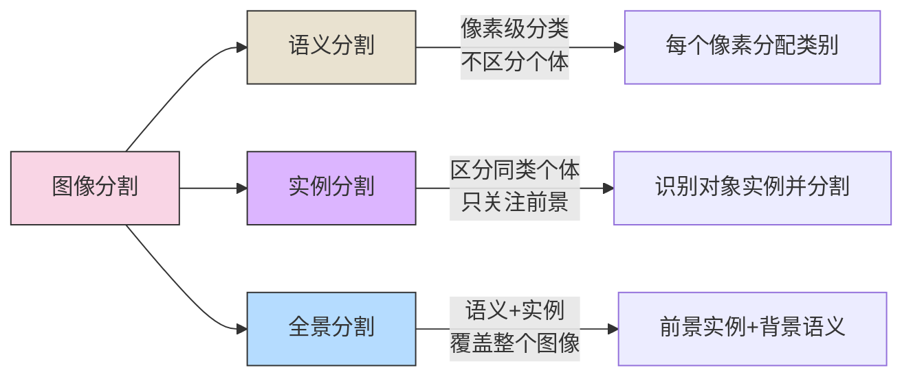
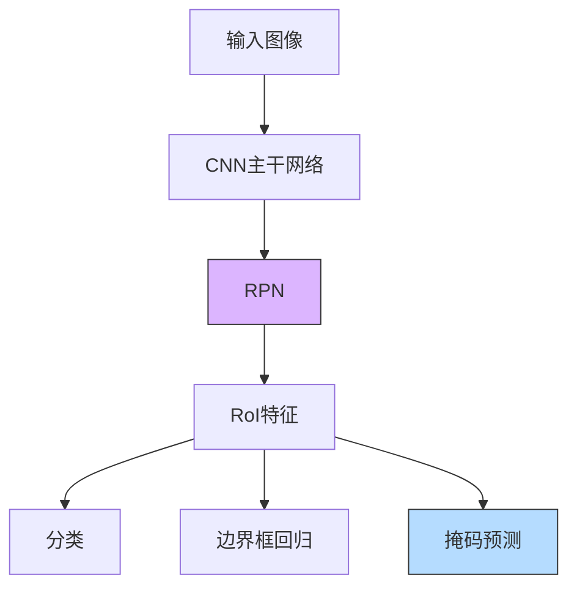

# 图像分割方法

## 目录
- [1. 图像分割概述](#1-图像分割概述)
- [2. 语义分割](#2-语义分割)
- [3. 实例分割](#3-实例分割)
- [4. 全景分割](#4-全景分割)
- [5. 评估指标](#5-评估指标)
- [6. 应用场景](#6-应用场景)

## 1. 图像分割概述

图像分割是计算机视觉中的基础任务，旨在将图像像素划分为有意义的区域或对象。根据任务的精细程度，图像分割主要分为三类：



### 主要分割类型比较

| 分割类型 | 描述 | 输出结果 | 应用场景 | 挑战 |
|---------|------|---------|---------|------|
| 语义分割 | 将图像中每个像素分配到预定义的类别 | 类别掩码 | 场景理解、自动驾驶 | 边界精度、小目标 |
| 实例分割 | 检测并分割图像中的每个对象实例 | 实例掩码+类别 | 物体计数、机器人抓取 | 实例分离、遮挡处理 |
| 全景分割 | 结合语义分割和实例分割的优点 | 前景实例+背景语义 | 完整场景理解 | 复杂性高、训练难度大 |

## 2. 语义分割

语义分割将图像中的每个像素分配给一个语义类别，不区分同一类别的不同实例。

### 2.1 传统方法

- **阈值分割**：基于像素强度的简单分割
- **区域生长**：从种子点扩展区域
- **分水岭算法**：将图像视为地形图，识别"山脊"和"山谷"
- **图割(Graph Cut)**：将分割问题建模为图上的最小割问题
- **活动轮廓(Active Contour/Snake)**：通过能量最小化调整轮廓

### 2.2 深度学习方法

#### 2.2.1 FCN (全卷积网络)

FCN是第一个端到端的像素级分割网络，将分类网络中的全连接层替换为卷积层，并引入上采样和跳跃连接恢复空间信息。


#### 2.2.2 U-Net

U-Net采用编码器-解码器结构，具有对称的跳跃连接，保证高分辨率特征的传递，特别适用于医疗图像分割。

```python
# U-Net简化实现
import torch
import torch.nn as nn

class DoubleConv(nn.Module):
    def __init__(self, in_ch, out_ch):
        super(DoubleConv, self).__init__()
        self.conv = nn.Sequential(
            nn.Conv2d(in_ch, out_ch, 3, padding=1),
            nn.BatchNorm2d(out_ch),
            nn.ReLU(inplace=True),
            nn.Conv2d(out_ch, out_ch, 3, padding=1),
            nn.BatchNorm2d(out_ch),
            nn.ReLU(inplace=True)
        )
    
    def forward(self, x):
        return self.conv(x)

class UNet(nn.Module):
    def __init__(self, n_channels, n_classes):
        super(UNet, self).__init__()
        self.inc = DoubleConv(n_channels, 64)
        self.down1 = nn.Sequential(nn.MaxPool2d(2), DoubleConv(64, 128))
        self.down2 = nn.Sequential(nn.MaxPool2d(2), DoubleConv(128, 256))
        self.down3 = nn.Sequential(nn.MaxPool2d(2), DoubleConv(256, 512))
        self.down4 = nn.Sequential(nn.MaxPool2d(2), DoubleConv(512, 1024))
        
        self.up1 = nn.ConvTranspose2d(1024, 512, 2, stride=2)
        self.conv1 = DoubleConv(1024, 512)
        self.up2 = nn.ConvTranspose2d(512, 256, 2, stride=2)
        self.conv2 = DoubleConv(512, 256)
        self.up3 = nn.ConvTranspose2d(256, 128, 2, stride=2)
        self.conv3 = DoubleConv(256, 128)
        self.up4 = nn.ConvTranspose2d(128, 64, 2, stride=2)
        self.conv4 = DoubleConv(128, 64)
        
        self.outc = nn.Conv2d(64, n_classes, 1)
    
    def forward(self, x):
        x1 = self.inc(x)
        x2 = self.down1(x1)
        x3 = self.down2(x2)
        x4 = self.down3(x3)
        x5 = self.down4(x4)
        
        x = self.up1(x5)
        x = torch.cat([x4, x], dim=1)
        x = self.conv1(x)
        
        x = self.up2(x)
        x = torch.cat([x3, x], dim=1)
        x = self.conv2(x)
        
        x = self.up3(x)
        x = torch.cat([x2, x], dim=1)
        x = self.conv3(x)
        
        x = self.up4(x)
        x = torch.cat([x1, x], dim=1)
        x = self.conv4(x)
        
        x = self.outc(x)
        return x
```

#### 2.2.3 DeepLab系列

DeepLab系列网络通过以下创新提高了语义分割性能：

- **空洞卷积(Atrous/Dilated Convolution)**：扩大感受野而不增加参数
- **ASPP(Atrous Spatial Pyramid Pooling)**：多尺度特征提取
- **CRF(Conditional Random Field)**：后处理细化边界

#### 2.2.4 PSPNet (Pyramid Scene Parsing Network)

PSPNet引入金字塔池化模块(PPM)，在不同尺度捕获上下文信息，提高分割质量。

#### 2.2.5 基于Transformer的方法

- **SETR (SEgmentation TRansformer)**：使用ViT作为编码器
- **SegFormer**：轻量级Transformer编码器+多尺度特征融合解码器
- **Mask2Former**：掩码分类架构，适用于各种分割任务

## 3. 实例分割

实例分割不仅要分配像素的类别，还要区分同一类别的不同实例。

### 3.1 基于提议的方法

#### 3.1.1 Mask R-CNN

Mask R-CNN是实例分割的奠基之作，它在Faster R-CNN的基础上添加了掩码预测分支：

1. 使用RPN生成区域提议
2. 使用RoIAlign精确提取特征
3. 并行预测类别、边界框和掩码



#### 3.1.2 PANet (Path Aggregation Network)

PANet在Mask R-CNN基础上改进了特征提取部分：
- 自底向上路径增强，增强低层特征
- 自适应特征池化，提高特征利用率
- 全连接融合增强区域特征

### 3.2 基于分割的方法

#### 3.2.1 实例嵌入方法

- **DeepMask/SharpMask**：生成分割提议，再分类
- **InstanceFCN**：预测相对位置敏感的得分图

#### 3.2.2 YOLACT (You Only Look At CoefficienTs)

YOLACT是一种实时实例分割方法：
1. 生成原型掩码（共享的掩码基础）
2. 预测每个实例的掩码系数
3. 线性组合生成实例掩码

#### 3.2.3 CenterMask

CenterMask结合了目标检测和实例分割：
1. 使用FCOS或CenterNet进行锚点无关检测
2. 添加掩码分支预测空间注意力引导的掩码

### 3.3 基于聚类的方法

#### 3.3.1 EmbedMask

EmbedMask为每个像素学习嵌入向量，通过聚类分离不同实例：
1. 预测像素嵌入和实例嵌入
2. 计算相似度，将像素分配给最相似的实例
3. 使用条件空间传播提高边界质量

## 4. 全景分割

全景分割同时处理可数(thing)和不可数(stuff)类别，提供场景的完整理解。

### 4.1 两阶段方法

#### 4.1.1 Panoptic FPN

Panoptic FPN结合Mask R-CNN和语义分割分支：
1. 实例分割处理"things"
2. 语义分割处理"stuff"
3. 使用合并算法解决重叠问题

#### 4.1.2 UPSNet (Unified Panoptic Segmentation Network)

UPSNet通过以下方式简化全景分割：
1. 参数共享的实例和语义分割分支
2. 全景头融合两种结果并处理重叠

### 4.2 统一方法

#### 4.2.1 Panoptic-DeepLab

Panoptic-DeepLab是一种自底向上的方法：
1. 语义分割预测像素类别
2. 实例中心预测和偏移预测
3. 基于像素亲和力分组形成实例

#### 4.2.2 MaskFormer/Mask2Former

MaskFormer系列将分割统一为掩码分类问题：
1. 生成一组掩码（类别无关）
2. 为每个掩码分配一个类别
3. 处理重叠并生成最终分割

```python
# Mask2Former推理示例
def inference(model, image):
    # 预处理
    preprocessed = preprocess(image)
    
    # 模型推理
    with torch.no_grad():
        masks, classes, scores = model(preprocessed)
    
    # 后处理
    panoptic_seg = torch.zeros_like(masks[0], dtype=torch.long)
    
    # 按分数排序处理掩码
    sorted_indices = torch.argsort(scores, descending=True)
    
    for i in sorted_indices:
        mask = masks[i] > 0.5
        cls_id = classes[i]
        
        # 如果是"thing"类别，分配一个唯一ID，否则使用类别ID
        if cls_id in thing_classes:
            instance_id = next_instance_id()
            panoptic_seg[mask & (panoptic_seg == 0)] = instance_id
        else:  # "stuff"类别
            panoptic_seg[mask & (panoptic_seg == 0)] = cls_id
            
    return panoptic_seg
```

## 5. 评估指标

### 5.1 语义分割指标

- **像素准确率**：正确分类的像素比例
- **类别准确率**：每个类别正确分类的像素比例
- **mIoU (mean Intersection over Union)**：各类别IoU的平均值
  ```
  IoU = (A∩B)/(A∪B)，A为预测掩码，B为真实掩码
  ```
- **Dice系数**：2×|A∩B|/(|A|+|B|)

### 5.2 实例分割指标

- **AP (Average Precision)**：不同IoU阈值下的精度均值
- **AP50, AP75**：IoU阈值分别为0.5和0.75时的AP
- **APS, APM, APL**：小、中、大物体的AP

### 5.3 全景分割指标

- **PQ (Panoptic Quality)**：结合语义和实例的质量评估
  ```
  PQ = SQ × RQ
  SQ (Segmentation Quality)：分割质量，匹配区域的平均IoU
  RQ (Recognition Quality)：识别质量，TP/(TP+FP+FN) 
  ```
- **PQTh, PQSt**：可数类别("things")和不可数类别("stuff")的PQ

## 6. 应用场景

### 6.1 自动驾驶

自动驾驶场景需要精确的道路、行人、车辆和交通标志理解：
- 语义分割：道路、人行道、天空等场景元素
- 实例分割：分离车辆、行人等移动物体
- 全景分割：提供完整场景解析

### 6.2 医学图像分析

医学图像分割用于：
- 器官分割和体积测量
- 肿瘤检测与分析
- 手术规划与导航

```python
# 医学图像分割的特殊损失函数
def dice_loss(pred, target):
    smooth = 1.0
    
    pred = torch.sigmoid(pred)
    intersection = (pred * target).sum(dim=(2, 3))
    union = pred.sum(dim=(2, 3)) + target.sum(dim=(2, 3))
    
    dice = (2.0 * intersection + smooth) / (union + smooth)
    loss = 1.0 - dice.mean()
    
    return loss
```

### 6.3 视频监控

视频监控中的分割应用：
- 移动物体检测与分析
- 人群密度估计
- 异常行为识别

### 6.4 增强现实

AR应用需要精确的场景解析：
- 表面分割与重建
- 物体识别和交互
- 真实与虚拟元素的无缝融合

### 6.5 卫星图像分析

卫星和航空图像分割用途：
- 土地利用分析
- 城市规划
- 农作物监测
- 灾害评估与响应

---

## 分割技术的未来趋势

1. **轻量化模型**：适合移动设备和边缘设备的高效分割模型
2. **低资源学习**：减少标注数据需求的弱监督和半监督方法
3. **实时性能**：满足实时应用需求的快速分割算法
4. **多模态融合**：结合RGB、深度、LiDAR等多种传感器数据
5. **3D分割扩展**：从2D扩展到3D空间的分割技术

---

© AI技术知识库 2023 