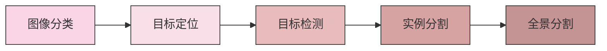
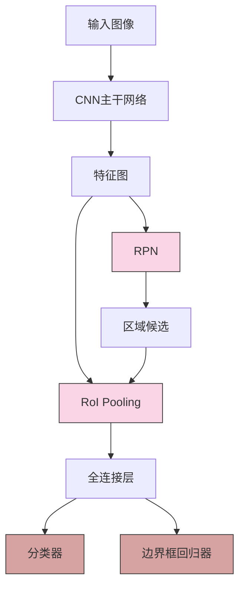
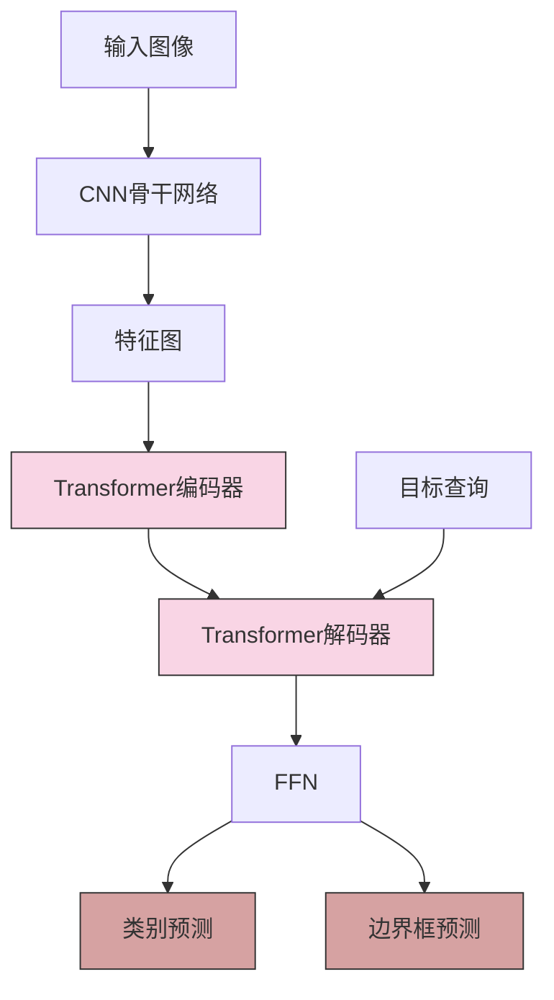

# 目标检测技术

## 目录
- [1. 目标检测基础](#1-目标检测基础)
- [2. 传统目标检测方法](#2-传统目标检测方法)
- [3. 深度学习目标检测方法](#3-深度学习目标检测方法)
- [4. 目标检测评估指标](#4-目标检测评估指标)
- [5. 目标检测挑战与应用](#5-目标检测挑战与应用)

## 1. 目标检测基础

### 1.1 问题定义

目标检测是计算机视觉中的基础任务，旨在定位并识别图像中存在的特定对象。与图像分类不同，目标检测不仅需要确定图像中有哪些对象，还需要通过边界框(bounding box)确定它们的位置。

一个典型的目标检测系统需要解决以下问题：
- **定位**：找出图像中目标对象的位置（通常以边界框表示）
- **分类**：确定检测到的对象属于哪个类别
- **置信度**：提供每个检测结果的置信度分数

### 1.2 目标检测任务演进



### 1.3 目标检测流程

一般目标检测的基本流程包括：

1. **输入图像预处理**：调整大小、归一化等
2. **特征提取**：从图像中提取有用的特征
3. **目标候选区域生成**：生成可能包含目标的区域建议
4. **区域分类与回归**：对每个区域进行分类并精细调整其边界框
5. **后处理**：非极大值抑制(NMS)去除重叠检测框

## 2. 传统目标检测方法

### 2.1 滑动窗口方法

滑动窗口是最早的目标检测方法之一，它通过在图像上以不同尺度滑动固定大小的窗口，对每个窗口区域应用分类器。

```python
# 滑动窗口伪代码
def sliding_window_detection(image, window_size, stride, classifier):
    detections = []
    for scale in scales:
        # 调整图像大小
        resized = resize_image(image, scale)
        # 对调整后的图像进行滑动窗口操作
        for y in range(0, resized.height - window_size[1], stride):
            for x in range(0, resized.width - window_size[0], stride):
                # 提取窗口
                window = resized[y:y+window_size[1], x:x+window_size[0]]
                # 提取特征
                features = extract_features(window)
                # 分类
                score = classifier.predict(features)
                if score > threshold:
                    # 将检测结果转换回原始图像坐标
                    detection = convert_to_original_coords(x, y, window_size, scale)
                    detections.append(detection)
    # 应用非极大值抑制
    final_detections = non_max_suppression(detections)
    return final_detections
```

### 2.2 Viola-Jones人脸检测

Viola-Jones算法是首个实时人脸检测框架，由Paul Viola和Michael Jones于2001年提出。它的核心组件包括：

1. **Haar-like特征**：用于有效捕获图像中的明暗模式
2. **积分图像**：加速特征计算
3. **AdaBoost**：特征选择和弱分类器组合
4. **级联分类器**：快速拒绝非人脸区域

```
级联分类器结构：

Window → Stage 1 → Stage 2 → ... → Stage n → Face Detected
         ↓          ↓                 ↓
       Reject     Reject            Reject
```

### 2.3 HOG+SVM方法

由Dalal和Triggs于2005年提出的行人检测方法，它结合了：

1. **HOG (Histogram of Oriented Gradients)**：捕获目标形状特征
2. **SVM (Support Vector Machine)**：分类器

HOG特征计算步骤：
- 图像预处理（归一化、灰度化）
- 计算图像梯度（大小和方向）
- 将图像分成小单元格(cells)，计算每个单元格的梯度方向直方图
- 将相邻单元格组成块(blocks)，对块内直方图进行归一化
- 将所有块的归一化直方图特征连接起来形成最终特征向量

### 2.4 DPM (Deformable Part Models)

DPM由Felzenszwalb等人在2008年提出，是HOG+SVM方法的扩展。它将目标建模为由根过滤器和多个部件过滤器组成的弹性结构，能够处理目标的形变和姿态变化。

DPM的关键特点：
- **部件模型**：将目标分解为多个部件
- **星形结构**：部件相对于根的空间关系
- **多分辨率特征**：根使用粗分辨率，部件使用细分辨率
- **潜在SVM**：用于处理未标注的部件位置

## 3. 深度学习目标检测方法

深度学习方法根据检测流程可分为两类：
1. **两阶段方法**：先生成区域候选，再分类和回归
2. **单阶段方法**：直接预测边界框和类别

### 3.1 两阶段检测器

#### 3.1.1 R-CNN系列

**R-CNN (Regions with CNN features)**
- 使用Selective Search生成约2000个区域候选
- 对每个区域使用CNN提取特征
- 使用SVM分类器对特征进行分类
- 使用回归器精调边界框

**Fast R-CNN**
- 改进R-CNN，整张图像只经过一次CNN特征提取
- 引入RoI (Region of Interest) Pooling层
- 多任务损失：同时优化分类和边界框回归

**Faster R-CNN**
- 引入RPN (Region Proposal Network)替代Selective Search
- 与Fast R-CNN共享特征提取网络
- 端到端可训练



#### 3.1.2 其他两阶段检测器

**Mask R-CNN**
- 在Faster R-CNN基础上扩展
- 引入RoIAlign替代RoI Pooling，解决像素误对齐问题
- 添加分割分支，实现实例分割

**Cascade R-CNN**
- 使用级联结构的多个检测头
- 每个阶段使用不同IoU阈值的训练样本
- 提高对高质量检测框的识别能力

### 3.2 单阶段检测器

#### 3.2.1 YOLO系列

**YOLO (You Only Look Once)**
- 直接预测边界框坐标和类别概率
- 将图像分成SxS网格，每个网格预测B个边界框
- 极快速度，但对小目标检测效果较差

**YOLOv2/YOLO9000**
- 引入Batch Normalization
- 使用锚框(anchor boxes)
- 使用Darknet-19骨干网络
- 多尺度训练

**YOLOv3**
- 使用Darknet-53骨干网络
- 三层特征金字塔，预测三种尺度
- 使用Logistic回归预测目标得分

**YOLOv4**
- 引入CSPDarknet53骨干网络
- 使用PANet替代FPN作为颈部网络
- 引入多种数据增强和正则化技术

**YOLOv5/YOLOv7/YOLOv8**
- 架构优化，推理速度更快
- 更好的小目标检测能力
- 集成分类、分割等多任务能力

```python
# YOLOv5部署示例
import torch

# 加载预训练模型
model = torch.hub.load('ultralytics/yolov5', 'yolov5s')

# 进行推理
results = model('image.jpg')

# 显示结果
results.show()

# 获取检测结果
detections = results.pandas().xyxy[0]  # 包含边界框坐标和类别信息
```

#### 3.2.2 SSD (Single Shot MultiBox Detector)

- 使用VGG16作为骨干网络
- 从多个特征图预测边界框和类别
- 使用锚框，但不同特征层使用不同尺寸锚框
- 端到端训练，平衡速度和准确率

#### 3.2.3 RetinaNet

- 引入FPN (Feature Pyramid Network)作为特征提取网络
- 提出Focal Loss解决类别不平衡问题
- 保持单阶段检测器的速度，达到接近两阶段检测器的精度

### 3.3 无锚点检测器

#### 3.3.1 CenterNet

- 将目标检测建模为关键点检测问题
- 预测目标中心点和大小
- 无需NMS后处理，速度快

#### 3.3.2 FCOS (Fully Convolutional One-Stage Object Detection)

- 无锚点、无提议的单阶段检测器
- 为每个位置直接预测4个边界框偏移值
- 使用多层特征图和向心性分支

### 3.4 Transformer-based检测器

#### 3.4.1 DETR (DEtection TRansformer)

- 将目标检测建模为集合预测问题
- 使用Transformer架构，直接输出检测结果
- 无需手工设计的组件，如锚框和NMS
- 使用双向匹配损失函数



#### 3.4.2 Deformable DETR

- 改进DETR的收敛速度和性能
- 引入可变形注意力机制，关注稀疏位置
- 多尺度特征融合

## 4. 目标检测评估指标

### 4.1 交并比(IoU)

交并比(Intersection over Union)是评估预测框与真实框重叠程度的指标：

```
IoU = (预测框 ∩ 真实框的面积) / (预测框 ∪ 真实框的面积)
```

通常，IoU阈值设为0.5或0.75，用于判断检测是否正确。

### 4.2 精确率和召回率

- **精确率(Precision)**：正确检测的数量除以总检测数量
  ```
  Precision = TP / (TP + FP)
  ```

- **召回率(Recall)**：正确检测的数量除以总真实目标数量
  ```
  Recall = TP / (TP + FN)
  ```

### 4.3 平均精度(AP)和mAP

- **AP (Average Precision)**：精确率-召回率曲线下的面积，用于评估单个类别的检测性能
- **mAP (mean Average Precision)**：所有类别AP的平均值，用于评估整体检测性能

在COCO数据集评估中，常用以下指标：
- **AP**：在多个IoU阈值(0.5到0.95，步长0.05)下的平均AP
- **AP50**：IoU阈值为0.5时的AP
- **AP75**：IoU阈值为0.75时的AP
- **APs/APm/APl**：小/中/大目标的AP

```python
# 使用pycocotools计算mAP的示例
from pycocotools.coco import COCO
from pycocotools.cocoeval import COCOeval

# 加载标注
coco_gt = COCO('annotations.json')
coco_dt = coco_gt.loadRes('detections.json')

# 创建评估器
cocoEval = COCOeval(coco_gt, coco_dt, 'bbox')

# 运行评估
cocoEval.evaluate()
cocoEval.accumulate()
cocoEval.summarize()

# 获取mAP (IoU=0.5:0.95)
mAP = cocoEval.stats[0]
```

### 4.4 F1分数

F1分数是精确率和召回率的调和平均：

```
F1 = 2 * (Precision * Recall) / (Precision + Recall)
```

### 4.5 检测速度指标

- **FPS (Frames Per Second)**：每秒处理图像的数量
- **推理时间**：处理单张图像所需的时间
- **FLOPS**：浮点运算次数，衡量计算复杂度

## 5. 目标检测挑战与应用

### 5.1 常见挑战

1. **小目标检测**：小目标的特征信息有限，不易被检测到
2. **密集场景检测**：目标密集重叠，难以区分个体
3. **光照变化和遮挡**：影响目标的视觉特征稳定性
4. **类别不平衡**：训练数据中不同类别的样本分布不均匀
5. **域适应问题**：模型在新场景的泛化能力不足

### 5.2 改进策略

#### 5.2.1 小目标检测改进

- 使用特征金字塔网络(FPN)融合多尺度特征
- 增加高分辨率特征图的权重
- 设计专门针对小目标的损失函数

#### 5.2.2 优化锚框设计

- 根据数据集统计信息设计锚框尺寸和比例
- 对每个特征层使用不同尺寸的锚框
- 增加锚框与目标的匹配策略

#### 5.2.3 损失函数优化

- **Focal Loss**：解决类别不平衡问题
- **GIoU/DIoU/CIoU Loss**：提高边界框回归精度
- **标签平滑**：提高模型泛化能力

#### 5.2.4 数据增强

```python
# Mosaic数据增强示例（YOLOv5使用）
def mosaic_augmentation(images, labels, img_size=640):
    # 随机选择4张图像
    indices = [random.randint(0, len(images)-1) for _ in range(4)]
    mosaic_img = np.zeros((img_size*2, img_size*2, 3), dtype=np.uint8)
    mosaic_labels = []
    
    # 将4张图像拼接成2x2网格
    for i, index in enumerate(indices):
        img = images[index]
        label = labels[index]
        
        # 计算位置
        x, y = i % 2 * img_size, i // 2 * img_size
        
        # 调整图像大小
        h, w = img.shape[:2]
        scale = min(img_size / h, img_size / w)
        nh, nw = int(h * scale), int(w * scale)
        img_resized = cv2.resize(img, (nw, nh))
        
        # 放置图像
        mosaic_img[y:y+nh, x:x+nw] = img_resized
        
        # 调整标签坐标
        for box in label:
            class_id, xc, yc, w, h = box
            xc = xc * nw + x
            yc = yc * nh + y
            w = w * nw
            h = h * nh
            mosaic_labels.append([class_id, xc, yc, w, h])
    
    # 裁剪到标准大小
    mosaic_img = mosaic_img[:img_size, :img_size]
    
    # 调整标签坐标到新图像
    for i in range(len(mosaic_labels)):
        mosaic_labels[i][1:] /= img_size
    
    return mosaic_img, mosaic_labels
```

### 5.3 应用场景

#### 5.3.1 自动驾驶

- 检测道路上的车辆、行人、交通标志等
- 需要高准确率和实时性能
- 需要适应各种天气和光照条件

```python
# 自动驾驶场景目标检测伪代码
def autonomous_driving_detection(video_stream, model):
    for frame in video_stream:
        # 预处理
        preprocessed_frame = preprocess(frame)
        
        # 目标检测
        detections = model(preprocessed_frame)
        
        # 后处理，包括跟踪和风险评估
        tracked_objects = tracker.update(detections)
        risks = risk_assessment(tracked_objects)
        
        # 决策
        driving_commands = decision_making(tracked_objects, risks)
        
        # 可视化（调试用）
        visualize_detections(frame, detections, risks)
        
        # 控制车辆
        vehicle.execute(driving_commands)
```

#### 5.3.2 安防监控

- 人员识别、行为分析、异常检测
- 通常需要处理低质量视频和远距离目标
- 24/7工作，需要高可靠性和低误报率

#### 5.3.3 零售分析

- 商品识别、库存管理、顾客行为分析
- 处理拥挤场景和遮挡情况
- 需要与POS系统集成

#### 5.3.4 医学影像

- 器官、病变和异常组织检测
- 需要高精度，容忍较低的速度
- 通常需要3D检测能力

#### 5.3.5 工业检测

- 产品缺陷检测、装配验证
- 高速生产线上的实时检测
- 对特定域有高适应性要求

### 5.4 部署优化

#### 5.4.1 模型剪枝和量化

- 剪枝：移除模型中不重要的连接或通道
- 量化：将浮点权重转换为低精度表示（如int8）
- 知识蒸馏：从大模型中提取知识到小模型

#### 5.4.2 硬件加速

- GPU优化：CUDA编程、TensorRT加速
- 专用硬件：TPU、FPGA、ASIC
- 移动端优化：ARM CPU优化、手机GPU、NPU

```python
# TensorRT优化示例
import tensorrt as trt
import pycuda.driver as cuda

def optimize_model_with_tensorrt(onnx_model_path, engine_path):
    # 创建TensorRT logger和builder
    logger = trt.Logger(trt.Logger.WARNING)
    builder = trt.Builder(logger)
    
    # 创建network
    network = builder.create_network(1 << int(trt.NetworkDefinitionCreationFlag.EXPLICIT_BATCH))
    parser = trt.OnnxParser(network, logger)
    
    # 解析ONNX模型
    with open(onnx_model_path, 'rb') as model:
        parser.parse(model.read())
    
    # 配置builder
    config = builder.create_builder_config()
    config.max_workspace_size = 1 << 30  # 1GB
    
    # 设置精度模式
    if builder.platform_has_fast_fp16:
        config.set_flag(trt.BuilderFlag.FP16)
    
    # 构建引擎
    engine = builder.build_engine(network, config)
    
    # 保存引擎
    with open(engine_path, 'wb') as f:
        f.write(engine.serialize())
        
    return engine
```

---

目标检测技术是计算机视觉领域中最活跃的研究方向之一，其应用范围广泛，从智能手机上的人脸检测到卫星图像中的目标识别。随着深度学习的快速发展，目标检测算法在速度和精度上都取得了显著进步，同时也面临着诸如小目标检测、实时性能和泛化能力等挑战。理解目标检测的基本原理、算法设计和评估方法对于开发和应用视觉系统至关重要。

---

© AI技术知识库 2023 