# 计算机视觉

## 📚 内容导航

- [图像处理基础](./ImageProcessing.md) - 图像滤波、增强、变换与特征提取
- [目标检测技术](./ObjectDetection.md) - 检测流程、常用算法、性能评估与应用
- [图像分割方法](./ImageSegmentation.md) - 语义分割、实例分割与全景分割技术
- [图像生成模型](./ImageGeneration.md) - GAN、VAE、扩散模型与生成式应用
- [视频分析技术](./VideoAnalysis.md) - 运动分析、动作识别与视频理解
- [三维视觉](./3DVision.md) - 深度估计、点云处理、3D重建与SLAM
- [多模态学习](./MultimodalLearning.md) - 视觉-语言模型与跨模态表示学习

## 🔍 计算机视觉知识结构

```mermaid
graph TD
    A[计算机视觉] --> B[基础理论与技术]
    A --> C[图像识别与检测]
    A --> D[图像分割与语义理解]
    A --> E[生成式视觉模型]
    A --> F[视频与时序分析]
    A --> G[3D视觉]
    A --> H[多模态视觉]
    
    B --> B1[图像表示]
    B --> B2[图像预处理]
    B --> B3[传统特征提取]
    B --> B4[深度特征学习]
    
    C --> C1[图像分类]
    C --> C2[目标检测]
    C --> C3[目标跟踪]
    C --> C4[人脸识别]
    
    D --> D1[语义分割]
    D --> D2[实例分割]
    D --> D3[全景分割]
    D --> D4[场景理解]
    
    E --> E1[GAN模型]
    E --> E2[扩散模型]
    E --> E3[VAE模型]
    E --> E4[文本到图像生成]
    
    F --> F1[动作识别]
    F --> F2[视频分类]
    F --> F3[视频摘要]
    F --> F4[时序预测]
    
    G --> G1[深度估计]
    G --> G2[3D重建]
    G --> G3[点云处理]
    G --> G4[SLAM]
    
    H --> H1[视觉-语言模型]
    H --> H2[跨模态检索]
    H --> H3[多模态融合]
    H --> H4[多模态生成]
    
    B1 --> B11[RGB表示]
    B1 --> B12[HSV等色彩空间]
    
    B2 --> B21[图像滤波]
    B2 --> B22[图像增强]
    B2 --> B23[几何变换]
    
    B3 --> B31[SIFT/SURF]
    B3 --> B32[HOG特征]
    B3 --> B33[LBP特征]
    
    B4 --> B41[CNN架构]
    B4 --> B42[Transformer架构]
    B4 --> B43[自监督特征学习]
    
    C2 --> C21[单阶段检测器]
    C2 --> C22[两阶段检测器]
    C2 --> C23[无锚点检测器]
    
    D1 --> D11[FCN]
    D1 --> D12[U-Net]
    D1 --> D13[DeepLab]
    
    E1 --> E11[StyleGAN]
    E1 --> E12[CycleGAN]
    
    E2 --> E21[DDPM]
    E2 --> E22[Stable Diffusion]
    
    classDef basic fill:#f9d5e5,stroke:#333,stroke-width:1px;
    classDef detect fill:#eeac99,stroke:#333,stroke-width:1px;
    classDef segment fill:#e06377,stroke:#333,stroke-width:1px;
    classDef generate fill:#c83349,stroke:#333,stroke-width:1px;
    classDef video fill:#5b9aa0,stroke:#333,stroke-width:1px;
    classDef threeD fill:#d2e9ff,stroke:#333,stroke-width:1px;
    classDef multimodal fill:#f9e07f,stroke:#333,stroke-width:1px;
    
    class B,B1,B2,B3,B4,B11,B12,B21,B22,B23,B31,B32,B33,B41,B42,B43 basic;
    class C,C1,C2,C3,C4,C21,C22,C23 detect;
    class D,D1,D2,D3,D4,D11,D12,D13 segment;
    class E,E1,E2,E3,E4,E11,E12,E21,E22 generate;
    class F,F1,F2,F3,F4 video;
    class G,G1,G2,G3,G4 threeD;
    class H,H1,H2,H3,H4 multimodal;
```



## 📊 计算机视觉模型对比

| 模型类型 | 代表算法 | 适用任务 | 计算复杂度 | 性能表现 | 主要挑战 |
|---------|---------|---------|----------|---------|---------|
| 图像分类 | ResNet, ViT, EfficientNet | 场景识别、物体分类 | 中-高 | 高 | 长尾分布、细粒度分类 |
| 目标检测 | Faster R-CNN, YOLO, DETR | 物体定位与分类 | 高 | 中-高 | 小目标检测、实时性 |
| 实例分割 | Mask R-CNN, PointRend | 物体轮廓提取 | 高 | 中-高 | 精细边界、重叠物体 |
| 语义分割 | DeepLabV3+, PSPNet | 像素级别分类 | 高 | 中-高 | 类别不平衡、边界精度 |
| 图像生成 | StyleGAN3, Stable Diffusion | 创意内容生成 | 极高 | 高-极高 | 控制性、真实性 |
| 视频分析 | SlowFast, TimeSformer | 行为识别、跟踪 | 极高 | 中-高 | 时空建模、效率 |
| 深度估计 | MonoDepth2, DPT | 3D场景理解 | 中-高 | 中 | 单目歧义性、尺度一致性 |
| 多模态 | CLIP, BLIP, VideoLLaMA | 视觉-语言理解 | 极高 | 高 | 模态对齐、融合策略 |

## 🚀 计算机视觉应用流程

```mermaid
flowchart TD
    A[数据收集与标注] --> B[数据预处理与增强]
    B --> C[特征提取/表示学习]
    C --> D[模型设计与训练]
    D --> E[评估与优化]
    E --> F{性能满足要求?}
    F -- 否 --> |调整模型架构| D
    F -- 否 --> |增强数据集| B
    F -- 是 --> G[模型部署]
    G --> H[监控与迭代更新]
    
    subgraph 数据准备阶段
    A
    B
    end
    
    subgraph 模型开发阶段
    C
    D
    E
    F
    end
    
    subgraph 应用部署阶段
    G
    H
    end
    
    B --> B1[归一化/标准化]
    B --> B2[数据增强]
    B --> B3[标签平衡]
    
    D --> D1[骨干网络选择]
    D --> D2[任务头设计]
    D --> D3[损失函数设计]
    D --> D4[训练策略]
```

## 📝 常用评估指标

### 图像分类评估指标

| 指标 | 说明 | 适用场景 | 解释 |
|------|-----|---------|------|
| 准确率(Accuracy) | 正确分类样本数/总样本数 | 类别均衡问题 | 值越高越好，但在不平衡数据集上可能有误导 |
| 精确率(Precision) | TP/(TP+FP) | 关注误报率 | 衡量预测为正的样本中真正为正的比例 |
| 召回率(Recall) | TP/(TP+FN) | 关注漏报率 | 衡量有多少真正的正样本被正确识别 |
| F1分数 | 2×(P×R)/(P+R) | 精确率和召回率的平衡 | 精确率和召回率的调和平均 |
| Top-K准确率 | 前K个预测中包含正确标签的比例 | 多标签或细粒度分类 | 对于难分类别更宽松的评估 |

### 目标检测评估指标

| 指标 | 说明 | 适用场景 | 解释 |
|------|-----|---------|------|
| mAP | 各类别AP的平均值 | 通用目标检测 | 综合评估检测性能，兼顾定位和分类 |
| AP@IoU=0.5 | IoU阈值0.5下的平均精度 | 宽松评估 | 更关注分类正确性 |
| AP@IoU=0.75 | IoU阈值0.75下的平均精度 | 严格评估 | 更关注定位精度 |
| AP@small/medium/large | 不同尺寸目标的AP | 多尺度目标场景 | 评估模型处理不同大小目标的能力 |
| 速度(FPS) | 每秒处理帧数 | 实时应用 | 评估模型推理速度 |

### 分割任务评估指标

| 指标 | 说明 | 适用场景 | 解释 |
|------|-----|---------|------|
| mIoU | 各类别IoU的平均值 | 语义分割 | 评估像素级分类准确性 |
| Dice系数 | 2×\|A∩B\|/(\|A\|+\|B\|) | 医学图像分割 | 评估重叠度，对小区域更敏感 |
| Boundary F1(BF) | 边界F1分数 | 精细边界分割 | 特别关注分割边界的准确性 |
| PQ(Panoptic Quality) | 结合分割质量和识别质量 | 全景分割 | 同时考虑语义理解和实例区分 |

## 💡 计算机视觉实践技巧

### 数据增强最佳实践

```python
# PyTorch数据增强示例
import torch
from torchvision import transforms
from torch.utils.data import DataLoader, Dataset

# 基础数据增强
train_transform = transforms.Compose([
    transforms.RandomResizedCrop(224),
    transforms.RandomHorizontalFlip(),
    transforms.ColorJitter(brightness=0.2, contrast=0.2, saturation=0.2),
    transforms.RandomAffine(degrees=10, translate=(0.1, 0.1)),
    transforms.ToTensor(),
    transforms.Normalize([0.485, 0.456, 0.406], [0.229, 0.224, 0.225])
])

# 测试转换
test_transform = transforms.Compose([
    transforms.Resize(256),
    transforms.CenterCrop(224),
    transforms.ToTensor(),
    transforms.Normalize([0.485, 0.456, 0.406], [0.229, 0.224, 0.225])
])

# 高级数据增强
advanced_transform = transforms.Compose([
    transforms.RandomResizedCrop(224),
    transforms.RandomHorizontalFlip(),
    transforms.RandomApply([transforms.ColorJitter(0.4, 0.4, 0.4, 0.2)], p=0.8),
    transforms.RandomGrayscale(p=0.2),
    transforms.RandomApply([transforms.GaussianBlur(kernel_size=23)], p=0.5),
    transforms.ToTensor(),
    transforms.Normalize([0.485, 0.456, 0.406], [0.229, 0.224, 0.225])
])
```

### 视觉模型训练技巧

1. **预训练模型选择**:
   - 对于一般视觉任务，优先选择ImageNet预训练模型
   - 数据量小时，考虑大规模自监督预训练模型（如MAE, DINO）
   - 特定领域任务，考虑领域适应或领域特定预训练

2. **学习率策略**:
   - 分层学习率：骨干网络低学习率，任务头高学习率
   - 余弦退火调度：在训练过程中周期性降低学习率
   - 线性预热：初始阶段逐渐增加学习率到基准值

3. **优化小技巧**:
   - 混合精度训练 (FP16) 加速训练
   - 渐进式学习（从低分辨率到高分辨率）
   - 梯度裁剪防止梯度爆炸
   - 使用EMA（指数移动平均）提高稳定性

### 目标检测模型实现示例

```python
# 使用PyTorch和Torchvision实现Faster R-CNN
import torch
import torchvision
from torchvision.models.detection import fasterrcnn_resnet50_fpn
from torchvision.models.detection.faster_rcnn import FastRCNNPredictor

def create_model(num_classes, pretrained=True):
    # 加载预训练模型
    model = fasterrcnn_resnet50_fpn(pretrained=pretrained)
    
    # 替换分类头以适应新的类别数
    in_features = model.roi_heads.box_predictor.cls_score.in_features
    model.roi_heads.box_predictor = FastRCNNPredictor(in_features, num_classes)
    
    return model

# 创建模型
model = create_model(num_classes=21)  # 20个类别 + 背景

# 设置设备
device = torch.device('cuda') if torch.cuda.is_available() else torch.device('cpu')
model.to(device)

# 训练循环
def train_one_epoch(model, optimizer, data_loader, device):
    model.train()
    total_loss = 0
    
    for images, targets in data_loader:
        images = [image.to(device) for image in images]
        targets = [{k: v.to(device) for k, v in t.items()} for t in targets]
        
        loss_dict = model(images, targets)
        losses = sum(loss for loss in loss_dict.values())
        
        optimizer.zero_grad()
        losses.backward()
        optimizer.step()
        
        total_loss += losses.item()
    
    return total_loss / len(data_loader)
```

## 📘 相关资源

- [返回AI技术知识库首页](../README.md)
- [机器学习基础](../MachineLearning/README.md)
- [深度学习](../DeepLearning/README.md)
- [多模态学习](./MultimodalLearning.md)

### 推荐学习资源

- 《计算机视觉：算法与应用》(Richard Szeliski)
- 《计算机视觉：模型、学习和推理》(Simon J.D. Prince)
- [Stanford CS231n: 深度学习与计算机视觉](http://cs231n.stanford.edu/)
- [torchvision文档](https://pytorch.org/vision/stable/index.html)
- [OpenCV文档](https://docs.opencv.org/)
- [Papers With Code - Computer Vision](https://paperswithcode.com/area/computer-vision)

---

© AI技术知识库 2023 