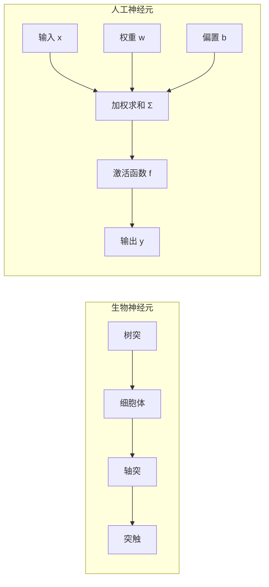
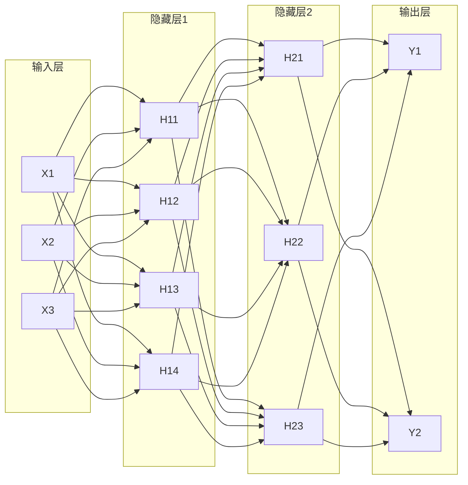

# 神经网络基础

## 📚 目录

1. [神经元模型](#神经元模型)
2. [激活函数](#激活函数)
3. [神经网络架构](#神经网络架构)
4. [前向传播](#前向传播)
5. [损失函数](#损失函数)
6. [反向传播算法](#反向传播算法)
7. [参数初始化](#参数初始化)
8. [梯度消失与爆炸](#梯度消失与爆炸)
9. [神经网络实现示例](#神经网络实现示例)

## 神经元模型

### 生物神经元与人工神经元对比



### 人工神经元数学表达

人工神经元是神经网络的基本计算单元，其数学表达为：

$$y = f(\sum_{i=1}^{n} w_i x_i + b)$$

其中：
- $x_i$ 是输入特征
- $w_i$ 是对应的权重
- $b$ 是偏置项
- $f$ 是激活函数
- $y$ 是神经元的输出

**向量形式**:
$$y = f(w^T x + b)$$

## 激活函数

激活函数赋予神经网络非线性建模能力，是深度学习的关键组件。

### 常用激活函数对比

| 激活函数 | 数学表达式 | 值域 | 优点 | 缺点 | 适用场景 |
|---------|----------|------|-----|------|---------|
| Sigmoid | $\sigma(x) = \frac{1}{1+e^{-x}}$ | (0, 1) | 平滑、可微、输出可解释为概率 | 梯度消失问题、计算开销大、输出不是零中心 | 二分类输出层 |
| Tanh | $\tanh(x) = \frac{e^x - e^{-x}}{e^x + e^{-x}}$ | (-1, 1) | 零中心化、平滑可微 | 梯度消失问题、计算开销大 | 早期RNN、隐藏层 |
| ReLU | $f(x) = \max(0, x)$ | [0, +∞) | 计算高效、缓解梯度消失、稀疏激活 | 死亡ReLU问题、非零中心、非有界 | CNN隐藏层、大多数前馈网络 |
| Leaky ReLU | $f(x) = \max(\alpha x, x)$ | (-∞, +∞) | 解决死亡ReLU问题、保留负梯度信息 | 需要额外超参数α | ReLU替代方案 |
| ELU | $f(x) = \begin{cases} x & \text{if } x > 0 \\ \alpha(e^x-1) & \text{if } x \leq 0 \end{cases}$ | (-α, +∞) | 输出均值接近零、平滑 | 计算开销相对大 | 当需要负值有意义时 |
| GELU | $f(x) = x \cdot \Phi(x)$ | (-∞, +∞) | 性能优异、平滑 | 计算复杂 | Transformer、最新模型 |
| Swish | $f(x) = x \cdot \sigma(\beta x)$ | (-∞, +∞) | 平滑、自门控 | 计算复杂 | 深度网络 |

### 激活函数可视化比较

```
Sigmoid:    ------/‾‾‾‾‾‾‾
Tanh:       ---/‾‾‾\___
ReLU:       __|/‾‾‾‾‾‾‾‾
Leaky ReLU: _/|/‾‾‾‾‾‾‾‾
ELU:        _-|/‾‾‾‾‾‾‾‾
```

```python
# 激活函数实现
import numpy as np
import matplotlib.pyplot as plt

def sigmoid(x):
    return 1 / (1 + np.exp(-x))

def tanh(x):
    return np.tanh(x)

def relu(x):
    return np.maximum(0, x)

def leaky_relu(x, alpha=0.01):
    return np.maximum(alpha * x, x)

def elu(x, alpha=1.0):
    return np.where(x > 0, x, alpha * (np.exp(x) - 1))

def gelu(x):
    return 0.5 * x * (1 + np.tanh(np.sqrt(2 / np.pi) * (x + 0.044715 * x**3)))

def swish(x, beta=1.0):
    return x * sigmoid(beta * x)

# 可视化比较
x = np.linspace(-5, 5, 1000)
plt.figure(figsize=(12, 8))
plt.plot(x, sigmoid(x), label='Sigmoid')
plt.plot(x, tanh(x), label='Tanh')
plt.plot(x, relu(x), label='ReLU')
plt.plot(x, leaky_relu(x), label='Leaky ReLU')
plt.plot(x, elu(x), label='ELU')
plt.plot(x, gelu(x), label='GELU')
plt.plot(x, swish(x), label='Swish')
plt.grid(True)
plt.legend()
plt.title('激活函数比较')
plt.axhline(y=0, color='k', linestyle='-', alpha=0.3)
plt.axvline(x=0, color='k', linestyle='-', alpha=0.3)
```

## 神经网络架构

### 前馈神经网络（多层感知机）

最基本的神经网络结构，信息只从输入层向输出层单向传播。



**主要特点**:
- 层间全连接
- 无环结构
- 隐藏层使用非线性激活函数
- 可以拟合任意连续函数（通用近似定理）

**数学表达**:
- 第一隐藏层: $H^{(1)} = f_1(W^{(1)}X + b^{(1)})$
- 第二隐藏层: $H^{(2)} = f_2(W^{(2)}H^{(1)} + b^{(2)})$
- 输出层: $Y = f_3(W^{(3)}H^{(2)} + b^{(3)})$

其中，$W^{(l)}$是第$l$层的权重矩阵，$b^{(l)}$是偏置向量，$f_l$是激活函数。

## 前向传播

前向传播是信息从输入层通过网络向输出层流动的过程。

### 前向传播算法

```
输入: 样本x, 网络参数{W^(l), b^(l)}
输出: 网络预测值y_pred

算法:
1. a^(0) = x  # 初始激活值为输入
2. 对于每一层l=1到L:
   a. z^(l) = W^(l)a^(l-1) + b^(l)  # 计算加权和
   b. a^(l) = f^(l)(z^(l))         # 应用激活函数
3. y_pred = a^(L)  # 输出层的激活值即为预测值
```

### 前向传播示例

以两层网络为例（1个隐藏层，1个输出层）：

```python
def forward_pass(x, W1, b1, W2, b2, activation_fn):
    # 第一层
    z1 = np.dot(W1, x) + b1
    a1 = activation_fn(z1)
    
    # 第二层（输出层）
    z2 = np.dot(W2, a1) + b2
    a2 = z2  # 假设输出层无激活函数（回归问题）
    
    # 保存中间结果用于反向传播
    cache = (x, z1, a1, W1, b1, W2, b2)
    
    return a2, cache
```

## 损失函数

损失函数量化模型预测值与真实值之间的差距，是神经网络优化的目标。

### 常用损失函数

| 损失函数 | 公式 | 适用任务 | 特点 |
|---------|-----|---------|------|
| 均方误差(MSE) | $\frac{1}{n}\sum_{i=1}^{n}(y_i - \hat{y}_i)^2$ | 回归 | 对异常值敏感 |
| 平均绝对误差(MAE) | $\frac{1}{n}\sum_{i=1}^{n}|y_i - \hat{y}_i|$ | 回归 | 对异常值不敏感，但不可微 |
| 交叉熵损失 | $-\sum_{i=1}^{C}y_i\log(\hat{y}_i)$ | 分类 | 惩罚错误预测的概率 |
| 二元交叉熵 | $-[y\log(\hat{y}) + (1-y)\log(1-\hat{y})]$ | 二分类 | 数值稳定性好 |
| Hinge Loss | $\max(0, 1 - y \cdot \hat{y})$ | SVM分类 | 最大间隔分类 |
| Huber Loss | 结合MSE和MAE的特点 | 回归 | 对异常值具有鲁棒性 |

## 反向传播算法

反向传播是计算损失函数相对于网络参数的梯度的高效算法，是神经网络训练的核心。

### 基本原理

反向传播利用链式法则逐层计算梯度，从输出层向输入层反向传播误差信号。


### 数学推导

对于损失函数$J$和参数$\theta$，梯度$\frac{\partial J}{\partial \theta}$的计算如下：

1. **前向传播**：计算每层的加权和$z^{(l)}$和激活值$a^{(l)}$

2. **输出层误差**：计算输出层误差$\delta^{(L)} = \frac{\partial J}{\partial z^{(L)}}$
   - 对于MSE损失：$\delta^{(L)} = (a^{(L)} - y) \odot f'(z^{(L)})$
   - 对于交叉熵损失配合Softmax激活：$\delta^{(L)} = a^{(L)} - y$

3. **反向传播误差**：逐层反向计算误差
   $\delta^{(l)} = ((W^{(l+1)})^T \delta^{(l+1)}) \odot f'(z^{(l)})$

4. **计算梯度**：
   - 权重梯度：$\frac{\partial J}{\partial W^{(l)}} = \delta^{(l)} (a^{(l-1)})^T$
   - 偏置梯度：$\frac{\partial J}{\partial b^{(l)}} = \delta^{(l)}$

### 反向传播示例

```python
def backward_pass(y_true, y_pred, cache, activation_fn_derivative):
    x, z1, a1, W1, b1, W2, b2 = cache
    
    # 输出层误差
    dz2 = y_pred - y_true  # 假设MSE损失
    
    # 输出层参数梯度
    dW2 = np.dot(dz2, a1.T)
    db2 = dz2
    
    # 隐藏层误差
    dz1 = np.dot(W2.T, dz2) * activation_fn_derivative(z1)
    
    # 隐藏层参数梯度
    dW1 = np.dot(dz1, x.T)
    db1 = dz1
    
    return dW1, db1, dW2, db2
```

## 参数初始化

神经网络参数初始化对训练过程和最终性能有重大影响。

### 常用初始化方法

| 初始化方法 | 公式 | 特点 | 适用场景 |
|-----------|-----|------|---------|
| 零初始化 | $W = 0$ | 对称性问题，不适用于深度网络 | 仅用于偏置项 |
| 随机初始化 | $W \sim U(-r, r)$ | 打破对称性 | 浅层网络 |
| Xavier/Glorot | $W \sim U(-\sqrt{\frac{6}{n_{in}+n_{out}}}, \sqrt{\frac{6}{n_{in}+n_{out}}})$ | 保持各层方差一致 | Sigmoid/Tanh激活函数 |
| He初始化 | $W \sim N(0, \sqrt{\frac{2}{n_{in}}})$ | 适合ReLU激活函数 | ReLU及其变种 |
| 正交初始化 | 使权重矩阵接近正交矩阵 | 改善信号传播 | 深度网络，特别是RNN |

```python
# 常用初始化方法实现
def zero_initialization(shape):
    return np.zeros(shape)

def random_initialization(shape, scale=0.01):
    return np.random.randn(*shape) * scale

def xavier_initialization(shape):
    n_in, n_out = shape
    limit = np.sqrt(6 / (n_in + n_out))
    return np.random.uniform(-limit, limit, shape)

def he_initialization(shape):
    n_in, n_out = shape
    std = np.sqrt(2 / n_in)
    return np.random.randn(n_in, n_out) * std
```

## 梯度消失与爆炸

在深度神经网络中，梯度可能随着层数的增加而变得极小（消失）或极大（爆炸），导致训练困难。

### 梯度消失

**原因**:
- Sigmoid/Tanh激活函数的导数在饱和区域接近零
- 深层网络中的连乘效应

**解决方案**:
1. 使用ReLU及其变种作为激活函数
2. 批归一化（Batch Normalization）
3. 残差连接（ResNet）
4. 合适的权重初始化

### 梯度爆炸

**原因**:
- 权重值过大
- 学习率设置不当
- 深层网络中的连乘效应

**解决方案**:
1. 梯度裁剪（Gradient Clipping）
2. 权重正则化
3. 批归一化
4. 合适的权重初始化

## 神经网络实现示例

完整实现一个简单的两层神经网络：

```python
import numpy as np

class SimpleNN:
    def __init__(self, input_size, hidden_size, output_size):
        # 初始化参数
        self.W1 = np.random.randn(hidden_size, input_size) * 0.01
        self.b1 = np.zeros((hidden_size, 1))
        self.W2 = np.random.randn(output_size, hidden_size) * 0.01
        self.b2 = np.zeros((output_size, 1))
    
    def _relu(self, Z):
        return np.maximum(0, Z)
    
    def _relu_derivative(self, Z):
        return Z > 0
    
    def forward(self, X):
        # 前向传播
        self.Z1 = np.dot(self.W1, X) + self.b1
        self.A1 = self._relu(self.Z1)
        self.Z2 = np.dot(self.W2, self.A1) + self.b2
        self.A2 = self.Z2  # 线性输出（回归问题）
        
        return self.A2
    
    def compute_loss(self, y_pred, y_true):
        # 计算MSE损失
        m = y_true.shape[1]
        loss = (1/(2*m)) * np.sum(np.square(y_pred - y_true))
        return loss
    
    def backward(self, X, Y):
        # 反向传播
        m = X.shape[1]
        
        # 输出层梯度
        dZ2 = self.A2 - Y
        dW2 = (1/m) * np.dot(dZ2, self.A1.T)
        db2 = (1/m) * np.sum(dZ2, axis=1, keepdims=True)
        
        # 隐藏层梯度
        dZ1 = np.dot(self.W2.T, dZ2) * self._relu_derivative(self.Z1)
        dW1 = (1/m) * np.dot(dZ1, X.T)
        db1 = (1/m) * np.sum(dZ1, axis=1, keepdims=True)
        
        return dW1, db1, dW2, db2
    
    def update_parameters(self, dW1, db1, dW2, db2, learning_rate):
        # 更新参数
        self.W1 -= learning_rate * dW1
        self.b1 -= learning_rate * db1
        self.W2 -= learning_rate * dW2
        self.b2 -= learning_rate * db2
    
    def train(self, X, Y, learning_rate=0.01, epochs=1000):
        losses = []
        
        for i in range(epochs):
            # 前向传播
            y_pred = self.forward(X)
            
            # 计算损失
            loss = self.compute_loss(y_pred, Y)
            losses.append(loss)
            
            # 反向传播
            dW1, db1, dW2, db2 = self.backward(X, Y)
            
            # 更新参数
            self.update_parameters(dW1, db1, dW2, db2, learning_rate)
            
            # 打印损失
            if i % 100 == 0:
                print(f"Epoch {i}, Loss: {loss:.6f}")
        
        return losses

# 使用示例
if __name__ == "__main__":
    # 生成一些模拟数据
    np.random.seed(42)
    X = np.random.randn(2, 100)  # 2个特征，100个样本
    Y = np.sin(X[0, :]) + np.cos(X[1, :])  # 目标：一个简单的非线性函数
    Y = Y.reshape(1, -1)
    
    # 创建并训练网络
    nn = SimpleNN(input_size=2, hidden_size=10, output_size=1)
    losses = nn.train(X, Y, learning_rate=0.1, epochs=1000)
    
    # 评估
    y_pred = nn.forward(X)
    mse = np.mean(np.square(y_pred - Y))
    print(f"Final MSE: {mse:.6f}")
```

## 📘 相关资源

- [返回深度学习首页](./README.md)
- [卷积神经网络](./CNN.md)
- [循环神经网络](./RNN.md)
- [优化算法](./Optimization.md)

---

© AI技术知识库 2023 