# 深度学习

## 📚 内容导航

- [神经网络基础](./NeuralNetworkBasics.md) - 神经元模型、激活函数、前向传播与反向传播
- [卷积神经网络](./CNN.md) - 卷积层、池化层、经典CNN架构与应用
- [循环神经网络](./RNN.md) - RNN基础、LSTM、GRU及其应用场景
- [Transformer架构](./Transformer.md) - 自注意力机制、编码器-解码器结构与应用
- [优化算法](./Optimization.md) - 梯度下降变种、学习率策略、优化器选择
- [正则化技术](./Regularization.md) - Dropout、BatchNorm、权重正则化等方法
- [模型压缩与加速](./ModelCompression.md) - 量化、剪枝、知识蒸馏与硬件加速

## 🔍 深度学习知识结构

```mermaid
graph TD
    A[深度学习] --> B[基础架构]
    A --> C[高级架构]
    A --> D[训练技术]
    A --> E[应用领域]
    A --> F[工程实践]
    
    B --> B1[前馈神经网络]
    B --> B2[卷积神经网络]
    B --> B3[循环神经网络]
    B --> B4[注意力机制]
    
    C --> C1[Transformer]
    C --> C2[GAN]
    C --> C3[自编码器]
    C --> C4[图神经网络]
    C --> C5[预训练模型]
    
    D --> D1[损失函数]
    D --> D2[优化算法]
    D --> D3[正则化技术]
    D --> D4[超参数调优]
    D --> D5[分布式训练]
    
    E --> E1[计算机视觉]
    E --> E2[自然语言处理]
    E --> E3[语音处理]
    E --> E4[多模态学习]
    E --> E5[强化学习]
    
    F --> F1[框架与工具]
    F --> F2[模型压缩]
    F --> F3[部署策略]
    F --> F4[硬件加速]
    F --> F5[可解释性]
    
    B1 --> B11[MLP结构]
    B1 --> B12[激活函数]
    B1 --> B13[反向传播]
    
    B2 --> B21[卷积操作]
    B2 --> B22[池化层]
    B2 --> B23[经典架构]
    
    B3 --> B31[简单RNN]
    B3 --> B32[LSTM]
    B3 --> B33[GRU]
    
    B4 --> B41[自注意力]
    B4 --> B42[多头注意力]
    
    C1 --> C11[编码器-解码器]
    C1 --> C12[Transformer变体]
    
    D2 --> D21[SGD变种]
    D2 --> D22[自适应方法]
    
    D3 --> D31[Dropout]
    D3 --> D32[批归一化]
    D3 --> D33[权重正则化]
    
    classDef base fill:#f9d5e5,stroke:#333,stroke-width:1px;
    classDef arch fill:#eeac99,stroke:#333,stroke-width:1px;
    classDef train fill:#e06377,stroke:#333,stroke-width:1px;
    classDef app fill:#c83349,stroke:#333,stroke-width:1px;
    classDef eng fill:#5b9aa0,stroke:#333,stroke-width:1px;
    
    class B1,B2,B3,B4,B11,B12,B13,B21,B22,B23,B31,B32,B33,B41,B42 base;
    class C1,C2,C3,C4,C5,C11,C12 arch;
    class D1,D2,D3,D4,D5,D21,D22,D31,D32,D33 train;
    class E1,E2,E3,E4,E5 app;
    class F1,F2,F3,F4,F5 eng;
```



## 📊 深度学习模型对比

| 模型类型 | 主要特点 | 适用任务 | 计算复杂度 | 参数量级 | 主要挑战 |
|---------|---------|---------|----------|----------|---------|
| 前馈神经网络 | 结构简单、全连接 | 简单分类与回归 | 低 | 中等 | 表达能力有限 |
| 卷积神经网络 | 局部连接、参数共享 | 图像处理、视觉任务 | 中-高 | 中-高 | 需大量标注数据 |
| 循环神经网络 | 序列建模、有状态 | 时序数据、NLP | 中 | 低-中 | 长序列依赖问题 |
| LSTM/GRU | 解决长依赖、门控机制 | 长序列任务、语言建模 | 中-高 | 中 | 训练复杂、计算开销 |
| Transformer | 自注意力、并行计算 | NLP、CV、多模态 | 高 | 高-极高 | 计算资源需求大 |
| GAN | 生成对抗、无监督 | 图像生成、风格迁移 | 高 | 中-高 | 训练不稳定 |
| 图神经网络 | 非欧几里得数据处理 | 社交网络、分子结构 | 中-高 | 中 | 可扩展性问题 |
| 自编码器 | 无监督特征学习 | 降维、异常检测 | 中 | 中 | 隐空间解释性 |
| 大型预训练模型 | 迁移学习、少样本学习 | 通用AI任务 | 极高 | 极高 | 计算资源、伦理问题 |

## 🚀 深度学习工作流程

```mermaid
flowchart TD
    A[数据收集] --> B[数据预处理]
    B --> C[特征工程]
    C --> D[数据分割]
    D --> E[模型设计]
    E --> F[模型训练]
    F --> G[评估与调优]
    G --> H{性能满足要求?}
    H -- 否 --> |调整架构/参数| E
    H -- 否 --> |增强数据| B
    H -- 是 --> I[模型部署]
    I --> J[监控与更新]
    
    subgraph 数据准备阶段
    A
    B
    C
    D
    end
    
    subgraph 模型开发阶段
    E
    F
    G
    H
    end
    
    subgraph 生产部署阶段
    I
    J
    end
```

## 📝 主流深度学习框架特性比较

| 框架 | 开发公司 | 编程语言 | 动态图 | 静态图 | 部署便捷性 | 社区活跃度 | 最适用场景 |
|------|---------|---------|--------|--------|----------|----------|----------|
| PyTorch | Facebook | Python | ✓ | ✓ (TorchScript) | 中-高 | 高 | 研究、原型开发 |
| TensorFlow | Google | Python, C++ | ✓ (Eager) | ✓ | 高 | 高 | 生产部署、移动端 |
| JAX | Google | Python | ✓ | ✓ | 中 | 中-高 | 科学计算、研究 |
| MXNet | Apache | 多语言 | ✓ | ✓ | 高 | 中 | 分布式训练 |
| ONNX | 开源联盟 | - | - | ✓ | 高 | 中-高 | 模型交换、跨框架部署 |
| DL4J | Eclipse | Java | ✓ | ✓ | 中 | 低-中 | Java生态系统 |
| Keras | 开源 | Python | ✓ | ✓ | 中-高 | 高 | 快速原型开发 |

## 💡 深度学习最佳实践

### 模型设计与训练技巧

1. **架构选择**:
   - 从简单模型开始，逐步增加复杂度
   - 优先考虑已有成功架构，避免从零设计
   - 针对特定任务选择专用架构（CNN for图像，Transformer for文本）

2. **训练优化**:
   - 使用批归一化或层归一化
   - 采用适当的学习率调度策略
   - 使用梯度裁剪防止梯度爆炸
   - 考虑混合精度训练加速

3. **正则化策略**:
   - Dropout防止过拟合
   - 数据增强增加训练样本多样性
   - 早停法避免过度训练
   - 考虑使用L1/L2正则化

### 深度学习代码最佳实践示例

```python
import torch
import torch.nn as nn
import torch.optim as optim
from torch.utils.data import DataLoader
from torchvision import datasets, transforms

# 1. 设置随机种子确保可重现性
def set_seed(seed=42):
    torch.manual_seed(seed)
    torch.cuda.manual_seed_all(seed)
    torch.backends.cudnn.deterministic = True
    
set_seed()

# 2. 数据预处理与增强
transform = transforms.Compose([
    transforms.RandomHorizontalFlip(),
    transforms.RandomRotation(10),
    transforms.ToTensor(),
    transforms.Normalize((0.5,), (0.5,))
])

# 3. 模型定义 - 使用模块化设计
class ConvBlock(nn.Module):
    def __init__(self, in_channels, out_channels):
        super().__init__()
        self.conv = nn.Conv2d(in_channels, out_channels, 3, padding=1)
        self.bn = nn.BatchNorm2d(out_channels)
        self.relu = nn.ReLU()
        self.pool = nn.MaxPool2d(2)
        
    def forward(self, x):
        return self.pool(self.relu(self.bn(self.conv(x))))

class SimpleCNN(nn.Module):
    def __init__(self, num_classes=10):
        super().__init__()
        self.layers = nn.Sequential(
            ConvBlock(1, 32),
            ConvBlock(32, 64),
            ConvBlock(64, 128),
            nn.Flatten(),
            nn.Linear(128 * 4 * 4, 512),
            nn.ReLU(),
            nn.Dropout(0.5),
            nn.Linear(512, num_classes)
        )
    
    def forward(self, x):
        return self.layers(x)

# 4. 训练循环与评估 - 良好的代码结构
def train_epoch(model, loader, criterion, optimizer, device):
    model.train()
    running_loss = 0.0
    correct = 0
    total = 0
    
    for inputs, targets in loader:
        inputs, targets = inputs.to(device), targets.to(device)
        
        optimizer.zero_grad()
        outputs = model(inputs)
        loss = criterion(outputs, targets)
        loss.backward()
        optimizer.step()
        
        running_loss += loss.item()
        _, predicted = outputs.max(1)
        total += targets.size(0)
        correct += predicted.eq(targets).sum().item()
    
    return running_loss/len(loader), correct/total

# 5. 学习率调度策略
def get_lr_scheduler(optimizer):
    return optim.lr_scheduler.ReduceLROnPlateau(
        optimizer, mode='min', factor=0.1, patience=5, verbose=True
    )
```

## 📘 相关资源

- [返回AI技术知识库首页](../README.md)
- [机器学习基础](../MachineLearning/README.md)
- [自然语言处理](../NLP/README.md)
- [计算机视觉](../ComputerVision/README.md)

### 推荐学习资源

- 《深度学习》(Ian Goodfellow, Yoshua Bengio, Aaron Courville)
- 《动手学深度学习》(李沐等)
- [Stanford CS231n: 深度学习与计算机视觉](http://cs231n.stanford.edu/)
- [Stanford CS224n: 深度学习与自然语言处理](http://web.stanford.edu/class/cs224n/)
- [深度学习框架文档](https://pytorch.org/docs/stable/index.html)
- [Papers With Code](https://paperswithcode.com/)

---

© AI技术知识库 2023 