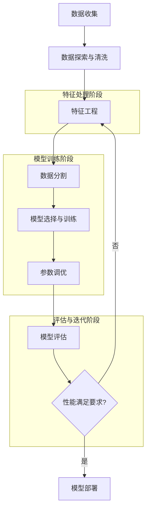

# 机器学习基础

## 📚 内容导航

- [监督学习算法](./SupervisedLearning.md) - 回归、分类、决策树、SVM等监督学习方法
- [无监督学习算法](./UnsupervisedLearning.md) - 聚类、降维、异常检测等无监督学习技术
- [特征工程技术](./FeatureEngineering.md) - 特征选择、提取、转换与缩放方法
- [模型评估方法](./ModelEvaluation.md) - 交叉验证、指标选择、过拟合处理等
- [集成学习技术](./EnsembleLearning.md) - Bagging、Boosting、Stacking等集成策略
- [概率图模型](./ProbabilisticGraphicalModels.md) - 贝叶斯网络、马尔可夫模型等概率模型

## 🔍 机器学习知识结构

```mermaid
graph TD
    A[机器学习基础] --> B[学习范式]
    A --> C[算法类别]
    A --> D[模型评估]
    A --> E[工程实践]
    
    B --> B1[监督学习]
    B --> B2[无监督学习]
    B --> B3[半监督学习]
    B --> B4[强化学习]
    
    C --> C1[回归算法]
    C --> C2[分类算法]
    C --> C3[聚类算法]
    C --> C4[降维算法]
    C --> C5[集成方法]
    
    D --> D1[评估指标]
    D --> D2[验证方法]
    D --> D3[超参优化]
    
    E --> E1[特征工程]
    E --> E2[数据预处理]
    E --> E3[模型选择]
    E --> E4[部署优化]
    
    C1 --> C11[线性回归]
    C1 --> C12[多项式回归]
    C1 --> C13[正则化方法]
    
    C2 --> C21[逻辑回归]
    C2 --> C22[决策树]
    C2 --> C23[随机森林]
    C2 --> C24[SVM]
    C2 --> C25[朴素贝叶斯]
    C2 --> C26[KNN]
    
    C3 --> C31[K-Means]
    C3 --> C32[层次聚类]
    C3 --> C33[DBSCAN]
    C3 --> C34[GMM]
    
    C4 --> C41[PCA]
    C4 --> C42[t-SNE]
    C4 --> C43[LDA]
    C4 --> C44[自编码器]
    
    C5 --> C51[Bagging]
    C5 --> C52[Boosting]
    C5 --> C53[Stacking]
    
    E1 --> E11[特征选择]
    E1 --> E12[特征提取]
    E1 --> E13[特征变换]
    
    classDef paradigm fill:#f9f,stroke:#333,stroke-width:2px;
    classDef algorithm fill:#bbf,stroke:#333,stroke-width:2px;
    classDef evaluation fill:#bfb,stroke:#333,stroke-width:2px;
    classDef engineering fill:#fbf,stroke:#333,stroke-width:2px;
    
    class B1,B2,B3,B4 paradigm;
    class C1,C2,C3,C4,C5,C11,C12,C13,C21,C22,C23,C24,C25,C26,C31,C32,C33,C34,C41,C42,C43,C44,C51,C52,C53 algorithm;
    class D1,D2,D3 evaluation;
    class E1,E2,E3,E4,E11,E12,E13 engineering;
```



## 📊 机器学习算法选择指南

| 问题类型 | 数据特征 | 推荐算法 | 优点 | 限制 |
|---------|---------|---------|------|------|
| 回归 | 连续值预测，线性关系 | 线性回归 | 简单易解释，训练快 | 对异常值敏感，假设严格 |
| 回归 | 连续值预测，非线性关系 | 决策树回归/随机森林 | 可捕捉非线性关系，鲁棒性强 | 可能过拟合，计算开销大 |
| 二分类 | 线性可分数据 | 逻辑回归/SVM | 高效可解释，支持正则化 | 表达能力有限，特征工程依赖 |
| 二分类 | 非线性复杂数据 | 随机森林/梯度提升树 | 强大的表达能力，自动特征选择 | 较难解释，参数调优复杂 |
| 多分类 | 类别较少，需可解释性 | 决策树/朴素贝叶斯 | 直观易懂，速度快 | 精度可能不如复杂模型 |
| 多分类 | 类别多，高维数据 | SVM/XGBoost | 处理高维数据能力强 | 计算开销大，调参复杂 |
| 聚类 | 球形簇，簇大小相似 | K-Means | 速度快，易实现 | 需预先知道K值，对异常值敏感 |
| 聚类 | 任意形状簇，密度变化 | DBSCAN | 自动发现簇个数，抗噪声 | 参数难设置，大数据集慢 |
| 降维 | 线性投影，保持方差 | PCA | 计算高效，直观易懂 | 只能发现线性关系 |
| 降维 | 流形学习，保持局部结构 | t-SNE | 可视化效果好，保持局部关系 | 计算开销大，非确定性 |

## 🚀 模型评估与调优流程



## 📝 常用评估指标

### 分类问题评估指标

| 指标 | 适用场景 | 计算方法 | 优势 |
|------|----------|---------|------|
| 准确率(Accuracy) | 类别均衡 | (TP+TN)/(TP+TN+FP+FN) | 直观易懂 |
| 精确率(Precision) | 减少假阳性 | TP/(TP+FP) | 关注预测为正的准确性 |
| 召回率(Recall) | 减少假阴性 | TP/(TP+FN) | 关注正样本的识别率 |
| F1分数 | 精确率和召回率平衡 | 2×(Precision×Recall)/(Precision+Recall) | 平衡精确与召回 |
| AUC-ROC | 类别不平衡，阈值选择 | ROC曲线下面积 | 与阈值无关，综合度量 |
| 混淆矩阵 | 详细错误分析 | 类别预测vs实际表 | 完整展示预测结果 |

### 回归问题评估指标

| 指标 | 适用场景 | 计算方法 | 优势 |
|------|----------|---------|------|
| MAE | 一般回归问题 | Σ\|y_true - y_pred\|/n | 易解释，对异常值不敏感 |
| MSE | 惩罚大误差 | Σ(y_true - y_pred)²/n | 可微分，统计意义明确 |
| RMSE | 与因变量同单位 | √MSE | 与原数据同单位，直观 |
| R² | 拟合优度 | 1 - SSres/SStot | 模型解释数据变异性程度 |
| MAPE | 相对误差重要 | Σ\|y_true - y_pred\|/y_true×100%/n | 相对误差度量，跨规模比较 |

## 💡 特征工程最佳实践

### 特征选择方法

1. **过滤法**：基于统计指标筛选
   - 相关性分析
   - 方差分析
   - 卡方检验
   - 信息增益

2. **包装法**：基于模型性能选择
   - 递归特征消除(RFE)
   - 前向/后向选择
   - 穷举搜索

3. **嵌入法**：在模型训练中选择
   - LASSO正则化
   - 决策树重要性
   - 梯度提升特征重要性

### 特征变换技巧

```python
# 数值特征缩放
from sklearn.preprocessing import StandardScaler, MinMaxScaler

# Z-score标准化
scaler = StandardScaler()
X_scaled = scaler.fit_transform(X)

# Min-Max缩放
min_max_scaler = MinMaxScaler()
X_scaled = min_max_scaler.fit_transform(X)

# 类别特征编码
from sklearn.preprocessing import OneHotEncoder, LabelEncoder

# 序号编码
label_encoder = LabelEncoder()
X_encoded = label_encoder.fit_transform(X_categorical)

# One-Hot编码
onehot_encoder = OneHotEncoder(sparse=False)
X_encoded = onehot_encoder.fit_transform(X_categorical.reshape(-1, 1))

# 非线性变换
import numpy as np

# 对数变换
X_log = np.log1p(X)  # log(1+x)避免x=0的问题

# Box-Cox变换
from scipy import stats
X_boxcox, lambda_value = stats.boxcox(X_positive)  # 注意：要求X>0
```

## 📘 相关资源

- [返回AI技术知识库首页](../README.md)
- [深度学习](../DeepLearning/README.md)
- [强化学习](../ReinforcementLearning/README.md)
- [特征工程详解](./FeatureEngineering.md)

### 推荐学习资源

- 《机器学习》(周志华)
- 《统计学习方法》(李航)
- 《Python机器学习》(Sebastian Raschka)
- [scikit-learn官方文档](https://scikit-learn.org/stable/user_guide.html)
- [Kaggle入门教程](https://www.kaggle.com/learn/overview)

---

© AI技术知识库 2023 