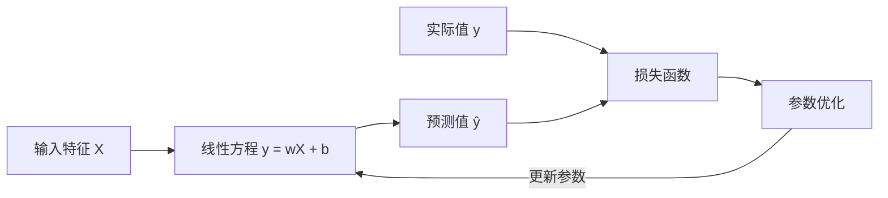
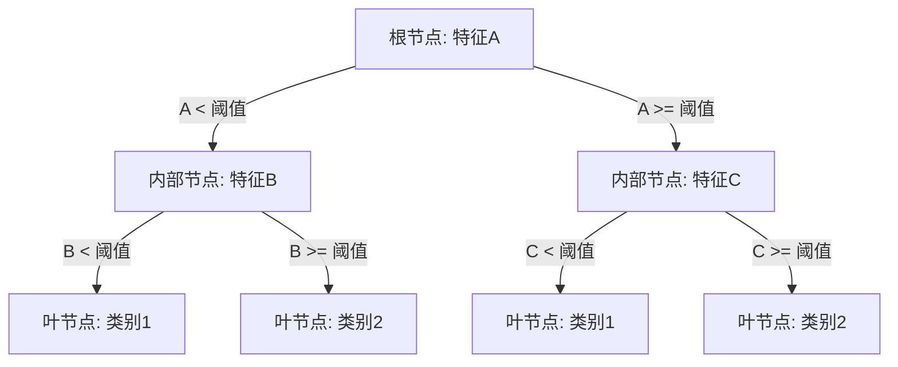
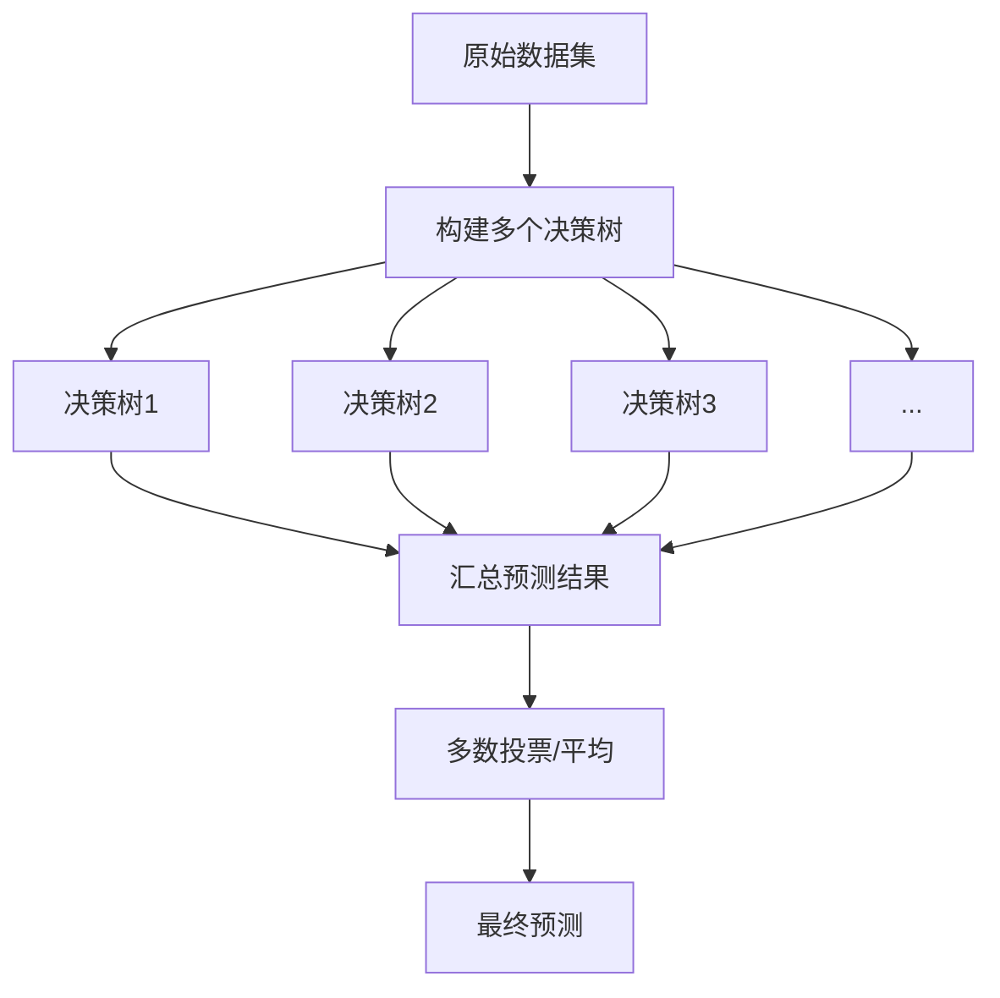
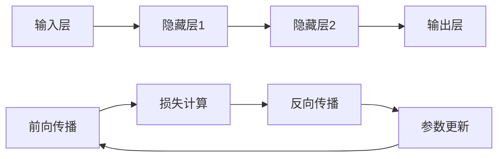
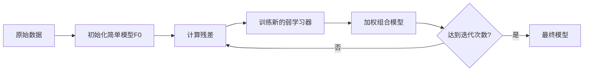
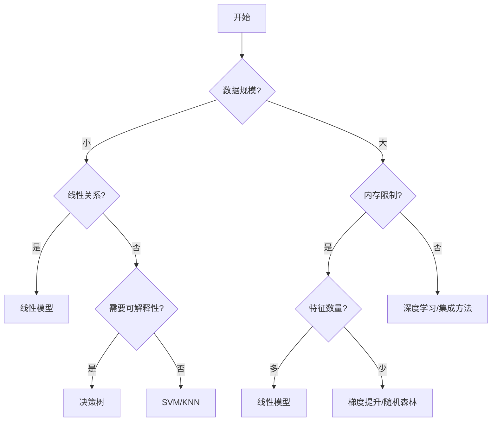

# 监督学习算法

## 📚 目录

1. [线性模型](#线性模型)
2. [决策树模型](#决策树模型)
3. [支持向量机](#支持向量机)
4. [K近邻算法](#k近邻算法)
5. [朴素贝叶斯](#朴素贝叶斯)
6. [神经网络](#神经网络)
7. [集成学习](#集成学习)
8. [算法选择指南](#算法选择指南)

## 线性模型

### 线性回归



**核心思想**: 假设目标值y与特征X之间存在线性关系，通过最小化预测值与真实值之间的平方差来学习参数。

**数学表达**:
- 模型: $y = w_1x_1 + w_2x_2 + ... + w_nx_n + b$
- 损失函数: $J(w,b) = \frac{1}{2m}\sum_{i=1}^{m}(y^{(i)} - \hat{y}^{(i)})^2$，其中$\hat{y}^{(i)} = w^Tx^{(i)} + b$

**优势**:
- 计算效率高，易于实现和理解
- 模型的可解释性强
- 适用于特征与目标之间存在线性关系的问题

**局限性**:
- 无法捕捉非线性关系
- 对异常值敏感
- 要求特征间相对独立（多重共线性问题）

**应用场景**:
- 房价预测
- 销售额预测
- 简单的趋势分析

**代码示例**:
```python
from sklearn.linear_model import LinearRegression
from sklearn.metrics import mean_squared_error

# 初始化模型
model = LinearRegression()

# 训练模型
model.fit(X_train, y_train)

# 预测
y_pred = model.predict(X_test)

# 评估
mse = mean_squared_error(y_test, y_pred)
print(f"均方误差: {mse}")
print(f"系数: {model.coef_}")
print(f"截距: {model.intercept_}")
```

### 逻辑回归

```mermaid
graph LR
    A[输入特征 X] --> B[线性计算 z = wX + b]
    B --> C[Sigmoid函数 σ(z)]
    C --> D[概率输出 P(y=1|X)]
    D --> E{概率大于0.5?}
    E --> |是| F[预测类别1]
    E --> |否| G[预测类别0]
```

**核心思想**: 将线性回归的输出通过Sigmoid函数映射到[0,1]区间，表示样本属于正类的概率。

**数学表达**:
- 模型: $P(y=1|x) = \sigma(w^Tx + b) = \frac{1}{1 + e^{-(w^Tx + b)}}$
- 损失函数: $J(w,b) = -\frac{1}{m}\sum_{i=1}^{m}[y^{(i)}\log(\hat{y}^{(i)}) + (1-y^{(i)})\log(1-\hat{y}^{(i)})]$

**优势**:
- 直接输出分类概率
- 训练速度快，计算资源需求低
- 可解释性强
- 适用于二分类问题，可扩展到多分类（一对多方法）

**局限性**:
- 主要用于线性可分问题
- 对特征缩放敏感
- 可能受到类别不平衡的影响

**应用场景**:
- 垃圾邮件检测
- 疾病诊断
- 信用风险评估
- 用户转化预测

**代码示例**:
```python
from sklearn.linear_model import LogisticRegression
from sklearn.metrics import accuracy_score, classification_report

# 初始化模型
model = LogisticRegression(C=1.0, solver='lbfgs', max_iter=1000)

# 训练模型
model.fit(X_train, y_train)

# 预测
y_pred = model.predict(X_test)
y_prob = model.predict_proba(X_test)[:, 1]

# 评估
accuracy = accuracy_score(y_test, y_pred)
print(f"准确率: {accuracy}")
print(classification_report(y_test, y_pred))
```

## 决策树模型

### 决策树



**核心思想**: 通过一系列问题将数据划分为不同的区域，每个区域内的样本尽可能属于同一类别。

**关键概念**:
- 信息增益：基于熵的减少量选择最佳分裂点
- 基尼不纯度：衡量节点的纯度
- 剪枝：减少过拟合的技术

**优势**:
- 可解释性强，决策过程直观
- 能处理数值和类别特征
- 不需要特征缩放
- 自动进行特征选择

**局限性**:
- 容易过拟合，特别是树很深时
- 对数据中的微小变化敏感，模型稳定性差
- 处理连续变量和高维数据时效率较低

**应用场景**:
- 简单的分类和回归问题
- 需要高度可解释性的领域（如医疗诊断）
- 特征包含类别和数值的混合数据集

**代码示例**:
```python
from sklearn.tree import DecisionTreeClassifier
from sklearn.metrics import accuracy_score

# 初始化模型
model = DecisionTreeClassifier(max_depth=5, min_samples_split=2, min_samples_leaf=1)

# 训练模型
model.fit(X_train, y_train)

# 预测
y_pred = model.predict(X_test)

# 评估
accuracy = accuracy_score(y_test, y_pred)
print(f"准确率: {accuracy}")

# 可视化决策树
from sklearn.tree import export_graphviz
import graphviz
dot_data = export_graphviz(model, filled=True, feature_names=feature_names, class_names=['0', '1'])
graphviz.Source(dot_data)
```

### 随机森林



**核心思想**: 构建多个决策树，每个树使用随机的数据子集和特征子集，最终通过投票或平均方式结合所有树的预测。

**关键技术**:
- 自助采样(Bootstrap): 随机有放回地抽取样本
- 随机特征选择: 每次分裂节点时仅考虑特征的随机子集
- 集成方法: 结合多个树的预测结果

**优势**:
- 大幅降低过拟合风险
- 提高预测准确性和稳定性
- 可处理高维数据
- 内置特征重要性评估

**局限性**:
- 相比单棵树，可解释性降低
- 训练和预测速度较慢
- 内存消耗较大

**应用场景**:
- 复杂分类和回归任务
- 特征众多的数据集
- 需要稳健预测的场景
- 特征重要性分析

**代码示例**:
```python
from sklearn.ensemble import RandomForestClassifier
from sklearn.metrics import accuracy_score, classification_report

# 初始化模型
model = RandomForestClassifier(n_estimators=100, max_depth=10, min_samples_split=2)

# 训练模型
model.fit(X_train, y_train)

# 预测
y_pred = model.predict(X_test)

# 评估
accuracy = accuracy_score(y_test, y_pred)
print(f"准确率: {accuracy}")
print(classification_report(y_test, y_pred))

# 特征重要性
importances = model.feature_importances_
indices = np.argsort(importances)[::-1]

# 输出特征重要性
for i in range(X_train.shape[1]):
    print(f"{i+1}. 特征 {feature_names[indices[i]]} ({importances[indices[i]]})")
```

## 支持向量机


**核心思想**: 寻找能够最大化分类间隔的超平面，并通过核函数处理非线性可分问题。

**数学表达**:
- 线性SVM: $f(x) = \text{sign}(w^T x + b)$
- 核函数: $K(x_i, x_j) = \phi(x_i)^T \phi(x_j)$
  - 线性核: $K(x_i, x_j) = x_i^T x_j$
  - 多项式核: $K(x_i, x_j) = (x_i^T x_j + c)^d$
  - 径向基函数核(RBF): $K(x_i, x_j) = \exp(-\gamma ||x_i - x_j||^2)$

**优势**:
- 在高维空间中表现出色
- 处理非线性分类问题的能力强
- 对噪声具有一定的鲁棒性
- 避免过拟合，特别是在高维小样本情况下

**局限性**:
- 对大规模数据训练计算开销大
- 对参数选择敏感（如C, gamma）
- 非概率输出，难以直接得到概率分数

**应用场景**:
- 文本分类
- 图像识别
- 基因表达分析
- 高维数据的分类问题

**代码示例**:
```python
from sklearn.svm import SVC
from sklearn.metrics import accuracy_score

# 数据预处理（重要）
from sklearn.preprocessing import StandardScaler
scaler = StandardScaler()
X_train_scaled = scaler.fit_transform(X_train)
X_test_scaled = scaler.transform(X_test)

# 初始化模型
model = SVC(kernel='rbf', C=1.0, gamma='scale', probability=True)

# 训练模型
model.fit(X_train_scaled, y_train)

# 预测
y_pred = model.predict(X_test_scaled)
y_prob = model.predict_proba(X_test_scaled)[:, 1]  # 需要probability=True

# 评估
accuracy = accuracy_score(y_test, y_pred)
print(f"准确率: {accuracy}")
```

## K近邻算法


**核心思想**: 基于相似性的非参数方法，预测基于K个最相似训练样本的多数投票或平均值。

**距离度量**:
- 欧氏距离: $d(x, y) = \sqrt{\sum_{i=1}^{n}(x_i - y_i)^2}$
- 曼哈顿距离: $d(x, y) = \sum_{i=1}^{n}|x_i - y_i|$
- 明可夫斯基距离: $d(x, y) = (\sum_{i=1}^{n}|x_i - y_i|^p)^{1/p}$

**优势**:
- 简单易实现，无需训练过程
- 适用于多分类问题
- 决策边界可以非常复杂
- 可解释性较强

**局限性**:
- 预测速度慢，特别是大数据集
- 对不相关特征和特征尺度敏感
- 存储开销大，需保存全部训练数据
- K值选择关键但困难

**应用场景**:
- 推荐系统
- 异常检测
- 小型数据集的分类
- 特征空间中样本分布规律性强的问题

**代码示例**:
```python
from sklearn.neighbors import KNeighborsClassifier
from sklearn.metrics import accuracy_score

# 数据预处理（重要）
from sklearn.preprocessing import StandardScaler
scaler = StandardScaler()
X_train_scaled = scaler.fit_transform(X_train)
X_test_scaled = scaler.transform(X_test)

# 初始化模型
model = KNeighborsClassifier(n_neighbors=5, weights='uniform', algorithm='auto')

# 训练模型
model.fit(X_train_scaled, y_train)

# 预测
y_pred = model.predict(X_test_scaled)
y_prob = model.predict_proba(X_test_scaled)[:, 1]

# 评估
accuracy = accuracy_score(y_test, y_pred)
print(f"准确率: {accuracy}")
```

## 朴素贝叶斯

```mermaid
graph LR
    A[训练数据] --> B[计算先验概率P(y)]
    A --> C[计算条件概率P(x|y)]
    B --> D[贝叶斯公式]
    C --> D
    D --> E[后验概率P(y|x)]
    E --> F[选择后验概率最大的类别]
```

**核心思想**: 基于贝叶斯定理，并假设特征之间相互独立，计算后验概率来进行分类。

**数学表达**:
- 贝叶斯定理: $P(y|x) = \frac{P(x|y)P(y)}{P(x)}$
- 决策规则: $\hat{y} = \arg\max_y P(y) \prod_{i=1}^{n}P(x_i|y)$

**主要变体**:
- 高斯朴素贝叶斯：假设特征服从高斯分布
- 多项式朴素贝叶斯：适用于离散计数特征
- 伯努利朴素贝叶斯：适用于二元特征

**优势**:
- 训练和预测效率极高
- 对小样本数据表现良好
- 易于实现和理解
- 适合增量学习

**局限性**:
- 特征独立性假设在实际中常常不成立
- 对零频率问题敏感（需要平滑处理）
- 对数值特征的分布假设可能不准确

**应用场景**:
- 文本分类（如垃圾邮件过滤）
- 实时预测（如推荐系统）
- 多分类问题
- 高维数据场景

**代码示例**:
```python
from sklearn.naive_bayes import GaussianNB, MultinomialNB
from sklearn.metrics import accuracy_score

# 高斯朴素贝叶斯（适合连续特征）
model_g = GaussianNB()
model_g.fit(X_train, y_train)
y_pred_g = model_g.predict(X_test)
accuracy_g = accuracy_score(y_test, y_pred_g)
print(f"高斯朴素贝叶斯准确率: {accuracy_g}")

# 多项式朴素贝叶斯（适合离散特征，如文本数据）
model_m = MultinomialNB(alpha=1.0)  # alpha是平滑参数
model_m.fit(X_train, y_train)
y_pred_m = model_m.predict(X_test)
accuracy_m = accuracy_score(y_test, y_pred_m)
print(f"多项式朴素贝叶斯准确率: {accuracy_m}")
```

## 神经网络



**核心思想**: 模拟人脑神经元连接结构的多层网络，通过反向传播算法学习复杂的特征表示。

**关键组件**:
- 输入层：接收原始特征
- 隐藏层：通过非线性激活函数提取复杂特征
- 输出层：产生预测结果
- 激活函数：如sigmoid, tanh, ReLU
- 损失函数：衡量预测与真实值的差距

**优势**:
- 强大的表达能力，可以建模极其复杂的关系
- 自动提取特征表示，减少人工特征工程
- 适用于各种问题类型（分类、回归、生成等）
- 灵活的架构设计，适应不同数据结构

**局限性**:
- 参数调优复杂，训练困难
- 需要大量数据和计算资源
- 容易过拟合
- 可解释性较差

**应用场景**:
- 图像识别
- 自然语言处理
- 推荐系统
- 复杂的多分类和回归问题

**代码示例**:
```python
from sklearn.neural_network import MLPClassifier
from sklearn.preprocessing import StandardScaler
from sklearn.metrics import accuracy_score

# 数据预处理（重要）
scaler = StandardScaler()
X_train_scaled = scaler.fit_transform(X_train)
X_test_scaled = scaler.transform(X_test)

# 初始化模型
model = MLPClassifier(
    hidden_layer_sizes=(100, 50),  # 两个隐藏层，节点数分别为100和50
    activation='relu',             # 激活函数
    solver='adam',                 # 优化算法
    alpha=0.0001,                  # L2正则化参数
    batch_size='auto',             # 批大小
    learning_rate='adaptive',      # 学习率策略
    max_iter=1000,                 # 最大迭代次数
    early_stopping=True,           # 早停
    random_state=42                # 随机种子
)

# 训练模型
model.fit(X_train_scaled, y_train)

# 预测
y_pred = model.predict(X_test_scaled)
y_prob = model.predict_proba(X_test_scaled)[:, 1]

# 评估
accuracy = accuracy_score(y_test, y_pred)
print(f"准确率: {accuracy}")
```

## 集成学习

### 梯度提升树



**核心思想**: 通过顺序构建一系列弱模型（通常是决策树），每个模型纠正前面模型的误差，最终组合成强大的预测模型。

**关键技术**:
- 残差学习：新模型拟合前模型的残差
- 梯度下降：在函数空间中进行优化
- 学习率：控制每个弱学习器的贡献
- 正则化：防止过拟合

**主要变体**:
- XGBoost：高效实现，带有正则化
- LightGBM：基于直方图的决策树算法，更快
- CatBoost：处理类别特征的专用算法

**优势**:
- 强大的预测性能，通常是最佳算法之一
- 内置特征选择
- 处理不同类型数据的能力强
- 对异常值较不敏感

**局限性**:
- 调参复杂
- 计算密集型，可能较慢
- 与随机森林相比，更容易过拟合
- 不如线性模型容易解释

**应用场景**:
- 竞赛和高精度要求场景
- 需要强大特征重要性分析的问题
- 复杂的回归和分类任务
- 解决各种结构化数据问题

**代码示例**:
```python
from sklearn.ensemble import GradientBoostingClassifier
from sklearn.metrics import accuracy_score, classification_report

# 初始化模型
model = GradientBoostingClassifier(
    n_estimators=100,          # 弱学习器数量
    learning_rate=0.1,         # 学习率
    max_depth=3,               # 树的最大深度
    min_samples_split=2,       # 内部节点分裂所需最小样本数
    random_state=42            # 随机种子
)

# 训练模型
model.fit(X_train, y_train)

# 预测
y_pred = model.predict(X_test)
y_prob = model.predict_proba(X_test)[:, 1]

# 评估
accuracy = accuracy_score(y_test, y_pred)
print(f"准确率: {accuracy}")
print(classification_report(y_test, y_pred))

# 特征重要性
importances = model.feature_importances_
indices = np.argsort(importances)[::-1]
for i in range(X_train.shape[1]):
    print(f"{i+1}. 特征 {feature_names[indices[i]]} ({importances[indices[i]]})")
```

## 算法选择指南

### 如何选择合适的监督学习算法？



### 各算法适用场景对比表

| 算法 | 数据规模 | 特征数量 | 训练速度 | 预测速度 | 可解释性 | 精确度 | 推荐场景 |
|------|---------|---------|----------|----------|---------|--------|----------|
| 线性回归/逻辑回归 | 不限 | 适合高维 | 快 | 极快 | 高 | 中 | 简单关系，需要解释性 |
| 决策树 | 小-中 | 中等 | 中 | 快 | 高 | 中 | 需要规则解释，混合特征 |
| 随机森林 | 中-大 | 中-高 | 中 | 中 | 中 | 高 | 特征众多，需均衡性能和解释性 |
| SVM | 小-中 | 高 | 慢 | 中 | 低 | 高 | 复杂边界，高维数据 |
| K近邻 | 小 | 低-中 | 极快(无训练) | 慢 | 中 | 中 | 简单问题，原型样本 |
| 朴素贝叶斯 | 不限 | 高 | 极快 | 极快 | 中 | 中 | 文本分类，高维稀疏数据 |
| 神经网络 | 大 | 不限 | 极慢 | 快 | 极低 | 极高 | 复杂问题，大数据，深度特征 |
| 梯度提升树 | 中-大 | 中 | 慢 | 快 | 中 | 极高 | 结构化数据，竞赛，高精度要求 |

### 算法选择流程

1. **了解问题**:
   - 是分类还是回归问题？
   - 数据规模和维度如何？
   - 是否需要概率输出？
   - 解释性是否重要？

2. **评估资源约束**:
   - 训练时间限制？
   - 预测时间要求？
   - 内存限制？

3. **尝试基线模型**:
   - 从简单模型开始（如线性模型）
   - 建立基准性能

4. **逐步尝试复杂模型**:
   - 在不同算法间交叉验证
   - 微调重要参数

5. **综合考虑**:
   - 精度、速度、解释性的平衡
   - 实际部署环境的限制

## 📘 相关资源

- [返回机器学习基础首页](./README.md)
- [模型评估方法](./ModelEvaluation.md)
- [特征工程技术](./FeatureEngineering.md)
- [集成学习技术](./EnsembleLearning.md)

---

© AI技术知识库 2023 