# 自然语言处理

## 📚 内容导航

- [文本预处理技术](./TextPreprocessing.md) - 分词、词形还原、停用词处理等基础文本处理方法
- [词向量与语言表示](./WordEmbeddings.md) - Word2Vec、GloVe、FastText、上下文嵌入模型
- [语言模型架构](./LanguageModels.md) - N-gram到Transformer模型，预训练语言模型架构解析
- [序列标注任务](./SequenceLabeling.md) - 词性标注、命名实体识别、语义角色标注等技术
- [文本分类与情感分析](./TextClassification.md) - 文档分类、情感极性分析与多标签分类方法
- [机器翻译技术](./MachineTranslation.md) - 统计机器翻译、神经机器翻译与评估方法
- [问答系统](./QuestionAnswering.md) - 信息检索式QA、生成式QA与对话系统设计

## 🔍 自然语言处理知识结构

```mermaid
graph TD
    A[自然语言处理] --> B[基础技术]
    A --> C[表示学习]
    A --> D[核心任务]
    A --> E[应用系统]
    A --> F[评估方法]
    
    B --> B1[文本预处理]
    B --> B2[语言学基础]
    B --> B3[统计语言模型]
    
    C --> C1[词表示]
    C --> C2[句子表示]
    C --> C3[文档表示]
    C --> C4[跨语言表示]
    
    D --> D1[词法分析]
    D --> D2[句法分析]
    D --> D3[语义分析]
    D --> D4[篇章分析]
    
    E --> E1[信息抽取]
    E --> E2[文本生成]
    E --> E3[对话系统]
    E --> E4[机器翻译]
    E --> E5[多模态NLP]
    
    F --> F1[内在评估]
    F --> F2[外在评估]
    F --> F3[人工评估]
    
    B1 --> B11[分词与标记化]
    B1 --> B12[词形还原]
    B1 --> B13[数据增强]
    
    C1 --> C11[One-hot编码]
    C1 --> C12[分布式表示]
    C1 --> C13[上下文化表示]
    
    D1 --> D11[词性标注]
    D1 --> D12[命名实体识别]
    D1 --> D13[词义消歧]
    
    D2 --> D21[依存句法分析]
    D2 --> D22[成分句法分析]
    
    D3 --> D31[语义角色标注]
    D3 --> D32[语义关系提取]
    
    E1 --> E11[实体抽取]
    E1 --> E12[关系抽取]
    E1 --> E13[事件抽取]
    
    E3 --> E31[任务型对话]
    E3 --> E32[开放域对话]
    E3 --> E33[情感对话]
    
    classDef basic fill:#f9d5e5,stroke:#333,stroke-width:1px;
    classDef rep fill:#eeac99,stroke:#333,stroke-width:1px;
    classDef task fill:#e06377,stroke:#333,stroke-width:1px;
    classDef app fill:#c83349,stroke:#333,stroke-width:1px;
    classDef eval fill:#5b9aa0,stroke:#333,stroke-width:1px;
    
    class B1,B2,B3,B11,B12,B13 basic;
    class C1,C2,C3,C4,C11,C12,C13 rep;
    class D1,D2,D3,D4,D11,D12,D13,D21,D22,D31,D32 task;
    class E1,E2,E3,E4,E5,E11,E12,E13,E31,E32,E33 app;
    class F1,F2,F3 eval;
```



## 📊 NLP技术发展与对比

| 技术领域 | 传统方法 | 深度学习方法 | 预训练语言模型 | 当前趋势 |
|---------|---------|------------|--------------|---------|
| 文本表示 | TF-IDF, BoW | Word2Vec, GloVe | BERT, RoBERTa | 自适应表示、多语言模型 |
| 文本分类 | SVM, Naive Bayes | CNN, RNN, LSTM | 微调预训练模型 | 少样本学习、数据增强 |
| 序列标注 | HMM, CRF | BiLSTM-CRF | 微调BERT/span预测 | 结构化预测、多任务学习 |
| 句法分析 | 基于规则, PCFG | 神经句法分析器 | 基于图的语法分析 | 无监督、跨语言 |
| 机器翻译 | 基于规则/统计 | Seq2Seq, 注意力 | Transformer | 多语言、文档级翻译 |
| 对话系统 | 基于模板/状态 | 检索式, 生成式 | 大规模预训练 | 多轮推理、知识整合 |
| 文本生成 | 模板填充 | RNN/Transformer | GPT系列 | 可控生成、长文本生成 |

## 🚀 NLP处理流程

```mermaid
flowchart TD
    A[原始文本] --> B[预处理]
    B --> C[特征提取/表示学习]
    C --> D[模型训练]
    D --> E[评估与优化]
    E --> F{满足要求?}
    F -- 否 --> |调整参数/模型| D
    F -- 否 --> |改进特征| C
    F -- 是 --> G[部署应用]
    
    subgraph 数据准备阶段
    A
    B
    end
    
    subgraph 特征工程与建模阶段
    C
    D
    E
    F
    end
    
    subgraph 应用部署阶段
    G
    end
    
    B --> B1[分词/标记化]
    B1 --> B2[去除停用词]
    B2 --> B3[词形还原/词干提取]
    B3 --> B4[数据增强/清洗]
```

## 📝 NLP评估指标

### 文本分类评估指标

| 指标 | 计算方法 | 适用场景 | 优缺点 |
|------|---------|---------|-------|
| 准确率(Accuracy) | 正确分类样本数/总样本数 | 类别均衡问题 | 直观但在不平衡数据集上有偏差 |
| 精确率(Precision) | TP/(TP+FP) | 减少误报重要场景 | 衡量正例预测的准确性 |
| 召回率(Recall) | TP/(TP+FN) | 减少漏报重要场景 | 衡量捕获所有正例的能力 |
| F1分数 | 2×(P×R)/(P+R) | 精确与召回平衡 | 精确率和召回率的调和平均 |
| Macro-F1 | 各类F1的平均 | 各类同等重要 | 反映所有类别的整体表现 |
| Micro-F1 | 汇总各类结果计算 | 考虑样本分布 | 受主类影响较大 |

### 序列标注评估指标

| 指标 | 计算方法 | 适用场景 | 备注 |
|------|---------|---------|-----|
| 标记准确率 | 正确标注标记数/总标记数 | 一般序列标注 | 简单但不反映实体完整性 |
| 实体精确率 | 正确标注实体数/预测实体总数 | NER任务 | 衡量实体边界识别准确性 |
| 实体召回率 | 正确标注实体数/实际实体总数 | NER任务 | 衡量发现所有实体的能力 |
| 实体F1 | 精确率和召回率的调和平均 | NER任务 | 综合评价实体抽取性能 |

### 机器翻译评估指标

| 指标 | 计算原理 | 优点 | 局限性 |
|------|---------|-----|--------|
| BLEU | n-gram精确匹配 | 广泛使用，计算简单 | 不考虑语义等价性 |
| METEOR | 基于对齐的单词匹配 | 考虑同义词和词形变化 | 计算复杂度高 |
| chrF | 字符级别的F-score | 适合形态丰富的语言 | 对短文本效果有限 |
| COMET | 基于神经网络的评估 | 与人类判断更相关 | 需要训练模型 |
| BERTScore | 上下文嵌入相似度 | 考虑语义相似性 | 计算资源消耗大 |

## 💡 NLP最佳实践

### 文本预处理技巧

```python
# 文本预处理示例代码
import re
import nltk
from nltk.tokenize import word_tokenize
from nltk.stem import WordNetLemmatizer
from nltk.corpus import stopwords

nltk.download(['punkt', 'wordnet', 'stopwords'])

def preprocess_text(text, language='english'):
    """基本的文本预处理函数"""
    # 转小写
    text = text.lower()
    
    # 移除特殊字符和数字
    text = re.sub(r'[^a-zA-Z\s]', '', text)
    
    # 分词
    tokens = word_tokenize(text)
    
    # 移除停用词
    stop_words = set(stopwords.words(language))
    tokens = [t for t in tokens if t not in stop_words]
    
    # 词形还原
    lemmatizer = WordNetLemmatizer()
    tokens = [lemmatizer.lemmatize(t) for t in tokens]
    
    return tokens

# 使用示例
text = "The quick brown foxes jumped over the lazy dogs! They weren't very quick."
processed_tokens = preprocess_text(text)
print(processed_tokens)
```

### 构建文本分类流水线

```python
from sklearn.feature_extraction.text import TfidfVectorizer
from sklearn.pipeline import Pipeline
from sklearn.model_selection import train_test_split, GridSearchCV
from sklearn.linear_model import LogisticRegression
from sklearn.metrics import classification_report

# 示例文本数据和标签
texts = ["This movie is great!", "I hate this product", "Love the service", ...]
labels = [1, 0, 1, ...]  # 1为正面情感，0为负面情感

# 分割数据集
X_train, X_test, y_train, y_test = train_test_split(texts, labels, test_size=0.2)

# 创建处理流水线
pipeline = Pipeline([
    ('tfidf', TfidfVectorizer(max_features=5000, ngram_range=(1, 2))),
    ('clf', LogisticRegression(C=1, max_iter=1000))
])

# 参数网格搜索
param_grid = {
    'tfidf__max_features': [3000, 5000, 10000],
    'tfidf__ngram_range': [(1, 1), (1, 2), (1, 3)],
    'clf__C': [0.1, 1.0, 10.0]
}

grid_search = GridSearchCV(pipeline, param_grid, cv=5, scoring='f1')
grid_search.fit(X_train, y_train)

# 最佳参数
print("最佳参数:", grid_search.best_params_)

# 评估模型
y_pred = grid_search.predict(X_test)
print(classification_report(y_test, y_pred))
```

### BERT微调最佳实践

```python
import torch
from transformers import BertTokenizer, BertForSequenceClassification, AdamW, get_linear_schedule_with_warmup
from torch.utils.data import DataLoader, TensorDataset
from sklearn.metrics import accuracy_score, f1_score
import numpy as np

# 1. 加载预训练模型和分词器
tokenizer = BertTokenizer.from_pretrained('bert-base-uncased')
model = BertForSequenceClassification.from_pretrained('bert-base-uncased', num_labels=2)

# 2. 数据准备
def encode_text(texts, max_length=128):
    return tokenizer(
        texts,
        padding='max_length',
        truncation=True,
        max_length=max_length,
        return_tensors='pt'
    )

# 假设我们已有训练数据
train_encodings = encode_text(train_texts)
val_encodings = encode_text(val_texts)

train_dataset = TensorDataset(
    train_encodings['input_ids'],
    train_encodings['attention_mask'],
    torch.tensor(train_labels)
)
val_dataset = TensorDataset(
    val_encodings['input_ids'],
    val_encodings['attention_mask'],
    torch.tensor(val_labels)
)

# 3. 创建数据加载器
train_loader = DataLoader(train_dataset, batch_size=16, shuffle=True)
val_loader = DataLoader(val_dataset, batch_size=32)

# 4. 训练设置
device = torch.device('cuda' if torch.cuda.is_available() else 'cpu')
model.to(device)

optimizer = AdamW(model.parameters(), lr=2e-5)
total_steps = len(train_loader) * 3  # 3个epoch
scheduler = get_linear_schedule_with_warmup(
    optimizer,
    num_warmup_steps=0,
    num_training_steps=total_steps
)

# 5. 训练循环
best_f1 = 0.0

for epoch in range(3):
    # 训练模式
    model.train()
    for batch in train_loader:
        input_ids, attention_mask, labels = [b.to(device) for b in batch]
        
        optimizer.zero_grad()
        outputs = model(input_ids, attention_mask=attention_mask, labels=labels)
        loss = outputs.loss
        loss.backward()
        
        torch.nn.utils.clip_grad_norm_(model.parameters(), 1.0)
        optimizer.step()
        scheduler.step()
    
    # 评估模式
    model.eval()
    val_preds = []
    val_true = []
    
    with torch.no_grad():
        for batch in val_loader:
            input_ids, attention_mask, labels = [b.to(device) for b in batch]
            outputs = model(input_ids, attention_mask=attention_mask)
            
            preds = torch.argmax(outputs.logits, dim=1).cpu().numpy()
            val_preds.extend(preds)
            val_true.extend(labels.cpu().numpy())
    
    # 计算指标
    accuracy = accuracy_score(val_true, val_preds)
    f1 = f1_score(val_true, val_preds)
    print(f"Epoch {epoch+1}: Accuracy = {accuracy:.4f}, F1 = {f1:.4f}")
    
    if f1 > best_f1:
        best_f1 = f1
        torch.save(model.state_dict(), 'best_model.pt')
```

## 📘 相关资源

- [返回AI技术知识库首页](../README.md)
- [机器学习基础](../MachineLearning/README.md)
- [深度学习](../DeepLearning/README.md)
- [大模型技术](../LargeModels/README.md)

### 推荐学习资源

- 《自然语言处理综论》(Daniel Jurafsky, James H. Martin)
- 《Python自然语言处理》(Steven Bird, Ewan Klein, Edward Loper)
- [Stanford CS224n: 深度学习与自然语言处理](http://web.stanford.edu/class/cs224n/)
- [Hugging Face Transformers文档](https://huggingface.co/docs/transformers/index)
- [spaCy自然语言处理库](https://spacy.io/usage/spacy-101)
- [NLTK文档](https://www.nltk.org/)

---

© AI技术知识库 2023 