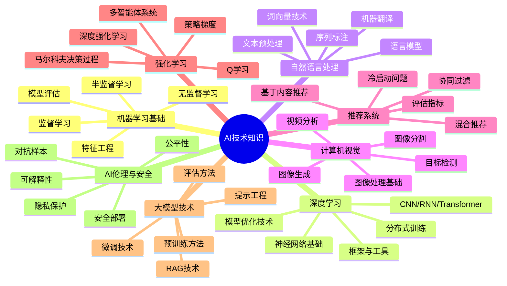

# AI技术知识体系

## 🌟 核心模块

## 📚 模块导航

### 机器学习基础

- [机器学习基础](./MachineLearning/README.md)
  - [监督学习算法](./MachineLearning/SupervisedLearning.md)
  - [无监督学习算法](./MachineLearning/UnsupervisedLearning.md)
  - [特征工程技术](./MachineLearning/FeatureEngineering.md)
  - [模型评估方法](./MachineLearning/ModelEvaluation.md)
  - [集成学习技术](./MachineLearning/EnsembleLearning.md)
  - [概率图模型](./MachineLearning/ProbabilisticGraphicalModels.md)

### 深度学习

- [深度学习](./DeepLearning/README.md)
  - [神经网络基础](./DeepLearning/NeuralNetworkBasics.md)
  - [卷积神经网络](./DeepLearning/CNN.md)
  - [循环神经网络](./DeepLearning/RNN.md)
  - [Transformer架构](./DeepLearning/Transformer.md)
  - [优化算法](./DeepLearning/Optimization.md)
  - [正则化技术](./DeepLearning/Regularization.md)
  - [模型压缩与加速](./DeepLearning/ModelCompression.md)

### 自然语言处理

- [自然语言处理](./NLP/README.md)
  - [文本预处理技术](./NLP/TextPreprocessing.md)
  - [词向量与语言表示](./NLP/WordEmbeddings.md)
  - [语言模型架构](./NLP/LanguageModels.md)
  - [序列标注任务](./NLP/SequenceLabeling.md)
  - [文本分类与情感分析](./NLP/TextClassification.md)
  - [机器翻译技术](./NLP/MachineTranslation.md)
  - [问答系统](./NLP/QuestionAnswering.md)

### 计算机视觉

- [计算机视觉](./ComputerVision/README.md)
  - [图像处理基础](./ComputerVision/ImageProcessing.md)
  - [目标检测技术](./ComputerVision/ObjectDetection.md)
  - [图像分割方法](./ComputerVision/ImageSegmentation.md)
  - [图像生成模型](./ComputerVision/ImageGeneration.md)
  - [视频分析技术](./ComputerVision/VideoAnalysis.md)
  - [三维视觉](./ComputerVision/3DVision.md)
  - [多模态学习](./ComputerVision/MultimodalLearning.md)

### 推荐系统

- [推荐系统](./RecommenderSystems/README.md)
  - [协同过滤算法](./RecommenderSystems/CollaborativeFiltering.md)
  - [基于内容的推荐](./RecommenderSystems/ContentBasedRecommendation.md)
  - [深度学习推荐模型](./RecommenderSystems/DeepLearningForRecommendation.md)
  - [上下文感知推荐](./RecommenderSystems/ContextAwareRecommendation.md)
  - [冷启动问题](./RecommenderSystems/ColdStartProblem.md)
  - [推荐系统评估](./RecommenderSystems/Evaluation.md)

### 强化学习

- [强化学习](./ReinforcementLearning/README.md)
  - [马尔科夫决策过程](./ReinforcementLearning/MDP.md)
  - [动态规划方法](./ReinforcementLearning/DynamicProgramming.md)
  - [蒙特卡洛与时序差分](./ReinforcementLearning/MC_TD.md)
  - [策略梯度方法](./ReinforcementLearning/PolicyGradient.md)
  - [深度强化学习](./ReinforcementLearning/DeepRL.md)
  - [多智能体强化学习](./ReinforcementLearning/MultiAgentRL.md)

### 大模型技术

- [大模型技术](./LargeModels/README.md)
  - [预训练方法](./LargeModels/PretrainingMethods.md)
  - [指令微调技术](./LargeModels/InstructionFineTuning.md)
  - [提示工程](./LargeModels/PromptEngineering.md)
  - [检索增强生成](./LargeModels/RAG.md)
  - [模型对齐技术](./LargeModels/Alignment.md)
  - [模型评估方法](./LargeModels/Evaluation.md)
  - [高效推理技术](./LargeModels/EfficientInference.md)

### AI伦理与安全

- [AI伦理与安全](./Ethics/README.md)
  - [AI伦理原则](./Ethics/EthicalPrinciples.md)
  - [隐私保护技术](./Ethics/PrivacyPreservation.md)
  - [AI公平性](./Ethics/Fairness.md)
  - [可解释AI](./Ethics/ExplainableAI.md)
  - [对抗攻击与防御](./Ethics/AdversarialAttacks.md)
  - [AI安全部署](./Ethics/SecureDeployment.md)

## 📊 学习路径图

以下是针对不同水平的AI学习者推荐的学习路径：

### 初学者路径

1. **基础入门**：
   - 机器学习基本概念
   - 监督学习基础算法
   - Python与数据处理
   - 基本特征工程

2. **深度学习基础**：
   - 神经网络基本原理
   - 深度学习框架入门
   - 基础网络结构
   - 简单NLP和CV任务

3. **应用实践**：
   - 小型项目实践
   - 数据集处理与分析
   - 模型训练与评估
   - 简单模型部署

### 中级学习者路径

1. **进阶模型**：
   - 复杂神经网络架构
   - 迁移学习技术
   - 高级特征工程
   - 多模态模型

2. **领域专精**：
   - NLP深入学习
   - CV进阶技术
   - 推荐系统设计
   - 强化学习基础

3. **系统设计**：
   - 端到端AI系统
   - 模型优化与部署
   - 分布式训练
   - AB测试与评估

### 高级学习者路径

1. **前沿研究**：
   - 大规模模型训练
   - 自监督学习
   - 元学习与小样本学习
   - 神经架构搜索

2. **工业化能力**：
   - 高可用AI系统
   - 模型监控与维护
   - 云原生AI部署
   - 大规模数据处理

3. **创新实践**：
   - AI算法创新
   - 跨领域AI应用
   - AI系统架构设计
   - AIGC与多模态系统

## 📌 AI技术在不同领域的应用重要性

下表展示了各AI技术模块在不同应用场景中的重要性：

| 技术模块 | 电子商务 | 金融科技 | 医疗健康 | 智能制造 | 内容创作 |
|---------|---------|---------|---------|---------|---------|
| 机器学习基础 | ⭐⭐⭐⭐ | ⭐⭐⭐⭐⭐ | ⭐⭐⭐⭐ | ⭐⭐⭐⭐ | ⭐⭐⭐ |
| 深度学习 | ⭐⭐⭐⭐ | ⭐⭐⭐⭐ | ⭐⭐⭐⭐⭐ | ⭐⭐⭐⭐ | ⭐⭐⭐⭐⭐ |
| 自然语言处理 | ⭐⭐⭐⭐ | ⭐⭐⭐ | ⭐⭐⭐⭐ | ⭐⭐ | ⭐⭐⭐⭐⭐ |
| 计算机视觉 | ⭐⭐⭐ | ⭐⭐ | ⭐⭐⭐⭐⭐ | ⭐⭐⭐⭐⭐ | ⭐⭐⭐⭐ |
| 推荐系统 | ⭐⭐⭐⭐⭐ | ⭐⭐⭐ | ⭐⭐⭐ | ⭐⭐ | ⭐⭐⭐⭐ |
| 强化学习 | ⭐⭐ | ⭐⭐⭐⭐ | ⭐⭐ | ⭐⭐⭐⭐ | ⭐⭐ |
| 大模型技术 | ⭐⭐⭐⭐ | ⭐⭐⭐ | ⭐⭐⭐⭐ | ⭐⭐⭐ | ⭐⭐⭐⭐⭐ |
| AI伦理与安全 | ⭐⭐⭐⭐ | ⭐⭐⭐⭐⭐ | ⭐⭐⭐⭐⭐ | ⭐⭐⭐ | ⭐⭐⭐ |

## 📖 推荐学习资源

### 经典书籍
- 《机器学习》(周志华)
- 《深度学习》(Ian Goodfellow, Yoshua Bengio, Aaron Courville)
- 《强化学习导论》(Richard S. Sutton, Andrew G. Barto)
- 《自然语言处理综论》(Daniel Jurafsky, James H. Martin)
- 《Hands-On Machine Learning with Scikit-Learn, Keras, and TensorFlow》(Aurélien Géron)

### 在线课程平台
- [Andrew Ng的机器学习课程](https://www.coursera.org/learn/machine-learning)
- [CS231n: 深度学习与计算机视觉](http://cs231n.stanford.edu/)
- [CS224n: 深度学习与自然语言处理](http://web.stanford.edu/class/cs224n/)
- [fast.ai深度学习实战课程](https://www.fast.ai/)
- [Hugging Face课程](https://huggingface.co/learn)

### 社区与资源
- [Papers with Code](https://paperswithcode.com/)
- [Kaggle竞赛平台](https://www.kaggle.com/)
- [arXiv论文预印本](https://arxiv.org/)
- [GitHub趋势AI项目](https://github.com/topics/artificial-intelligence)
- [AI研究实验室博客](https://openai.com/blog/)

### 框架与工具
- [PyTorch](https://pytorch.org/docs/stable/index.html)
- [TensorFlow](https://www.tensorflow.org/learn)
- [scikit-learn](https://scikit-learn.org/stable/documentation.html)
- [Hugging Face Transformers](https://huggingface.co/docs/transformers/index)
- [Ray](https://docs.ray.io/en/latest/)

---

© AI技术知识库 2023 