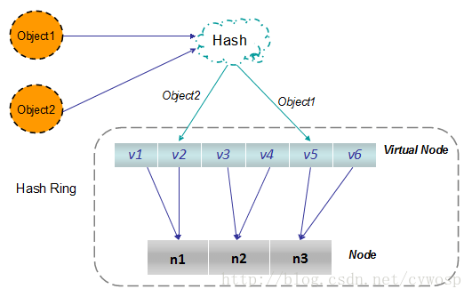

# Consistent Hashing
  - 一致性Hash算法
  - 一致性哈希算法是一种用于分布式系统中的哈希算法，它可以将数据分散到不同的节点上，同时保证节点的负载均衡和容错性。在一致性哈希算法中，将数据哈希成一个数值范围，在环上均匀分布节点，每个节点都对应着一个或多个范围。
  - 当有新的数据需要添加到分布式系统中时，先将数据哈希成数值，然后通过一致性哈希算法找到对应的节点。同时，当一个节点出现故障或者需要被移除时，只需要重新计算一次哈希，就可以将该节点对应的数据迁移到相邻节点上，而不会影响整个系统的稳定性。
  - 一致性哈希算法相较于传统哈希算法的优势在于：在添加或删除节点时，只需要将该节点周围的数据进行重新分配，而不会像传统哈希算法一样需要重新分配整个数据集。因此，一致性哈希算法可以实现更好的负载均衡和容错性。

  - 在实际应用中，一致性哈希算法被广泛应用于分布式缓存系统，比如 Memcached 和 Redis 等。它可以将数据分散到多台缓存服务器上，提高了缓存的性能和可用性。同时，一致性哈希算法也可以用于负载均衡和分布式存储系统等其他分布式应用中。

---

## 一致性Hash算法评判指标
  - 平衡性（Balance）
    不同key的哈希结果分布均衡，尽可能的均衡地分布到各节点上。平衡性跟哈希函数关系密切，目前许多哈希算法都有较好的平衡性。
  >
  - 单调性（Monotonicity）
    当有新的节点上线后，系统中原有的key要么还是映射到原来的节点上，映射到新加入的节点上，不会出现从一个老节点重新映射到另一个老节点。即表示：当可用存储桶的集合发生更改时，只有在必要时才移动项目以保持均匀的分布。
  >
  - 分散性（Spread）
    由于客户端可能看不到后端的所有服务，这种情况下对于固定的key，在两个客户端上可能被分散到不同的后端服务，从而降低后端存储的效率，所以算法应该尽量降低分散性。
  >
  - 服务器负载均衡（Load）
    负载主要是从服务器的角度来看，指各服务器的负载应该尽量均衡

---
## 均衡性优化 - 引入虚拟节点
  

## 算法具体实现
  - ketama 算法是最常用的一种一致性哈希算法的实现，广泛应用在存储及各rpc产品中，如memcache、redis，nginx、envoy等。github上面有 [Ketama的多语言实现](https://github.com/RJ/ketama) 的代码

---
## 参考资料
  - [一致性哈希 （Consistent Hashing）的前世今生](https://candicexiao.com/consistenthashing/)
  

---
- [返回首页](../../README.md)