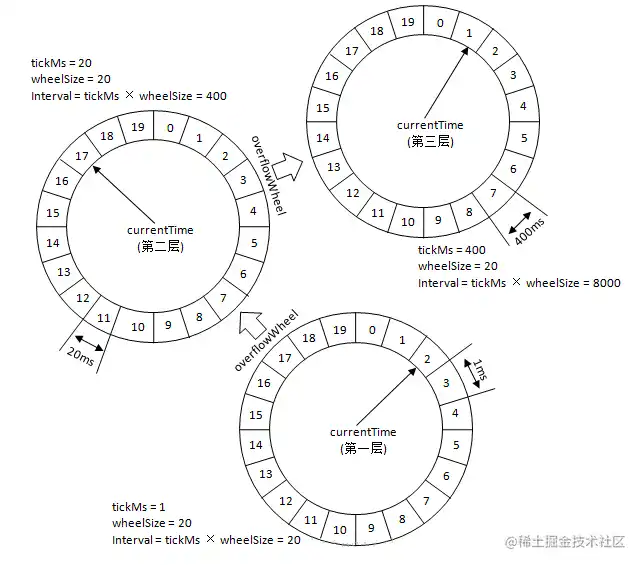

# TimingWheel
  - 时间轮算法 是一种 实现延迟功能（定时器） 的 巧妙算法。如果一个系统存在大量的任务调度，时间轮可以高效的利用线程资源来进行批量化调度。把大批量的调度任务全部都绑定时间轮上，通过时间轮进行所有任务的管理，触发以及运行。能够高效地管理各种延时任务，周期任务，通知任务等。

## 基本模型构成
  - **tickMs（基本时间跨度）**：时间轮由多个时间格组成，每个时间格代表当前时间轮的基本时间跨度（tickMs）。
  - **wheelSize（时间单位个数）**：时间轮的时间格个数是固定的，可用（wheelSize）来表示，那么整个时间轮的总体时间跨度（interval）可以通过公式 tickMs × wheelSize计算得出。
  - **currentTime（当前所处时间）**：时间轮还有一个表盘指针（currentTime），用来表示时间轮当前所处的时间，currentTime 是 tickMs 的整数倍。currentTime 可以将整个时间轮划分为到期部分和未到期部分，currentTime 当前指向的时间格也属于到期部分，表示刚好到期，需要处理此时间格所对应的 TimerTaskList 的所有任务。

## **层级时间轮**
  （层级时间轮类似十进制/二进制的计数方式）的概念应运而生，当任务的到期时间超过了当前时间轮所表示的时间范围时，就会尝试添加到上层时间轮中。
  复用之前的案例，第一层的时间轮 tickMs=1ms, wheelSize=20, interval=20ms。第二层的时间轮的 tickMs 为第一层时间轮的 interval，即为 20ms。每一层时间轮的 wheelSize 是固定的，都是 20，那么第二层的时间轮的总体时间跨度 interval 为 400ms。以此类推，这个 400ms 也是第三层的 tickMs 的大小，第三层的时间轮的总体时间跨度为 8000ms。
 
 
 
---
## 参考资料
  - [时间轮（TimingWheel）高性能定时任务原理解密](https://juejin.cn/post/7083795682313633822)

--- 
- [返回首页](../../README.md)