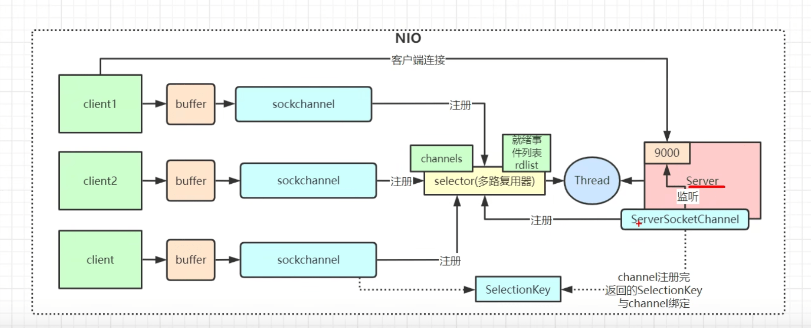

# Netty

## Linux IO模型
  - epoll的三个函数
    - epoll_create 新建epoll描述符
    ```c
    //创建一个epoll的句柄，size用来告诉内核这个监听的数目一共有多大, 在epoll早期的实现中，对于监控文件描述符的组织并不是使用红黑树，而是hash表。这里的size实际上已经没有意义。
    int epoll_create(int size)；
    int epoll_ctl(int epfd, int op, int fd, struct epoll_event *event)；
    int epoll_wait(int epfd, struct epoll_event * events, int maxevents, int timeout);
    ```
    - epoll_ctl 添加或者删除所有待监控的连接
    - epoll_wait 返回的活跃连接
  - Java在Linux系统中[java.nio.channels.Selector](https://github.com/openjdk/jdk/blob/cbe7e7bd7f7e7ea9f7221ef206917c58baff7696/src/java.base/linux/classes/sun/nio/ch/EPollSelectorImpl.java)实际上是对epoll的封装
  - LT模式：LT是epoll默认的工作方式，支持阻塞和非阻塞两种机制。LT模式下内核会持续通知你文件描述符就绪了，然后你可以对这个就绪的fd进行I/O操作。如果不做任何操作，内核还是会继续通知你的。
  - ET模式：ET模式相对LT模式更加高效，只支持非阻塞模式。在这个模式下，当描述符从未就绪变为就绪时，内核通过epoll告诉你。然后它会假设你知道文件描述符已经就绪，并且不再为那个文件描述符发生更多的就绪通知。直到你做了某些操作导致那个文件描述符不再为就绪状态了。
ET模式在很大程度上减少了epoll事件被重复触发的次数，因此效率要比LT模式高。epoll工作在ET模式时，必须使用非阻塞套接口，以避免一个文件句柄的阻塞导致把其他文件描述符饿死。
## Reactor编程模型
    

## NIO编程模型
    

## 参考资料
- [B站:Netty教程](https://www.bilibili.com/video/BV1JB4y1R7XB)
- [epoll中et和lt的区别与实现原理](https://baijiahao.baidu.com/s?id=1736123311976351393&wfr=spider&for=pc)