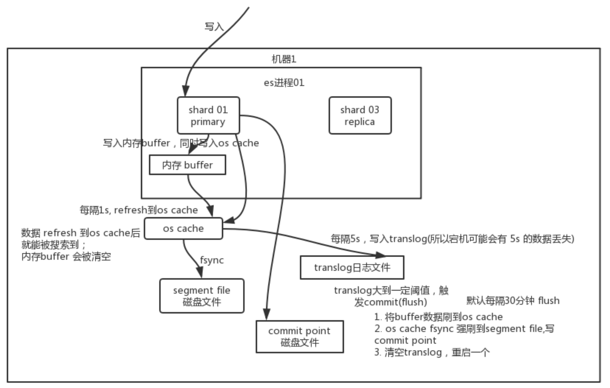

# ElasticSearch

## 关于Elasticsearch的Master选举机制
   - 基于Bully算法
     - 对所有可以成为master的节点根据nodeId排序，每次选举每个节点都把自己所知道节点排一次序，然后选出第一个（第0位）节点，暂且认为它是master节点。
     - 如果对某个节点的投票数达到一定的值（可以成为master节点数n/2+1）并且该节点自己也选举自己，那这个节点就是master。否则重新选举。
     - 对于脑裂(brain split)问题，需要把候选master节点最小值设置为可以成为master节点数n/2+1（quorum ）

## ES写入数据的工作原理
 - 1、客户端发写数据的请求时，可以发往任意节点。这个节点就会成为coordinating node协调节点。
 - 2、计算文档要写入的分片：计算时就采用hash取模的方式来计算。
 - 3、协调节点就会进行路由，将请求转发给对应的primary sharding所在的datanode。
 - 4、datanode节点上的primary sharding处理请求，写入数据到索引库，并且将数据同步到对应的replica sharding
 - 5、等primary sharding 和 replica sharding都保存好文档了之后，返回客户端响应。

## ES查询数据的工作原理
 - 1、客户端发请求可发给任意节点，这个节点就成为协调节点
 - 2、协调节点将查询请求广播到每一个数据节点，这些数据节点的分片就会处理改查询请求。
 - 3、每个分片进行数据查询，将符合条件的数据放在一个队列当中，并将这些数据的文档1D、节点信息、分片信息都返回给协调节点。
 - 4、由协调节点将所有的结果进行汇总，并排序。
 - 5、协调节点向包含这些文档ID的分片发送get请求，对应的分片将文档数据返回给协调节点,最后协调节点整合数据返回给客户端。
 - 写请求是写入 primary shard，然后同步给所有的 replica shard；读请求可以从 primary shard 或 replica shard 读取，采用的是随机轮询算法。
  
## ES写数据底层原理
  - 数据先写入内存 buffer，然后每隔 1s，将数据 refresh 到 os cache，到了 os cache数据就能被搜索到（所以我们才说 es 从写入到能被搜索到，中间有 1s 的延迟）。每隔 5s，将数据写入 translog 文件（这样如果机器宕机，内存数据全没，最多会有 5s 的数据丢失），translog 大到一定程度，或者默认每隔 30min，会触发 commit 操作，将缓冲区的数据都 flush 到 segment file 磁盘文件中。数据写入 segment file 之后，同时就建立好了倒排索引。
  

## 删除/更新数据底层原理
  - 如果是删除操作，commit 的时候会生成一个 .del 文件，里面将某个 doc 标识为 deleted状态，那么搜索的时候根据 .del 文件就知道这个 doc 是否被删除了。
  - 如果是更新操作，就是将原来的 doc 标识为 deleted 状态，然后新写入一条数据。
  - buffer 每 refresh 一次，就会产生一个 segment file ，所以默认情况下是 1 秒钟一个segment file ，这样下来 segment file 会越来越多，此时会定期执行 merge。每次merge 的时候，会将多个 segment file 合并成一个，同时这里会将标识为 deleted 的 doc 给物理删除掉，然后将新的 segment file 写入磁盘，这里会写一个 commit point ，标识所有新的 segment file ，然后打开 segment file 供搜索使用，同时删除旧的segment file 。

## ES VS Solr
  - 当单纯地对已有数据进行检索时，solr比ES快。当实时建立索引时，solr会产生io阻塞，查询性能较差，Elasticsearch具有明显的优势。
  - 二者安装都很简单。
  - 1、solr利用zookeeper 进行分布式管理，而Elasticsearch 自身带有分布式协调管理功能。
  - 2、solr 支持更多格式的数据，比如JSON、XML、CSV，而 Elasticsearch 仅支持json文件格式。
  - 3、Solr 在传统的搜索应用中表现好于 Elasticsearch，但在处理实时搜索应用时效率明显低于 Elasticsearcho
  - 4、Solr 是传统搜索应用的有力解决方案，但 Elasticsearch更适用于新兴的实时搜索应用。

## 如何提升ES的读写效率
  - 足够的内存、CPU、磁盘、网络
  - 减少需要的索引的字段
  - 分片要合理
  - 按时间分索引
  - 数据预热
  - 冷热分离
  - ES分页性能优化
    - 建议产品不允许深度分页，跳转分页
    - 使用scroll api

## 重要概念
  - 全文检索是指：
•通过一个程序扫描文本中的每一个单词，针对单词建立索引，并保存该单词在文本中的位置、以及出现的次数
•用户查询时，通过之前建立好的索引来查询，将秦引中单词对应的文本位置、出现的次数返回给用户，因为有了具体文本的位置，所以就可以将具体内容
读取出来了
## 参考资料
  - [Elasticsearch的灵魂唯一master选举机制原理分析](https://www.jb51.net/article/245436.htm)
  - [Elasticsearch原理（五）：Master机制及脑裂分析](Elasticsearch原理（五）：Master机制及脑裂分析)