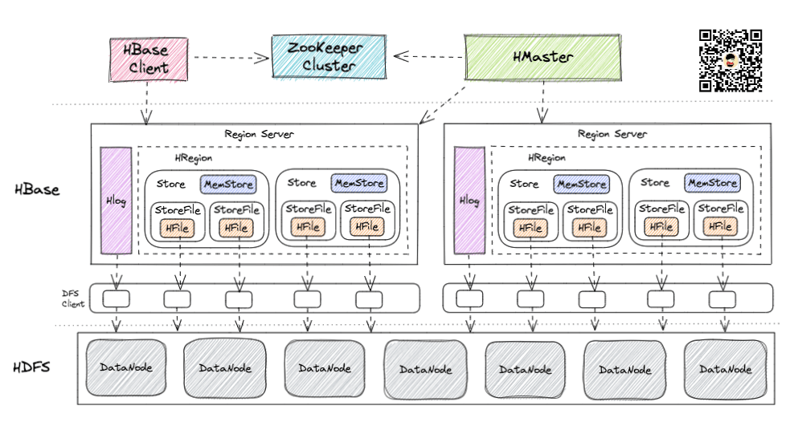

# HBase
## HBase的组成
  
  - **HBase Client**
    - HBase Client 为用户提供了访问 HBase 的接口，可以通过元数据表来定位到目标数据的 RegionServer，另外 HBase Client 还维护了对应的 cache 来加速 Hbase 的访问，比如缓存元数据的信息。
  - **HMaster**   
    - HMaster 是 HBase 集群的主节点，负责整个集群的管理工作，主要工作职责如下
    - 分配Region：负责启动的时候分配Region到具体的 RegionServer；
    - 负载均衡：一方面负责将用户的数据均衡地分布在各个 Region Server 上，防止Region Server数据倾斜过载。另一方面负责将用户的请求均衡地分布在各个 Region Server 上，防止Region Server 请求过热；
    - 维护数据：发现失效的 Region，并将失效的 Region 分配到正常的 RegionServer 上，并且在Region Sever 失效的时候，协调对应的HLog进行任务的拆分。
    - 管理namespace和table的元数据（实际存储在HDFS上）；
    - 权限控制（ACL）。
  - **RegionServer**
    - Region Server 直接对接用户的读写请求，是真正的干活的节点，主要工作职责如下。
    - 管理 HMaster 为其分配的 Region；
    - 负责与底层的 HDFS 交互，存储数据到 HDFS；
    - 负责Region变大以后的拆分以及 StoreFile 的合并工作。
    - 与 HMaster 的协同：当某个 RegionServer 宕机之后，ZK 会通知 Master 进行失效备援。下线的 RegionServer 所负责的 Region 暂时停止对外提供服务，Master 会将该 RegionServer 所负责的 Region 转移到其他 RegionServer 上，并且会对所下线的 RegionServer 上存在 MemStore 中还未持久化到磁盘中的数据由 WAL 重播进行恢复。
  - **ZooKeeper**
    - 存放整个 HBase集群的元数据以及集群的状态信息；
    - 实现HMaster主从节点的failover。

## Hbase 海量数据加载 
   - HBase BulkLoad的入库方式，该方式利用HBase的数据信息按照特定格式存储在hdfs内这一原理，直接在HDFS中生成持久化的HFile数据格式文件，然后上传至合适位置，即完成巨量数据快速入库的办法。该方式配合MapReduce完成，高效便捷，而且不占用Region资源，增添负载，在大数据量写入时能极大的提高写入效率，并降低对Hbase节点的写入压力。
   > 
   通过使用先生成HFile,然后利用BuckLoad到Hbase的方式来替代之前直接调用HTableOutputFormat的方法有如下的好处：

   - （1）减小HBase集群插入数据的压力
   - （2）提供了job的运行速度，降低了job的执行时间
   - （3）使用HBase API相比，使用Bulkload导入数据占用更少的CPU和网络资源。

---

## 参考资料
  - [什么是HBase？终于有人讲明白了](https://blog.csdn.net/weixin_43958974/article/details/125049446)
  - [HBase骚操作之数据加载方式BulkLoad](https://blog.csdn.net/godlovedaniel/article/details/104904471)

---
  - [返回首页](../../README.md)