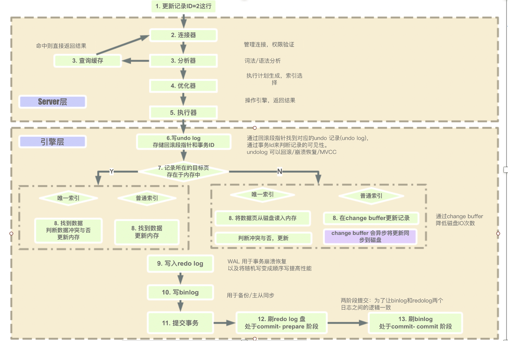

# MySQL

## MySQL执行过程
 

## MySQL日志

### binlog(二进制日志)

### redo log(重做日志)

### undo log(回滚日志)

### errorlog(错误日志)

### slow query log(慢查询日志)

### general log(一般查询日志)

### relay log(中继日志)

---

## Mysql主从复制
   - **MySQL 主从复制原理**：主库将变更写入 binlog 日志，然后从库连接到主库之后，从库有一个 IO 线程，将主库的 binlog 日志拷贝到自己本地，写入一个 relay 中继日志中。接着从库中有一个 SQL 线程会从中继日志读取 binlog，然后执行 binlog 日志中的内容，也就是在自己本地再次执行一遍 SQL，这样就可以保证自己跟主库的数据是一样的。
   - 存在主从复制延时，主机宕机数据丢失问题，解决机制如下：
     - **半同步复制**：所谓半同步复制，也叫 semi-sync 复制，指的就是主库写入 binlog 日志之后，就会将强制此时立即将数据同步到从库，从库将日志写入自己本地的 relay log 之后，接着会返回一个 ack 给主库，主库接收到至少一个从库的 ack 之后才会认为写操作完成了。
     - **并行复制**:指的是从库开启多个线程，并行读取 relay log 中不同库的日志，然后并行重放不同库的日志，这是库级别的并行。
   - MySQL 主从同步延时可能会导致先写再查查不到。一般来说，如果主从延迟较为严重，有以下解决方案：
     - 分库，将一个主库拆分为多个主库，每个主库的写并发就减少了几倍，此时主从延迟可以忽略不计。
     - 打开 MySQL 支持的并行复制，多个库并行复制。如果说某个库的写入并发就是特别高，单库写并发达到了 2000/s，并行复制还是没意义。
     - 重写代码，写代码的同学，要慎重，插入数据时立马查询可能查不到。
     - 如果确实是存在必须先插入，立马要求就查询到，然后立马就要反过来执行一些操作，对这个查询设置直连主库。不推荐这种方法，你要是这么搞，读写分离的意义就丧失了。

## 事务的隔离级别
  ## 读未提交
   - 存在脏读(事务回滚引起)、不可重复读(数据更新引起)、幻读(数据增删引起)问题
  ## 读已提交
   - 解决了脏读问题，存在不可重复读、幻读问题。MSSQL\Oracle默认隔离级别。
  ## 可重复读
   - 解决了不可重复读问题，存在幻读问题。MYSQL默认隔离级别。
  ## 串行化
   - 解决了以上所有问题。

## 动态扩容缩容的分库分表方案
  - 双写迁移方案, 可以让系统从未分库分表动态切换到分库分表上。
  - snowflake 算法是 twitter 开源的分布式 id 生成算法解决分库分表之后，id 主键的生成问题。

## MySQL8.0优化
  - Mysql分为Server层和存储引擎层两大部分，那么Qcache位于Server层，Buffer Pool位于存储引擎层，mysql8.0移除了Qcache

## MySQL调优
  - 优化查询语句：
    - 使用索引。
    - 使用 EXPLAIN 分析查询执行计划，找出潜在的性能问题。
    - 避免使用子查询，改用 JOIN。
    - 避免使用 SELECT *，仅查询需要的列。
    - 使用 LIMIT 限制返回结果数量。
    - 避免在 WHERE 子句中使用函数和表达式。
  - 调整MySQL的配置参数
    - 调整 InnoDB 配置，如 innodb_buffer_pool_size、innodb_log_file_size、innodb_flush_log_at_trx_commit 等。
    - 调整查询缓存设置，如 query_cache_size、query_cache_type 等。
    - 调整连接和线程设置，如 max_connections、thread_cache_size 等。
    - 根据实际需求调整各种超时参数，如 wait_timeout、interactive_timeout 等。
  - 数据库设计优化
    - 合理设计表结构，使用合适的数据类型和字符集。
    - 创建合适的索引，以提高查询性能。
    - 对于大表，可以考虑分区和分表。
    - 尽量使用较小的数据类型,避免过多的NULL值等。
    - 避免使用大字段、避免使用TEXT和BLOB类型等。
  - 分离读写操作
    - 将读写操作分离到不同的服务器上，减轻单个服务器的压力。
  -  定期清理无用数据
    - 例如删除过期的日志、清理无用的临时表等。
  - 监控和分析：
    - 使用慢查询日志分析慢查询。
    - 监控 MySQL 的性能指标，如吞吐量、响应时间、锁等。
    - 使用工具如 MySQLTuner、Percona Monitoring and Management (PMM) 进行性能分析。
  - 硬件和系统优化：
    - 选择合适的硬件配置，如 CPU、内存、磁盘和网络。
    - 优化操作系统设置，如 I/O 调度、文件系统、虚拟内存和网络参数。
  - 使用缓存
    - 例如使用Memcached或Redis缓存，减轻数据库的压力。

## 问题
   - 在 MySQL 中，普通索引和唯一索引的存储方式有所不同
     - 普通索引：在创建普通索引时，MySQL 会创建一个与表分离的索引文件，该索引文件包含了索引字段和指向表数据的指针。这些指针指向了存储在表中对应行的实际数据。
     - 唯一索引：与普通索引不同的是，唯一索引要求索引字段的值是唯一的，因此在创建唯一索引时，MySQL 会在索引文件中为每个索引值分配一个唯一的标识符，并将标识符与实际数据关联起来。这样，当查询该值时，只需查找其标识符即可，而不需要通过指针访问实际数据。
   - 聚集索引和非聚集索引的区别？
     - InnoDB 存储引擎支持以下几种常见的索引：
     B+树索引、全文索引、哈希索引
     而 B+树索引最为常见，可以分为聚集索引和非聚集索引。非聚集索引也可以叫做辅助索引，二级索引。
     - 两种索引相同点：
       - 内部都是 B+ 树，高度平衡，叶子节点存放着所有的数据。
     - 不同点：
       - 聚集索引的叶子节点存放是一整行的信息。
       - 聚集索引一个表只能有一个，而非聚集索引一个表可以存在多个。
       - 聚集索引存储记录是物理上连续存在，而非聚集索引是逻辑上的连续，物理存储并不连续。
       - 聚集索引查询数据速度快，插入数据速度慢;非聚集索引反之。
       - 聚集索引范围查询快。
     - 聚集索引：
       - InnoDB 存储引擎表是索引组织表，表种数据按照主键顺序存放，而聚集索引就是按照每张表的主键构造一颗 B+ 数，同时叶子节点中存放的就是整张表的行记录数据，也将聚集索引的叶子节点称为数据页。
       - 每张表只能拥有一个聚集索引。
       - 查询优化器倾向于采用聚集索引。
     - 非聚集索引：
       - 叶子节点不包含记录的全部数据。
       - 叶子节点中索引行中还包含了一个书签，用来告诉 InnoDB 存储引擎在哪里可以找到与索引相应的行数据。这个书签就是相应的行数据的聚集索引键。可以有多个非聚集索引。使用非聚集索引来寻找数据时，通过叶级别的指针获得指向主键索引的主键，再通过主键索引找到一个完整的行记录。
 - 

## 参考资料
  - [MySQL中的几种日志了解](https://www.cnblogs.com/myseries/p/10728533.html)
  - [Java 工程师进阶知识完全扫盲](https://doocs.github.io/advanced-java/#/)
  - [mysql执行过程以及顺序](https://www.cnblogs.com/wyq178/p/11576065.html)

---
 - [返回首页](../../README.md)
