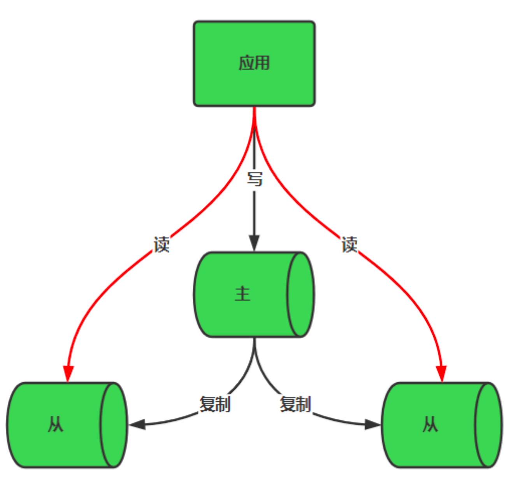
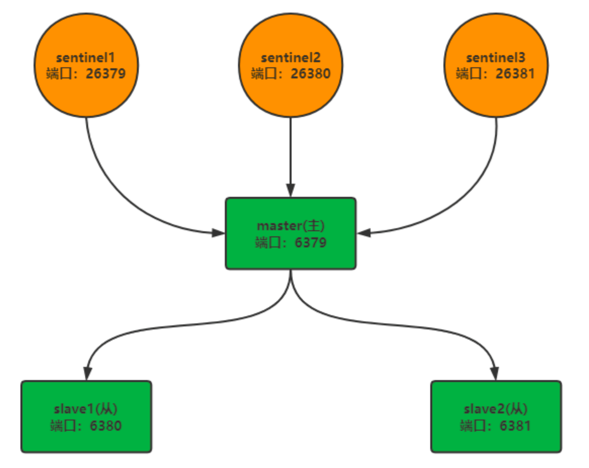
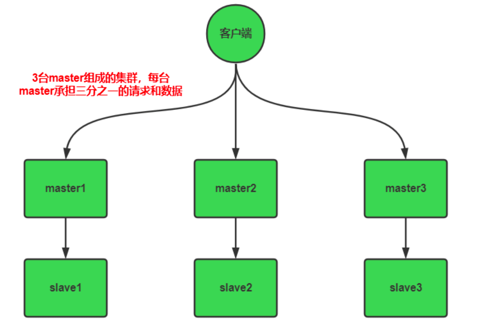

- [Redis](#redis)
  - [一. Redis数据类型](#一-redis数据类型)
    - [1.String](#1string)
      - [简介](#简介)
      - [使用场景](#使用场景)
      - [数据结构](#数据结构)
    - [2.List](#2list)
      - [简介](#简介-1)
      - [使用场景](#使用场景-1)
      - [数据结构](#数据结构-1)
    - [3.Hash](#3hash)
      - [简介](#简介-2)
      - [使用场景](#使用场景-2)
      - [数据结构](#数据结构-2)
    - [4.Set](#4set)
      - [简介](#简介-3)
      - [使用场景](#使用场景-3)
      - [数据结构](#数据结构-3)
    - [5.ZSet](#5zset)
      - [简介](#简介-4)
      - [使用场景](#使用场景-4)
      - [数据结构](#数据结构-4)
  - [二、Redis内部数据类型](#二redis内部数据类型)
      - [1.zipList](#1ziplist)
      - [2.quicklist](#2quicklist)
      - [3.skiplist](#3skiplist)
      - [4.hashtable](#4hashtable)
  - [三、Redis数据清理机制](#三redis数据清理机制)
  - [四、Redis内存淘汰策略](#四redis内存淘汰策略)
  - [五、缓存典型问题](#五缓存典型问题)
  - [六、Reids持久化策略](#六reids持久化策略)
  - [七、slave-\>master 选举算法](#七slave-master-选举算法)
  - [Redis的部署模式](#redis的部署模式)
  - [Redis的调优](#redis的调优)
  - [八、其它问题](#八其它问题)
  - [九、参考资料](#九参考资料)

# Redis
## 一. Redis数据类型
---
### 1.String
#### 简介
  - 一个Redis中字符串value最多可以是512M
#### 使用场景
  - 缓存
  - 计数
  - 共享Session
  - 分布式锁
  - 分布式系统全局序列号(分布式架构系统生成全局唯一序列号的一个思路)
#### 数据结构
  - String的数据结构为简单动态字符串（Simple Dynamic String，缩写SDS）。是可以修改的字符串，内部结构上类似于Java的ArrayList，采用分配冗余空间的方式来减少内存的频繁分配。
  
  - 如图所示，内部为当前字符串实际分配的空间capacity一般要高于实际字符串长度len。当字符串长度小于1M时，扩容都是加倍现有的空间，如果超过1M，扩容时一次会多扩容1M的空间。

### 2.List
#### 简介
  - 单键多值
  - redis列表是简单的字符串列表，按照插入顺序排序。
  - 你可以添加一个元素到列表的头部（左边）或者尾部（右边）。
#### 使用场景
  - Stack栈：LPUSH+LPOP
  - Queue队列：LPUSH+RPOP
  - Blocking MQ阻塞队列：LPUSH+BRPOP
  - 最新列表，List 类型的 lpush 命令和 lrange 命令能实现最新列表的功能，每次通过 lpush 命令往列表里插入新的元素，然后通过 lrange 命令读取最新的元素列表，如朋友圈的点赞列表、评论列表：
       - 1、A关注了B，C等大V
       - 2、B发微博了，消息ID为1001：LPUSH msg：{A的ID}  1001
       - 3、C发微博了，消息ID为1002：LPUSH msg：{A的ID}  1002
       - 4、A查看最新的5条微博消息：LRANGE msg：{A的ID}  0 5

按照时间排序的这些朋友圈信息等
#### 数据结构
  - List的数据结构为快速链表[quickList](#2quicklist)
  - 首先在列表元素较少的情况下会使用一块连续的内存存储，这个结构是[ziplist](#1ziplist)(v7.0 由 listpack 替代)，也就是压缩列表。它将所有的元素紧挨着一起存储，分配的是一块连续的内存。
  - 当元素比较多的时候才会改成quickList。
  - 因为普通的链表需要的附加指针空间太大，会比较浪费空间，比如这个列表里存储的只是int类型的数，结构上还需要2个额外的指针prev和next。
  
  - redis将链表和ziplist结合起来组成了quicklist。也就是将多个ziplist使用双向指针串起来使用，这样既满足了快速的插入删除性能，又不会出现太大的空间冗余。
  
### 3.Hash
#### 简介
  - Redis hash是一个键值对集合。Redis hash是一个string类型的field和value的映射表，hash特别适合用于存储对象。类似于java里面的Map<String,Object>
#### 使用场景
  - 适用于存储对象，比如把用户的信息存到hash里，以用户id为key，用户的详细信息为value。
  - 电商购物车，以用户ID为key，商品ID为field，商品数量为value。
#### 数据结构
  - Hash类型对应的数据结构是2种：ziplist（压缩列表），hashtable（哈希表）。
当field-value长度较短个数较少时，使用ziplist，否则使用hashtable。

### 4.Set
#### 简介
  - redis set对外提供的功与list类似，是一个列表的功能，特殊之处在于set是可以自动排重的，当你需要存储一个列表数据，又不希望出现重复数据时，set是一个很好的选择。
  - redis的set是string类型的无序集合，他的底层实际是一个value为null的hash表，收益添加，删除，查找复杂度都是O(1)。
#### 使用场景
  - 给用户添加标签，跟我们上面的例子一样。一个人对应多个不同的标签。
  - 好友/关注/粉丝/感兴趣的人集合，可以使用上面的取交集、并集相关的命令。
  - 随机展示，通过 srandmember 随机返回对应的内容，像一些首页获取动态内容可以这么玩。
  - 黑名单/白名单，有业务出于安全性方面的考虑，需要设置用户黑名单、ip 黑名单、设备黑名单等，set 类型适合存储这些黑名单数据，sismember 命令可用于判断用户、ip、设备是否处于黑名单之中。
  - 微信抽奖小程序
    - 1、点击参与抽奖加入集合：SADD item:1001   {userID}
    - 2、查看参与抽奖的所有用户：SMEMBERS item:1001
    - 3、抽取3名中奖者：SRANDMEMBER/SPOP item:1001 3   (SRANDMEMBER后，中奖的用户不会从集合中移除，SPOP 后，中奖的用户会从集合中移除)
#### 数据结构
  - set数据结构是字典，字典是用hash表实现的。Java中的HashSet的内部实现使用HashMap，只不过所有的value都指向同一个对象。Redis的set结构也是一样的，它的内部也使用hash结构，所有的value都指向同一个内部值。
### 5.ZSet
#### 简介
 - redis有序集合zset与普通集合set非常相似，是一个没有重复元素的字符串集合。
 - 不同之处是有序集合的每个成员都关联了一个评分（score），这个评分（score）被用来按照从最低分到最高分的方式排序集合中的成员。
  - 集合的成员是唯一的，但是评分是可以重复的。因为元素是有序的，所以你可以很快的根据评分（score）或者次序（position）来获取一个范围的元素。
  - 访问有序集合中的中间元素也是非常快的，因为你能够使用有序集合作为一个没有重复成员的智能列表。
#### 使用场景
  - 标签：比如我们博客网站常常使用到的兴趣标签，把一个个有着相同爱好，关注类似内容的用户利用一个标签把他们进行归并。
  - 共同好友功能，共同喜好，或者可以引申到二度好友之类的扩展应用。
  - 统计网站的独立 IP。利用 set 集合当中元素不唯一性，可以快速实时统计访问网站的独立IP。
  - 统计用户的点赞/取消点赞
  - 排行榜功能，比如展示获取赞数最多的十个用户
  - Zset本质就是Set结构上加了个排序的功能，除了添加数据value之外，还提供另一属性score，这一属性在添加修改元素时候可以指定，每次指定后，Zset会自动重新按新的值调整顺序。可以理解为有两列字段的数据表，一列存value,一列存顺序编号。操作中key理解为zset的名字，那么对延时队列又有何用呢？试想如果score代表的是想要执行时间的时间戳，在某个时间将它插入Zset集合中，它变会按照时间戳大小进行排序，也就是对执行时间前后进行排序，这样的话，起一个死循环线程不断地进行取第一个key值，如果当前时间戳大于等于该key值的socre就将它取出来进行消费删除，就可以达到延时执行的目的, 注意不需要遍历整个Zset集合，以免造成性能浪费。
#### 数据结构
  - SortedSet（zset）是redis提供的一个非常特别的数据结构，内部使用到了2种数据结构。
  - 1、**hash表**
    - 类似于java中的Map<String,score>，key为集合中的元素，value为元素对应的score，可以用来快速定位元素定义的score，时间复杂度为O(1)
  - 2、**[跳表](#3skiplist)**
    - 跳表（skiplist）是一个非常优秀的数据结构，实现简单，插入、删除、查找的复杂度均为O(logN)。类似java中的ConcurrentSkipListSet，根据score的值排序后生成的一个跳表，可以快速按照位置的顺序或者score的顺序查询元素。
---
## 二、Redis内部数据类型
#### 1.zipList
  - 简述
    - ziplist是Redis list、hash、zset的底层实现结构之一，当list、hash、zset中节点数量较少，并且存储的大多节点为小整数型，较短的字符串时，Redis就会使用ziplist作为list、hash、zset的底层实现。
  - **zipList结构**
     
    - zlbytes：记录整个ziplist的大小。
    - zltail：ziplist开始指针与最后一个entry之间的偏移量，通过该偏移量可以获得最后一个entry。
    - zllen：entry数量。
    - entry：存储具体数据的节点。
    - zlend：ziplist结尾标识。
  - **entry结构**: 每一个entry由以下三个部分组成。
     
    - previous_entry_length：上一个entry的大小。
    - encoding：记录content的类型以及长度。
    - content：一个整形或者字节数组。
    - 注
      - previous_entry_length保存上一个entry的长度，当上一个entry长度小于等于263字节时，previous_entry_length只占一个字节；大于263字节时，previous_entry_length占5个字节,其中第一字节设置为0xFE，之后的四字节用于保存前一节点的长度。
      - 可以通过previous_entry_length得到上一个entry，ziplist就是这样实现从尾到头的检索
  - **ziplist连续更新**
    - 假如现在ziplist中每一个entry的大小都是263字节，那么每一个entry的previous_entry_length都只占一个字节。假如此时在ziplist头部插入一个大于263的entry，那么，该entry往后的entry要把previous_entry_length修改为5个字节，而此时修改之后entry长度变为267，那么再下一个entry也要修改previous_entry_length的长度，以此类推。。。
    - 删除节点的时候也会出现连续更新的情况。
    - 虽然，发生连续更新时，ziplist的性能会大大的降低，但是实际情况下，极少会发生连续更新，而且ziplist都是存储少量的节点，哪怕发生一整个ziplist的更新，也不会占用大量时间。
 
#### 2.quicklist
  - quicklist 实际上是 zipList 和 linkedList 的混合体，它将 linkedList 按段切分，每一段使用 zipList 来紧凑存储，多个 zipList 之间使用双向指针串接起来。
  
  - **quicklis结构体**
    ```c
    typedef struct quicklist {
      quicklistNode *head;
      quicklistNode *tail;
      unsigned long count;        /* total count of all entries in all ziplists */
      unsigned long len;          /* number of quicklistNodes */
      int fill : QL_FILL_BITS;              /* fill factor for individual nodes */
      unsigned int compress : QL_COMP_BITS; /* depth of end nodes not to compress;0=off */
      unsigned int bookmark_count: QL_BM_BITS;
      quicklistBookmark bookmarks[];
    } quicklist;
    ```
     - head: 指向头节点（左侧第一个节点）的指针。
     - tail: 指向尾节点（右侧第一个节点）的指针。
     - count: 所有ziplist数据项的个数总和。
     - len: quicklist节点的个数。
     - fill: 16bit，ziplist大小设置，存放list-max-ziplist-size参数的值。
     - compress: 16bit，节点压缩深度设置，存放list-compress-depth参数的值。
  
#### 3.skiplist
  - 这里我们来看一下跳表的原理：
  - 首先从考虑一个有序表开始：  
  
  - 从该有序表中搜索元素 < 23, 43, 59 > ，需要比较的次数分别为 < 2, 4, 6 >，总共比较的次数为 2 + 4 + 6= 12 次。有没有优化的算法吗? 链表是有序的，但不能使用二分查找。类似二叉搜索树，我们把一些节点提取出来，作为索引。得到如下结构：
  
  - 这里我们把 < 14, 34, 50, 72 > 提取出来作为一级索引，这样搜索的时候就可以减少比较次数了。我们还可以再从一级索引提取一些元素出来，作为二级索引，变成如下结构：
  
  - 这里元素不多，体现不出优势，如果元素足够多，这种索引结构就能体现出优势来了。
#### 4.hashtable

  - hashtable是Redis中hash数据结构的底层实现，当数据小, 并且数量不多的时候会用ziplist来实现hash结构，数据量大时，才使用hashtable来实现hash结构
  - hashtable与java的HashMap类似，都是数组+链表的结构，通过链表或rehash来解决hash冲突问题
  
  - dictht[]数组长度为2, 一般我们使用dictht[0], 另外一个dictht[1]作为rehash使用
---
## 三、Redis数据清理机制
  - 定时删除
    - 指的是 Redis 默认是每隔 100ms 就随机抽取一些设置了过期时间的 key，检查其是否过期，如果过期就删除。
    - 假设 Redis 里放了 10w 个 key，都设置了过期时间，你每隔几百毫秒，就检查 10w 个 key，那 Redis 基本上就死了，cpu 负载会很高的，消耗在你的检查过期 key 上了。注意，这里可不是每隔 100ms 就遍历所有的设置过期时间的 key，那样就是一场性能上的灾难。实际上 Redis 是每隔 100ms 随机抽取一些 key 来检查和删除的。
  - 惰性删除
    - 定期删除可能会导致很多过期 key 到了时间并没有被删除掉，那咋整呢？所以就是惰性删除了。这就是说，在你获取某个 key 的时候，Redis 会检查一下 ，这个 key 如果设置了过期时间那么是否过期了？如果过期了此时就会删除，不会给你返回任何东西。
  - 内存淘汰

---
## 四、Redis内存淘汰策略
  - 8种策略
    - **noeviction(默认)**：当内存使用达到阈值的时候，所有引起申请内存的命令会报错。
    - **allkeys-lru**：在主键空间中，优先移除最近未使用的key。(推荐)
    - **volatile-lru**：在设置了过期时间的键空间中，优先移除最近未使用的key。
    - **allkeys-random**：在主键空间中，随机移除某个key。
    - **volatile-random**：在设置了过期时间的键空间中，随机移除某个key。
    - **volatile-ttl**：在设置了过期时间的键空间中，具有更早过期时间的key优先移除。
    - **volatile-lfu**，针对设置了过期时间的key，使用lfu算法进行淘汰。
    - **allkeys-lfu**，针对所有key使用lfu算法进行淘汰。
  - 主要使用了四种算法
    - lru 最近很少的使用(也可以理解成最久没有使用)的key（根据时间，最不常用的淘汰）,Redis使用的LRU算法其实是一种不可靠的LRU算法, 是从采样maxmemory-samples个，然后进行淘汰。
    - lfu 最近很少的使用的key (根据计数器，用的次数最少的key淘汰),它很好的解决了LRU算法的缺陷：一个很久没有被访问的key，偶尔被访问一次，导致被误认为是热点数据的问题
    - random 随机淘汰
    - ttl 快要过期的先淘汰 
- 如在redis.conf中配置 `maxmemory-policy allkeys-lru`


---
## 五、缓存典型问题
   - 缓存穿透: 特定的缓存key未命中，每次都会查库。
     - 解决方案：缓存不存在的key；布隆过滤器
   - 缓存击穿: 单一热点缓存突然过期，大量的相关查询请求跑到数据库。
     - 解决方案: 不过期；互斥锁；
   - 缓存雪崩: 大量的key突然过期，大量的查询请求跑到数据库。
     - 解决方案：不过期；随机过期时间;搭建高可用集群
   - 数据一致性(redis与DB)
     - 解决方案：延迟双删机制
   - 缓存并发竞争: 同时有多个客户端去set一个key。
     - 解决方案
       - 乐观锁，注意不要在分片集群中使用
       - 分布式锁，适合分布式系统环境
       - 时间戳，适合有序场景
       - 消息队列，串行化处理

---
## 六、Reids持久化策略
   - RDB
     - RDB 会生成多个数据文件，每个数据文件都代表了某一个时刻中 Redis 的数据，这种多个数据文件的方式，非常适合做冷备，可以将这种完整的数据文件发送到一些远程的安全存储上去，比如说 Amazon 的 S3 云服务上去，在国内可以是阿里云的 ODPS 分布式存储上，以预定好的备份策略来定期备份 Redis 中的数据。
     - RDB 对 Redis 对外提供的读写服务，影响非常小，可以让 Redis 保持高性能，因为 Redis 主进程只需要 fork 一个子进程，让子进程执行磁盘 IO 操作来进行 RDB 持久化即可。
     - 相对于 AOF 持久化机制来说，直接基于 RDB 数据文件来重启和恢复 Redis 进程，更加快速。
     - 如果想要在 Redis 故障时，尽可能少的丢失数据，那么 RDB 没有 AOF 好。一般来说，RDB 数据快照文件，都是每隔 5 分钟，或者更长时间生成一次，这个时候就得接受一旦 Redis 进程宕机，那么会丢失最近 5 分钟（甚至更长时间）的数据。
     - RDB 每次在 fork 子进程来执行 RDB 快照数据文件生成的时候，如果数据文件特别大，可能会导致对客户端提供的服务暂停数毫秒，或者甚至数秒。
   - AOF
     - AOF 可以更好的保护数据不丢失，一般 AOF 会每隔 1 秒，通过一个后台线程执行一次 fsync 操作，最多丢失 1 秒钟的数据。
     - AOF 日志文件以 append-only 模式写入，所以没有任何磁盘寻址的开销，写入性能非常高，而且文件不容易破损，即使文件尾部破损，也很容易修复。
     - AOF 日志文件即使过大的时候，出现后台重写操作，也不会影响客户端的读写。因为在 rewrite log 的时候，会对其中的指令进行压缩，创建出一份需要恢复数据的最小日志出来。在创建新日志文件的时候，老的日志文件还是照常写入。当新的 merge 后的日志文件 ready 的时候，再交换新老日志文件即可。
     - AOF 日志文件的命令通过可读较强的方式进行记录，这个特性非常适合做灾难性的误删除的紧急恢复。比如某人不小心用 flushall 命令清空了所有数据，只要这个时候后台 rewrite 还没有发生，那么就可以立即拷贝 AOF 文件，将最后一条 flushall 命令给删了，然后再将该 AOF 文件放回去，就可以通过恢复机制，自动恢复所有数据。
     - 对于同一份数据来说，AOF 日志文件通常比 RDB 数据快照文件更大。
     - AOF 开启后，支持的写 QPS 会比 RDB 支持的写 QPS 低，因为 AOF 一般会配置成每秒 fsync 一次日志文件，当然，每秒一次 fsync ，性能也还是很高的。（如果实时写入，那么 QPS 会大降，Redis 性能会大大降低）
     - 以前 AOF 发生过 bug，就是通过 AOF 记录的日志，进行数据恢复的时候，没有恢复一模一样的数据出来。所以说，类似 AOF 这种较为复杂的基于命令日志 merge 回放的方式，比基于 RDB 每次持久化一份完整的数据快照文件的方式，更加脆弱一些，容易有 bug。不过 AOF 就是为了避免 rewrite 过程导致的 bug，因此每次 rewrite 并不是基于旧的指令日志进行 merge 的，而是基于当时内存中的数据进行指令的重新构建，这样健壮性会好很多。


---
## 七、slave->master 选举算法
  - 如果一个 master 被认为 odown 了，而且 majority 数量的哨兵都允许主备切换，那么某个哨兵就会执行主备切换操作，此时首先要选举一个 slave 来，会考虑 slave 的一些信息：
    - 跟 master 断开连接的时长
    - slave 优先级
    - 复制 offset
    - run id
  - 如果一个 slave 跟 master 断开连接的时间已经超过了 down-after-milliseconds 的 10 倍，外加 master 宕机的时长，那么 slave 就被认为不适合选举为 master。
   `(down-after-milliseconds * 10) + milliseconds_since_master_is_in_SDOWN_state`
   接下来会对 slave 进行排序：
     - 按照 slave 优先级进行排序，slave priority 越低，优先级就越高。
     - 如果 slave priority 相同，那么看 replica offset，哪个 slave 复制了越多的数据，offset 越靠后，优先级就越高。
     - 如果上面两个条件都相同，那么选择一个 run id 比较小的那个 slave。

## Redis的部署模式
  - 主从模式
   
  >
  - 哨兵模式
   
  >
  - 集群模式
  
  

## Redis的调优
- 1. 内存管理：
   - 使用maxmemory配置项设置最大内存使用量。
   - 选择合适的内存淘汰策略（maxmemory-policy），如volatile-lru、allkeys-lru等。
   - 合理使用数据结构，例如使用哈希（hash）存储大量小对象以减少内存开销。

- 2. 持久化优化：
   - 选择合适的持久化策略，如RDB、AOF或混合持久化。
   - 调整AOF重写参数（auto-aof-rewrite-percentage和auto-aof-rewrite-min-size）以降低磁盘I/O。
   - 如果使用AOF，可以开启AOF重写压缩（aof-use-rdb-preamble）以减少磁盘占用。

- 3. 网络优化：
   - 开启TCP连接复用（tcp-keepalive）以减少连接建立和关闭的开销。
   - 使用流水线（pipeline）处理批量请求以减少网络延迟。
   - 考虑使用RESP3协议以减少传输数据量。

- 4. 集群优化：
   - 使用主从复制（master-slave replication）提高读取性能。
   - 使用分片（sharding）分布数据，提高横向扩展能力。
   - 使用哨兵（Sentinel）或集群（Redis Cluster）实现高可用。

- 5. 代码优化：
   - 使用合适的键名设计以便于维护和查询。
   - 使用Lua脚本处理复杂业务逻辑以减少网络开销。
   - 避免使用大量慢查询命令，如KEYS、SMEMBERS等。

- 6. 监控与故障排查：
   - 使用INFO命令或第三方监控工具定期检查Redis性能指标。
   - 使用SLOWLOG记录慢查询以便于优化。
   - 定期检查日志文件（logfile）以获取潜在问题。
---
## 八、其它问题
  - [为什么Redis集群有16384个槽](https://www.cnblogs.com/rjzheng/p/11430592.html)
  - Redis为什么快
    - 数据结构简单高效
    - 单线程模型
    - 高效的持久化机制(异步的)
    - 高效的网络模型(epoll 或 kqueue 等)

---
## 九、参考资料
  - [B站：趣话Redis](https://www.bilibili.com/video/BV1ge411L7Sh/)
  - [Redis全套学习笔记.pdf](https://www.aliyundrive.com/s/XLLvcQA7uhA)
  - [CSDN:Redis Ziplist（压缩列表）](https://blog.csdn.net/solo_jm/article/details/118520888)
  - [CSDN:Redis中的ziplist](https://blog.csdn.net/xiexingshishu/article/details/110455212)
  - [Redis数据结构——快速列表(quicklist)](https://www.cnblogs.com/hunternet/p/12624691.html)
  - [Redis之字典(hashtable)](https://blog.csdn.net/m0_53804791/article/details/121344223)
  - [redis数据类型及使用场景](https://blog.csdn.net/weixin_42352733/article/details/123628841)
  - [Redis内存淘汰策略](https://blog.csdn.net/qq_30999361/article/details/124488406)
  - [redis淘汰策略](https://blog.csdn.net/weixin_40980639/article/details/125446002)
  - [Redis缓存穿透/击穿/雪崩以及数据一致性的解决方案](https://www.toutiao.com/article/7186486324625605124/?log_from=4f224823dd997_1673241757062)
  - [详解缓存穿透、缓存雪崩、缓存击穿](https://blog.csdn.net/qq_45637260/article/details/125866738)
  
--- 

- [回到首页](../../README.md)