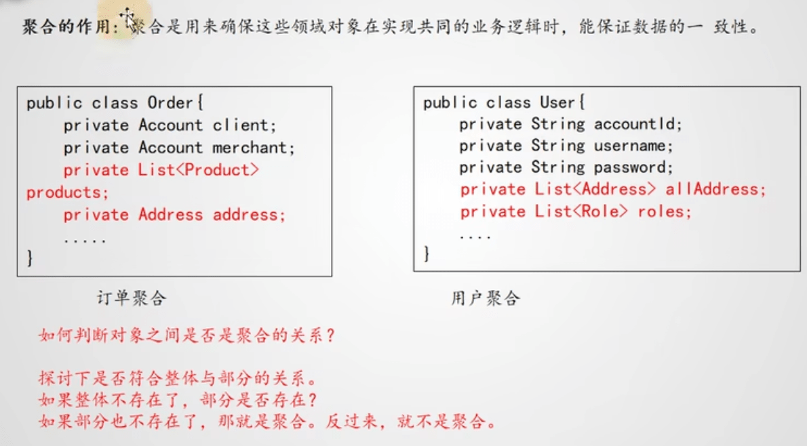

# DDD
## 简介
  - DDD 全称Domain-Driven Design，中文叫领域驱动设计，是一套应对复杂软件系统分析和设计的面向对象建模方法论。
  - DDD 四层架构
    
  - DDD基础概念
    - **实体**:代表具有唯一ID的领域对象，存在生命周期，如订单信息。
    - **值对象**：代表一成不变的，本质性的事务，可能存在不同的表现形式，如固定的地址信息。
    - **聚合**：聚合是用来确保这些领域对象在实现共同业务逻辑时，能保证数据的一致性。
    
    - **聚合根**:每个聚合内部应该有一个外部访问聚合的唯一如克，成为聚合根。通过聚合与聚合根的设计，极大的简化整个系统内的对象关系图。同时也隔离聚合内的变化。
    
    - **限界上下文**
     
    - **领域服务**
    - **防腐层**
    - **仓库**
    - **业务**：在DDD中认为引起实体状态变化的才称之为业务，所以查询、统计不属于DDD的业务。可以考虑仅用DDD实现核心业务。 
    - **工厂**
  - DDD四层架构规范
    - 1、领域中的对象由实体和值对象组成。对值对象的访问必须经由所属的实体对象。
    - 2、相关联的一组实体与值对象组成聚合。对聚合内对象的访问必须经由聚合根对象。
    - 3、跨实体的操作必须经由领域服务。
    - 4、应用服务层只通过领城服务或者聚合根來组织业务，自身不带任务实现逻輯。
    - 5、业务与数据隔离。领域层只关注业务，数据支撑全部交由基础设施层。
  - 充血模型 > 贫血模型POJO
  - DDD妙招
    - 使用充血模型的实体对象，描述核心业务能力。***系统能做什么，一目了然***
    - 使用仓库与工厂，封装实体持久化操作。***摆脱数据库限制***
    - 构造防腐层，隔离外部服务。***众人皆醉我独醒***
    - 防腐层，隔离第三方组件。***摆脱技术框架限制，提供无限可能***
    - 通过划分实体和值对象，大胆进行一些反范式设计，如订单不关联地址id，而是直接冗余存储地址信息。但这种划分不是一成不变的，当地址是能够增删改的时候，地址也具备生命周期，应该是实体对象。
     
  - 一个关于支付逻辑的DDD改进示例
    
    
  - DDD改进后的好处
    - **需求更容易梳理**：业务逻钢纯净清晰，没有了业务逻辑与实现细节之间的复杂转换
    - **更容易单元测试**：业务与基础设施隔离，没有基础设施依然很容易设计单元测试案例。各个功能组件的依赖都是独立的。可以编写单元测试案例，单独测试。
    - **更容易开发**：领域内服务自治，不用担心其他模块的影响。下单模块的Account与账户管理模块的Account属性与方法都可以完全不同，没有任何直接关朕
    - **技术容易更新**：业务与数据隔离很清晰，改ORM术只一要改仓库层实现，对业务无影响，
  - DDD的宏观发展
    

## 参考资料
  - [领域驱动设计.pdf](https://github.com/ShineFan/awesome-programming-books-1/tree/master/CleanCode)
  - [B站:DDD实战](https://www.bilibili.com/video/BV1sa411U7m9)
  - [探秘微信业务优化：DDD从入门到实践](https://www.toutiao.com/article/7178808072192655924)