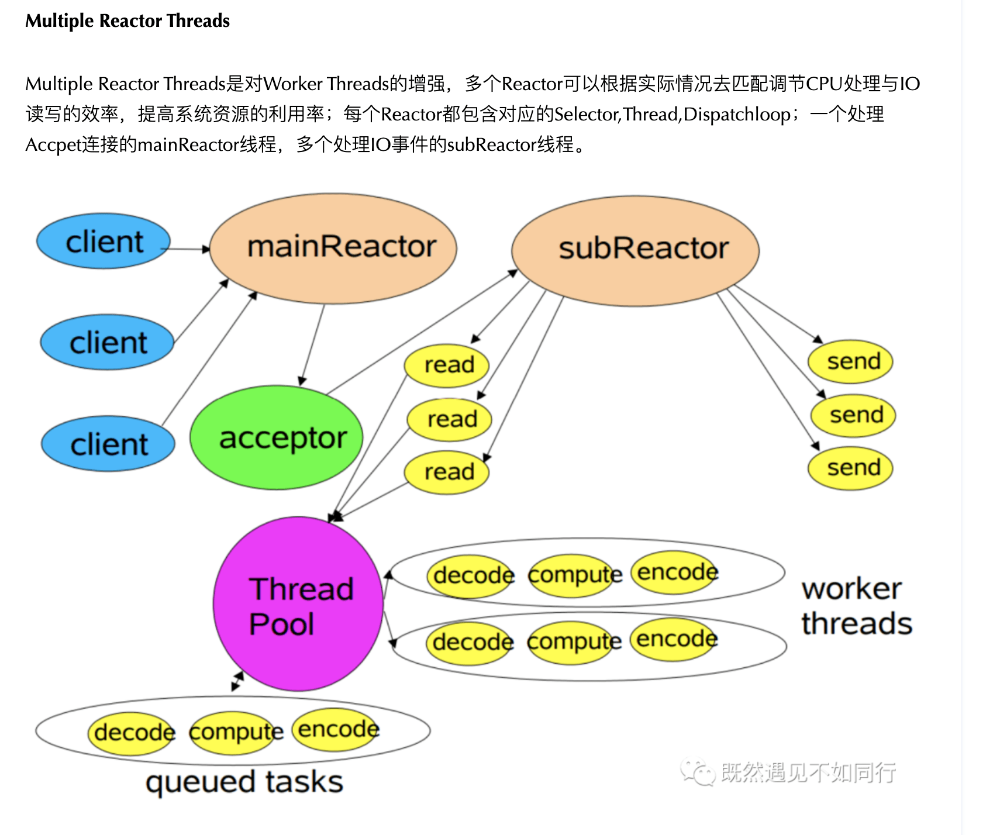

- [Netty](#netty)
  - [Linux IO模型](#linux-io模型)
  - [I/O多路复用的三种方式](#io多路复用的三种方式)
    - [select](#select)
    - [poll](#poll)
    - [epoll](#epoll)
  - [Reactor编程模型](#reactor编程模型)
  - [NIO编程模型](#nio编程模型)
  - [Netty Java使用代码](#netty-java使用代码)
  - [参考资料](#参考资料)


# Netty

## Linux IO模型
  - 阻塞 I/O（blocking IO）
  - 非阻塞 I/O（nonblocking IO）
  - I/O 多路复用（ IO multiplexing）
  - 信号驱动 I/O（ signal driven IO）
  - 异步 I/O（asynchronous IO）

## I/O多路复用的三种方式
  ### select
   - select有几个缺点：
     - 监听的IO最大连接数有限，在Linux系统上一般为1024。
     - select函数返回后，是通过遍历fdset ，找到就绪的描述符fd。（仅知道有I/O事件发生，却不知是哪几个流，所以遍历所有流）
  
  ### poll
   - poll解决了连接数限制问题。但是呢，select和poll一样，还是需要通过遍历文件描述符来获取已经就绪的socket。如果同时连接的大量客户端，在一时刻可能只有极少处于就绪状态，伴随着监视的描述符数量的增长，效率也会线性下降。
  
  ### epoll
   - epoll先通过epoll_ctl() 来注册一个fd（文件描述符），一旦基于某个fd就绪时，内核会采用回调机制，迅速激活这个fd，当进程调用epoll_wait() 时便得到通知。这里去掉了遍历文件描述符的操作，而是采用监听事件回调的机制。这就是epoll的亮点。

  - fd数据拷贝每次调用select，需要将fd数据从用户空间拷贝到内核空间每次调用poll，需要将fd数据从用户空间拷贝到内核空间使用内存映射(mmap)，不需要从用户空间频繁拷贝fd数据到内核空间

  - epoll明显优化了IO的执行效率，但在进程调用epoll_wait()时，仍然可能被阻塞。属于同步IO，需要在读写事件准备就绪后，由系统调用进行阻塞式读写，能不能酱紫：不用我老是去问你数据是否准备就绪，等我发出请求后，你数据准备好了通知我就行了，这就诞生了信号驱动IO模型。  
  - epoll的三个函数
    - epoll_create 新建epoll描述符
    ```c
    //创建一个epoll的句柄，size用来告诉内核这个监听的数目一共有多大, 在epoll早期的实现中，对于监控文件描述符的组织并不是使用红黑树，而是hash表。这里的size实际上已经没有意义。
    int epoll_create(int size)；
    int epoll_ctl(int epfd, int op, int fd, struct epoll_event *event)；
    int epoll_wait(int epfd, struct epoll_event * events, int maxevents, int timeout);
    ```
    - epoll_ctl 添加或者删除所有待监控的连接
    - epoll_wait 返回的活跃连接
  - Java在Linux系统中[java.nio.channels.Selector](https://github.com/openjdk/jdk/blob/cbe7e7bd7f7e7ea9f7221ef206917c58baff7696/src/java.base/linux/classes/sun/nio/ch/EPollSelectorImpl.java)实际上是对epoll的封装
  - LT模式：LT是epoll默认的工作方式，支持阻塞和非阻塞两种机制。LT模式下内核会持续通知你文件描述符就绪了，然后你可以对这个就绪的fd进行I/O操作。如果不做任何操作，内核还是会继续通知你的。
  - ET模式：ET模式相对LT模式更加高效，只支持非阻塞模式。在这个模式下，当描述符从未就绪变为就绪时，内核通过epoll告诉你。然后它会假设你知道文件描述符已经就绪，并且不再为那个文件描述符发生更多的就绪通知。直到你做了某些操作导致那个文件描述符不再为就绪状态了。
ET模式在很大程度上减少了epoll事件被重复触发的次数，因此效率要比LT模式高。epoll工作在ET模式时，必须使用非阻塞套接口，以避免一个文件句柄的阻塞导致把其他文件描述符饿死。
## Reactor编程模型
    

## NIO编程模型
    


## Netty Java使用代码
  ```java
  public class NettyServer {

    public static void main(String[] args) {
       EventLoopGroup bossGroup = new NioEventLoopGroup(1);
       EventLoopGroup workGroup = new NioEventLoopGroup(10);
       //创建服务器的启动对象
        ServerBootstrap bootstrap = new ServerBootstrap();
        //使用链式编程来配置启动参数
        bootstrap.group(bossGroup,workGroup)
                //使用NioServerSocketChannel作为服务器的通道实现
                .channel(NioServerSocketChannel.class)
                .option(ChannelOption.SO_BACKLOG, 1024)
                .childHandler(new ChannelInitializer<SocketChannel>() {
                    @Override
                    protected void initChannel(SocketChannel socketChannel) throws Exception {
                        ChannelPipeline pipeline = socketChannel.pipeline();
                        pipeline.addLast(new NettyServerHandler());
                    }
                });
        System.out.println("Netty Server start...");
        //绑定一个端口并且同步，生成一个ChannelFuture异步对象，通过isDone()等方法
        //可以判断异步事件的执行情况
        try {
            ChannelFuture cf = bootstrap.bind(9000).sync();
        } catch (InterruptedException e) {

        }
    }
  }
  ```
   
  ```java
  public class NettyServerHandler extends ChannelInboundHandlerAdapter {

    /**
     * 当客户端连接服务器完成就会触发该方法
     *
     * @param ctx
     */
    @Override
    public void channelActive(ChannelHandlerContext ctx) {
        System.out.println("客户端连接通道建立完成" + ctx.pipeline().channel().getClass());
    }

    @Override
    public void channelRead(ChannelHandlerContext ctx, Object msg) throws Exception {
        ByteBuf buf = (ByteBuf) msg;
        System.out.println("收到客户端数据" + buf.toString(CharsetUtil.UTF_8));
    }
 }
  ```

## 参考资料
- [B站:Netty教程](https://www.bilibili.com/video/BV1JB4y1R7XB)
- [epoll中et和lt的区别与实现原理](https://baijiahao.baidu.com/s?id=1736123311976351393&wfr=spider&for=pc)
- [Linux IO模式及select、poll、epoll详解](https://blog.csdn.net/m0_46761060/article/details/124417722)

---
- [返回首页](../../README.md)