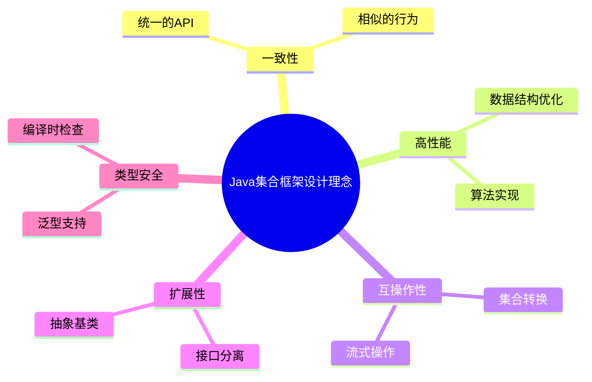
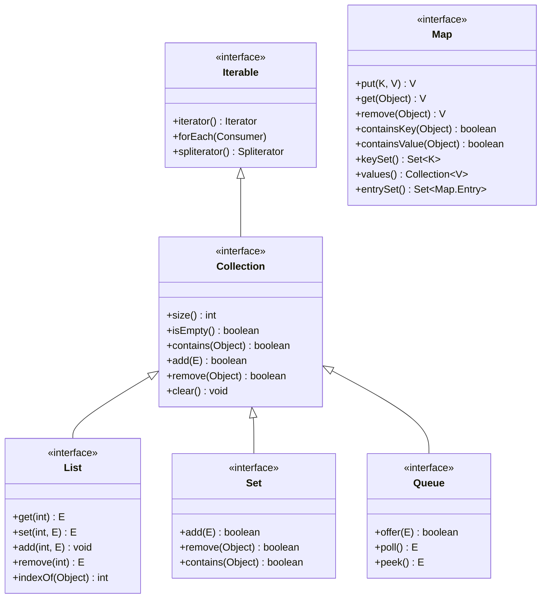
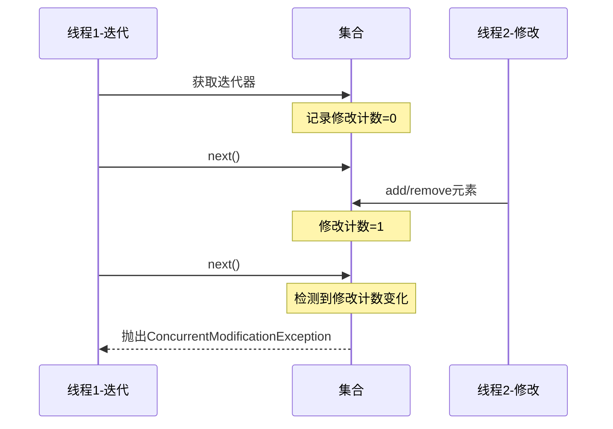

# Java集合框架概述

## 1. 集合框架的设计理念

Java集合框架是Java标准库中最重要的部分之一，它为存储和操作数据提供了统一的架构。集合框架的核心设计理念包括：

- **一致性**：所有集合类遵循共同的设计模式和接口规范
- **高性能**：提供高效实现和算法
- **互操作性**：集合之间可以无缝转换和交互
- **扩展性**：允许用户自定义实现和扩展
- **类型安全**：通过泛型机制保证类型安全



## 2. 集合框架的整体架构

Java集合框架采用接口和实现分离的设计，构建了多层次的类型体系。



### 2.1 核心接口

Java集合框架的核心接口包括：

- **Iterable**：允许对象使用增强for循环
- **Collection**：所有集合的根接口，定义了集合的基本操作
- **List**：有序集合，元素可重复，支持索引访问
- **Set**：无重复元素的集合
- **Queue/Deque**：队列接口，支持FIFO或LIFO等访问模式
- **Map**：键值对映射，键不可重复

### 2.2 JDK提供的主要实现

Java集合框架提供了丰富的实现类，每一种实现都有其特定的性能特点和应用场景。

```mermaid
graph TD
    Collection[Collection接口] --> List[List接口]
    Collection --> Set[Set接口]
    Collection --> Queue[Queue接口]
    
    List --> ArrayList[ArrayList实现]
    List --> LinkedList[LinkedList实现]
    List --> Vector[Vector实现]
    Vector --> Stack[Stack实现]
    
    Set --> HashSet[HashSet实现]
    Set --> LinkedHashSet[LinkedHashSet实现]
    Set --> TreeSet[TreeSet实现]
    Set --> EnumSet[EnumSet实现]
    
    Queue --> PriorityQueue[PriorityQueue实现]
    Queue --> LinkedList2[LinkedList实现]
    Queue --> Deque[Deque接口]
    Deque --> ArrayDeque[ArrayDeque实现]
    Deque --> LinkedList3[LinkedList实现]
    
    Map[Map接口] --> HashMap[HashMap实现]
    Map --> LinkedHashMap[LinkedHashMap实现]
    Map --> TreeMap[TreeMap实现]
    Map --> EnumMap[EnumMap实现]
    Map --> WeakHashMap[WeakHashMap实现]
    Map --> IdentityHashMap[IdentityHashMap实现]
    
    subgraph 并发集合
    List -.-> CopyOnWriteArrayList[CopyOnWriteArrayList]
    Set -.-> CopyOnWriteArraySet[CopyOnWriteArraySet]
    Map -.-> ConcurrentHashMap[ConcurrentHashMap]
    Queue -.-> BlockingQueue[BlockingQueue接口]
    BlockingQueue -.-> ArrayBlockingQueue[ArrayBlockingQueue]
    BlockingQueue -.-> LinkedBlockingQueue[LinkedBlockingQueue]
    BlockingQueue -.-> PriorityBlockingQueue[PriorityBlockingQueue]
    Deque -.-> BlockingDeque[BlockingDeque接口]
    BlockingDeque -.-> LinkedBlockingDeque[LinkedBlockingDeque]
    end
    
    classDef interface fill:#f9f,stroke:#333,stroke-width:2px;
    classDef implementation fill:#bbf,stroke:#333,stroke-width:2px;
    classDef concurrent fill:#bfb,stroke:#333,stroke-width:2px;
    
    class Collection,List,Set,Queue,Deque,Map,BlockingQueue,BlockingDeque interface;
    class ArrayList,LinkedList,Vector,Stack,HashSet,LinkedHashSet,TreeSet,EnumSet,PriorityQueue,ArrayDeque,HashMap,LinkedHashMap,TreeMap,EnumMap,WeakHashMap,IdentityHashMap implementation;
    class CopyOnWriteArrayList,CopyOnWriteArraySet,ConcurrentHashMap,ArrayBlockingQueue,LinkedBlockingQueue,PriorityBlockingQueue,LinkedBlockingDeque concurrent;
```



## 3. 集合框架的核心组件

### 3.1 List家族

List是有序集合，允许重复元素，提供基于索引的访问。

| 实现类 | 内部数据结构 | 特点 | 适用场景 |
| ----- | ---------- | ---- | ------- |
| ArrayList | 动态数组 | 随机访问快，修改慢 | 随机访问频繁，修改较少 |
| LinkedList | 双向链表 | 随机访问慢，修改快 | 频繁插入/删除操作 |
| Vector | 同步动态数组 | 线程安全，性能较低 | 遗留代码，不推荐使用 |
| Stack | 继承自Vector | LIFO栈操作 | 遗留代码，建议使用Deque |

### 3.2 Set家族

Set是不允许重复元素的集合，基于对象的equals()和hashCode()方法判断重复。

| 实现类 | 内部数据结构 | 特点 | 适用场景 |
| ----- | ---------- | ---- | ------- |
| HashSet | HashMap | 无序，高性能 | 需要快速查找、去重 |
| LinkedHashSet | LinkedHashMap | 保持插入顺序 | 需要去重且关注元素顺序 |
| TreeSet | TreeMap | 自然排序或自定义比较器 | 需要排序的集合 |
| EnumSet | 位向量 | 专为枚举类型设计，高性能 | 存储枚举类型 |

### 3.3 Map家族

Map提供键值对映射，键不可重复，每个键映射到一个值。

| 实现类 | 内部数据结构 | 特点 | 适用场景 |
| ----- | ---------- | ---- | ------- |
| HashMap | 哈希表+红黑树(JDK8+) | 高性能，无序 | 一般用途的映射 |
| LinkedHashMap | 哈希表+双向链表 | 保持插入顺序或访问顺序 | 需要记住插入顺序的映射 |
| TreeMap | 红黑树 | 基于键的排序 | 需要排序的映射 |
| EnumMap | 数组 | 专为枚举键设计，高性能 | 键为枚举类型的映射 |
| WeakHashMap | 哈希表+弱引用 | 弱键引用，GC时可回收 | 缓存应用 |
| IdentityHashMap | 哈希表 | 使用==而非equals()比较 | 特殊算法需求 |

### 3.4 Queue/Deque家族

队列接口提供FIFO（先进先出）的访问模式，双端队列同时支持FIFO和LIFO（后进先出）。

| 实现类 | 内部数据结构 | 特点 | 适用场景 |
| ----- | ---------- | ---- | ------- |
| ArrayDeque | 循环数组 | 双端队列，无容量限制 | 作为栈或队列使用 |
| LinkedList | 双向链表 | 实现了List和Deque接口 | 需要同时使用List和Deque操作 |
| PriorityQueue | 优先堆 | 基于优先级排序 | 任务调度，优先级处理 |

## 4. 迭代器与遍历

Java集合框架提供了统一的迭代器接口，是访问集合元素的标准方法。

```java
// 传统迭代器
Iterator<String> it = collection.iterator();
while (it.hasNext()) {
    String element = it.next();
    // 处理元素
}

// 增强for循环（语法糖，底层仍使用迭代器）
for (String element : collection) {
    // 处理元素
}

// Java 8 Stream API
collection.stream()
    .filter(e -> e.startsWith("A"))
    .map(String::toUpperCase)
    .forEach(System.out::println);
```

### 4.1 迭代器类型

- **Iterator**：基本迭代器，提供前向遍历
- **ListIterator**：扩展Iterator，支持双向遍历和修改操作
- **Spliterator**：支持并行遍历的迭代器（Java 8+）

### 4.2 Fail-Fast与Fail-Safe

集合框架的迭代器有两种行为模式：

- **Fail-Fast**：检测到并发修改时快速失败，抛出ConcurrentModificationException，大多数非并发集合采用此策略
- **Fail-Safe**：即使在迭代期间集合被修改也不会抛出异常，并发集合如ConcurrentHashMap采用此策略



## 5. 集合框架中的工具类

Java集合框架提供了强大的工具类，用于集合操作和转换：

### 5.1 Collections工具类

提供了一系列静态方法，用于集合的排序、搜索、线程安全转换等操作：

```java
// 排序
Collections.sort(list);

// 二分查找
int index = Collections.binarySearch(sortedList, key);

// 打乱顺序
Collections.shuffle(list);

// 不可修改的包装
List<String> unmodifiableList = Collections.unmodifiableList(list);

// 同步包装
Map<String, Integer> syncMap = Collections.synchronizedMap(hashMap);

// 单例集合
Set<String> singletonSet = Collections.singleton("element");
```

### 5.2 Arrays工具类

提供了数组操作和数组与集合转换的工具方法：

```java
// 数组转List
List<String> list = Arrays.asList("a", "b", "c");

// 排序
Arrays.sort(array);

// 并行排序（Java 8+）
Arrays.parallelSort(largeArray);

// 二分查找
int index = Arrays.binarySearch(sortedArray, key);

// 填充
Arrays.fill(array, value);
```

## 6. Java 8+中的集合增强

Java 8及以后的版本对集合框架进行了多项增强，主要包括：

### 6.1 Stream API

Stream API提供了声明式的集合操作方式，支持函数式编程范式：

```java
// 串行流处理
List<String> filtered = list.stream()
    .filter(s -> s.length() > 3)
    .map(String::toUpperCase)
    .collect(Collectors.toList());

// 并行流处理
long count = list.parallelStream()
    .filter(s -> s.startsWith("A"))
    .count();
```

### 6.2 接口默认方法

Java 8为集合接口添加了多个默认方法，提供了更丰富的功能：

```java
// Collection接口的默认方法
collection.removeIf(e -> e.isEmpty());  // 条件删除
collection.forEach(System.out::println);  // 遍历操作

// List接口的默认方法
list.replaceAll(String::toUpperCase);  // 替换所有元素
list.sort(Comparator.naturalOrder());  // 排序

// Map接口的默认方法
map.getOrDefault("key", defaultValue);  // 获取值或默认值
map.putIfAbsent("key", value);  // 键不存在时插入
map.forEach((k, v) -> System.out.println(k + ": " + v));  // 遍历
map.compute("key", (k, v) -> v == null ? 1 : v + 1);  // 计算并更新
map.merge(key, 1, Integer::sum);  // 合并值
```

### 6.3 工厂方法

Java 9引入了集合的便捷工厂方法，用于创建小型不可变集合：

```java
// 不可变List
List<String> list = List.of("one", "two", "three");

// 不可变Set
Set<String> set = Set.of("one", "two", "three");

// 不可变Map
Map<String, Integer> map = Map.of("one", 1, "two", 2, "three", 3);
Map<String, Integer> largeMap = Map.ofEntries(
    Map.entry("one", 1),
    Map.entry("two", 2),
    Map.entry("three", 3)
);
```

## 7. 集合框架的使用建议

### 7.1 选择合适的集合

- 需要按索引访问元素：`ArrayList`
- 经常在头/尾添加删除元素：`LinkedList`或`ArrayDeque`
- 需要保证元素唯一性：`HashSet`或`LinkedHashSet`
- 需要排序的集合：`TreeSet`或`TreeMap`
- 需要频繁的键值查找：`HashMap`或`LinkedHashMap`
- 多线程环境下的映射：`ConcurrentHashMap`
- 需要FIFO队列：`LinkedList`或`ArrayDeque`
- 需要LIFO栈：`ArrayDeque`
- 需要基于优先级的队列：`PriorityQueue`

### 7.2 性能考量

- **初始容量**：合理设置集合的初始容量，避免频繁扩容
- **负载因子**：对于哈希表，可调整负载因子平衡空间和时间复杂度
- **并发**：选择正确的并发集合，避免使用同步包装类
- **迭代器**：注意迭代器的正确使用，避免并发修改异常
- **内存开销**：关注集合的内存占用，特别是在大数据量场景

### 7.3 常见陷阱

- 误用可变对象作为HashMap/HashSet的键
- 忽略equals和hashCode方法实现
- 忽略泛型的类型安全
- 对集合进行不必要的包装
- 在多线程环境中使用非线程安全的集合
- 忽略集合返回的结果（如put, remove)
- 对大数据量使用不适当的集合类型

## 8. JDK版本演进中的集合变化

Java集合框架随着JDK版本的更新而不断演进，增加了新特性并优化了性能。

| JDK版本 | 新增特性 |
| ------ | ------- |
| JDK 1.2 | 首次引入集合框架 |
| JDK 1.4 | 引入非阻塞队列 |
| JDK 5.0 | 引入泛型支持、并发集合包、枚举集合 |
| JDK 6 | 引入Deque接口和NavigableMap/NavigableSet |
| JDK 7 | 钻石操作符、try-with-resources支持 |
| JDK 8 | Lambda表达式、Stream API、接口默认方法 |
| JDK 9 | 集合工厂方法、改进的Stream API |
| JDK 10 | 不可变集合复制方法copyOf() |
| JDK 16+ | 引入更多不可变集合工具 |

---

[返回集合框架目录](./README.md)

- [Java基础首页](../README.md)
- [Java内存模型](../JMM/README.md) 