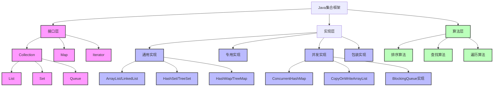

# Java集合框架详解

## 📚 内容导航

- [集合框架概述](./Overview.md) - 集合框架的整体架构和设计理念
- [List详解](./List.md) - ArrayList、LinkedList等实现原理及性能分析
- [Map详解](./Map.md) - HashMap、TreeMap、LinkedHashMap等实现原理
- [Set详解](./Set.md) - HashSet、TreeSet等实现原理及应用场景
- [Queue详解](./Queue.md) - 队列家族及其并发实现
- [并发集合](./ConcurrentCollections.md) - 线程安全集合类详解
- [集合最佳实践](./BestPractices.md) - 集合使用的常见陷阱和最佳实践

## 🔍 核心知识图谱

## 📊 集合性能对比

| 集合类型 | 随机访问 | 插入/删除头部 | 插入/删除中间 | 插入/删除尾部 | 内存占用 | 线程安全 |
|---------|---------|--------------|--------------|--------------|---------|---------|
| ArrayList | O(1) | O(n) | O(n) | O(1)* | 低 | 否 |
| LinkedList | O(n) | O(1) | O(1)** | O(1) | 高 | 否 |
| HashMap | O(1) | - | - | - | 中 | 否 |
| TreeMap | O(log n) | - | - | - | 中 | 否 |
| HashSet | O(1) | - | - | - | 中 | 否 |
| ConcurrentHashMap | O(1) | - | - | - | 中 | 是 |
| CopyOnWriteArrayList | O(1) | O(n) | O(n) | O(n) | 很高 | 是 |

\* 当需要扩容时为O(n)  
\** 需要先遍历到指定位置，总体为O(n)

## 🚀 学习路径

1. **基础阶段**：集合框架概述 → List → Map → Set
2. **进阶阶段**：Queue → Iterator深入 → Comparable/Comparator
3. **高级阶段**：并发集合 → 自定义集合实现 → 源码分析
4. **实战阶段**：性能优化 → 集合最佳实践 → 设计模式与集合

## 📖 扩展阅读

- [Collections工具类完全指南](./CollectionsUtil.md)
- [自定义集合实现](./CustomCollections.md)
- [JDK版本演进中的集合变化](./CollectionsEvolution.md)
- [集合框架面试题集锦](./InterviewQuestions.md)

## 📘 相关资源

- [返回Java基础首页](../README.md)
- [Java内存模型与并发编程](../JMM/README.md)
- [Java I/O体系](../IO/README.md)

---

© Java知识库 2023 