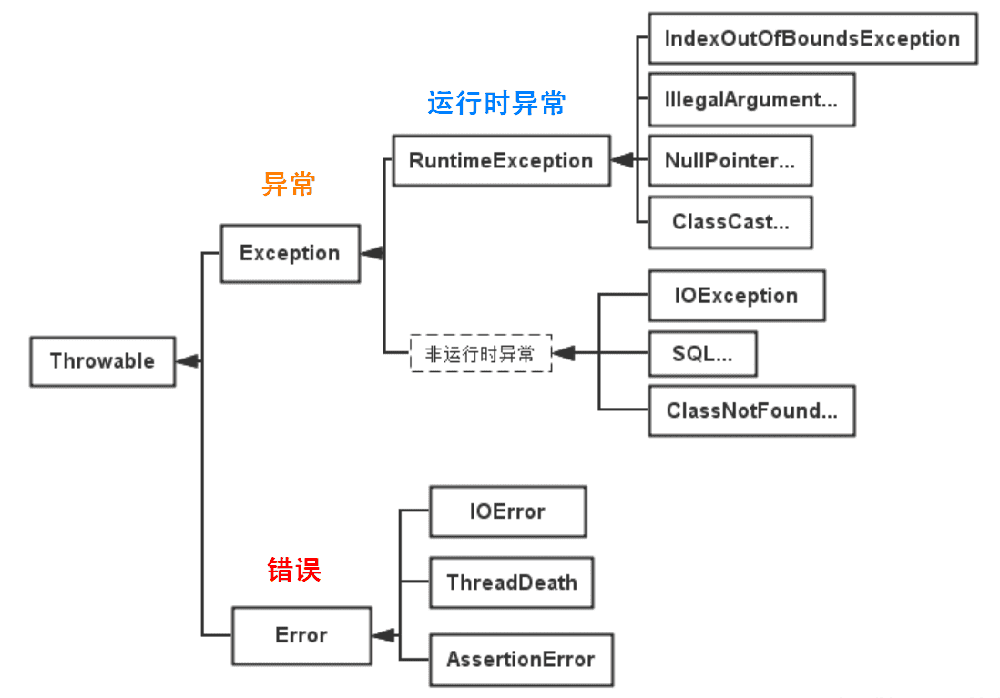

# 异常
- **Throwable** 是 Java 语言中所有错误与异常的超类。 
  - **Error** 类及其子类：程序中无法处理的错误，表示运行应用程序中出现了严重的错误。
  - **Exception** 程序本身可以捕获并且可以处理的异常。Exception 这种异常又分为两类：运行时异常和编译时异常。
 

- **可查异常**（编译器要求必须处置的异常）：正确的程序在运行中，很容易出现的、情理可容的异常状况。可查异常虽然是异常状况，但在一定程度上它的发生是可以预计的，而且一旦发生这种异常状况，就必须采取某种方式进行处理。除了RuntimeException及其子类以外，其他的Exception类及其子类都属于可查异常。这种异常的特点是Java编译器会检查它，也就是说，当程序中可能出现这类异常，要么用try-catch语句捕获它，要么用throws子句声明抛出它，否则编译不会通过。
- **不可查异常**(编译器不要求强制处置的异常)包括运行时异常（RuntimeException与其子类）和错误（Error）。
