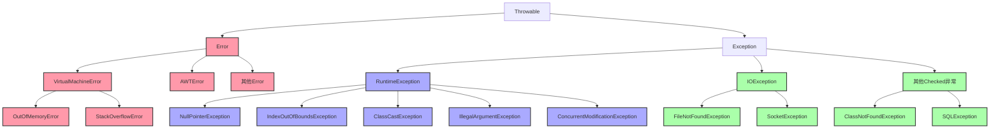
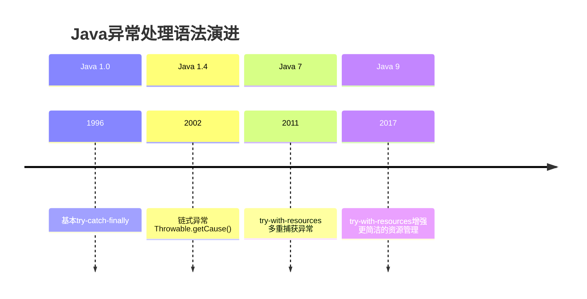

# Java异常处理机制详解

## 📚 内容导航

- [异常体系概述](./Overview.md) - Java异常层次结构和设计理念
- [异常处理语法](./Syntax.md) - try-catch-finally、try-with-resources等语法详解
- [常见异常分析](./CommonExceptions.md) - JDK常见异常类解析及处理方法
- [自定义异常](./CustomExceptions.md) - 设计良好的自定义异常及最佳实践
- [异常处理策略](./Strategies.md) - 不同场景下的异常处理策略
- [异常性能优化](./Performance.md) - 异常处理对性能的影响及优化方法
- [实战案例](./CaseStudies.md) - 复杂场景下的异常处理案例分析

## 🔍 异常体系结构



## 📊 异常类型对比

| 特性 | Checked Exception | Unchecked Exception | Error |
|------|------------------|---------------------|-------|
| 继承关系 | Exception的子类 | RuntimeException的子类 | Error的子类 |
| 编译检查 | 必须显式处理或声明抛出 | 不强制处理或声明 | 不强制处理或声明 |
| 可恢复性 | 通常可恢复 | 通常由程序错误导致 | 通常不可恢复 |
| 示例 | IOException, SQLException | NullPointerException, IllegalArgumentException | OutOfMemoryError, StackOverflowError |
| 处理方式 | 捕获并处理或声明抛出 | 修复代码缺陷 | 预防或JVM调优 |

## 🚀 异常处理语法进化



## 📝 异常处理代码示例

### 基本的try-catch-finally

```java
try {
    // 可能抛出异常的代码
    FileInputStream file = new FileInputStream("file.txt");
    int data = file.read();
} catch (FileNotFoundException e) {
    // 处理文件未找到异常
    System.err.println("文件未找到: " + e.getMessage());
} catch (IOException e) {
    // 处理IO异常
    System.err.println("读取错误: " + e.getMessage());
} finally {
    // 无论是否发生异常都会执行
    // 关闭资源等清理操作
    if (file != null) {
        try {
            file.close();
        } catch (IOException e) {
            e.printStackTrace();
        }
    }
}
```

### Java 7 try-with-resources

```java
// 自动关闭资源，更简洁安全
try (FileInputStream file = new FileInputStream("file.txt");
     BufferedReader reader = new BufferedReader(new InputStreamReader(file))) {
    String line = reader.readLine();
    // 处理数据...
} catch (IOException e) {
    // 处理异常
    e.printStackTrace();
}
// 资源自动关闭，无需显式finally块
```

### Java 7 多重捕获

```java
try {
    // 可能抛出多种异常的代码
} catch (IOException | SQLException e) {
    // 同时处理两种异常
    logger.error("数据访问异常", e);
}
```

## 💡 异常处理最佳实践

1. **只在异常情况下使用异常**
   - 不要使用异常控制正常的业务流程
   - 避免过度捕获异常

2. **精确捕获异常**
   - 捕获具体的异常类而非笼统的Exception
   - 不同类型的异常采用不同的处理策略

3. **保持异常的原始信息**
   - 使用异常链而非创建新异常
   - 包装异常时保留原始异常信息

4. **正确使用异常层次结构**
   - 业务异常应为Checked异常
   - 程序错误应为Unchecked异常

5. **日志记录异常信息**
   - 记录足够的上下文信息
   - 避免重复记录同一异常

6. **关闭资源的正确方式**
   - 优先使用try-with-resources
   - finally块中的关闭操作也要处理异常

7. **不要忽略异常**
   - 避免空catch块
   - 必要时转换为适当的未检查异常

## 📘 相关资源

- [返回Java基础首页](../README.md)
- [Java内存模型与并发编程](../JMM/README.md)
- [Java I/O体系](../IO/README.md)
- [Java集合框架](../Collections/README.md)

---

© Java知识库 2023 