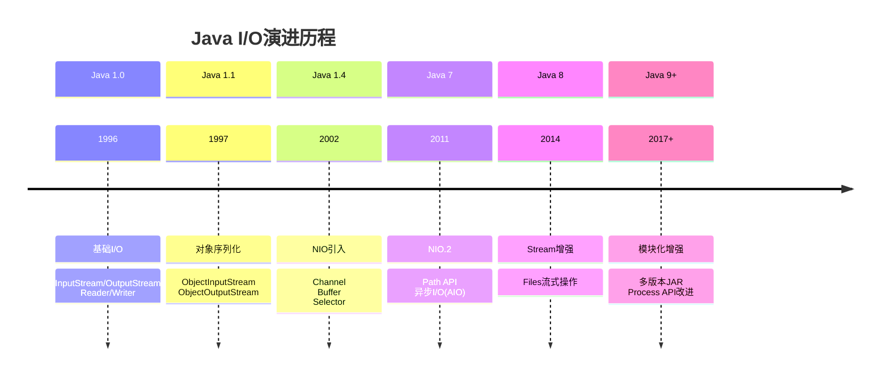
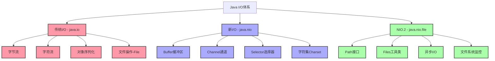
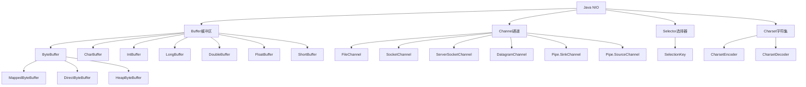
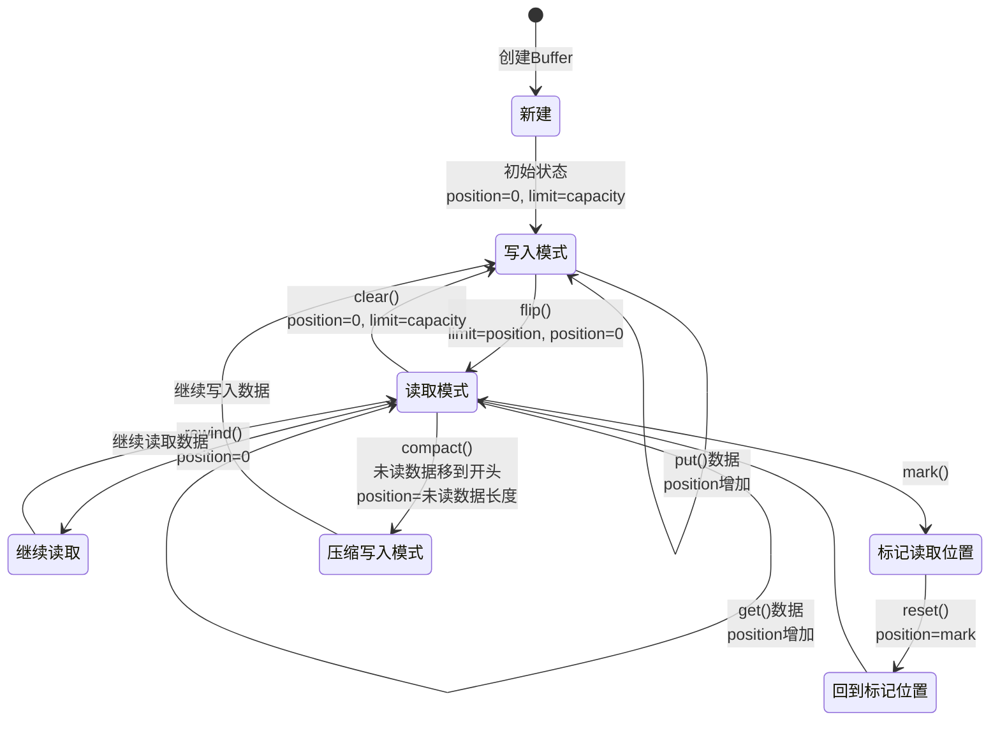
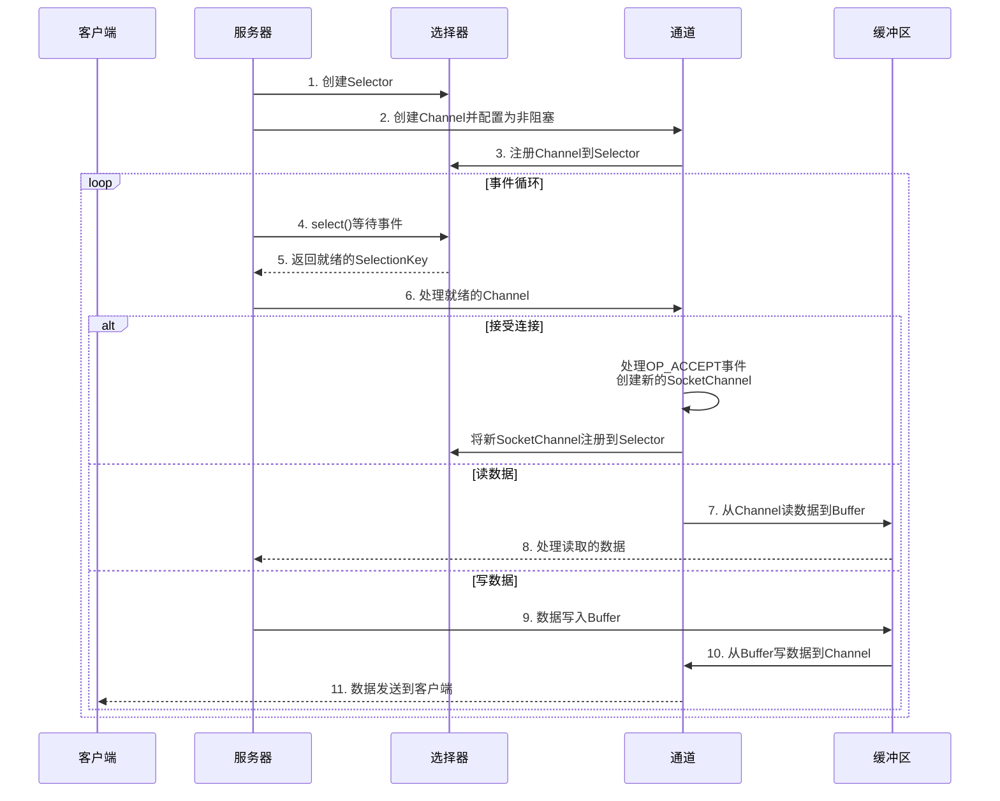
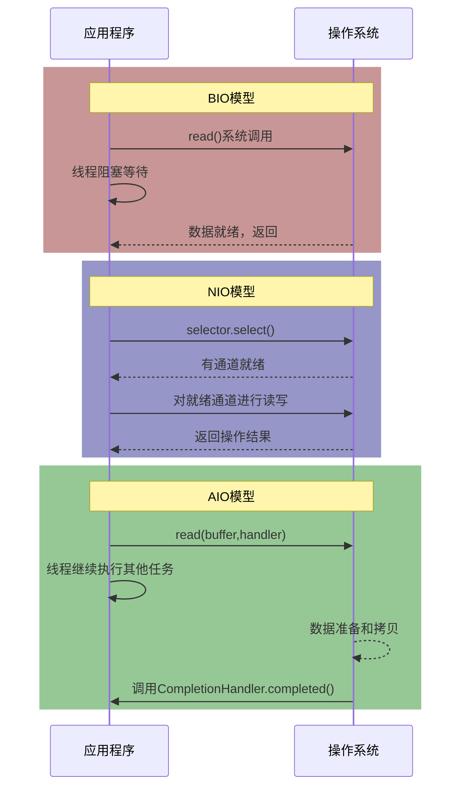

# Java I/O体系概述

## 1. Java I/O的发展历程

Java I/O体系经历了多次演进，从最初的阻塞式I/O到现代的异步非阻塞I/O，为不同场景提供了丰富的解决方案。



## 2. I/O体系的整体架构

Java I/O体系由三大部分组成：传统I/O（BIO）、新I/O（NIO）和新I/O.2（NIO.2）。每部分都有其特定的用途和性能特点。



## 3. 传统I/O (BIO) 架构

传统I/O基于流（Stream）模型，是一种阻塞式I/O。它将I/O设备抽象为流，通过流读写数据。

### 3.1 设计理念

传统I/O的核心设计理念包括：

- **流抽象**：将所有I/O设备统一抽象为流
- **装饰器模式**：通过组合实现功能扩展
- **阻塞操作**：读写操作会阻塞当前线程
- **字节与字符分离**：分别处理二进制数据和文本数据

### 3.2 类层次结构

```mermaid
classDiagram
    class InputStream {
        <<abstract>>
        +read() int
        +read(byte[] b) int
        +read(byte[] b, int off, int len) int
        +skip(long n) long
        +available() int
        +close() void
        +mark(int readlimit) void
        +reset() void
        +markSupported() boolean
    }
    
    class OutputStream {
        <<abstract>>
        +write(int b) void
        +write(byte[] b) void
        +write(byte[] b, int off, int len) void
        +flush() void
        +close() void
    }
    
    class Reader {
        <<abstract>>
        +read() int
        +read(char[] cbuf) int
        +read(char[] cbuf, int off, int len) int
        +skip(long n) long
        +ready() boolean
        +markSupported() boolean
        +mark(int readAheadLimit) void
        +reset() void
        +close() void
    }
    
    class Writer {
        <<abstract>>
        +write(int c) void
        +write(char[] cbuf) void
        +write(char[] cbuf, int off, int len) void
        +write(String str) void
        +write(String str, int off, int len) void
        +append(CharSequence csq) Writer
        +append(CharSequence csq, int start, int end) Writer
        +append(char c) Writer
        +flush() void
        +close() void
    }
    
    InputStream <|-- FileInputStream
    InputStream <|-- FilterInputStream
    InputStream <|-- ObjectInputStream
    InputStream <|-- PipedInputStream
    InputStream <|-- SequenceInputStream
    InputStream <|-- ByteArrayInputStream
    InputStream <|-- StringBufferInputStream
    
    FilterInputStream <|-- BufferedInputStream
    FilterInputStream <|-- DataInputStream
    FilterInputStream <|-- PushbackInputStream
    
    OutputStream <|-- FileOutputStream
    OutputStream <|-- FilterOutputStream
    OutputStream <|-- ObjectOutputStream
    OutputStream <|-- PipedOutputStream
    OutputStream <|-- ByteArrayOutputStream
    
    FilterOutputStream <|-- BufferedOutputStream
    FilterOutputStream <|-- DataOutputStream
    FilterOutputStream <|-- PrintStream
    
    Reader <|-- BufferedReader
    Reader <|-- InputStreamReader
    Reader <|-- StringReader
    Reader <|-- PipedReader
    Reader <|-- CharArrayReader
    Reader <|-- FilterReader
    
    BufferedReader <|-- LineNumberReader
    InputStreamReader <|-- FileReader
    FilterReader <|-- PushbackReader
    
    Writer <|-- BufferedWriter
    Writer <|-- OutputStreamWriter
    Writer <|-- StringWriter
    Writer <|-- PipedWriter
    Writer <|-- CharArrayWriter
    Writer <|-- FilterWriter
    Writer <|-- PrintWriter
    
    OutputStreamWriter <|-- FileWriter
```



### 3.3 装饰器模式应用

传统I/O大量使用装饰器模式，通过组合不同功能的流来实现复杂功能：

```java
// 装饰器模式示例：一个具有缓冲、数据类型处理能力的文件输入流
DataInputStream dis = new DataInputStream(
                         new BufferedInputStream(
                           new FileInputStream("data.bin")));

// 读取不同类型的数据
int i = dis.readInt();
double d = dis.readDouble();
String s = dis.readUTF();
```

## 4. 新I/O (NIO) 架构

Java NIO是在Java 1.4引入的，提供了一种基于Buffer和Channel的I/O操作方式，支持非阻塞I/O。

### 4.1 设计理念

NIO的核心设计理念包括：

- **缓冲区操作**：基于Buffer进行数据处理
- **通道传输**：Channel作为连接源与目标的通道
- **非阻塞I/O**：支持非阻塞模式的I/O操作
- **多路复用**：通过Selector实现单线程管理多连接
- **直接内存访问**：支持零拷贝技术

### 4.2 核心组件



### 4.3 Buffer的状态变化

Buffer是NIO的核心概念，有三个重要属性：capacity（容量）、position（位置）和limit（限制）。



### 4.4 NIO非阻塞I/O模型



## 5. NIO.2 (AIO) 架构

Java 7引入的NIO.2提供了更丰富的文件系统操作API和真正的异步I/O支持。

### 5.1 设计理念

NIO.2的核心设计理念包括：

- **路径抽象**：使用Path替代File，更灵活地表示文件路径
- **文件操作封装**：Files工具类提供丰富的文件操作方法
- **异步I/O**：提供真正的异步非阻塞I/O操作
- **文件系统监控**：支持文件系统变化事件监听
- **符号链接支持**：完善的符号链接处理能力

### 5.2 Path与Files API

```java
// 创建路径
Path path = Paths.get("/home/user/docs/file.txt");

// 路径操作
Path parent = path.getParent();
Path fileName = path.getFileName();
Path absolute = path.toAbsolutePath();
Path normalized = path.normalize();

// 文件操作
boolean exists = Files.exists(path);
long size = Files.size(path);
FileTime modTime = Files.getLastModifiedTime(path);

// 读写文件
List<String> lines = Files.readAllLines(path);
byte[] bytes = Files.readAllBytes(path);
Files.write(path, bytes);

// 目录遍历
try (DirectoryStream<Path> stream = Files.newDirectoryStream(dir)) {
    for (Path entry: stream) {
        System.out.println(entry.getFileName());
    }
}

// 使用文件访问器遍历目录树
Files.walkFileTree(start, new SimpleFileVisitor<Path>() {
    @Override
    public FileVisitResult visitFile(Path file, BasicFileAttributes attrs) {
        System.out.println(file);
        return FileVisitResult.CONTINUE;
    }
});
```

### 5.3 异步I/O操作

```java
// 异步文件通道
AsynchronousFileChannel fileChannel = AsynchronousFileChannel.open(path, 
    StandardOpenOption.READ);

// 使用Future方式
ByteBuffer buffer = ByteBuffer.allocate(1024);
Future<Integer> operation = fileChannel.read(buffer, 0);
while(!operation.isDone());
buffer.flip();
// 处理数据...

// 使用CompletionHandler方式
fileChannel.read(buffer, 0, buffer, new CompletionHandler<Integer, ByteBuffer>() {
    @Override
    public void completed(Integer result, ByteBuffer attachment) {
        attachment.flip();
        // 处理数据...
    }
    
    @Override
    public void failed(Throwable exc, ByteBuffer attachment) {
        // 处理失败...
    }
});
```

### 5.4 文件系统监控

```java
WatchService watchService = FileSystems.getDefault().newWatchService();
Path directory = Paths.get("/path/to/dir");

directory.register(watchService, 
    StandardWatchEventKinds.ENTRY_CREATE,
    StandardWatchEventKinds.ENTRY_DELETE,
    StandardWatchEventKinds.ENTRY_MODIFY);

while (true) {
    WatchKey key = watchService.take(); // 阻塞等待事件
    
    for (WatchEvent<?> event : key.pollEvents()) {
        WatchEvent.Kind<?> kind = event.kind();
        Path fileName = (Path) event.context();
        
        System.out.println(kind.name() + ": " + fileName);
    }
    
    boolean valid = key.reset();
    if (!valid) break;
}
```

## 6. I/O模型比较

### 6.1 BIO、NIO和AIO的对比

| 特性 | BIO (Blocking I/O) | NIO (Non-blocking I/O) | AIO (Asynchronous I/O) |
|------|-------------------|----------------------|------------------------|
| 阻塞模式 | 阻塞 | 非阻塞 | 非阻塞 |
| 同步/异步 | 同步 | 同步(多路复用) | 异步 |
| 编程复杂度 | 简单 | 复杂 | 中等 |
| 调用方式 | 调用后阻塞等待结果 | 调用后主动轮询结果 | 调用后注册回调，结果自动通知 |
| 适用场景 | 连接数少、服务器资源充足 | 连接数多、I/O时间长 | 连接数多、I/O时间长且追求更高性能 |
| 实现机制 | 一请求一线程 | 单线程处理多请求(Reactor模式) | 事件驱动(Proactor模式) |

### 6.2 三种I/O模型的处理流程



## 7. 选择合适的I/O模型

### 7.1 I/O模型选择指南

| 场景 | 推荐模型 | 理由 |
|------|---------|------|
| 小型应用、连接少 | BIO | 简单易用，开发成本低 |
| 文件操作、本地I/O | BIO/NIO | 文件I/O通常不是性能瓶颈 |
| 高并发网络应用 | NIO | 支持大量连接，资源占用少 |
| 需要细粒度控制I/O | NIO | 提供更多底层控制能力 |
| 追求极致性能 | AIO | 真正的异步操作，性能更高 |
| 复杂文件操作 | NIO.2 | 更丰富的文件操作API |

### 7.2 不同I/O模型的应用场景

- **BIO适用场景**：
  - 连接数目较小且固定的架构
  - 服务器资源充足
  - 实现简单明了为主要需求

- **NIO适用场景**：
  - 服务器需要同时处理大量连接
  - 连接是长连接且非活跃
  - 需要在同一个线程内管理多个连接

- **AIO适用场景**：
  - 大量长连接应用
  - 读写操作时间长
  - 对I/O性能有较高要求

## 8. I/O性能优化建议

### 8.1 通用I/O性能优化策略

1. **使用缓冲**：无论是BIO还是NIO，都应使用缓冲提高吞吐量
2. **合理的缓冲区大小**：通常8KB-16KB是比较平衡的选择
3. **减少系统调用**：合并小数据量的读写操作
4. **使用直接缓冲区**：适用于大数据量传输
5. **选择合适的I/O模型**：根据应用特点选择BIO/NIO/AIO
6. **避免过早优化**：先保证功能正确，再进行性能优化

### 8.2 文件I/O性能优化

1. **使用BufferedInputStream/BufferedOutputStream**：提高吞吐量
2. **使用NIO的FileChannel**：支持更高效的文件传输
3. **考虑内存映射文件**：对于大文件读写
4. **使用Files工具类批量操作**：简化代码并优化性能
5. **序列化优化**：考虑使用高性能序列化框架替代Java原生序列化

### 8.3 网络I/O性能优化

1. **使用非阻塞I/O**：处理大量连接时更高效
2. **缓冲区优化**：合理设置Socket发送和接收缓冲区大小
3. **零拷贝技术**：利用transferTo/transferFrom减少数据复制
4. **考虑使用成熟的网络框架**：如Netty提供更好的性能和功能
5. **连接池化**：复用连接避免频繁创建关闭的开销

---

## 9. 总结

Java I/O体系从简单的流模型发展到现代的异步I/O，提供了全面的I/O处理能力。

- **传统I/O(BIO)**：简单易用，阻塞式I/O
- **新I/O(NIO)**：支持非阻塞I/O，多路复用
- **NIO.2(AIO)**：提供异步I/O和增强的文件操作

选择合适的I/O模型并进行针对性优化，可以显著提高应用性能。

---

[返回I/O体系目录](./README.md)

- [Java基础首页](../README.md)
- [Java集合框架](../Collections/README.md) 