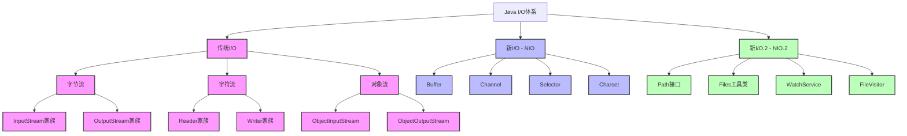

# Java I/O体系详解

## 📚 内容导航

- [I/O体系概述](./Overview.md) - Java I/O体系的整体架构和设计理念
- [字节流详解](./ByteStreams.md) - InputStream和OutputStream家族
- [字符流详解](./CharacterStreams.md) - Reader和Writer家族
- [NIO详解](./NIO.md) - 基于Buffer和Channel的新I/O
- [NIO.2特性](./NIO2.md) - Java 7引入的Path和Files API
- [序列化与反序列化](./Serialization.md) - 对象序列化机制与最佳实践
- [I/O性能优化](./Performance.md) - I/O操作的性能调优策略

## 🔍 核心知识图谱



## 📊 I/O模型对比

| I/O类型 | 阻塞特性 | 缓冲区 | 主要用途 | 性能特点 |
|---------|---------|---------|---------|---------|
| 传统I/O (BIO) | 阻塞式 | 流式处理 | 简单的文件和网络I/O | CPU使用率高，线程数限制并发 |
| 新I/O (NIO) | 非阻塞 | 基于Buffer | 高性能网络应用 | 单线程处理多连接，高并发 |
| 异步I/O (AIO) | 非阻塞异步 | 基于回调 | 高性能网络应用 | 真正的异步非阻塞I/O，事件驱动 |

## 📐 字节流与字符流对比

| 特性 | 字节流 | 字符流 |
|------|--------|--------|
| 处理单位 | 8位字节 | 16位字符 |
| 适用场景 | 二进制数据 | 文本数据 |
| 是否支持字符编码 | 不支持 | 支持 |
| 基础抽象类 | InputStream/OutputStream | Reader/Writer |
| 缓冲实现 | BufferedInputStream/BufferedOutputStream | BufferedReader/BufferedWriter |
| 特殊功能 | DataInputStream支持基本类型读取 | BufferedReader支持readLine() |

## 🚀 学习路径

1. **基础阶段**：I/O体系概述 → 字节流 → 字符流 → 缓冲流
2. **进阶阶段**：File操作 → 序列化 → 压缩流 → 随机访问文件
3. **高级阶段**：NIO基础 → Buffer与Channel → Selector模型
4. **实战阶段**：NIO.2 Path API → 异步I/O → 高性能I/O模型设计

## 💼 常见I/O应用场景解决方案

### 文件操作

```java
// 文件复制 - 传统I/O
public static void copyFileUsingStream(File source, File dest) throws IOException {
    try (InputStream is = new FileInputStream(source);
         OutputStream os = new FileOutputStream(dest)) {
        byte[] buffer = new byte[8192];
        int length;
        while ((length = is.read(buffer)) > 0) {
            os.write(buffer, 0, length);
        }
    }
}

// 文件复制 - NIO
public static void copyFileUsingChannel(File source, File dest) throws IOException {
    try (FileChannel sourceChannel = new FileInputStream(source).getChannel();
         FileChannel destChannel = new FileOutputStream(dest).getChannel()) {
        destChannel.transferFrom(sourceChannel, 0, sourceChannel.size());
    }
}

// 文件复制 - NIO.2
public static void copyFileUsingFiles(Path source, Path dest) throws IOException {
    Files.copy(source, dest, StandardCopyOption.REPLACE_EXISTING);
}
```

### 网络通信

```java
// BIO网络编程
ServerSocket serverSocket = new ServerSocket(port);
while (true) {
    Socket clientSocket = serverSocket.accept();
    new Thread(() -> handleClient(clientSocket)).start();
}

// NIO网络编程
Selector selector = Selector.open();
ServerSocketChannel serverChannel = ServerSocketChannel.open();
serverChannel.configureBlocking(false);
serverChannel.bind(new InetSocketAddress(port));
serverChannel.register(selector, SelectionKey.OP_ACCEPT);

while (true) {
    selector.select();
    Set<SelectionKey> selectedKeys = selector.selectedKeys();
    Iterator<SelectionKey> iterator = selectedKeys.iterator();
    while (iterator.hasNext()) {
        SelectionKey key = iterator.next();
        if (key.isAcceptable()) {
            // 处理新连接
        } else if (key.isReadable()) {
            // 处理可读事件
        }
        iterator.remove();
    }
}
```

## 📘 扩展阅读

- [Java常见I/O设计模式](./IOPatterns.md)
- [零拷贝技术详解](./ZeroCopy.md)
- [Netty框架与Java I/O](./Netty.md)
- [I/O框架对比分析](./IOFrameworks.md)
- [异步文件I/O实战](./AsyncFileIO.md)

## 📁 相关资源

- [返回Java基础首页](../README.md)
- [Java内存模型与并发编程](../JMM/README.md)
- [Java集合框架](../Collections/README.md)

---

© Java知识库 2023 