# Java并发编程模型

## 1. 并发编程模型概述

并发编程模型是指在多线程环境下，如何组织和协调线程以完成任务的方法论。Java提供了多种并发编程模型，每种模型都有其特定的应用场景和优缺点。

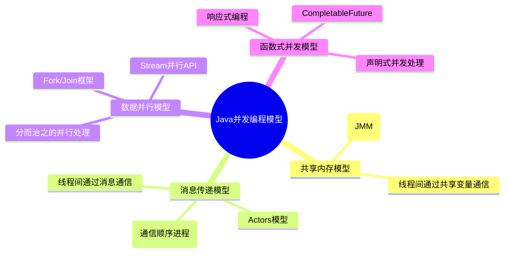

## 2. 共享内存模型

共享内存模型是Java最原始和基础的并发模型，基于Java内存模型(JMM)构建。在这个模型中，线程之间通过共享内存中的变量进行通信。

### 2.1 基本概念

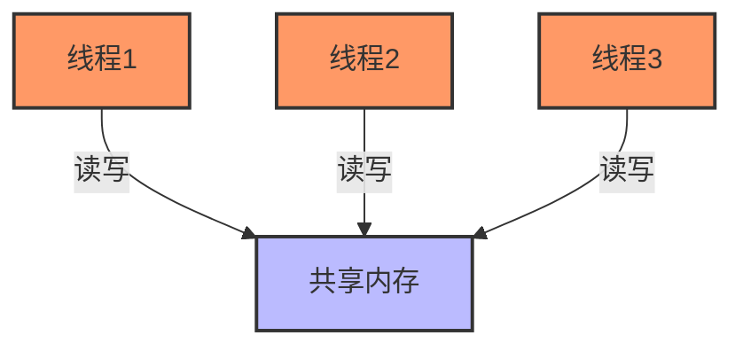

**核心特性**：
- 线程间通过读写共享变量通信
- 需要使用同步机制（如锁）来协调访问
- 直接映射到底层硬件模型

### 2.2 同步机制

Java提供了多种同步机制来确保共享内存模型的正确性：

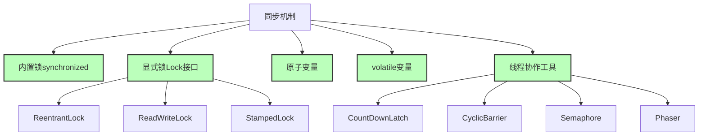

**示例代码**：
```java
// 使用synchronized
public class SharedCounter {
    private int count = 0;
    
    public synchronized void increment() {
        count++;
    }
    
    public synchronized int getCount() {
        return count;
    }
}

// 使用显式锁
public class LockBasedCounter {
    private final Lock lock = new ReentrantLock();
    private int count = 0;
    
    public void increment() {
        lock.lock();
        try {
            count++;
        } finally {
            lock.unlock();
        }
    }
    
    public int getCount() {
        lock.lock();
        try {
            return count;
        } finally {
            lock.unlock();
        }
    }
}
```

### 2.3 共享内存模型的挑战

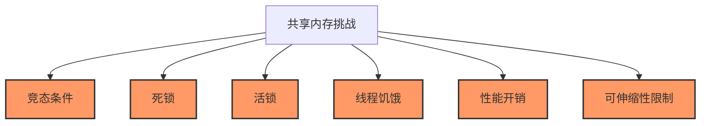

- **竞态条件**：多线程以不确定顺序访问共享资源
- **死锁**：多个线程循环等待其他线程持有的锁
- **活锁**：线程不断响应其他线程的动作，但无法前进
- **线程饥饿**：某些线程无法获得所需资源
- **性能开销**：锁争用导致的上下文切换
- **可伸缩性**：在大规模并发环境下扩展困难

## 3. 消息传递模型

消息传递模型是一种避免共享状态的并发模型，线程之间通过发送消息进行通信，而不是共享内存。

### 3.1 Actors模型

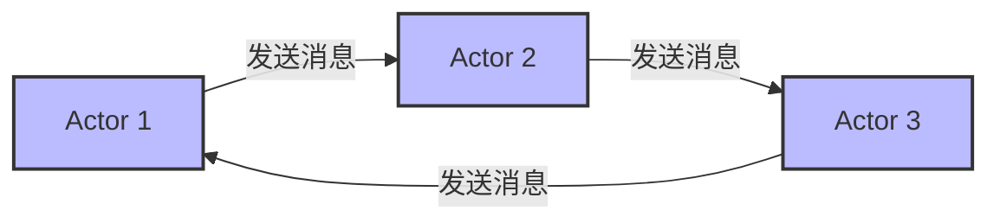

**核心概念**：
- Actor是基本计算单元，有自己的状态和行为
- Actor之间通过异步消息传递通信
- 每个Actor有自己的邮箱，按顺序处理消息
- 没有共享状态，降低并发复杂度

**Java实现**：
- Akka库是JVM上最流行的Actor模型实现
- Quasar库提供轻量级Actor实现

**示例代码**：
```java
// 使用Akka实现Actor模型
public class HelloActor extends AbstractActor {
    @Override
    public Receive createReceive() {
        return receiveBuilder()
            .match(String.class, s -> {
                System.out.println("Received message: " + s);
                getSender().tell("Hello back!", getSelf());
            })
            .build();
    }
    
    public static void main(String[] args) {
        ActorSystem system = ActorSystem.create("helloSystem");
        ActorRef helloActor = system.actorOf(Props.create(HelloActor.class));
        
        // 发送消息
        helloActor.tell("Hello Actor!", ActorRef.noSender());
    }
}
```

### 3.2 CSP模型

CSP(Communicating Sequential Processes)是一种通过明确的通道(Channel)进行通信的并发模型。

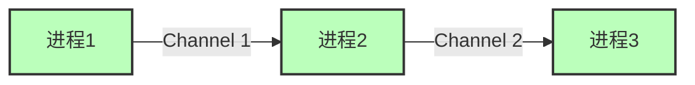

**核心概念**：
- 进程间通过显式的通道(Channel)通信
- 通道是一等公民，可以在进程间传递
- 通道可以是有缓冲或无缓冲的

**Java实现**：
- JCSP库提供CSP模型的Java实现
- java.util.concurrent.BlockingQueue可以作为简单的CSP通道

**示例代码**：
```java
// 使用BlockingQueue实现CSP风格的生产者-消费者
public class CSPExample {
    public static void main(String[] args) {
        BlockingQueue<String> channel = new LinkedBlockingQueue<>(10);
        
        // 生产者进程
        new Thread(() -> {
            try {
                for (int i = 0; i < 20; i++) {
                    channel.put("Message " + i);
                    System.out.println("Sent: Message " + i);
                    Thread.sleep(100);
                }
                channel.put("DONE");
            } catch (InterruptedException e) {
                Thread.currentThread().interrupt();
            }
        }).start();
        
        // 消费者进程
        new Thread(() -> {
            try {
                String msg;
                while (!(msg = channel.take()).equals("DONE")) {
                    System.out.println("Received: " + msg);
                    Thread.sleep(200);
                }
            } catch (InterruptedException e) {
                Thread.currentThread().interrupt();
            }
        }).start();
    }
}
```

### 3.3 消息传递模型的优缺点

| 优点 | 缺点 |
|------|------|
| 避免了共享状态导致的问题 | 可能引入消息处理的复杂性 |
| 简化了并发推理 | 可能导致消息爆炸 |
| 更好的隔离性和容错性 | 调试可能更复杂 |
| 易于扩展到分布式系统 | 额外的内存开销和性能消耗 |
| 状态本地化 | 学习曲线较陡 |

## 4. 数据并行模型

数据并行模型关注的是如何高效地对大量数据执行相同操作，将数据分割成多个部分并行处理。

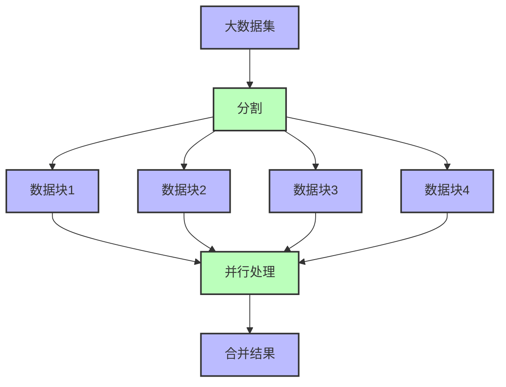

### 4.1 Stream API并行处理

Java 8引入的Stream API提供了声明式数据并行处理能力。

**核心概念**：
- 基于函数式编程范式
- 自动化的数据并行计算
- 内部使用Fork/Join框架实现

**示例代码**：
```java
// 并行流处理大量数据
List<Integer> numbers = Arrays.asList(1, 2, 3, 4, 5, 6, 7, 8, 9, 10);

// 串行处理
long sum = numbers.stream()
                  .filter(n -> n % 2 == 0)
                  .mapToLong(n -> n * n)
                  .sum();

// 并行处理（自动使用多线程）
long parallelSum = numbers.parallelStream()
                         .filter(n -> n % 2 == 0)
                         .mapToLong(n -> n * n)
                         .sum();
```

### 4.2 Fork/Join框架

Fork/Join框架是一种特殊的ExecutorService，专为支持"分而治之"并行处理范式而设计。

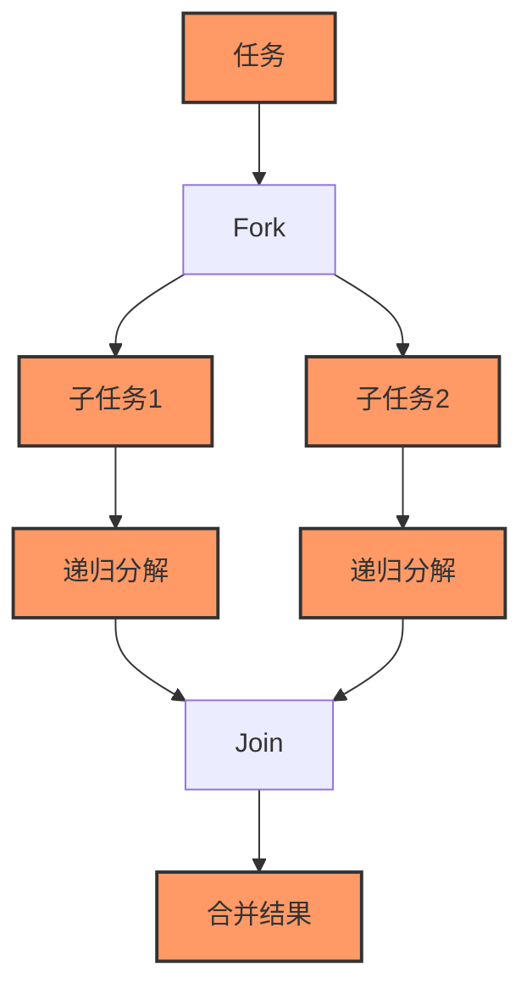

**核心特性**：
- 工作窃取算法：空闲线程可以"窃取"其他线程队列中的任务
- 递归任务分解：大任务分解为小任务，直到足够小可以直接计算
- 自动负载均衡：适合处理计算密集型任务

**示例代码**：
```java
public class SumTask extends RecursiveTask<Long> {
    private static final int THRESHOLD = 1000;
    private final long[] array;
    private final int start;
    private final int end;
    
    public SumTask(long[] array, int start, int end) {
        this.array = array;
        this.start = start;
        this.end = end;
    }
    
    @Override
    protected Long compute() {
        int length = end - start;
        if (length <= THRESHOLD) {
            // 小任务直接计算
            long sum = 0;
            for (int i = start; i < end; i++) {
                sum += array[i];
            }
            return sum;
        } else {
            // 大任务分解
            int middle = start + length / 2;
            SumTask left = new SumTask(array, start, middle);
            SumTask right = new SumTask(array, middle, end);
            
            right.fork(); // 异步执行右侧任务
            long leftResult = left.compute(); // 直接执行左侧任务
            long rightResult = right.join(); // 等待右侧任务结果
            
            return leftResult + rightResult;
        }
    }
    
    public static void main(String[] args) {
        long[] array = new long[100000000];
        Arrays.fill(array, 1);
        
        ForkJoinPool pool = ForkJoinPool.commonPool();
        long result = pool.invoke(new SumTask(array, 0, array.length));
        System.out.println("Sum: " + result);
    }
}
```

### 4.3 数据并行适用场景

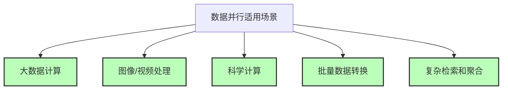

- 需要处理大量独立数据元素
- 每个数据元素的处理逻辑相似
- 处理过程计算密集
- 数据间依赖性低

## 5. 函数式并发模型

函数式并发模型将函数式编程的思想应用到并发编程中，通过不可变数据和声明式API来简化并发编程。

### 5.1 CompletableFuture

CompletableFuture代表了Java中函数式并发编程的主要实现，它提供了一种声明式的方式来编排异步计算。

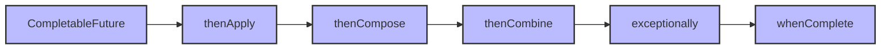

**核心特性**：
- 声明式API：链式调用，函数式风格
- 组合能力：多个异步计算可以组合
- 异常处理：内置的异常处理机制
- 完成状态：可以手动完成、异常完成或取消

**示例代码**：
```java
public class CompletableFutureExample {
    public static void main(String[] args) throws Exception {
        // 创建异步计算
        CompletableFuture<String> future = CompletableFuture.supplyAsync(() -> {
            try {
                Thread.sleep(1000); // 模拟耗时操作
            } catch (InterruptedException e) {
                Thread.currentThread().interrupt();
            }
            return "Hello";
        });
        
        // 链式处理结果
        CompletableFuture<String> finalResult = future
            .thenApply(s -> s + " World") // 转换结果
            .thenCompose(s -> CompletableFuture.supplyAsync(() -> s + "!")) // 组合另一个Future
            .exceptionally(ex -> "Error: " + ex.getMessage()) // 处理异常
            .whenComplete((result, error) -> {
                if (error == null) {
                    System.out.println("Processing completed: " + result);
                } else {
                    System.out.println("Processing error: " + error);
                }
            });
        
        // 等待最终结果
        System.out.println("Final result: " + finalResult.get());
    }
}
```

### 5.2 响应式编程

响应式编程是一种基于数据流和变化传播的编程范式，特别适合处理异步事件序列。


**核心概念**：
- 推送模型：数据主动推送给消费者
- 数据流：关注数据随时间的变化
- 组合操作符：提供丰富的操作符组合数据流
- 背压(Backpressure)：处理生产者和消费者速度不匹配问题

**Java实现**：
- RxJava：JVM上最流行的响应式编程库
- Project Reactor：支持Reactive Streams规范的库
- java.util.concurrent.Flow (Java 9+)：官方响应式流API

**示例代码**：
```java
// 使用RxJava实现响应式编程
Observable.interval(1, TimeUnit.SECONDS) // 每秒发射一个递增的Long值
    .map(tick -> "Tick: " + tick)
    .take(5) // 只取前5个
    .subscribeOn(Schedulers.computation()) // 在计算线程池执行
    .observeOn(Schedulers.io()) // 在IO线程池观察结果
    .subscribe(
        item -> System.out.println("Received: " + item), // onNext
        error -> System.err.println("Error: " + error), // onError
        () -> System.out.println("Completed!") // onComplete
    );

// 使用sleep保持程序运行
Thread.sleep(6000);
```

### 5.3 函数式并发的优缺点

| 优点 | 缺点 |
|------|------|
| 代码更简洁、更易读 | 调试复杂链式调用困难 |
| 声明式而非命令式 | 学习曲线较陡 |
| 更好的组合性 | 错误处理可能更复杂 |
| 隐式并行性 | 可能引入不必要的抽象层 |
| 更容易推理 | 长链式调用可能带来性能开销 |

## 6. 混合并发模型

实际应用中，通常会混合使用多种并发模型以发挥各自的优势。

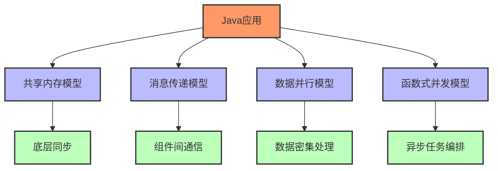

### 6.1 选择合适的并发模型

选择并发模型时需要考虑的因素：

1. **问题特性**：
   - 是否需要共享状态
   - 任务之间的依赖关系
   - 数据量大小和处理方式

2. **性能要求**：
   - 延迟敏感度
   - 吞吐量需求
   - 资源限制

3. **开发复杂性**：
   - 团队熟悉程度
   - 维护成本
   - 调试难度

4. **伸缩需求**：
   - 垂直伸缩（单机多核）
   - 水平伸缩（多机分布式）

### 6.2 实际混合使用案例

**微服务架构中的并发模型混合**：

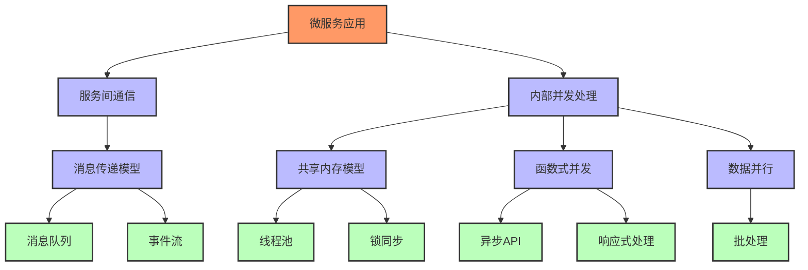

**具体案例**：电子商务平台订单处理系统

- **服务间通信**：使用消息队列（如Kafka）实现订单事件的异步处理（消息传递模型）
- **订单验证**：使用CompletableFuture并行调用多个微服务进行库存、支付和用户信息验证（函数式并发模型）
- **库存管理**：使用synchronized或Lock保护共享的库存数据（共享内存模型）
- **批量报表生成**：使用并行流或Fork/Join框架处理大量订单数据（数据并行模型）
- **用户界面更新**：使用响应式编程（如RxJava）处理订单状态变化（函数式并发模型）

## 7. Java并发编程的未来趋势

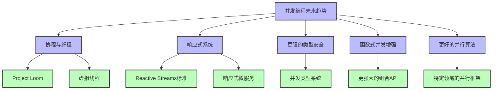

### 7.1 Project Loom与虚拟线程

Java 19引入了虚拟线程（预览功能），这是由Project Loom项目提供的轻量级线程实现。

**核心特性**：
- 虚拟线程是JDK管理的轻量级线程，而非OS线程
- 支持成千上万的并发线程
- 与现有代码和API兼容
- 适合IO密集型应用

**示例代码**：
```java
// Java 19+ 虚拟线程示例
public class VirtualThreadExample {
    public static void main(String[] args) throws Exception {
        // 创建并启动虚拟线程
        Thread vThread = Thread.startVirtualThread(() -> {
            System.out.println("Running in virtual thread");
            try {
                Thread.sleep(100);
            } catch (InterruptedException e) {
                Thread.currentThread().interrupt();
            }
            System.out.println("Virtual thread completed");
        });
        
        // 等待虚拟线程完成
        vThread.join();
        
        // 创建大量虚拟线程
        List<Thread> threads = new ArrayList<>();
        for (int i = 0; i < 10000; i++) {
            final int id = i;
            Thread t = Thread.startVirtualThread(() -> {
                try {
                    Thread.sleep(1000);
                    System.out.println("Virtual thread " + id + " completed");
                } catch (InterruptedException e) {
                    Thread.currentThread().interrupt();
                }
            });
            threads.add(t);
        }
        
        // 等待所有虚拟线程完成
        for (Thread t : threads) {
            t.join();
        }
    }
}
```

### 7.2 响应式系统与弹性设计

响应式系统是一种以响应为中心的架构风格，强调系统的弹性、伸缩性和消息驱动。

**响应式宣言核心原则**：
- 响应性(Responsive)：系统及时响应
- 弹性(Resilient)：系统在故障情况下保持响应
- 伸缩性(Elastic)：系统在不同负载下能适应
- 消息驱动(Message-Driven)：系统通过异步消息传递实现组件间松耦合

**Java实现**：
- Akka：提供响应式系统的全栈实现
- Spring WebFlux：基于Reactor的响应式Web框架
- MicroProfile Reactive Streams Operators：企业级响应式流

## 8. 并发编程实践建议

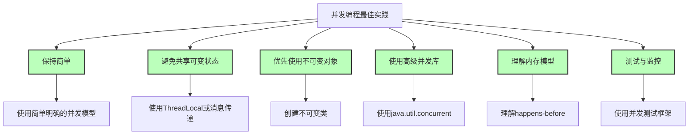

### 8.1 保持简单

- **明确责任**：每个线程负责明确定义的任务
- **减少共享**：尽量避免线程间的状态共享
- **隔离复杂性**：将并发复杂性封装在专用模块中

### 8.2 选择合适的抽象

- 对于简单场景，使用ExecutorService和Future
- 需要复杂任务编排时，使用CompletableFuture
- 数据处理场景，使用并行流
- 反应式处理，使用Reactive Streams实现

### 8.3 防御性编程

- **检查线程安全性**：明确文档说明类的线程安全特性
- **不做假设**：不假设调用顺序和时序
- **考虑边界情况**：初始化、关闭和错误处理
- **处理中断**：正确处理InterruptedException

### 8.4 并发代码的测试与监控

- **压力测试**：使用JMH等工具进行并发性能测试
- **竞态检测**：使用FindBugs、SpotBugs等静态分析工具
- **死锁检测**：使用jstack分析线程转储
- **性能监控**：使用JFR、VisualVM等监控工具
- **并发测试框架**：如java.util.concurrent.CyclicBarrier或JCStress

## 9. 参考资料

1. [Java Concurrency in Practice](http://jcip.net/)
2. [Reactive Manifesto](https://www.reactivemanifesto.org/)
3. [Project Loom](https://wiki.openjdk.java.net/display/loom/Main)
4. [Akka Documentation](https://akka.io/docs/)
5. [RxJava GitHub](https://github.com/ReactiveX/RxJava)
6. [Fork/Join Framework](https://docs.oracle.com/javase/tutorial/essential/concurrency/forkjoin.html)
7. [CompletableFuture API](https://docs.oracle.com/en/java/javase/17/docs/api/java.base/java/util/concurrent/CompletableFuture.html)
8. [Java 9 Flow API](https://docs.oracle.com/en/java/javase/17/docs/api/java.base/java/util/concurrent/Flow.html)

---

- [回到JMM目录](./JMM.md)
- [回到首页](../../README.md) 