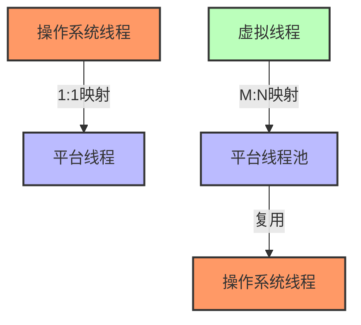
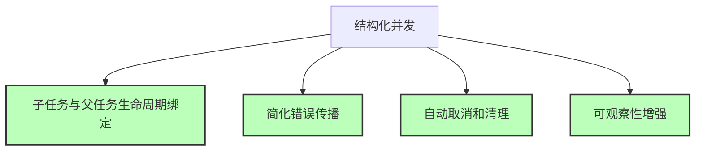
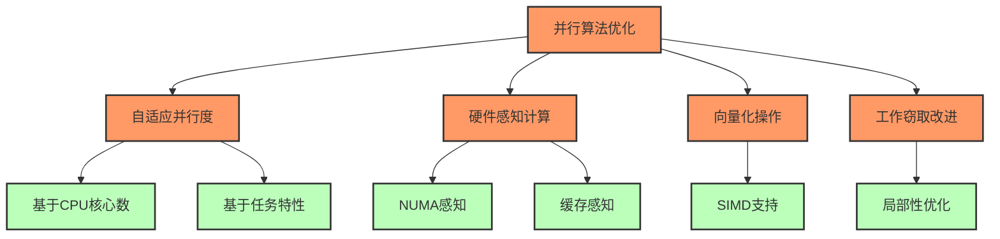
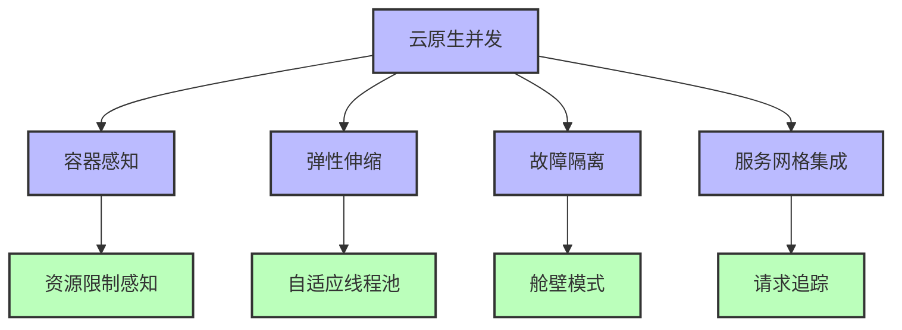

# Java并发编程的未来趋势

Java作为一种企业级编程语言，其并发编程能力正在不断演进。本文将探讨Java并发编程的最新发展和未来趋势，特别关注即将到来的JDK版本中的新特性。

## 1. JDK 21/22 并发编程的主要进展

### 1.1 虚拟线程（Project Loom）

JDK 21已将虚拟线程作为正式特性发布，这是Java并发编程的一次重大革新。



**虚拟线程的核心优势**：

1. **轻量级** - 可以创建数百万个虚拟线程，而非数千个OS线程
2. **简化编程模型** - 保持熟悉的命令式/同步编程模型，同时获得异步的性能优势
3. **没有API变化** - 现有的线程API可以直接使用
4. **适合IO密集型应用** - 解决了C10K问题（同时处理10,000个客户端连接）

**JDK 22的虚拟线程增强**：
- 虚拟线程诊断API增强
- 线程局部变量（ThreadLocal）性能优化
- 更好的工具支持（如JFR事件）

### 1.2 结构化并发（Structured Concurrency）

JDK 21引入了结构化并发作为预览特性，JDK 22继续完善该特性。



**结构化并发的核心理念**：

- 子任务的生命周期不应超过父任务
- 所有并发操作应有明确的作用域边界
- 错误应该可预测地向上传播
- 取消操作应该在整个任务层次结构中传播

**示例代码**：
```java
try (var scope = new StructuredTaskScope.ShutdownOnFailure()) {
    Future<User> user = scope.fork(() -> findUser(userId));
    Future<Order> order = scope.fork(() -> fetchOrder(orderId));
    
    scope.join();           // 等待所有任务完成
    scope.throwIfFailed();  // 如有任务失败则抛出异常
    
    // 处理结果
    return new OrderView(user.resultNow(), order.resultNow());
}
```

### 1.3 扩展的Scoped Values

JDK 22中的Scoped Values是对ThreadLocal的现代替代方案，专为虚拟线程设计。

**核心特性**：
- 与ThreadLocal类似，但值是不可变的
- 优化了虚拟线程环境中的性能
- 支持结构化值传播模式
- 自动清理，避免内存泄漏

**示例代码**：
```java
// 定义一个ScopedValue
final static ScopedValue<User> CURRENT_USER = ScopedValue.newInstance();

void processRequest(Request request) {
    User user = authenticateUser(request);
    
    // 在作用域内绑定值
    ScopedValue.where(CURRENT_USER, user)
        .run(() -> handleUserRequest(request));
}

void handleUserRequest(Request request) {
    // 在任何地方访问当前用户
    User user = CURRENT_USER.get();
    // 处理逻辑...
    
    // 甚至在异步代码中也可以访问
    Thread.startVirtualThread(() -> {
        // 这里依然可以访问相同的CURRENT_USER值
        auditAction(CURRENT_USER.get(), "processed-request");
    });
}
```

## 2. 响应式编程的标准化

### 2.1 Flow API的成熟

Java 9引入了`java.util.concurrent.Flow` API，作为响应式编程的标准接口。在未来的JDK版本中，我们期待看到：

- 标准库中更多Flow API的实现
- 与虚拟线程的更好集成
- 更完善的背压处理机制
- 扩展的操作符集合


### 2.2 虚拟线程与响应式编程的融合

虚拟线程提供了同步编程模型的高并发，而响应式编程提供了声明式的数据流处理。未来的趋势是这两种模式的融合：

- 响应式库将利用虚拟线程优化内部实现
- 混合编程模型将更加普遍
- 响应式背压将与虚拟线程调度器协同工作

**预期的开发模式**：
```java
// 将响应式流转换为同步迭代
Flux<Order> orderFlux = orderService.findAllOrders();
try (var scope = new StructuredTaskScope<ProcessResult>()) {
    // 使用虚拟线程处理每个订单
    for (Order order : orderFlux.toIterable()) {
        scope.fork(() -> processOrder(order));
    }
    // 等待所有订单处理完成
    scope.join();
}
```

## 3. 并行算法与数据结构

### 3.1 增强的并行集合

未来的JDK版本预计将引入更多针对并行操作优化的集合类：

- 不可变集合的标准化，提高并行操作的安全性
- 更高性能的并发哈希表和队列实现
- 专为NUMA架构优化的集合类
- 适用于虚拟线程的集合实现

### 3.2 特化的并行算法

随着硬件的发展，Java将引入更多利用现代CPU特性的并行算法：

- 向量化操作(SIMD)支持
- 基于缓存感知的并行算法
- GPU加速计算框架集成
- 专用并行排序、搜索和聚合算法



## 4. 内存模型与编译器优化

### 4.1 增强的内存屏障

JDK未来版本可能引入更细粒度的内存屏障控制，以便更精确地控制指令重排序和可见性：

- 新的`VarHandle` API扩展
- 更精细的volatile语义变体
- 更好的原子操作支持

### 4.2 编译器级优化

JVM将继续改进其对并发代码的优化能力：

- 锁消除和锁粗化的增强
- 更智能的逃逸分析
- 虚拟线程感知的JIT优化
- 对原子操作的更好硬件支持

## 5. 分布式并发

### 5.1 跨JVM的并发原语

未来的Java版本可能提供更好的分布式并发支持：

- 分布式锁和屏障的标准API
- 分布式事务的简化API
- 集群感知的调度器

### 5.2 云原生并发

为了更好地支持云环境中的并发，Java将提供：

- 容器感知的资源分配
- 弹性伸缩的线程池
- 与服务网格的集成
- 云事件的标准处理模型



## 6. 静态分析与验证

### 6.1 并发错误检测

Java生态系统将提供更强大的静态分析工具：

- 内置的并发错误检测器
- 死锁和竞态条件分析
- 并发模式违反检测

### 6.2 形式化验证

对于关键系统，将出现更多形式化验证工具：

- 基于类型的并发安全性验证
- 模型检查工具集成
- 属性测试框架扩展

## 7. 适用于未来的并发编程实践

基于Java并发的演进趋势，以下是一些适用于未来的最佳实践：

1. **拥抱虚拟线程** - 开始将代码从异步回调模式迁移到虚拟线程
2. **采用结构化并发** - 使用明确的作用域和生命周期管理并发任务
3. **减少共享可变状态** - 优先使用不可变数据结构和消息传递
4. **学习函数式并发模式** - 熟悉声明式并发API和操作符
5. **保持简单性** - 避免过度工程化并发解决方案

## 8. JDK 22之后的展望

在未来的JDK版本中，我们可能会看到：

- **更强大的工作窃取算法** - 针对非均匀工作负载优化
- **协程语法糖** - 可能引入更简洁的语法支持异步编程
- **软实时调度器** - 更好地支持低延迟应用
- **改进的异步文件IO** - 与虚拟线程深度集成的异步IO
- **内存交易(Memory Transactions)** - 取代低级锁操作的高级内存同步机制

## 9. 参考资源

1. [JEP 444: Virtual Threads](https://openjdk.org/jeps/444)
2. [JEP 453: Structured Concurrency](https://openjdk.org/jeps/453)
3. [JEP 446: Scoped Values](https://openjdk.org/jeps/446)
4. [Inside Java Podcast: Virtual Threads](https://inside.java/2021/09/16/podcast-020/)
5. [Java Language Futures Conference Talks](https://www.youtube.com/results?search_query=java+language+futures)
6. [Project Loom: Modern Scalable Concurrency for the Java Platform](https://cr.openjdk.org/~rpressler/loom/loom/sol1_part1.html)
7. [Reactive Streams Specification](https://github.com/reactive-streams/reactive-streams-jvm)

---

- [回到JMM目录](./README.md)
- [回到首页](../../README.md) 