# Java内存模型(JMM)详解

## 1. JMM基本概念

Java内存模型(Java Memory Model，简称JMM)是一种规范，定义了Java虚拟机(JVM)如何与计算机内存(RAM)进行交互。JMM是Java多线程编程的基础，它定义了共享变量的可见性、有序性和原子性问题。

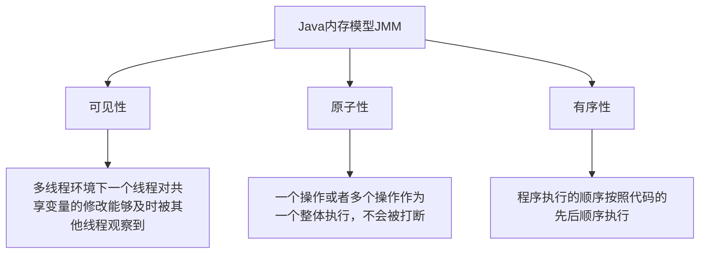

### 1.1 为什么需要JMM？

现代计算机体系结构中，为了提高性能，引入了多级缓存机制，导致多线程环境下共享变量的访问变得复杂。

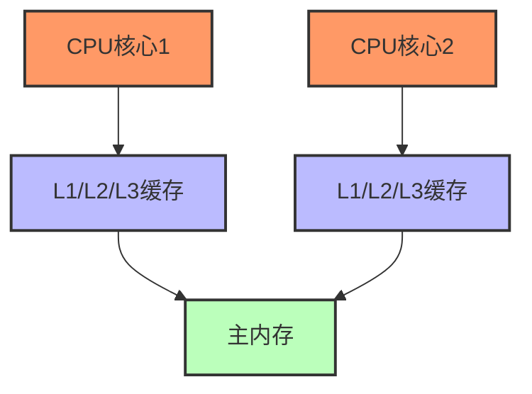

主要挑战：
- **缓存一致性问题**：多个处理器各自的缓存中的值不一致
- **指令重排序**：编译器、处理器可能改变指令执行顺序
- **内存可见性**：一个线程对共享变量的修改不能及时被其他线程看到

## 2. JMM的工作原理

JMM规定了所有变量都存储在主内存中，每个线程都有自己的工作内存。

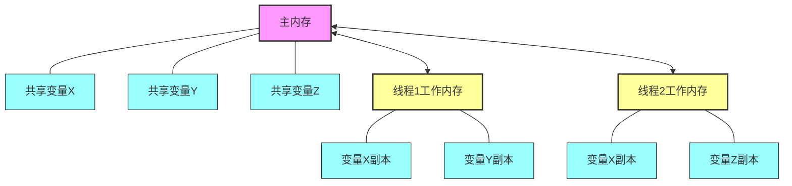

### 2.1 JMM的抽象结构

- **主内存(Main Memory)**：所有线程共享，存储所有变量的主副本
- **工作内存(Working Memory)**：每个线程私有，存储该线程使用的变量的副本
- **线程操作**：线程不能直接操作主内存中的变量，而是先将变量拷贝到工作内存，再对副本进行操作

### 2.2 JMM中的八种原子操作

JMM定义了8种操作来完成主内存与工作内存之间的交互：

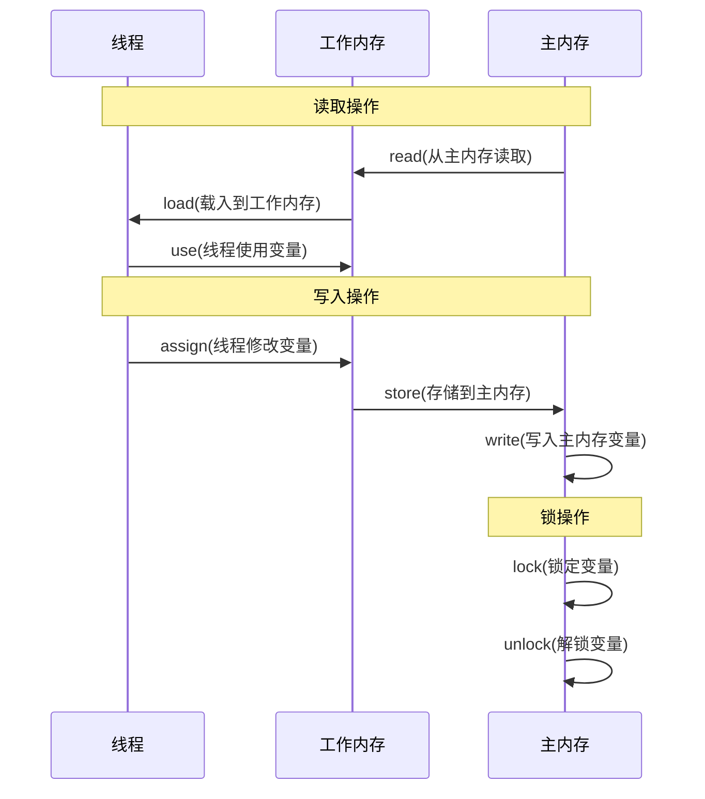

1. **read(读取)**：从主内存读取变量值
2. **load(载入)**：将read操作的值载入工作内存
3. **use(使用)**：线程从工作内存读取变量值
4. **assign(赋值)**：线程向工作内存写入变量值
5. **store(存储)**：工作内存变量写回主内存
6. **write(写入)**：将store操作的值写入主内存
7. **lock(锁定)**：对主内存变量加锁
8. **unlock(解锁)**：对主内存变量解锁

这些操作必须满足一定的规则，例如：
- 不允许read和load、store和write操作单独出现
- 不允许线程丢弃assign操作
- 不允许线程无原因地（没有发生过assign操作）把变量从工作内存同步回主内存

## 3. JMM的三大特性

### 3.1 原子性(Atomicity)

**定义**：一个操作或者多个操作，要么全部执行并且不会被任何因素打断，要么就不执行。


**问题根源**：
- 多线程环境下，线程的切换会导致原子性问题
- 即使简单的 i++ 操作实际包含多个步骤：读取、修改、写入

**解决方案**：
- `synchronized`关键字
- 各种`Lock`实现（如`ReentrantLock`）
- 原子类（如`AtomicInteger`，底层使用CAS操作）

**示例代码**：
```java
// 非原子操作
private int count = 0;
public void increment() {
    count++; // 非原子操作，可能导致线程安全问题
}

// 使用synchronized保证原子性
private int count = 0;
public synchronized void increment() {
    count++; // 使用synchronized保证原子性
}

// 使用原子类
private AtomicInteger count = new AtomicInteger(0);
public void increment() {
    count.incrementAndGet(); // 原子操作
}
```

### 3.2 可见性(Visibility)

**定义**：当一个线程修改了共享变量的值，其他线程能够立即得知这个修改。

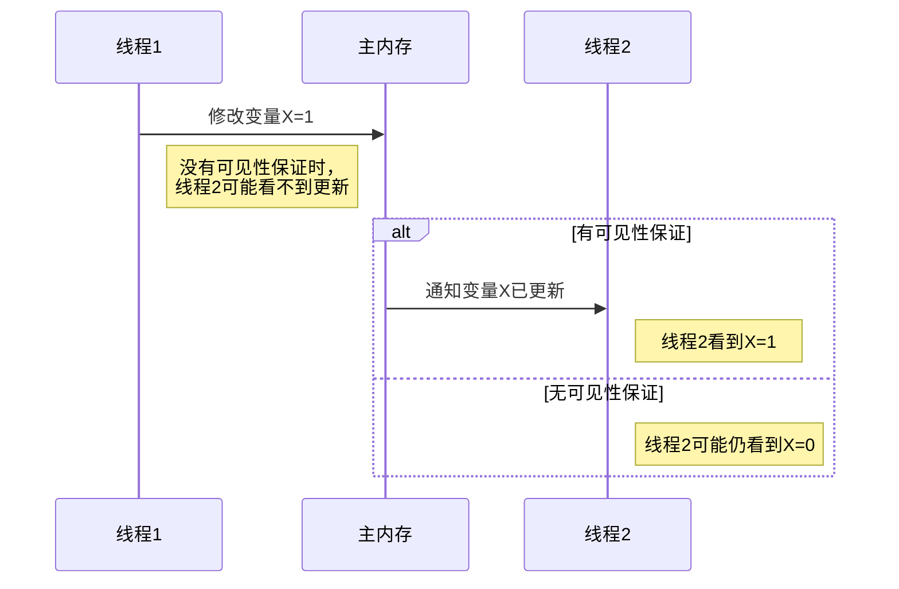

**问题根源**：
- 多级缓存导致的"缓存一致性"问题
- 编译器优化可能导致变量读写不及时刷新到主内存

**解决方案**：
- `volatile`关键字
- `synchronized`关键字
- 各种`Lock`实现
- `final`关键字（一旦初始化完成，对所有线程可见）

**示例代码**：
```java
// 可见性问题
private boolean flag = false;
public void setFlag() {
    flag = true; // 其他线程可能看不到这个更新
}

// 使用volatile保证可见性
private volatile boolean flag = false;
public void setFlag() {
    flag = true; // 所有线程都能看到这个更新
}
```

### 3.3 有序性(Ordering)

**定义**：程序执行的顺序按照代码的先后顺序执行。

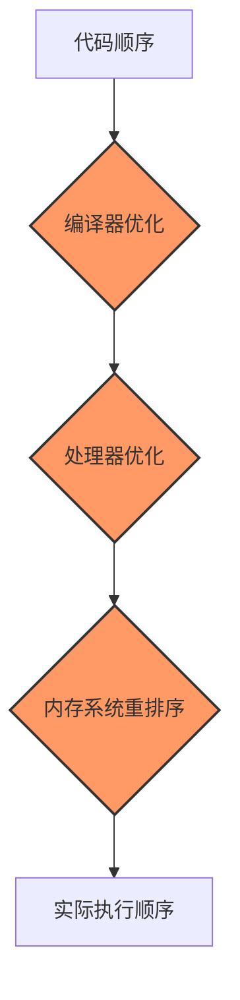

**问题根源**：
- 编译器优化
- 处理器指令重排序
- 内存系统的"重排序"

**指令重排类型**：
- **编译器优化重排**：编译器在不改变单线程程序语义的情况下，重新安排指令顺序
- **处理器重排**：现代处理器采用了乱序执行技术来提高性能
- **内存系统重排**：由于缓存的存在，读写操作的执行顺序可能与实际代码顺序不同

**解决方案**：
- `volatile`关键字（禁止指令重排）
- `synchronized`关键字
- 显式的内存屏障（如`Unsafe.loadFence()`、`Unsafe.storeFence()`）

**示例代码**：
```java
// 指令重排导致的问题
int a = 0;
boolean flag = false;

// 线程1
a = 1;
flag = true;

// 线程2
if (flag) {
    int b = a * a; // 可能看到a=0，因为指令重排可能使flag=true先执行
}

// 使用volatile禁止指令重排
int a = 0;
volatile boolean flag = false;

// 线程1
a = 1; // 写volatile变量之前的操作不会重排到写volatile之后
flag = true;

// 线程2
if (flag) { // 读volatile之后的操作不会重排到读volatile之前
    int b = a * a; // 一定能看到a=1
}
```

## 4. Happens-Before原则

Happens-Before是Java内存模型中的一个重要概念，用于指定两个操作之间的执行顺序。如果操作A Happens-Before操作B，那么操作A的结果对操作B可见，且操作A的执行顺序排在操作B之前。


### 4.1 Happens-Before规则

Java内存模型定义了以下Happens-Before规则：

```mermaid
mindmap
  root((Happens-Before规则))
    程序顺序规则
      ::icon(fa fa-code)
      同一线程中的每个操作都happens-before于该线程中的任意后续操作
    锁规则
      ::icon(fa fa-lock)
      对锁的解锁happens-before于后续对同一锁的加锁
    volatile规则
      ::icon(fa fa-bolt)
      volatile写happens-before于后续对该变量的读
    线程启动规则
      ::icon(fa fa-play)
      Thread.start()的调用happens-before于线程内的任意操作
    线程终止规则
      ::icon(fa fa-stop)
      线程中的所有操作都happens-before于其他线程中对该线程的终止检测
    线程中断规则
      ::icon(fa fa-exclamation-triangle)
      调用线程interrupt()方法happens-before于被中断线程检测到中断事件
    传递性规则
      ::icon(fa fa-exchange)
      如果A happens-before B，且B happens-before C，那么A happens-before C
    对象终结规则
      ::icon(fa fa-trash)
      对象的构造函数执行完毕happens-before于finalize()方法
```

1. **程序顺序规则**：一个线程内，按照代码顺序，书写在前面的操作先行发生于书写在后面的操作。
2. **锁规则**：一个unlock操作先行发生于后面对同一个锁的lock操作。
3. **volatile规则**：对一个volatile变量的写操作先行发生于后面对这个变量的读操作。
4. **线程启动规则**：Thread.start()方法的调用先行发生于被启动线程的任何操作。
5. **线程终止规则**：线程中的所有操作都先行发生于对此线程的终止检测。
6. **线程中断规则**：一个线程调用另一个线程的interrupt()方法，happens-before于被中断线程检测到中断的代码。
7. **传递性规则**：如果A先行发生于B，且B先行发生于C，那么A一定先行发生于C。
8. **对象终结规则**：一个对象的构造函数执行完毕，happens-before于finalize()方法。

### 4.2 Happens-Before示例

```java
// volatile规则示例
class VolatileExample {
    private volatile boolean flag = false;
    private int a = 0;
    
    public void writer() {
        a = 1;          // 1
        flag = true;    // 2 volatile写
    }
    
    public void reader() {
        if (flag) {     // 3 volatile读
            int b = a;  // 4
            // 由于2 happens-before 3，且1 happens-before 2（程序顺序规则）
            // 根据传递性，1 happens-before 4，所以线程reader看到a一定是1
        }
    }
}
```

## 5. volatile关键字详解

volatile是Java提供的最轻量级的同步机制，它保证了变量的可见性和禁止指令重排序。

### 5.1 volatile的内存语义

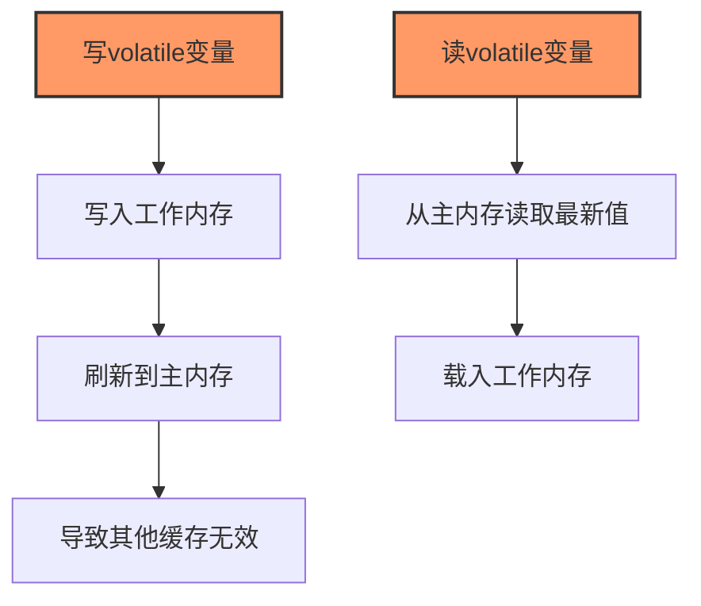

- **写操作**：当写一个volatile变量时，JMM会把该线程工作内存中的所有变量刷新到主内存
- **读操作**：当读一个volatile变量时，JMM会把该线程工作内存中的该变量置为无效，从主内存中读取

### 5.2 volatile的实现原理

**底层实现**：基于内存屏障(Memory Barrier)

编译器和CPU会在volatile变量操作前后插入内存屏障：

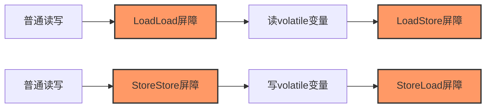

- **StoreStore屏障**：确保volatile写之前，所有普通写操作已完成
- **StoreLoad屏障**：确保volatile写之后，后续volatile读能读到最新值
- **LoadLoad屏障**：确保volatile读之后，所有普通读操作不会重排到volatile读之前
- **LoadStore屏障**：确保volatile读之后，所有普通写操作不会重排到volatile读之前

### 5.3 volatile的适用场景

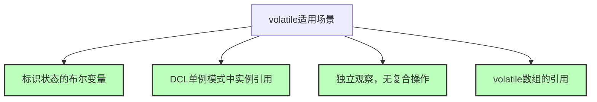

- **状态标志**：使用volatile修饰的布尔值表示状态
- **一次性安全发布(One-time safe publication)**：一个线程修改值，其他线程接收更新值
- **双重检查锁定(DCL)中的单例模式**：防止部分初始化对象引用逸出
- **独立观察**：定期"发布"观察结果供其他线程使用

**不适用场景**：
- 需要原子性的复合操作（如i++）
- 有依赖关系的多个变量操作

**示例代码**：
```java
// 适用场景：状态标志
private volatile boolean shutdownRequested = false;

public void shutdown() {
    shutdownRequested = true;
}

public void doWork() {
    while (!shutdownRequested) {
        // 工作内容
    }
}

// 适用场景：DCL单例
public class Singleton {
    private static volatile Singleton instance;
    
    private Singleton() {}
    
    public static Singleton getInstance() {
        if (instance == null) {
            synchronized (Singleton.class) {
                if (instance == null) {
                    instance = new Singleton();
                }
            }
        }
        return instance;
    }
}
```

## 6. JMM与synchronized

synchronized关键字是Java中的内置锁机制，它提供了互斥访问以及内存可见性保证。

### 6.1 synchronized的内存语义

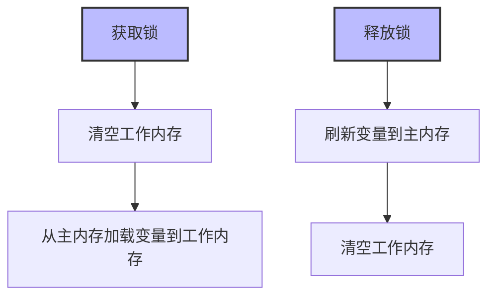

- **进入synchronized块**：把工作内存中的变量清空，从主内存中重新加载
- **退出synchronized块**：把工作内存中的变量刷新到主内存

### 6.2 synchronized的实现原理

synchronized在JVM中的实现依赖于进入和退出管程(Monitor)时的需要的指令：

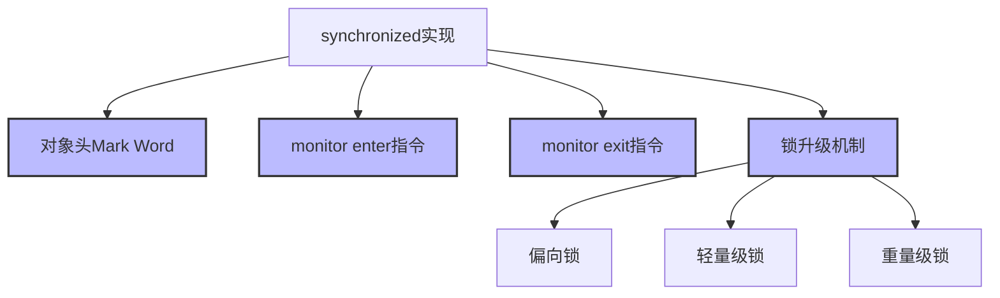

- **对象头**：Java对象头中的Mark Word包含锁信息
- **Monitor**：每个Java对象都可以关联一个Monitor对象
- **字节码指令**：monitorenter和monitorexit
- **锁升级**：偏向锁 → 轻量级锁 → 重量级锁

**锁的状态变化**：

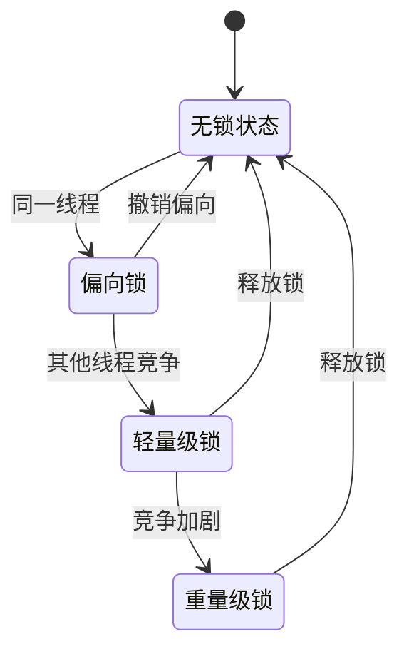

### 6.3 synchronized与volatile的比较

| 特性 | synchronized | volatile |
|------|--------------|----------|
| 原子性 | 支持 | 不支持（仅单个volatile变量的读/写是原子操作）|
| 可见性 | 支持 | 支持 |
| 有序性 | 支持 | 部分支持（禁止指令重排） |
| 锁操作 | 加锁/解锁 | 无锁 |
| 适用场景 | 复合操作、多变量共同约束 | 单一变量可见性、禁止重排序 |
| 性能影响 | 较重（特别是重量级锁） | 较轻 |

## 7. JMM与并发编程实践

### 7.1 线程安全实现方法

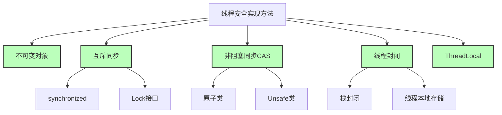

1. **不可变对象**：不可变对象天生线程安全
2. **互斥同步**：使用synchronized或Lock接口实现类
3. **非阻塞同步**：基于CAS(Compare and Swap)操作
4. **线程封闭**：栈封闭、ThreadLocal等
5. **无同步方案**：线程本地存储

### 7.2 共享对象的安全发布

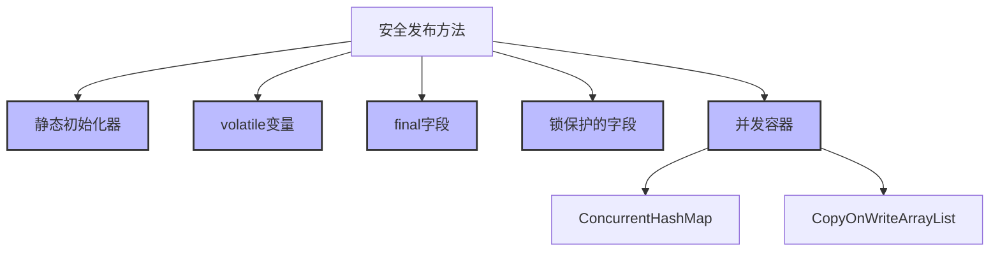

1. **静态初始化器**：在静态初始化器中初始化一个对象引用
2. **volatile变量**：将对象引用存储到volatile变量
3. **final字段**：将对象引用存储到final字段
4. **锁保护**：将对象引用存储到由锁保护的字段
5. **并发容器**：将对象引用存储到线程安全的容器

**示例代码**：
```java
// 静态初始化器
public static final Map<String, Object> SAFE_MAP = Collections.synchronizedMap(new HashMap<>());

// volatile变量
private volatile Object safeObject = new Object();

// final字段
private final Object finalObject = new Object();

// 锁保护
private final Object lock = new Object();
private Object protectedObject;
public void setObject(Object o) {
    synchronized (lock) {
        protectedObject = o;
    }
}

// 并发容器
private final ConcurrentHashMap<String, Object> concurrentMap = new ConcurrentHashMap<>();
```

### 7.3 常见的线程安全问题及解决方案

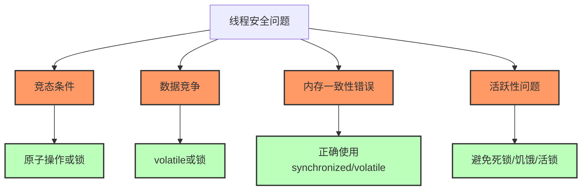

**竞态条件(Race Condition)**：
- 定义：多个线程以非预期的顺序执行，导致错误结果
- 解决：使用原子操作、锁或线程安全集合

**数据竞争(Data Race)**：
- 定义：多个线程同时访问一个内存位置，至少一个是写操作
- 解决：使用volatile或锁

**内存一致性错误**：
- 定义：一个线程看到了另一个线程的"不完整"操作
- 解决：正确使用synchronized、volatile或Happens-Before规则

**活跃性问题**：
- 死锁：两个或多个线程互相等待对方持有的锁
- 饥饿：线程长时间无法获取所需资源
- 活锁：线程不断重试失败的操作

## 8. JDK 17/21中的JMM增强

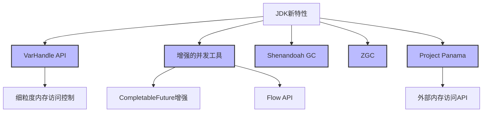

### 8.1 VarHandle API

JDK 9引入的VarHandle API提供了比Unsafe类更安全、更高效的底层内存访问能力。

**VarHandle优势**：
- 支持各种形式的内存访问模式
- 提供比volatile和synchronized更细粒度的内存访问控制
- 支持Plain、Opaque、Release/Acquire、Volatile等访问模式

**示例代码**：
```java
public class VarHandleExample {
    private int x;
    private static final VarHandle VH;
    
    static {
        try {
            VH = MethodHandles.lookup()
                    .findVarHandle(VarHandleExample.class, "x", int.class);
        } catch (Exception e) {
            throw new Error(e);
        }
    }
    
    public void updateX(int value) {
        // volatile写语义
        VH.setVolatile(this, value);
    }
    
    public int readX() {
        // volatile读语义
        return (int) VH.getVolatile(this);
    }
    
    public boolean compareAndSetX(int expected, int update) {
        // CAS操作
        return VH.compareAndSet(this, expected, update);
    }
}
```

### 8.2 默认方法线程安全性

接口默认方法的线程安全性需要特别注意：
- 默认方法可能在多个实现类中被继承
- 默认方法自身通常无法保证线程安全性
- 实现类需要额外考虑线程安全问题

## 9. JMM常见面试题解析

以下是关于Java内存模型的一些常见面试题及解析：

### 9.1 volatile底层如何实现内存可见性？

**答**：volatile通过内存屏障指令实现可见性。JVM在volatile写操作后插入StoreLoad屏障，在读操作前插入LoadLoad屏障。这些屏障保证了：
1. 写volatile变量时，强制将工作内存的值刷新到主内存
2. 读volatile变量时，强制从主内存读取，而不是使用缓存
3. 禁止指令重排序，保证有序性

### 9.2 synchronized和volatile的区别？

**答**：主要区别如下：
- 原子性：synchronized可以保证代码块的原子性；volatile仅能保证单个变量读写的原子性
- 可见性：两者都能保证可见性
- 有序性：两者都能保证有序性，但实现机制不同
- 使用方式：volatile修饰变量；synchronized可以修饰方法或代码块
- 性能影响：volatile轻量；synchronized相对重量
- 适用场景：volatile适用于单个变量的可见性；synchronized适用于复合操作的原子性保证

### 9.3 说一说Happens-Before规则及其应用

**答**：Happens-Before是JMM中定义的内存可见性保证原则，包括：
1. 程序顺序规则：同一线程中的操作按程序顺序执行
2. 锁规则：解锁操作happens-before后续对同一锁的加锁
3. volatile规则：volatile写happens-before后续对该变量的读
4. 线程启动规则：Thread.start()happens-before线程内的操作
5. 传递性：如果A happens-before B，且B happens-before C，那么A happens-before C

应用：程序员利用这些规则可以推断多线程程序中操作的可见性，例如，可以利用volatile写之前的操作对后续volatile读可见的特性进行状态安全发布。

### 9.4 DCL单例模式中为什么要使用volatile？

**答**：在双重检查锁定(DCL)单例模式中，volatile关键字用于防止部分初始化对象引用的发布。

```java
public class Singleton {
    private static volatile Singleton instance;
    
    private Singleton() {}
    
    public static Singleton getInstance() {
        if (instance == null) {
            synchronized (Singleton.class) {
                if (instance == null) {
                    instance = new Singleton(); // 可能发生重排序的地方
                }
            }
        }
        return instance;
    }
}
```

`instance = new Singleton()`这个操作可以分解为三步：
1. 分配内存空间
2. 初始化对象
3. 将引用指向分配的内存

如果没有volatile，可能会发生2和3的重排序，导致其他线程可能看到一个"部分初始化"的对象。使用volatile禁止了这种重排序。

## 10. Java内存模型参考资料

1. [JSR-133: Java内存模型与线程规范](https://jcp.org/en/jsr/detail?id=133)
2. [深入理解Java内存模型](https://www.infoq.cn/article/java-memory-model-1)
3. [《Java并发编程实战》](http://jcip.net/)
4. [Java内存模型FAQ](http://www.cs.umd.edu/~pugh/java/memoryModel/jsr-133-faq.html)
5. [The Java Memory Model](http://jenkov.com/tutorials/java-concurrency/java-memory-model.html)
6. [JMM中文文档](https://github.com/cncounter/translation/blob/master/tiemao_2020/45_jmm/README.md)

---

- [回到首页](../../README.md)