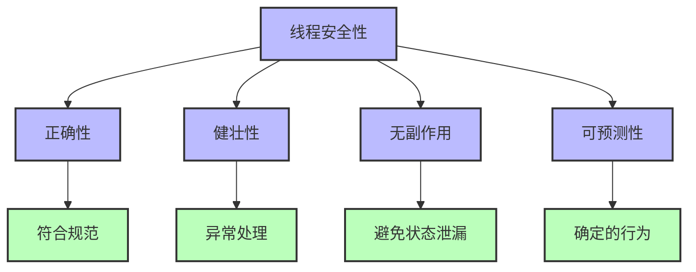
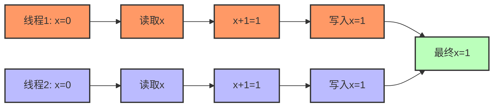
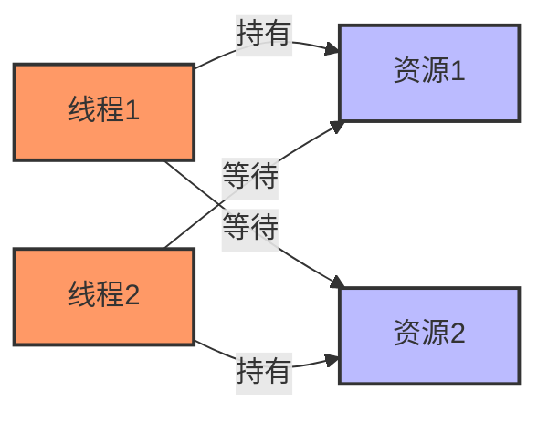
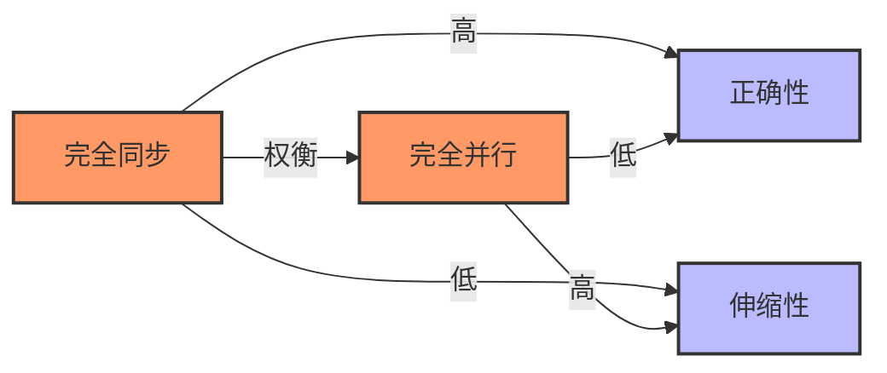

# Java线程安全性详解

## 1. 线程安全的基本概念

线程安全是并发编程中的核心概念，指的是在多线程环境下，代码能够正确地处理共享数据，而不会出现数据损坏或不一致的问题。



### 1.1 线程安全的定义

一个类或方法在多线程环境下满足以下条件时，可以被称为线程安全：

1. **原子性**：操作要么全部执行成功，要么全部不执行
2. **可见性**：一个线程修改数据后，其他线程能够立即看到修改
3. **有序性**：程序执行的顺序与代码编写的顺序一致（不受重排序影响）
4. **无副作用**：不破坏对象的不变性条件

### 1.2 线程不安全的常见表现

线程不安全的代码在并发环境下可能出现以下问题：

- **竞态条件**：多个线程在读写同一数据时，最终结果依赖于线程执行的精确时序
- **数据损坏**：并发修改导致数据结构的内部一致性被破坏
- **活跃性问题**：死锁、活锁、饥饿等导致程序无法继续执行
- **安全性违反**：对象约束条件被破坏，如余额变为负值



上图展示了经典的竞态条件问题，当两个线程同时对x进行递增操作时，期望结果应为2，但实际结果为1。

## 2. 线程安全的实现方式

在Java中，有多种方式可以实现线程安全：

### 2.1 同步机制

#### 2.1.1 synchronized关键字

`synchronized`是Java中最基本的同步机制，它可以用于方法或代码块：

```java
// 同步方法
public synchronized void increment() {
    count++;
}

// 同步代码块
public void increment() {
    synchronized(this) {
        count++;
    }
}

// 静态同步方法 - 锁定类
public static synchronized void incrementStatic() {
    staticCount++;
}
```

**工作原理**：
- 每个对象都有一个内置锁（监视器或Monitor）
- 线程在进入同步块前必须获取锁
- 同一时刻只有一个线程可以持有锁
- 线程退出同步块时释放锁

#### 2.1.2 显式锁（Lock接口）

`java.util.concurrent.locks`包提供了比`synchronized`更灵活的锁实现：

```java
private final Lock lock = new ReentrantLock();
private int count = 0;

public void increment() {
    lock.lock();  // 获取锁
    try {
        count++;
    } finally {
        lock.unlock();  // 确保锁被释放
    }
}
```

**ReentrantLock的优势**：
- 可中断的锁获取
- 可设置超时的锁获取
- 公平性选项
- 条件变量支持
- 非阻塞的获取与释放

#### 2.1.3 读写锁

读写锁允许多个读线程同时访问，但写线程需要独占访问：

```java
private final ReadWriteLock rwLock = new ReentrantReadWriteLock();
private final Lock readLock = rwLock.readLock();
private final Lock writeLock = rwLock.writeLock();
private int data = 0;

public int readData() {
    readLock.lock();
    try {
        return data;
    } finally {
        readLock.unlock();
    }
}

public void writeData(int newData) {
    writeLock.lock();
    try {
        data = newData;
    } finally {
        writeLock.unlock();
    }
}
```

**适用场景**：读多写少的并发访问模式

#### 2.1.4 StampedLock

JDK 8引入的`StampedLock`提供了乐观读取功能，进一步优化读多写少的场景：

```java
private final StampedLock sl = new StampedLock();
private double x, y;

public double distanceFromOrigin() {
    // 乐观读取
    long stamp = sl.tryOptimisticRead();
    double curX = x, curY = y;
    
    // 检查读取期间是否有写操作
    if (!sl.validate(stamp)) {
        // 退化为悲观读锁
        stamp = sl.readLock();
        try {
            curX = x;
            curY = y;
        } finally {
            sl.unlockRead(stamp);
        }
    }
    
    return Math.sqrt(curX * curX + curY * curY);
}

public void moveToOrigin(double newX, double newY) {
    long stamp = sl.writeLock();
    try {
        x = newX;
        y = newY;
    } finally {
        sl.unlockWrite(stamp);
    }
}
```

### 2.2 原子变量

`java.util.concurrent.atomic`包提供了对单个变量的原子操作支持：

```java
private AtomicInteger counter = new AtomicInteger(0);

public void increment() {
    counter.incrementAndGet();  // 原子递增
}

public int getAndReset() {
    return counter.getAndSet(0);  // 原子性获取并设置新值
}
```

**核心原子类**：
- `AtomicBoolean`、`AtomicInteger`、`AtomicLong`
- `AtomicReference<V>`
- `AtomicIntegerArray`、`AtomicLongArray`、`AtomicReferenceArray<V>`
- `DoubleAdder`、`LongAdder` - 高并发递增性能更好

**实现原理**：
- 基于CAS（Compare-And-Swap）操作
- 硬件级原子指令支持
- 非阻塞算法

### 2.3 不可变对象

不可变对象天生线程安全，因为其状态在创建后不可修改：

```java
public final class ImmutablePoint {
    private final int x;
    private final int y;
    
    public ImmutablePoint(int x, int y) {
        this.x = x;
        this.y = y;
    }
    
    public int getX() { return x; }
    public int getY() { return y; }
    
    public ImmutablePoint translate(int dx, int dy) {
        return new ImmutablePoint(x + dx, y + dy);  // 创建新对象
    }
}
```

**创建不可变类的规则**：
1. 所有字段都是`final`
2. 类被声明为`final`（防止子类破坏不可变性）
3. 不提供修改状态的方法
4. 所有可变字段都是私有的
5. 确保对可变组件的独占访问

### 2.4 线程封闭

线程封闭是避免共享的技术，确保数据只能被单一线程访问：

#### 2.4.1 局部变量

方法内的局部变量只属于执行该方法的线程：

```java
public void processSomething() {
    // count只在当前线程的栈中可见
    int count = 0;
    for (int i = 0; i < 100; i++) {
        count++;
    }
    System.out.println("Final count: " + count);
}
```

#### 2.4.2 ThreadLocal

`ThreadLocal`允许每个线程拥有变量的独立副本：

```java
private static final ThreadLocal<SimpleDateFormat> dateFormatter = 
    ThreadLocal.withInitial(() -> new SimpleDateFormat("yyyy-MM-dd"));

public String formatDate(Date date) {
    // 每个线程有自己的SimpleDateFormat实例
    return dateFormatter.get().format(date);
}
```

**注意事项**：
- 在使用线程池时，需要确保正确清理`ThreadLocal`变量
- JDK 8引入的`ThreadLocal.withInitial`简化了初始化
- 当前线程执行结束时，记得调用`remove()`方法避免潜在的内存泄漏

### 2.5 并发容器

JDK提供了专为并发环境设计的容器类：

```java
// 线程安全的List
List<String> syncList = Collections.synchronizedList(new ArrayList<>());
List<String> concurrentList = new CopyOnWriteArrayList<>();

// 线程安全的Map
Map<String, Integer> syncMap = Collections.synchronizedMap(new HashMap<>());
Map<String, Integer> concurrentMap = new ConcurrentHashMap<>();

// 线程安全的Set
Set<String> syncSet = Collections.synchronizedSet(new HashSet<>());
Set<String> concurrentSet = new CopyOnWriteArraySet<>();

// 线程安全的队列
Queue<Task> blockingQueue = new LinkedBlockingQueue<>();
Queue<Task> concurrentQueue = new ConcurrentLinkedQueue<>();
```

**常用并发容器**：
- `ConcurrentHashMap` - 高并发、分段锁实现的Map
- `CopyOnWriteArrayList` - 适用于读多写少场景
- `BlockingQueue` 家族 - 支持生产者-消费者模式
  - `ArrayBlockingQueue` - 有界队列
  - `LinkedBlockingQueue` - 可选有界队列
  - `PriorityBlockingQueue` - 优先级队列
  - `DelayQueue` - 延迟元素队列

## 3. 常见的线程安全问题及解决方案

### 3.1 竞态条件

当多个线程同时修改共享数据，最终结果依赖于线程执行顺序时，会发生竞态条件。

**示例**：银行转账

```java
// 线程不安全版本
public void transfer(Account from, Account to, double amount) {
    if (from.getBalance() >= amount) {
        from.debit(amount);
        to.credit(amount);
    }
}

// 线程安全版本
public void transferSafe(Account from, Account to, double amount) {
    // 避免死锁：按固定顺序获取锁
    Account first = from.getId() < to.getId() ? from : to;
    Account second = from.getId() < to.getId() ? to : from;
    
    synchronized(first) {
        synchronized(second) {
            if (from.getBalance() >= amount) {
                from.debit(amount);
                to.credit(amount);
            }
        }
    }
}
```

**解决方案**：
- 使用锁或同步机制
- 使用原子操作
- 避免共享或使用不可变数据

### 3.2 死锁

当两个或多个线程永久等待对方持有的资源时，会发生死锁。



**示例**：

```java
public void methodA() {
    synchronized(lockA) {
        // 做一些工作
        synchronized(lockB) {
            // 使用两个锁的资源
        }
    }
}

public void methodB() {
    synchronized(lockB) {
        // 做一些工作
        synchronized(lockA) {
            // 使用两个锁的资源
        }
    }
}
```

**解决方案**：
1. **锁排序**：按照固定顺序获取锁
2. **锁超时**：使用`tryLock()`方法设定超时时间
3. **死锁检测**：使用工具检测死锁并恢复
4. **避免嵌套锁**：尽量避免在持有一个锁的同时获取另一个锁

### 3.3 活锁

线程不断响应对方的动作，但都无法继续执行，形成活锁。类似于两个人在走廊相遇时互相礼让，但双方一直左右摆动导致无法通过。

**解决方案**：
- 引入随机因素
- 退避策略（指数退避）
- 优先级设置

### 3.4 线程饥饿

高优先级线程不断抢占资源，导致低优先级线程无法获得足够的CPU时间而无法向前推进。

**解决方案**：
- 公平锁（`ReentrantLock(true)`）
- 带超时的等待
- 适当优先级设置

## 4. 线程安全设计技巧

### 4.1 最小化同步范围

缩小同步代码块的范围，减少锁竞争：

```java
// 不好的实践
public synchronized void processBigTask() {
    // 准备工作（不需要同步）
    prepareData();
    
    // 访问共享数据（需要同步）
    updateSharedData();
    
    // 后处理（不需要同步）
    postProcess();
}

// 好的实践
public void processBigTaskBetter() {
    // 准备工作（不需要同步）
    prepareData();
    
    // 只同步必要的部分
    synchronized(this) {
        updateSharedData();
    }
    
    // 后处理（不需要同步）
    postProcess();
}
```

### 4.2 避免过度同步

过度同步可能导致性能问题和死锁风险：

```java
// 危险模式：在同步块中调用外部方法
public synchronized void synchronizedMethod() {
    // 这可能导致死锁或性能问题
    listener.onEvent(new Event("something happened"));
}

// 更好的方式：先复制需要的数据，再在同步块外执行回调
public void betterApproach() {
    // 创建事件的副本
    Event event;
    synchronized(this) {
        event = new Event("something happened");
    }
    
    // 在同步块外调用可能耗时的方法
    listener.onEvent(event);
}
```

### 4.3 慎用容器的复合操作

即使使用线程安全的容器，复合操作也可能不安全：

```java
// 线程不安全的复合操作
public void removeIfExists(ConcurrentHashMap<String, Data> map, String key) {
    if (map.containsKey(key)) {  // 检查
        map.remove(key);         // 删除
    }
}

// 线程安全的方式
public void removeIfExistsSafe(ConcurrentHashMap<String, Data> map, String key) {
    // 原子的"若存在则删除"操作
    map.remove(key, map.get(key));
}
```

### 4.4 优先使用高级并发工具

优先使用更高级别的并发工具，而非底层同步：

```java
// 不推荐：手动实现复杂同步逻辑
public void complexSynchronizationLogic() {
    synchronized(lock) {
        while (!condition) {
            try {
                lock.wait();
            } catch (InterruptedException e) {
                Thread.currentThread().interrupt();
            }
        }
        // 执行操作
        condition = false;
        lock.notifyAll();
    }
}

// 推荐：使用现成的并发工具
private final Semaphore semaphore = new Semaphore(1);

public void simplifiedWithConcurrencyTools() {
    try {
        semaphore.acquire();
        // 执行操作
    } catch (InterruptedException e) {
        Thread.currentThread().interrupt();
    } finally {
        semaphore.release();
    }
}
```

### 4.5 理解并发性和可伸缩性之间的权衡

更多的同步可能提高正确性，但会降低可伸缩性：



**权衡决策**：
- 在核心功能中优先考虑正确性
- 在性能关键路径上小心优化并发性
- 考虑不同的并发策略（如粗粒度锁vs细粒度锁）
- 测量实际性能，而不是猜测

## 5. 线程安全性文档化

明确记录类或方法的线程安全性承诺：

```java
/**
 * 这个类是线程安全的。所有公共方法都使用内部锁同步。
 */
public class ThreadSafeClass {
    // 实现...
}

/**
 * 这个类不是线程安全的。调用者必须提供自己的同步机制。
 */
public class NotThreadSafeClass {
    // 实现...
}

/**
 * 这个类是有条件线程安全的。
 * 单独的方法是线程安全的，但某些方法序列可能需要外部同步。
 */
public class ConditionallyThreadSafeClass {
    // 实现...
}
```

**线程安全性级别**：
1. **不可变**：实例创建后状态不变
2. **线程安全**：所有公共方法都是同步的
3. **有条件线程安全**：某些方法序列需要外部同步
4. **非线程安全**：客户端负责同步
5. **线程对立**：即使外部同步也不安全

---

[下一部分：高级线程安全技术](./ThreadSafety2.md)

- [回到JMM目录](./README.md)
- [回到首页](../../README.md) 