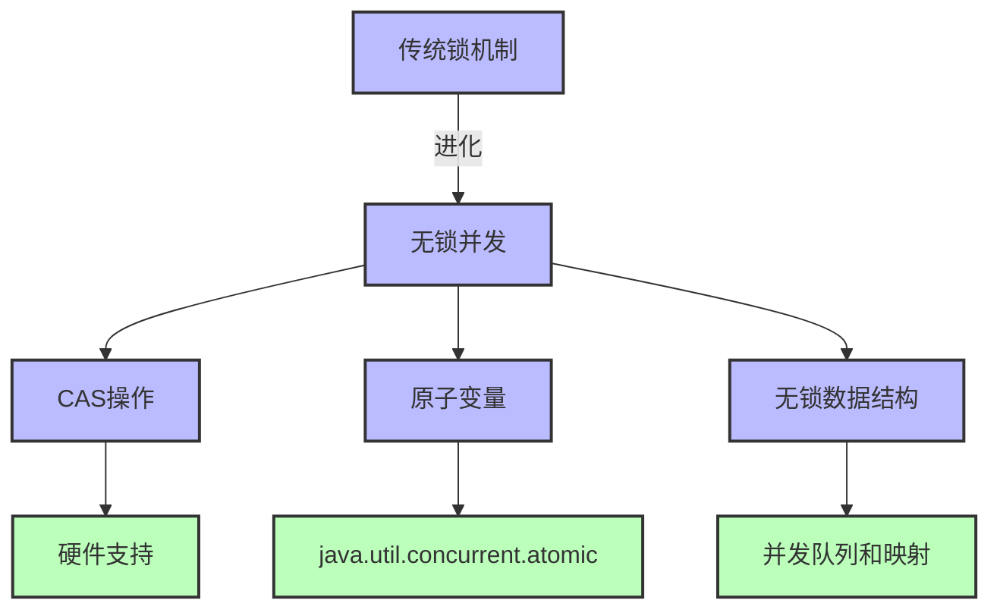
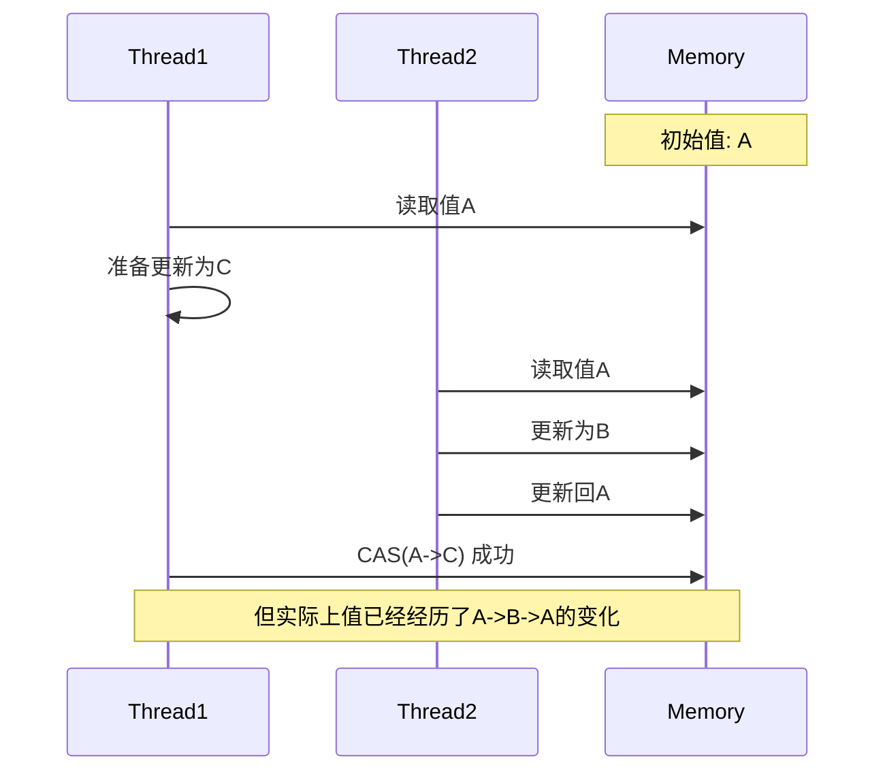
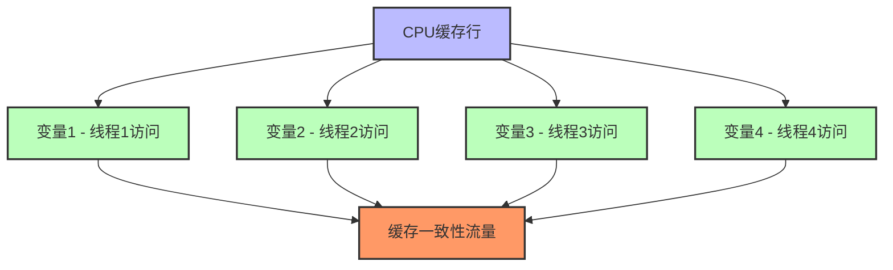

# Java线程安全高级技术

## 1. 无锁并发编程

无锁并发（Lock-Free Concurrency）是一种高级线程安全策略，通过非阻塞算法实现线程安全，避免了传统锁机制带来的性能开销和死锁风险。



### 1.1 CAS操作原理

Compare-And-Swap (CAS) 是实现无锁算法的基础，它是一种原子操作，包含三个操作数：

1. **内存位置/变量** (V)
2. **预期的原值** (A)
3. **新值** (B)

执行流程：仅当变量V的当前值等于预期值A时，才会将V设置为新值B。

```java
// 伪代码表示CAS操作
boolean compareAndSet(Variable V, Value A, Value B) {
    atomic {
        if (V == A) {
            V = B;
            return true;
        } else {
            return false;
        }
    }
}
```

在Java中，CAS操作通过`sun.misc.Unsafe`类的本地方法实现：

```java
// 实际上，原子类内部使用类似这样的代码
private static final Unsafe unsafe = Unsafe.getUnsafe();
private static final long valueOffset;

static {
    try {
        valueOffset = unsafe.objectFieldOffset
            (AtomicInteger.class.getDeclaredField("value"));
    } catch (Exception ex) { throw new Error(ex); }
}

private volatile int value;

public final boolean compareAndSet(int expect, int update) {
    return unsafe.compareAndSwapInt(this, valueOffset, expect, update);
}
```

### 1.2 原子变量类

Java在`java.util.concurrent.atomic`包中提供了多种原子变量类，它们都基于CAS操作实现：

```java
// 使用AtomicInteger实现计数器
private AtomicInteger counter = new AtomicInteger(0);

public void increment() {
    counter.incrementAndGet();
}

public int getAndReset() {
    return counter.getAndSet(0);
}
```

**延伸类**：

1. **基本类型原子类**：
   - `AtomicBoolean`, `AtomicInteger`, `AtomicLong`

2. **引用类型原子类**：
   - `AtomicReference<V>`
   - `AtomicStampedReference<V>` - 解决ABA问题
   - `AtomicMarkableReference<V>` - 带标记的引用

3. **数组原子类**：
   - `AtomicIntegerArray`, `AtomicLongArray`, `AtomicReferenceArray<V>`

4. **字段更新器**：
   - `AtomicIntegerFieldUpdater<T>`, `AtomicLongFieldUpdater<T>`, `AtomicReferenceFieldUpdater<T,V>`

5. **高并发累加器**：
   - `DoubleAdder`, `LongAdder` - 比原子变量有更好的并发性能
   - `DoubleAccumulator`, `LongAccumulator` - 支持定制累加函数

### 1.3 ABA问题与解决方案

ABA问题是无锁算法中常见的问题，指的是一个值从A变成B，又变回A，使得CAS操作无法检测到这个变化过程。



**解决方案**：使用带版本号的原子引用

```java
// 使用AtomicStampedReference解决ABA问题
private AtomicStampedReference<Node> top = new AtomicStampedReference<>(null, 0);

public void push(E value) {
    Node newHead = new Node(value);
    Node oldHead;
    int stamp;
    do {
        stamp = top.getStamp();
        oldHead = top.getReference();
        newHead.next = oldHead;
    } while (!top.compareAndSet(oldHead, newHead, stamp, stamp + 1));
}

public E pop() {
    Node oldHead;
    Node newHead;
    int stamp;
    do {
        stamp = top.getStamp();
        oldHead = top.getReference();
        if (oldHead == null) {
            return null;
        }
        newHead = oldHead.next;
    } while (!top.compareAndSet(oldHead, newHead, stamp, stamp + 1));
    
    return oldHead.value;
}
```

### 1.4 无锁数据结构

无锁数据结构是使用CAS和其他无锁技术构建的高并发容器，可以在不使用互斥锁的情况下实现线程安全：

#### 1.4.1 ConcurrentLinkedQueue

一个高性能的无边界无锁并发队列，基于Michael-Scott算法实现：

```java
// 使用ConcurrentLinkedQueue实现工作队列
ConcurrentLinkedQueue<Task> taskQueue = new ConcurrentLinkedQueue<>();

// 生产者
public void addTask(Task task) {
    taskQueue.offer(task);
}

// 消费者
public Task getTask() {
    return taskQueue.poll();
}
```

#### 1.4.2 无锁算法设计技巧

1. **使用不变性**：
   - 设计节点不可变，更新引用而非修改节点
   - 使用copy-on-write策略

2. **原子更新多个相关字段**：
   - 将多个字段打包成一个对象
   - 使用AtomicReference更新整个对象

3. **处理部分失败**：
   - 幂等操作设计
   - 优雅处理CAS失败

## 2. 性能优化技术

线程安全实现的性能优化是并发编程中的重要考量，通过减少锁竞争和提高缓存利用率可以显著提升性能。

### 2.1 锁分段技术

锁分段是减少锁竞争的有效策略，将一个大的资源拆分成多个小段，每段使用独立的锁：

```java
// 简化版锁分段哈希表实现
public class StripedMap<K, V> {
    private static final int SEGMENTS = 16; // 分段数
    
    private final Node<K, V>[] buckets;
    private final Object[] locks;
    
    @SuppressWarnings("unchecked")
    public StripedMap(int capacity) {
        buckets = (Node<K, V>[]) new Node[capacity];
        locks = new Object[SEGMENTS];
        for (int i = 0; i < SEGMENTS; i++) {
            locks[i] = new Object();
        }
    }
    
    private int hash(Object key) {
        return Math.abs(key.hashCode() % buckets.length);
    }
    
    private int lockIndex(int hash) {
        return hash % SEGMENTS;
    }
    
    public V get(K key) {
        int hash = hash(key);
        synchronized (locks[lockIndex(hash)]) {
            for (Node<K, V> n = buckets[hash]; n != null; n = n.next) {
                if (n.key.equals(key)) {
                    return n.value;
                }
            }
        }
        return null;
    }
    
    public V put(K key, V value) {
        int hash = hash(key);
        synchronized (locks[lockIndex(hash)]) {
            Node<K, V> first = buckets[hash];
            for (Node<K, V> n = first; n != null; n = n.next) {
                if (n.key.equals(key)) {
                    V oldValue = n.value;
                    n.value = value;
                    return oldValue;
                }
            }
            buckets[hash] = new Node<>(key, value, first);
            return null;
        }
    }
    
    private static class Node<K, V> {
        final K key;
        V value;
        Node<K, V> next;
        
        Node(K key, V value, Node<K, V> next) {
            this.key = key;
            this.value = value;
            this.next = next;
        }
    }
}
```

**ConcurrentHashMap的实现**：

JDK 7中的ConcurrentHashMap使用了Segment数组实现分段锁，每个Segment独立加锁。

JDK 8重新设计了ConcurrentHashMap，抛弃了Segment，改用Node数组+CAS+synchronized实现更细粒度的锁控制。

### 2.2 避免伪共享

伪共享（False Sharing）是多核CPU系统中的一个性能问题，当多个线程频繁修改位于同一CPU缓存行的不同变量时会发生：



**解决方案**：使用缓存行填充

```java
// 使用填充防止伪共享
public final class PaddedAtomicLong extends AtomicLong {
    // 缓存行通常为64字节
    private long p1, p2, p3, p4, p5, p6, p7; // 前填充
    
    public PaddedAtomicLong(long initialValue) {
        super(initialValue);
    }
    
    public PaddedAtomicLong() {
        super();
    }
    
    // long消费7个long空间
    private long q1, q2, q3, q4, q5, q6, q7; // 后填充
}
```

**Java 8的@Contended注解**：

从Java 8开始，可以使用`@sun.misc.Contended`注解实现缓存行填充（需要JVM参数`-XX:-RestrictContended`）：

```java
@sun.misc.Contended
public class ContendedCounter {
    private volatile long count = 0;
    
    public void increment() {
        count++;
    }
    
    public long getCount() {
        return count;
    }
}
```

### 2.3 避免过度同步

在同步块中调用外部方法可能导致死锁和性能问题，尤其是调用不受控制的代码：

```java
// 危险的同步模式
private final List<Listener> listeners = new CopyOnWriteArrayList<>();

public synchronized void performAction() {
    // 核心操作
    action();
    
    // 危险操作：在持有锁的同时调用外部代码
    for (Listener listener : listeners) {
        listener.onAction(); // 可能长时间运行或死锁
    }
}

// 改进的同步模式
public void performActionSafe() {
    // 在同步块中执行必要的操作
    synchronized(this) {
        action();
    }
    
    // 复制引用，在同步块外调用监听器
    List<Listener> listenersCopy = new ArrayList<>(listeners);
    for (Listener listener : listenersCopy) {
        listener.onAction();
    }
}
```

### 2.4 并发优化策略

1. **减少锁持有时间**：
   - 仅锁定必要的代码段
   - 提前准备数据，延迟处理结果

2. **减小锁粒度**：
   - 使用分段锁
   - 锁不同的对象

3. **使用替代方案**：
   - 无锁数据结构
   - 乐观并发控制
   - 线程封闭

4. **非阻塞算法**：
   - 使用CAS操作
   - 使用原子变量

## 3. 线程池优化

线程池是并发应用程序的核心组件，需要针对特定工作负载进行优化：

### 3.1 线程池配置策略

根据任务特性选择合适的线程池配置：

```java
// IO密集型任务
int ioThreads = Runtime.getRuntime().availableProcessors() * 2;
ExecutorService ioExecutor = Executors.newFixedThreadPool(ioThreads);

// CPU密集型任务
int cpuThreads = Runtime.getRuntime().availableProcessors();
ExecutorService cpuExecutor = Executors.newFixedThreadPool(cpuThreads);

// 混合工作负载的自定义线程池
ThreadPoolExecutor customExecutor = new ThreadPoolExecutor(
    corePoolSize,              // 核心线程数
    maximumPoolSize,           // 最大线程数
    keepAliveTime,             // 空闲线程保持时间
    TimeUnit.SECONDS,          // 时间单位
    new LinkedBlockingQueue<>(queueCapacity), // 工作队列
    new CustomThreadFactory(), // 线程工厂
    new CallerRunsPolicy()     // 拒绝策略
);
```

**线程池监控与调整**：

```java
// 扩展ThreadPoolExecutor以收集执行统计信息
public class MonitoredThreadPoolExecutor extends ThreadPoolExecutor {
    private final AtomicLong tasksCompleted = new AtomicLong();
    private final AtomicLong totalTaskTime = new AtomicLong();
    private final ConcurrentHashMap<Runnable, Long> startTimes = new ConcurrentHashMap<>();
    
    // 构造器...
    
    @Override
    protected void beforeExecute(Thread t, Runnable r) {
        startTimes.put(r, System.nanoTime());
        super.beforeExecute(t, r);
    }
    
    @Override
    protected void afterExecute(Runnable r, Throwable t) {
        super.afterExecute(r, t);
        
        long startTime = startTimes.remove(r);
        long endTime = System.nanoTime();
        
        tasksCompleted.incrementAndGet();
        totalTaskTime.addAndGet(endTime - startTime);
    }
    
    public double getAverageTaskTime() {
        long completed = tasksCompleted.get();
        return completed == 0 ? 0 : (double)totalTaskTime.get() / completed / 1_000_000.0;
    }
    
    // 其他监控方法...
}
```

### 3.2 工作窃取策略

Fork/Join框架使用工作窃取算法，适用于计算密集型的递归分解任务：

```java
// 使用Fork/Join框架的工作窃取线程池
ForkJoinPool forkJoinPool = new ForkJoinPool(
    Runtime.getRuntime().availableProcessors(),
    ForkJoinPool.defaultForkJoinWorkerThreadFactory,
    null,
    true  // 异步模式
);

// 计算数组元素和的任务
class SumTask extends RecursiveTask<Long> {
    private final long[] array;
    private final int start;
    private final int end;
    private static final int THRESHOLD = 10_000;
    
    // 构造器...
    
    @Override
    protected Long compute() {
        int length = end - start;
        if (length <= THRESHOLD) {
            // 小任务直接计算
            return computeDirectly();
        }
        
        // 拆分成小任务并行执行
        int mid = start + length / 2;
        SumTask leftTask = new SumTask(array, start, mid);
        SumTask rightTask = new SumTask(array, mid, end);
        
        leftTask.fork();  // 异步执行左任务
        long rightResult = rightTask.compute();  // 直接执行右任务
        long leftResult = leftTask.join();  // 等待左任务结果
        
        return leftResult + rightResult;
    }
    
    private long computeDirectly() {
        long sum = 0;
        for (int i = start; i < end; i++) {
            sum += array[i];
        }
        return sum;
    }
}
```

### 3.3 虚拟线程的应用

从JDK 21开始，虚拟线程成为实现高并发IO的首选方案：

```java
// 创建虚拟线程
Thread vThread = Thread.ofVirtual().start(() -> {
    System.out.println("Running in a virtual thread");
});

// 使用虚拟线程执行器
try (var executor = Executors.newVirtualThreadPerTaskExecutor()) {
    // 提交大量任务，每个任务都在独立的虚拟线程中执行
    for (int i = 0; i < 10_000; i++) {
        int taskId = i;
        executor.submit(() -> {
            // 执行IO阻塞操作
            try {
                Thread.sleep(100); // 模拟IO
                System.out.println("Task " + taskId + " completed");
            } catch (InterruptedException e) {
                Thread.currentThread().interrupt();
            }
            return taskId;
        });
    }
    // executor自动关闭并等待所有任务完成
}
```

## 4. 实际案例：高性能缓存实现

下面是一个综合使用无锁并发和性能优化技术的线程安全缓存实现示例：

```java
public class ConcurrentCache<K, V> {
    private final ConcurrentHashMap<K, V> cache = new ConcurrentHashMap<>();
    private final ConcurrentHashMap<K, Future<V>> futures = new ConcurrentHashMap<>();
    private final Function<K, V> computeFunction;
    
    public ConcurrentCache(Function<K, V> computeFunction) {
        this.computeFunction = computeFunction;
    }
    
    public V get(K key) throws InterruptedException, ExecutionException {
        // 首先检查缓存是否已有值
        V value = cache.get(key);
        if (value != null) {
            return value;
        }
        
        // 创建计算任务
        FutureTask<V> futureTask = new FutureTask<>(() -> {
            V newValue = computeFunction.apply(key);
            cache.put(key, newValue);
            return newValue;
        });
        
        // 尝试放入futures映射，如果已存在则使用现有的Future
        Future<V> future = futures.putIfAbsent(key, futureTask);
        if (future == null) {
            // 我们的FutureTask被接受，执行计算
            future = futureTask;
            futureTask.run();
        }
        
        // 等待结果
        try {
            return future.get();
        } finally {
            // 计算完成后从futures移除
            futures.remove(key, future);
        }
    }
    
    public void invalidate(K key) {
        cache.remove(key);
    }
    
    public void clear() {
        cache.clear();
        futures.clear();
    }
}
```

**核心设计特点**：

1. **使用ConcurrentHashMap**：实现高并发读写的主存储
2. **避免重复计算**：使用Future防止缓存击穿
3. **无阻塞查询**：已缓存值的获取完全无锁
4. **延迟计算**：仅在需要时计算值
5. **自动缓存**：计算完成后自动更新缓存

## 5. Java 21及未来版本中的线程安全增强

Java不断发展，新版本中引入了多项提升线程安全性和性能的特性：

### 5.1 Project Loom - 虚拟线程

JDK 21正式引入了虚拟线程，为高并发IO密集型应用提供了更简单的编程模型：

```java
// 使用虚拟线程执行HTTP请求
void processRequests(List<URI> uris) throws Exception {
    try (var executor = Executors.newVirtualThreadPerTaskExecutor()) {
        List<Future<String>> futures = uris.stream()
            .map(uri -> executor.submit(() -> fetchUri(uri)))
            .toList();
        
        for (Future<String> future : futures) {
            // 处理每个响应
            processResponse(future.get());
        }
    }
}

String fetchUri(URI uri) throws Exception {
    HttpClient client = HttpClient.newHttpClient();
    HttpRequest request = HttpRequest.newBuilder(uri).build();
    HttpResponse<String> response = client.send(request, HttpResponse.BodyHandlers.ofString());
    return response.body();
}
```

### 5.2 Structured Concurrency

JDK 21/22中的结构化并发API简化了并发任务的生命周期管理和错误处理：

```java
// 使用结构化并发API
record UserData(User user, Profile profile, Settings settings) {}

UserData loadUserData(String userId) throws ExecutionException, InterruptedException {
    try (var scope = new StructuredTaskScope.ShutdownOnFailure()) {
        Future<User> userFuture = scope.fork(() -> fetchUser(userId));
        Future<Profile> profileFuture = scope.fork(() -> fetchProfile(userId));
        Future<Settings> settingsFuture = scope.fork(() -> fetchSettings(userId));
        
        // 等待所有任务完成或任一任务失败
        scope.join();
        // 如有任务失败则抛出异常
        scope.throwIfFailed();
        
        // 所有任务成功，返回结果
        return new UserData(
            userFuture.resultNow(),
            profileFuture.resultNow(),
            settingsFuture.resultNow()
        );
    }
}
```

## 6. 总结与最佳实践

高级线程安全技术需要深入理解并发原理，并根据特定场景选择合适的策略：

### 6.1 技术选择指南

| 场景 | 推荐技术 |
|------|---------|
| 读多写少 | CopyOnWriteArrayList, ReadWriteLock, StampedLock |
| 高频修改 | LongAdder, AtomicLong, 分段锁 |
| 复杂状态更新 | Synchronized，显式锁，不可变状态 |
| 高并发队列 | ConcurrentLinkedQueue, LinkedBlockingQueue |
| 计算密集型并行 | Fork/Join框架, 并行流 |
| IO密集型并发 | 虚拟线程, CompletableFuture |

### 6.2 性能测试与调优

线程安全实现必须通过基准测试验证性能：

```java
// 使用JMH进行基准测试
@BenchmarkMode(Mode.Throughput)
@OutputTimeUnit(TimeUnit.MICROSECONDS)
@State(Scope.Benchmark)
public class ConcurrentMapBenchmark {
    private ConcurrentHashMap<Integer, String> concurrentMap;
    private StripedMap<Integer, String> stripedMap;
    // 初始化...
    
    @Benchmark
    public String concurrentHashMapGet() {
        return concurrentMap.get(ThreadLocalRandom.current().nextInt(1000));
    }
    
    @Benchmark
    public String stripedMapGet() {
        return stripedMap.get(ThreadLocalRandom.current().nextInt(1000));
    }
    
    // 更多测试方法...
}
```

### 6.3 并发编程的未来趋势

1. **更高层次的抽象**：结构化并发，声明式并发API
2. **硬件感知算法**：利用特定CPU架构特性
3. **自适应并发**：基于运行时反馈调整并发策略
4. **虚拟线程生态系统**：围绕轻量级线程的新模式和库
5. **线程安全类型系统**：编译时检测并发问题

---

[回到线程安全性基础](./ThreadSafety.md)

- [回到JMM目录](./README.md)
- [回到首页](../../README.md) 