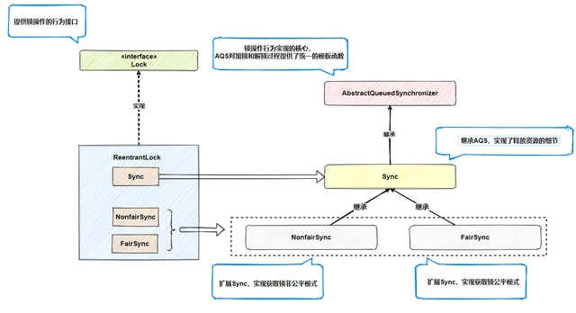
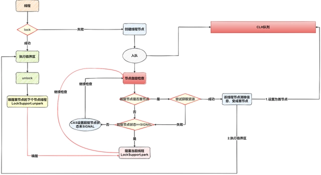

# ReentrantLock
  - ReentrantLock是可重入的互斥锁，虽然具有与synchronized相同功能，但是会比synchronized更加灵活（具有更多的方法）。ReentrantLock底层基于AQS(AbstractQueuedSynchronizer)实现.
  - ReentrantLock默认是使用非公平策略，如果想指定模式，可以通过入参fair来选择
  - ReentrantLock整体结构组成如下：
  

## AQS
 - AQS流程图
  

## 参考资料
  - [通俗易懂的ReentrantLock](https://baijiahao.baidu.com/s?id=1702822534980452383&wfr=spider&for=pc)

---
 - [返回首页](../../../README.md)