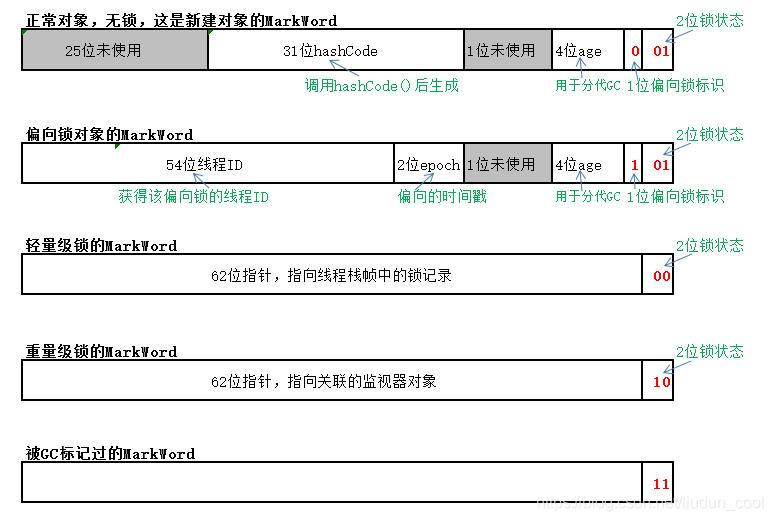

# synchronized

## synchronized锁升级过程
  - 从以前的加锁就是重量级锁优化成了有一个锁升级的过程
    - 无锁(初创建)->偏向锁(1个线程)->轻量级锁(2个线程)->重量级锁(>2个线程)。
  -  1.初期锁对象刚创建时，还没有任何线程来竞争，对象的Mark Word是下图的第一种情形，这偏向锁标识位是0，锁状态01，说明该对象处于无锁状态（无线程竞争它）。
  - 2.当有一个线程来竞争锁时，先用偏向锁，表示锁对象偏爱这个线程，这个线程要执行这个锁关联的任何代码，不需要再做任何检查和切换，这种竞争不激烈的情况下，效率非常高。这时Mark Word会记录自己偏爱的线程的ID，把该线程当做自己的熟人。如下图第二种情形。
  - 3.当有两个线程开始竞争这个锁对象，情况发生变化了，不再是偏向（独占）锁了，锁会升级为轻量级锁，两个线程公平竞争，哪个线程先占有锁对象并执行代码，锁对象的Mark Word就执行哪个线程的栈帧中的锁记录。如下图第三种情形。
  - 4.如果竞争的这个锁对象的线程更多，导致了更多的切换和等待，JVM会把该锁对象的锁升级为重量级锁，这个就叫做同步锁，这个锁对象Mark Word再次发生变化，会指向一个监视器对象，这个监视器对象用集合的形式，来登记和管理排队的线程。如下图第四种情形。
  >
  - 如果线程竞争锁以图的方式来单独描述的话，锁对象处于5种状态下的Mark Word分别表现如下
  
   

---

## 参考资料
  - [Java对象结构与锁实现原理及MarkWord详解](https://blog.csdn.net/liudun_cool/article/details/86286872)
  
---
- [返回首页](../../../README.md)
