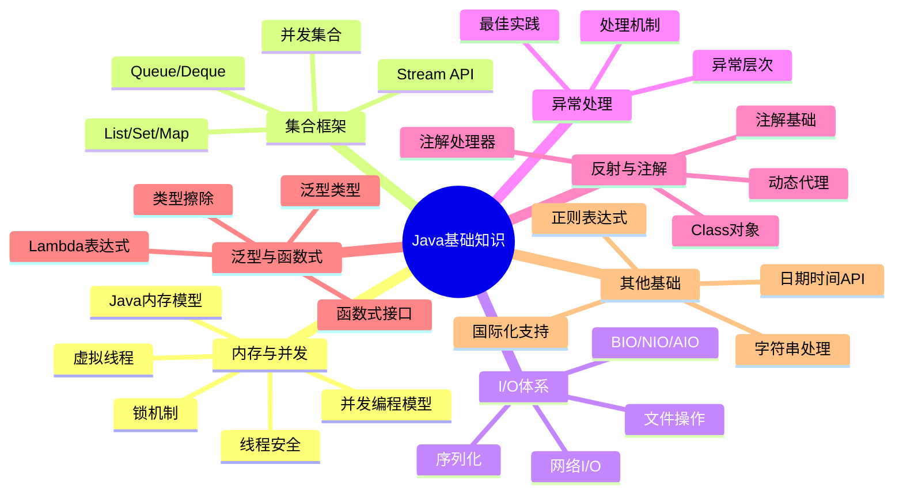

# Java基础知识体系

## 🌟 核心模块

## 📚 模块导航

### 内存与并发

- [Java内存模型详解](./JMM/README.md)
  - [内存模型基础](./JMM/JMM.md)
  - [线程安全机制](./JMM/ThreadSafety.md)
  - [线程安全高级特性](./JMM/ThreadSafety2.md)
  - [锁自由编程](./JMM/LockFreeJava.md)
  - [并发编程模型](./JMM/ConcurrencyModels.md)
  - [并发未来展望](./JMM/Future.md)

### 集合框架

- [Java集合框架详解](./Collections/README.md)
  - [集合框架概述](./Collections/Overview.md)
  - [List详解](./Collections/List.md)
  - [Map详解](./Collections/Map.md)
  - [Set详解](./Collections/Set.md)
  - [Queue详解](./Collections/Queue.md)
  - [并发集合](./Collections/ConcurrentCollections.md)
  - [集合最佳实践](./Collections/BestPractices.md)

### I/O体系

- [Java I/O体系详解](./IO/README.md)
  - [I/O体系概述](./IO/Overview.md)
  - [字节流详解](./IO/ByteStreams.md)
  - [字符流详解](./IO/CharacterStreams.md)
  - [NIO详解](./IO/NIO.md)
  - [NIO.2特性](./IO/NIO2.md)
  - [序列化与反序列化](./IO/Serialization.md)
  - [I/O性能优化](./IO/Performance.md)

### 异常处理

- [Java异常处理机制详解](./Exceptions/README.md)
  - [异常体系概述](./Exceptions/Overview.md)
  - [异常处理语法](./Exceptions/Syntax.md)
  - [常见异常分析](./Exceptions/CommonExceptions.md)
  - [自定义异常](./Exceptions/CustomExceptions.md)
  - [异常处理策略](./Exceptions/Strategies.md)
  - [异常性能优化](./Exceptions/Performance.md)
  - [实战案例](./Exceptions/CaseStudies.md)

### 反射与注解

- [Java反射与注解机制详解](./Reflection/README.md)
  - [反射机制概述](./Reflection/ReflectionOverview.md)
  - [类与成员反射](./Reflection/ClassReflection.md)
  - [泛型与反射](./Reflection/Generics.md)
  - [动态代理](./Reflection/DynamicProxy.md)
  - [注解基础](./Reflection/AnnotationBasics.md)
  - [元注解详解](./Reflection/MetaAnnotations.md)
  - [注解处理器](./Reflection/AnnotationProcessors.md)
  - [反射性能优化](./Reflection/Performance.md)

### 泛型与函数式

- [Java泛型与函数式编程](./FunctionalProgramming/README.md)
  - [泛型基础](./FunctionalProgramming/GenericsBasics.md)
  - [泛型高级特性](./FunctionalProgramming/AdvancedGenerics.md)
  - [Lambda表达式](./FunctionalProgramming/Lambda.md)
  - [函数式接口](./FunctionalProgramming/FunctionalInterfaces.md)
  - [方法引用](./FunctionalProgramming/MethodReferences.md)
  - [Stream API详解](./FunctionalProgramming/StreamAPI.md)
  - [函数式编程最佳实践](./FunctionalProgramming/BestPractices.md)

### 其他基础

- [Java字符串处理](./Strings/README.md)
- [Java日期时间API](./DateTime/README.md)
- [Java国际化支持](./I18n/README.md)
- [Java正则表达式](./Regex/README.md)

## 📊 学习路径图

以下是针对不同水平的Java开发者推荐的学习路径：

### 初学者路径

1. **基础入门**：
   - Java语法基础
   - 面向对象编程
   - 字符串处理
   - 异常处理基础

2. **数据处理**：
   - 集合框架基础
   - 简单I/O操作
   - 日期时间API

3. **进阶概念**：
   - 泛型基础
   - 注解基本使用
   - Lambda基础

### 中级开发者路径

1. **深入核心**：
   - Java内存模型
   - 并发编程基础
   - NIO与文件处理
   - 函数式编程

2. **设计能力**：
   - 异常设计
   - 集合框架高级特性
   - 注解设计与使用
   - 泛型高级特性

3. **性能优化**：
   - I/O性能优化
   - 异常处理优化
   - 反射高效使用

### 高级开发者路径

1. **专家级特性**：
   - 并发编程高级模型
   - 锁自由编程
   - 自定义注解处理器
   - 高级Stream操作

2. **框架设计**：
   - 反射与元编程
   - 底层I/O模型
   - 内存模型与JVM调优
   - 动态代理与AOP

3. **前沿技术**：
   - 虚拟线程与结构化并发
   - 现代Java特性
   - 高性能编程技术

## 📌 基础知识重要性分析

下表展示了各Java基础知识模块在不同应用场景中的重要性：

| 知识模块 | Web开发 | 微服务 | 大数据处理 | 桌面应用 | Android开发 |
|---------|--------|--------|-----------|----------|------------|
| 内存与并发 | ⭐⭐⭐⭐ | ⭐⭐⭐⭐⭐ | ⭐⭐⭐⭐⭐ | ⭐⭐⭐ | ⭐⭐⭐⭐ |
| 集合框架 | ⭐⭐⭐⭐ | ⭐⭐⭐⭐ | ⭐⭐⭐⭐⭐ | ⭐⭐⭐⭐ | ⭐⭐⭐⭐ |
| I/O体系 | ⭐⭐⭐ | ⭐⭐⭐⭐ | ⭐⭐⭐⭐⭐ | ⭐⭐⭐⭐ | ⭐⭐ |
| 异常处理 | ⭐⭐⭐⭐ | ⭐⭐⭐⭐ | ⭐⭐⭐ | ⭐⭐⭐ | ⭐⭐⭐ |
| 反射与注解 | ⭐⭐⭐⭐⭐ | ⭐⭐⭐⭐ | ⭐⭐⭐ | ⭐⭐ | ⭐⭐⭐ |
| 泛型与函数式 | ⭐⭐⭐⭐ | ⭐⭐⭐⭐ | ⭐⭐⭐⭐⭐ | ⭐⭐⭐ | ⭐⭐⭐ |
| 字符串处理 | ⭐⭐⭐⭐ | ⭐⭐⭐ | ⭐⭐⭐ | ⭐⭐⭐ | ⭐⭐⭐ |
| 日期时间API | ⭐⭐⭐ | ⭐⭐⭐ | ⭐⭐⭐ | ⭐⭐⭐ | ⭐⭐⭐ |

## 📖 推荐学习资源

### 官方文档
- [Java SE Documentation](https://docs.oracle.com/javase/)
- [The Java Tutorials](https://docs.oracle.com/javase/tutorial/)
- [JDK Release Notes](https://www.oracle.com/java/technologies/javase/jdk-relnotes-index.html)

### 经典书籍
- 《Java核心技术》(Core Java)
- 《Effective Java》
- 《Java并发编程实战》(Java Concurrency in Practice)
- 《深入理解Java虚拟机》
- 《Java编程思想》(Thinking in Java)

### 在线课程平台
- [Coursera - Java Programming](https://www.coursera.org/specializations/java-programming)
- [Udemy - Java Masterclass](https://www.udemy.com/course/java-the-complete-java-developer-course/)
- [Pluralsight - Java Courses](https://www.pluralsight.com/paths/java)

### 社区与论坛
- [Stack Overflow - Java](https://stackoverflow.com/questions/tagged/java)
- [Reddit - Java](https://www.reddit.com/r/java/)
- [Java Ranch](https://coderanch.com/f/33/java)

---

© Java知识库 2023 