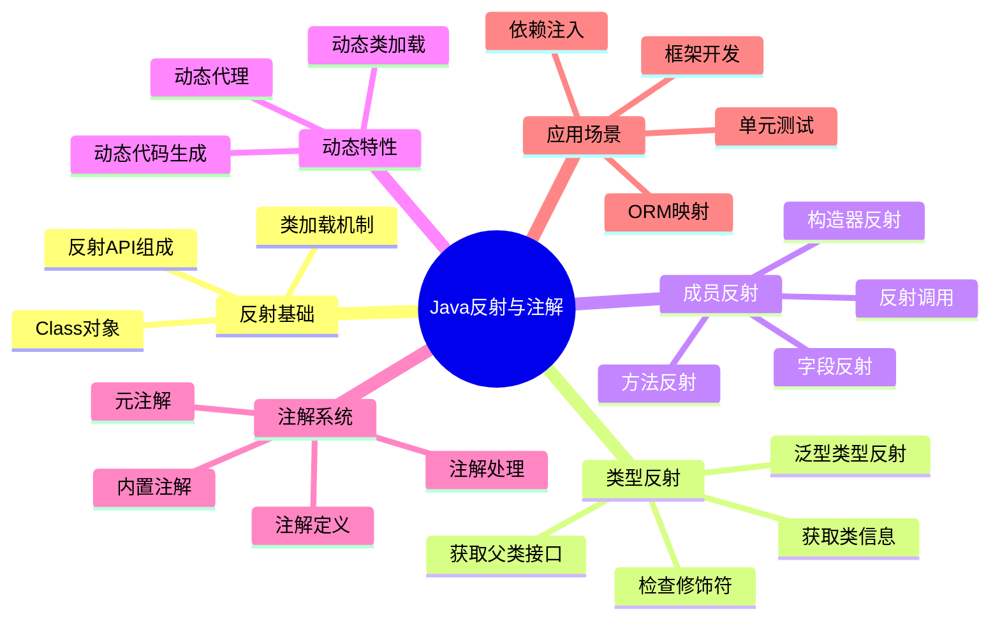
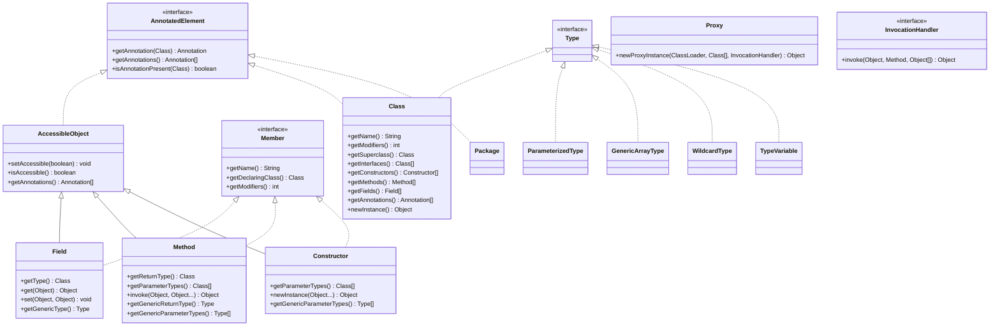

# Java反射与注解机制详解

## 📚 内容导航

- [反射机制概述](./ReflectionOverview.md) - Java反射API的设计理念与基础用法
- [类与成员反射](./ClassReflection.md) - 类、字段、方法、构造器的反射操作
- [泛型与反射](./Generics.md) - 泛型类型与反射的结合使用
- [动态代理](./DynamicProxy.md) - 基于接口和基于类的动态代理实现
- [注解基础](./AnnotationBasics.md) - 注解的定义、使用和处理
- [元注解详解](./MetaAnnotations.md) - @Retention、@Target等元注解的用法
- [注解处理器](./AnnotationProcessors.md) - 编译时和运行时注解处理技术
- [反射性能优化](./Performance.md) - 反射调用的性能优化策略

## 🔍 反射与注解知识结构



## 📊 反射主要API结构图



## ⚙️ 注解类型系统

```mermaid
graph TD
    A[Java注解] --> B[元注解]
    A --> C[内置注解]
    A --> D[自定义注解]
    
    B --> B1[@Retention]
    B --> B2[@Target]
    B --> B3[@Documented]
    B --> B4[@Inherited]
    B --> B5[@Repeatable]
    
    C --> C1[@Override]
    C --> C2[@Deprecated]
    C --> C3[@SuppressWarnings]
    C --> C4[@FunctionalInterface]
    C --> C5[@SafeVarargs]
    
    B1 --> B11[RetentionPolicy.SOURCE]
    B1 --> B12[RetentionPolicy.CLASS]
    B1 --> B13[RetentionPolicy.RUNTIME]
    
    B2 --> B21[ElementType.TYPE]
    B2 --> B22[ElementType.FIELD]
    B2 --> B23[ElementType.METHOD]
    B2 --> B24[...]
    
    D --> D1[标记注解]
    D --> D2[单值注解]
    D --> D3[完整注解]
    D --> D4[重复注解]
    
    classDef meta fill:#f9a,stroke:#333,stroke-width:2px;
    classDef builtin fill:#aaf,stroke:#333,stroke-width:2px;
    classDef custom fill:#afa,stroke:#333,stroke-width:2px;
    
    class B,B1,B2,B3,B4,B5,B11,B12,B13,B21,B22,B23,B24 meta;
    class C,C1,C2,C3,C4,C5 builtin;
    class D,D1,D2,D3,D4 custom;
```

## 🧩 反射应用场景

### 反射的常见用途

1. **依赖注入框架**：Spring、Guice等通过反射实现IoC容器
2. **ORM框架**：Hibernate、MyBatis等使用反射映射对象和数据库
3. **单元测试框架**：JUnit使用反射调用测试方法
4. **序列化/反序列化**：JSON处理库如Jackson、Gson等
5. **动态代理**：AOP实现、RPC框架
6. **类库适配**：兼容不同版本API
7. **插件系统**：动态加载和实例化插件类

### 代码示例：属性注入

```java
public class SimpleInjector {
    public static <T> T createInstance(Class<T> clazz) throws Exception {
        // 创建实例
        T instance = clazz.getDeclaredConstructor().newInstance();
        
        // 处理所有带@Inject注解的字段
        for (Field field : clazz.getDeclaredFields()) {
            if (field.isAnnotationPresent(Inject.class)) {
                field.setAccessible(true);
                
                // 为字段创建实例并注入
                Class<?> fieldType = field.getType();
                Object fieldInstance = createInstance(fieldType);
                field.set(instance, fieldInstance);
            }
        }
        
        return instance;
    }
}

// 自定义注解
@Retention(RetentionPolicy.RUNTIME)
@Target(ElementType.FIELD)
@interface Inject {}

// 使用示例
class ServiceA {
    public String getMessage() {
        return "Hello from ServiceA";
    }
}

class ServiceB {
    @Inject
    private ServiceA serviceA;
    
    public String getMessageFromA() {
        return serviceA.getMessage();
    }
}
```

### 代码示例：动态代理

```java
// 动态代理示例
public class LoggingProxy {
    @SuppressWarnings("unchecked")
    public static <T> T createProxy(T target) {
        Class<?> targetClass = target.getClass();
        
        return (T) Proxy.newProxyInstance(
            targetClass.getClassLoader(),
            targetClass.getInterfaces(),
            new InvocationHandler() {
                @Override
                public Object invoke(Object proxy, Method method, Object[] args) throws Throwable {
                    System.out.println("Before method: " + method.getName());
                    try {
                        Object result = method.invoke(target, args);
                        System.out.println("After method: " + method.getName());
                        return result;
                    } catch (Exception e) {
                        System.out.println("Exception in method: " + method.getName());
                        throw e;
                    }
                }
            }
        );
    }
}
```

## 📝 注解示例

### 基本注解定义

```java
// 元注解的使用
@Retention(RetentionPolicy.RUNTIME) // 在运行时保留
@Target({ElementType.TYPE, ElementType.METHOD}) // 可用于类和方法
@Documented // 包含在JavaDoc中
public @interface Auditable {
    String value() default ""; // 没有默认值的属性在使用时必须指定
    String modifiedBy() default "unknown";
    String modifiedOn() default "today";
}

// 使用注解
@Auditable(value = "重要操作", modifiedBy = "admin")
public class BankAccount {
    private String accountNumber;
    
    @Auditable("转账操作")
    public void transfer(String toAccount, double amount) {
        // 转账逻辑
    }
}
```

### 注解处理示例

```java
// 运行时注解处理
public class AuditProcessor {
    public static void processAudit(Class<?> clazz) {
        // 处理类上的注解
        if (clazz.isAnnotationPresent(Auditable.class)) {
            Auditable audit = clazz.getAnnotation(Auditable.class);
            System.out.println("类 " + clazz.getName() + " 的审计信息:");
            System.out.println("  - 操作: " + audit.value());
            System.out.println("  - 修改人: " + audit.modifiedBy());
            System.out.println("  - 修改时间: " + audit.modifiedOn());
        }
        
        // 处理方法上的注解
        for (Method method : clazz.getDeclaredMethods()) {
            if (method.isAnnotationPresent(Auditable.class)) {
                Auditable audit = method.getAnnotation(Auditable.class);
                System.out.println("方法 " + method.getName() + " 的审计信息:");
                System.out.println("  - 操作: " + audit.value());
                System.out.println("  - 修改人: " + audit.modifiedBy());
                System.out.println("  - 修改时间: " + audit.modifiedOn());
            }
        }
    }
}
```

## 💡 最佳实践

### 反射使用建议

1. **谨慎使用**：反射降低了类型安全性并影响性能
2. **缓存反射对象**：重复获取Class、Method等对象会影响性能
3. **异常处理**：适当处理反射相关的异常
4. **访问控制**：合理使用setAccessible方法
5. **替代方案**：可能的情况下使用接口和多态替代反射

### 注解设计原则

1. **保持简单**：注解应简单明了，避免过度复杂的设计
2. **文档完善**：为注解提供完整的文档说明
3. **合理默认值**：为注解属性提供合理的默认值
4. **约定优于配置**：遵循"约定优于配置"原则设计注解
5. **适当的保留策略**：根据使用场景选择合适的RetentionPolicy

## 📘 相关资源

- [返回Java基础首页](../README.md)
- [Java内存模型与并发编程](../JMM/README.md)
- [Java I/O体系](../IO/README.md)
- [Java集合框架](../Collections/README.md)

---

© Java知识库 2023 