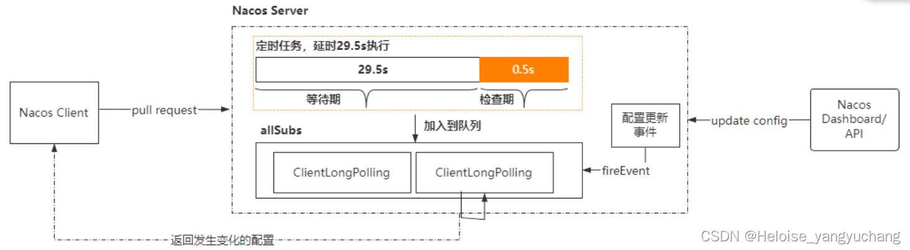

# Nacos

## 配置中心原理
  nacos 配置中心就是采用：客户端 long pull 的方式
  
  - Nacos 客户端会循环请求服务端变更的数据，并且超时时间设置为30s，当配置发生变化时，请求的响应会立即返回，否则会一直等到 29.5s+ 之后再返回响应
  - 客户端的请求到达服务端后，服务端将该请求加入到一个叫 allSubs 的队列(ConcurrentLinkedQueue)中，等待配置发生变更时 DataChangeTask主动去触发，并将变更后的数据写入响应对象。
  - 与此同时服务端也将该请求封装成一个调度任务去执行，等待调度的期间就是等DataChangeTask 主动触发的，如果延迟时间到了 DataChangeTask 还未触发的话，则调度任务开始执行数据变更的检查，然后将检查的结果写入响应对象（基于文件的MD5）

## 注册中心原理

## 参考资料
  - [Nacos 原理](https://blog.csdn.net/qq_35958391/article/details/124501708)
