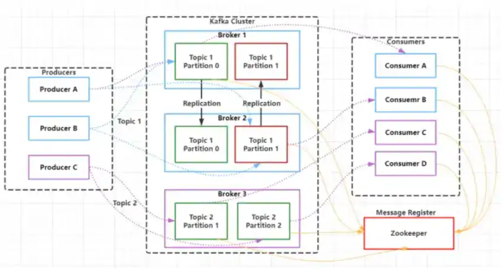

# Kafka

## 架构
 
 
## 概念
 - **Consumer Group**：消费者组，消费者组内每个消费者负责消费不同分区的数据，提高消费能力。逻辑上的一个订阅者。
 - **Topic**：可以理解为一个队列，Topic 将消息分类，生产者和消费者面向的是同一个 Topic。
 - **Partition**：为了实现扩展性，提高并发能力，一个Topic 以多个Partition的方式分布到多个Broker 上，每个partition 是一个有序的队列。一个Topic 的每个Partition都有若干个副本 (Replica），一个Leader 和若干个Follower。生产者发送数据的对象，以及消费者消费数据的对象，都是 Leader。 Follower负责实时从 Leader 中同步数据，保持和Leader 数据的同步。Leader 发生故障时，某个Follower 还会成为新的Leader。
  - **ISR**:如果一个follower落后leader不超过某个时间國值，那么则则ISR中，否则将放在OSR中。

## 高可用性
  - Kafka 一个最基本的架构认识：由多个 broker 组成，每个 broker 是一个节点；你创建一个topic，这个 topic 可以划分为多个 partition，每个 partition 可以存在于不同的 broker 上，每个partition 就放一部分数据。这就是天然的分布式消息队列，就是说一个 topic 的数据，是分散放在多个机器上的，每个机器就放一部分数据。
  - Kafka 0.8 以后，提供了 HA 机制，就是 replica（复制品） 副本机制。每个 partition 的数据都会同步到其它机器上，形成自己的多个 replica 副本。所有 replica 会选举一个 leader 出来，那么生产和消费都跟这个 leader 打交道，然后其他 replica 就是 follower。写的时候，leader 会负责把数据同步到所有 follower 上去，读的时候就直接读 leader 上的数据即可。只能读写 leader？很简单，要是你可以随意读写每个 follower，那么就要 care 数据一致性的问题，系统复杂度太高，很容易出问题。Kafka 会均匀地将一个 partition 的所有 replica 分布在不同的机器上，这样才可以提高容错性。

## 高性能高吞吐原因
  - 1、磁盘顺序读写：保证了消息的堆积
    - •顺序读写，磁盘会预读，预读即在读取的起始地址连续读取多个页面，主要时间花费在了传输时间，而这个时间两种读写可以认为是一样的。
    - •随机读写，因为数据没有在一起，将预读浪费掉了。需要多次寻道和旋转延迟。而这个时间可能是传输时间的许多倍。
  - 2、零拷贝：避免CPU将数据从一块存储拷贝到另外一块存储的技术
    - •传统的数据复制：
      - 1、读取磁盘文件数据到内核缓冲区
      - 2、将内核缓冲区的数据copy到用户缓冲区
      - 3、将用户缓冲区的数据copy到socket的发送缓冲区了、将socket发送缓冲区中的数据发送到网卡进行传输
    - •零拷贝：磁盘文件->内核空间读取缓冲区->网卡接口->消费者进程
  - 3、分区分段＋索引
    - Kafka的smessage消息实际上是分布式存储在一个一个小的segment中的，每次文件操作也是直接操作的segment。为了进一步的查询优化，Kafka又默认为分段后的数据文件建立了索引文件，就是文件系统上的.index文件。这种分区分段＋素引1的设计，不仅提升了数据读取的效率，同时也提高了数据操作的并行度
  - 4、批量压缩(gzip)：多条消息一起压缩，降低带宽
  - 5、批量读写
  - 6、直接操作page cache， 而不是JVM、避免GC耗时及对象创建耗时，且读写速度更高，进程重启、缓存也不会丢

## 消息的顺序性
 - kafka只保证单partition有序，如果Kafka要保证多个partition有序，不仅broker保存的数据要保持顺序，消费时也要按序消费。假设partition1堵了，为了有序，那partition2以及后续的分区也不能被消费，这种情况下，Kafka 就退化成了单一队列，毫无并发性可言，极大降低系统性能。因此Kafka使用多partition的概念，并且只保证单partition有序。这样不同partiiton之间不会干扰对方。

## 高可用方案(消息不丢失)
 - 消息发送
   - ack：0、不重试，1、lead写入成功就返回了，all/-1、等待SR同步完再返回
   - unclean.leader.election.enable：false， 禁止选举ISR以外的follower为leader
   - tries>1，重试次数
   - min.insync.replicas ＞1：同步副本数，没满足该值前、不提供读写服务、写操作会异常
 - 消费：
   - 手工提交offset
 - broker：减小刷盘间隔
 - 事务消息

## 消息的顺序性
 - 一个 topic，一个 partition，一个 consumer，内部单线程消费，单线程吞吐量太低，一般不会用这个。
 - 写 N 个内存 queue，具有相同 key 的数据都到同一个内存 queue；然后对于 N 个线程，每个线程分别消费一个内存 queue 即可，这样就能保证顺序性。

## 事务

## Kafka3.0改进
  Apache Kafka 3.0 引入了各种新功能、突破性的 API 更改以及对 KRaft 的改进——Apache Kafka 的内置共识机制将取代 Apache ZooKeeper™。

## 参考资料
  - [kafka是如何实现高性能高吞吐的？](https://blog.csdn.net/weixin_42103983/article/details/121796316)
  - [03、如何理解Kafka和Zookeeper的关系 ](https://www.cnblogs.com/suyj/p/16786273.html)

  