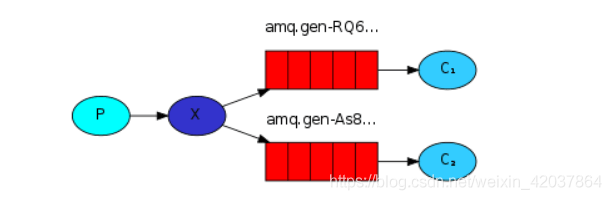

# RabbitMQ

## RabbitMQ 基本概念
   
   - **Message**
   消息，消息是不具名的，它由消息头和消息体组成。消息体是不透明的，而消息头则由一系列的可选属性组成，这些属性包括routing-key（路由键）、priority（相对于其他消息的优先权）、delivery-mode（指出该消息可能需要持久性存储）等。
   - **Publisher**
   消息的生产者，也是一个向交换器发布消息的客户端应用程序。
   - **Exchange**
   交换器，用来接收生产者发送的消息并将这些消息路由给服务器中的队列。
   - **Binding**
   绑定，用于消息队列和交换器之间的关联。一个绑定就是基于路由键将交换器和消息队列连接起来的路由规则，所以可以将交换器理解成一个由绑定构成的路由表。
   - **Queue**
   消息队列，用来保存消息直到发送给消费者。它是消息的容器，也是消息的终点。一个消息可投入一个或多个队列。消息一直在队列里面，等待消费者连接到这个队列将其取走。
   - **Connection**
   网络连接，比如一个TCP连接。
   - **Channel**
   信道，多路复用连接中的一条独立的双向数据流通道。信道是建立在真实的TCP连接内地虚拟连接，AMQP 命令都是通过信道发出去的，不管是发布消息、订阅队列还是接收消息，这些动作都是通过信道完成。因为对于操作系统来说建立和销毁 TCP 都是非常昂贵的开销，所以引入了信道的概念，以复用一条 TCP 连接。
   ***常用的交换器主要分为***：
     - fanout：如果交换器收到消息，将会广播到所有绑定的队列上。如果routing_key 有指定也不会生效
     - direct：如果路由键完全匹配，消息就被投递到相应的队列
     - topic：可以使来自不同源头的消息能够到达同一个队列。 使用 topic 交换器时，可以使用通配符进行模糊匹配
       - 符号“#”匹配一个或多个词
         eg：" log.# "能够匹配到‘ log.info.oa ’
       - 符号“ * ” 匹配不多不少一个词
         eg：“ log.* ”只能匹配到“log.erro
     - headers： 不常用，不予介绍
   - **Consumer**
   消息的消费者，表示一个从消息队列中取得消息的客户端应用程序。
   - **Virtual Host**
   虚拟主机，表示一批交换器、消息队列和相关对象。虚拟主机是共享相同的身份认证和加密环境的独立服务器域。每个 vhost 本质上就是一个 mini 版的 RabbitMQ 服务器，拥有自己的队列、交换器、绑定和权限机制。vhost 是 AMQP 概念的基础，必须在连接时指定，RabbitMQ 默认的 vhost 是 / 。
   - **Broker**
   表示消息队列服务器实体。

## RabbitMQ的消息模式(工作模式)
   - 简单模式
     > 简单模式是最简单的消息模式，它包含一个生产者、一个消费者和一个队列。生产者向队列里发送消息，消费者从队列中获取消息并消费。
     
   - work 工作模式
     > 工作模式是指向多个互相竞争的消费者发送消息的模式，它包含一个生产者、两个消费者和一个队列。两个消费者同时绑定到一个队列上去，当消费者获取消息处理耗时任务时，空闲的消费者从队列中获取并消费消息。
     
   - pub/sub 发布订阅模式
     > 发布/订阅模式是指**同时向多个消费者发送消息的模式（类似广播的形式）**，它包含一个生产者、两个消费者、两个队列和一个交换机。两个消费者同时绑定到不同的队列上去，两个队列绑定到交换机上去，生产者通过发送消息到交换机，所有消费者接收并消费消息。
     
   - Routing 路由模式
     > 路由模式是可以根据路由键选择性给多个消费者发送消息的模式，它包含一个生产者、两个消费者、两个队列和一个交换机。两个消费者同时绑定到不同的队列上去，两个队列通过路由键绑定到交换机上去，生产者发送消息到交换机，交换机通过路由键转发到不同队列，队列绑定的消费者接收并消费消息
     
   - Topic 主题模式
     > (路由模式的一种,形象比喻路由模式为sql查询的精确查询，通配符模式为模糊查询)
      通配符模式是可以根据路由键匹配规则选择性给多个消费者发送消息的模式，它包含一个生产者、两个消费者、两个队列和一个交换机。两个消费者同时绑定到不同的队列上去，两个队列通过路由键匹配规则绑定到交换机上去，生产者发送消息到交换机，交换机通过路由键匹配规则转发到不同队列，队列绑定的消费者接收并消费消息。
      特殊匹配符号
      *：只能匹配一个单词；
      #：可以匹配零个或多个单词。
       


## RabbitMQ的高可用
  - RiabbitMQ是基于主从（非分布式）做高可用性的。
  - RabbitMQ 有三种模式：单机模式、普通集群模式、镜像集群模式(高可用性)。
  - 镜像集群模式是所谓的 RabbitMQ 的高可用模式。跟普通集群模式不一样的是，在镜像集群模式下，你创建的 queue，无论元数据还是 queue 里的消息都会存在于多个实例上，就是说，每个 RabbitMQ 节点都有这个 queue 的一个完整镜像，包含 queue 的全部数据的意思。然后每次你写消息到 queue 的时候，都会自动把消息同步到多个实例的 queue 上。

## RabbitMQ消息的可靠性(不丢失)
  
  - 生产者丢失消息的情况
    - 方案一：**开启事务**，RabbitMQ 事务机制（同步）一搞，基本上吞吐量会下来，因为太耗性能。
    ```java
    // 开启事务 
    channel.txSelect 
    try {
        // 这里发送消息
        } catch (Exception e) { 
            channel.txRollback 
            // 这里再次重发这条消息 
        }
        // 提交事务 
        channel.txCommit
    ```
    - 方案二：**生产者开启confirm模式(推荐)**
    - 每次写的消息都会分配一个唯一的 id，然后如果写入了 RabbitMQ 中，RabbitMQ 会给你回传一个 ack 消息，告诉你说这个消息 ok 了。如果RabbitMQ 没能处理这个消息，会回调你的一个 nack 接口，告诉你这个消息接收失败，你可以重试。而且你可以结合这个机制自己在内存里维护每个消息 id 的状态，如果超过一定时间还没接收到这个消息的回调，那么你可以重发。事务机制和 confirm 机制最大的不同在于，事务机制是同步的，你提交一个事务之后会阻 塞在那儿，但是 confirm 机制是异步的，你发送个消息之后就可以发送下一个消息，然后那个消息 RabbitMQ 接收了之后会异步回调你的一个接口通知你这个消息接收到了。所以一般在生产者这块避免数据丢失，都是用 confirm 机制的。
  - MQ丢失消息的情况
    - 开启RabbitMQ 的持久化
      - 创建 queue 的时候将其设置为持久化
        > 这样就可以保证 RabbitMQ 持久化 queue 的元数据，但是它是不会持久化 queue 里的数据的。
      -  第二个是发送消息的时候将消息的 deliveryMode 设置为 2,就是将消息设置为持久化的，此时 RabbitMQ 就会将消息持久化到磁盘上去。
      - 必须要同时设置这两个持久化才行，RabbitMQ 哪怕是挂了，再次重启，也会从磁盘上重启恢复queue，恢复这个 queue 里的数据。
- 消费端弄丢了数据的情况
  - 用RabbitMQ 提供的 ack 机制，简单来说，就是你必须关闭 RabbitMQ 的自动ack ，可以通过一个 api 来调用就行，然后每次你自己代码里确保处理完的时候，再在程序里 ack 一把。这样的话，如果你还没处理完，不就没有 ack 了？那 RabbitMQ 就认为你还没处理完，这个时候 RabbitMQ 会把这个消费分配给别的 consumer 去处理，消息是不会丢的。


## 消息的顺序性
  - 拆分多个 queue，每个 queue 一个 consumer，就是多一些 queue 而已，确实是麻烦点；或者就一个 queue 但是对应一个 consumer，然后这个 consumer 内部用内存队列做排队，然后分发给底层不同的 worker 来处理

## 参考资料
  - [RabbitMQ的消息模式](https://blog.csdn.net/weixin_42037864/article/details/110945672)