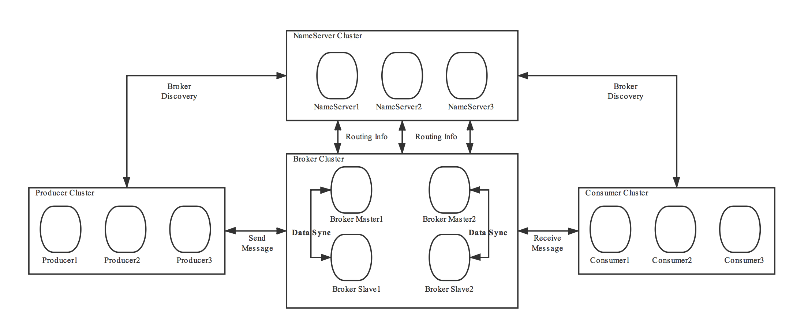

# RocketMQ
  

## RocketMQ如何保证消息不丢失
 - 持久化机制：RocketMQ 将消息持久化到磁盘上，确保即使发生宕机等异常情况，也能够在重启后继续传递未被消费的消息。RocketMQ 默认将消息存储到本地文件中，并支持多种存储方式，例如 RocksDB、MySQL 等。
 - 同步刷盘：RocketMQ 在发送消息时可以选择同步刷盘模式，即消息发送成功后立即将数据刷写到磁盘上，确保消息不会因为进程奔溃等原因丢失。虽然同步刷盘会带来一定的性能损耗，但是对于关键业务场景非常有用。
 - 复制机制：RocketMQ 支持对消息进行多副本复制，将消息存储到多个 Broker 上，确保即使某一个 Broker 发生故障，也能从其他 Broker 上获取该消息。
 - 容错机制：RocketMQ 在设计时考虑了各种可能的错误情况，并提供了相应的容错机制。例如，如果某个 Broker 发生故障，Producer 和 Consumer 可以自动切换到其他正常的 Broker 上；如果 Producer 发送消息失败，RocketMQ 会尝试自动重试；如果 Consumer 处理消息失败，RocketMQ 可以根据配置进行消息重试或者丢弃该消息。

## 参考资料
  - [架构篇 RocketMQ 的架构设计](https://juejin.cn/post/7067733864143142925)
---

- [返回首页](../../../README.md)