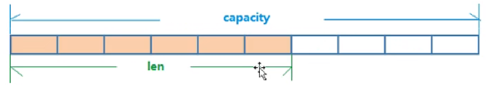

# Redis
## 一. Redis数据类型
### 1.String
  - 一个Redis中字符串value最多可以是512M
  - String的数据结构为简单动态字符串（Simple Dynamic String，缩写SDS）。是可以修改的字符串，内部结构上类似于Java的ArrayList，采用分配冗余空间的方式来减少内存的频繁分配。
  
  - 如图所示，内部为当前字符串实际分配的空间capacity一般要高于实际字符串长度len。当字符串长度小于1M时，扩容都是加倍现有的空间，如果超过1M，扩容时一次会多扩容1M的空间。

### 2.List
### 3.Hash
### 4.Set
### 5.ZSet
