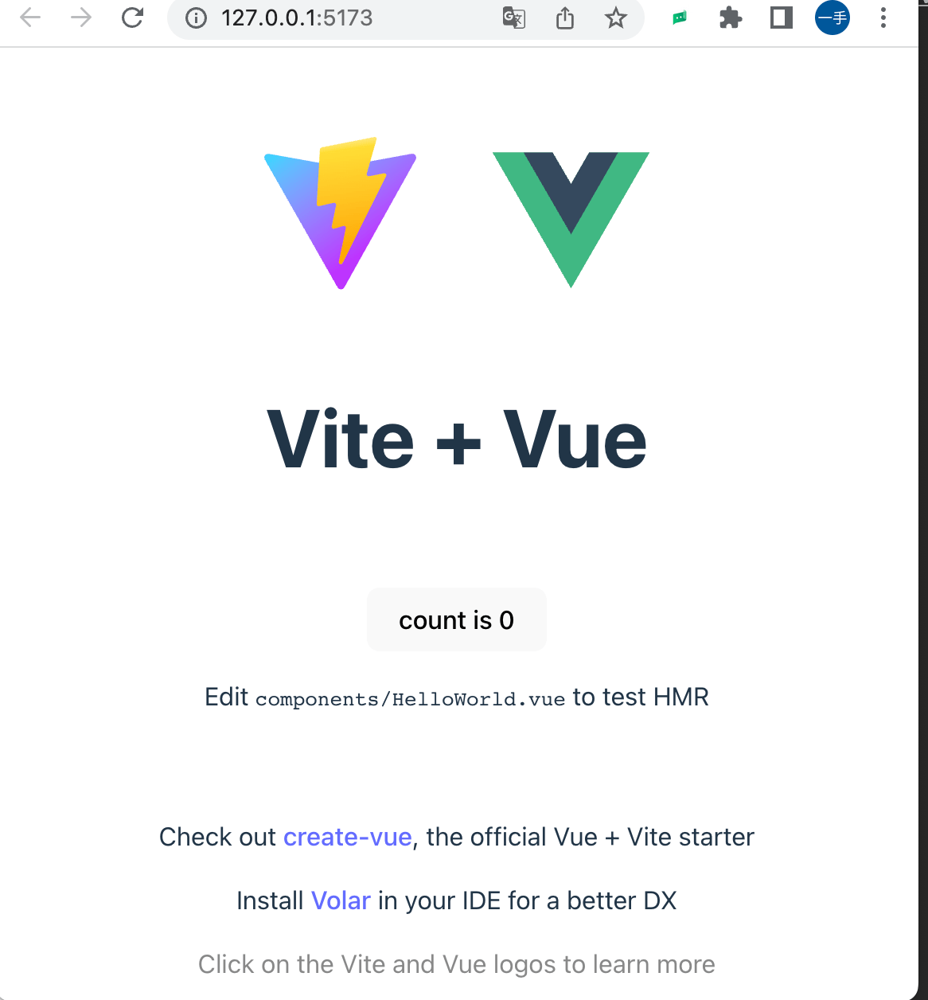

- [Vue3实战](#vue3实战)
  - [1、环境准备](#1环境准备)
    - [1.1安装nvm](#11安装nvm)
    - [1.2 安装Node.js](#12-安装nodejs)
  - [2.搭建脚手架项目](#2搭建脚手架项目)
    - [2.1创建脚手架项目](#21创建脚手架项目)
    - [2.2 安装依赖](#22-安装依赖)
    - [2.3 启动](#23-启动)
  - [3.改造项目](#3改造项目)
      - [3.1 修改 App.vue，删除默认的 HelloWorld 组件](#31-修改-appvue删除默认的-helloworld-组件)
    - [3.2 安装配置Element Plus](#32-安装配置element-plus)
    - [3.3 配置路由](#33-配置路由)
    - [3.3 安装配置 Axios](#33-安装配置-axios)
    - [3.4 http.js：主要用来封装各种请求：](#34-httpjs主要用来封装各种请求)
    - [3.5 配置跨域](#35-配置跨域)
    - [3.6 登录界面](#36-登录界面)
    - [3.7 新建接口](#37-新建接口)
    - [3.8 登录校验](#38-登录校验)
    - [3.9 设置主页](#39-设置主页)
  - [附录](#附录)
    - [1.nvm常用命令](#1nvm常用命令)
  - [参考资料](#参考资料)

---
# Vue3实战

## 1、环境准备
  - 电脑： MacBook Pro Apple M1 Max
  
### 1.1安装nvm
  - 1.移除可能已经存在的Node版本
  ```shell
   #Remove existing Node Versions
   brew uninstall --ignore-dependencies node 
   brew uninstall --force node 
  ```
  - 2.安装NVM到Mac OS
    - 使用brew安装mvm
      ```shell
       #brew update 
       brew install nvm 
      ```
    - 配置NVM环境变量
      ```shell
       vim ~/.bash_profile 
      ```
       添加如下内容
      ```shell
       export NVM_DIR=~/.nvm
       source $(brew --prefix nvm)/nvm.sh
      ```
      刷新环境变量
      ```shell
      # source ~/.bash_profile 
      # 新版本的macOS Catalina开始，新用户的默认shell改为了zsh对于zsh，使用.zshrc, 已手动在.zshrc中source ~/.bash_profile
      source ~/.zshrc
      ```
   - 3.检查nvm是否已安装成功
     ```shell
      nvm -v
      > 0.39.3
     ```
     **Note**: [附录：nvm常用命令](#1nvm常用命令)

 ### 1.2 安装Node.js
   ```shell
    #查看所有网上可安装的node版本
    nvm ls-remote 
    # 安装了指定版本Node
    # 2022-7-12的最新LTS:16.16.0
    # 2022-2-23的最新LTS:v18.14.2 
    nvm install 16.17.0
    #看安装的所有node.js的版本
    nvm ls
     #显示当前版本
    nvm current
    > v16.17.0
    # 切换使用指定的版本node
    nvm use <version>
    #永久node版本切换
    nvm alias default v16.17.0
    nvm use v16.17.0

    # 查看npm版本(npm是随node绑定安装的)
    npm -v 
    > 8.15.0
   ```
   ---

## 2.搭建脚手架项目
### 2.1创建脚手架项目
   ```shell
   # npm 6.x
   npm init vite@latest vue3-kiwi --template vue

   # npm 7+ & npm 8+
   npm init vite@latest vue3-kiwi -- --template vue 
   # 会提醒需要安装, 直接y
   > Need to install the following packages:
   > create-vite@4.1.0
   > Ok to proceed? (y) y
   ```
### 2.2 安装依赖
   ```shell
    cd vue3-kiwi
    npm install
   ```
### 2.3 启动
   ```shell
    npm run dev
   ```
   


## 3.改造项目
#### 3.1 修改 App.vue，删除默认的 HelloWorld 组件
 使用以下内容覆盖App.vue中的所有内容
```Typescript
<template>
  <div>
    <router-view></router-view>
  </div>
</template>
<script setup>
</script>
<style scoped>
</style>
```   
### 3.2 安装配置Element Plus
  [Element Plus官网](http://element-plus.org/zh-CN/)
  ```shell
    # npm install module-name --save自动把模块和版本号添加到dependencies部分 npm install module-name --save-dev自动把模块和版本号添加到devDependencies部分
    npm install element-plus --save
  ```
  在 main.js 配置 Element plus, 增加以下内容
  ```javascript
   import ElementPlus from 'element-plus'
   import 'element-plus/dist/index.css'

   const app = createApp(App)
   app.use(ElementPlus)
   app.mount('#app')
  ```

### 3.3 配置路由
  ```shell
   npm install vue-router --save
  ```
  在 src 文件夹下新建 router 文件夹，然后新建 index.js, 撰写下列内容
  ``` javascript
  import { createRouter, createWebHashHistory } from "vue-router"
  const routes = [

  ]
  const router = createRouter({
      history:createWebHashHistory(),
      routes
  })

  //挂在路由导航守卫：to表示将要访问的路径，from表示从哪里来，next是下一个要做的操作

  router.beforeEach((to, from, next) => {
      //修改页面 title
      if (to.meta.title) {
          document.title = 'Kiwi课堂后台管理系统 - ' + to.meta.title
      }
      //放行登录页面
      if (to.path == '/login') {
          return next();
      }

      //获取token
      const token = sessionStorage.getItem('token')
      if (!token) {
          return next('/login')
      } 

      return next();
  })

  //导出路由
  export default router;
  ```
  在 main.js 中配置路由
  ```JavaScript
   import router from './router/index.js'

   app.use(router).use(ElementPlus)
  ```
 ### 3.3 安装配置 Axios
   axios 是一个基于Promise 用于浏览器和 nodejs 的 HTTP 客户端
  ```shell
  npm i axios -- save
  ```
  在 src 文件夹下新建 utils 文件夹，在 utils 文件夹下新建 http 文件夹，然后 新建 axios.js 和 http.js。
  ```JavaScript
    import axios from "axios"
    import {ElMessage} from "element-plus"
    //1.创建axios实例
    const instance = axios.create({
        //接口
        baseURL: "/api",
        //超时时间
        timeout: 50000,
    });
    //2.请求拦截
    instance.interceptors.request.use(
        config => {
            let token = sessionStorage.getItem('token')
            if (token) {
                config.headers['token'] = token
            }
            return config;
        },
        error => {
            //请求发生错误，抛出异常
            Promise.reject(error);

        }
    );

    //3.响应拦截
    instance.interceptors.response.use(
        res => {
            return res;
        },
        error => {
            if (error && error.response) {
                const status =  error.response.status
                switch (status) {
                    case 400:
                    ElMessage.error("请求错误");
                    break;
                    case 401:
                      ElMessage.error("未授权，请重新登录");
                      break;
                    case 403:
                      ElMessage.error("拒绝访问");
                      break;
                    case 404:
                      ElMessage.error("请求错误，未找到相应的资源");
                      break;
                    case 408:
                      ElMessage.error("请求超时");
                      break;
                    case 500:
                      ElMessage.error("服务器内部错误");
                      break;
                    case 501:
                      ElMessage.error("网络未实现");
                      break;
                    case 502:
                      ElMessage.error("网络错误");
                      break;
                    case 503:
                      ElMessage.error("服务不可用");
                      break;
                    case 504:
                      ElMessage.error("网络超时");
                      break;
                    case 505:
                      ElMessage.error("HTTP版本不支持该请求");
                      break;
                    default:
                      ElMessage.error("请求失败, 错误码:" + status);
                }
            } else {
                if (JSON.stringify(error).includes("timeout")) {
                    ElMessage.error("服务器响应超时，请刷新页面");
                  }
                ElMessage.error("连接服务器失败");
            }
            return Promise.reject(error);
        }
    );

    // 4.导出 axios 实例
    export default instance;
  ```
 ### 3.4 http.js：主要用来封装各种请求：
   axios是基于Promise的，因此可以使用Promise API
   ```Javascript
    import instance from "./axios"

    const post = (url, data) => {
        return new Promise((resolve, reject) => {
            instance.post(url, data).then(res => {
                resolve(res)
            }).catch(err => {
                reject(err)
            })
        })
    }
    const get = (url, data) => {
        return new Promise((resolve, reject) => {
            instance.get(url, { params: data }).then(res => {
                resolve(res)
            }).catch(err => {
                reject(err)
            })
        })
    }
    const put = (url, data) => {
        return new Promise((resolve, reject) => {
            instance.put(url, data).then(res => {
                resolve(res)
            }).catch(err => {
                reject(err)
            })
        })
    }

    const del = (url, data) => {
        return new Promise((resolve, reject) => {
            instance.delete(url, { params: data }).then(res => {
                resolve(res)
            }).catch(err => {
                reject(err)
            })
        })
    }

    export default {
        post, get, put, del
    }
   ```

 ### 3.5 配置跨域
  在 vite.config.js 配置跨域：  
  target 是后台接口地址。
  /api 就是 axios 实例的 baseURL 属性。 
  ```javascript
    export default defineConfig({
      plugins: [vue()],
      server: {
        open: false,
        port: 3000,
        proxy: {
          '/api': {
            target: 'http://localhost:8082/kiwi-vue-backend',
            changeOrigin: true,
            rewrite: (path) => path.replace(/^\/api/, '')
          },
        },
      },
    })
  ```
 ### 3.6 登录界面
 在 /router/index.js 中配置登录的路由：
 ```javascript
  const routes = [
    {
      path: '/',
      redirect: '/login'
    }
  ]
 ```
 在src目录下新建view文件夹
 然后在 view 文件夹下新建 Login.vue
 登录页面主要使用了 Element plus 的 Container 布局容器、卡片、表单以及 Icon 图标。
 ```html
  <template>
    <div>
      <el-container>
        <el-header>
          <div style = "width:400px">
            <p style = "float:left;">
              <el-icon color= "#409EFF":size="50">
                <ElementPlus />
            </p>
            <p style="float: left;font-size: 25px; font-weight: bold">
              欢迎来到kiwi在线课堂
            </p>
          </div>
        </el-header>
        <el-main>
          <el-card class="login_card">
            <el-form :model="form" :rules="rules" ref="ruleFormRef" label-width="80px">
              <el-form-item label="账号：" prop="username">
                <el-input v-model="form.username" placeholder="请输入账号" />
              </el-form-item>
              <el-form-item label="密码：" prop="password">
                <el-input type="password" placeholder="请输入密码" v-model="form.password" />
              </el-form-item>
              <el-form-item>
                <el-button type="primary" @click="onSubmit()">登录</el-button>
                <el-button type="primary" @click="resetForm()">重置</el-button>
              </el-form-item>
            </el-form>
          </el-card>
        </el-main>
        <el-footer>
          <p>关于我们 | 联系我们 | 人才招聘 | 广告服务 | 友情链接 | kiwi社区 | kiwi公益</p>
          <p>Copyright © 2022-2023 <el-tag>公众号：kiwi技术</el-tag></p>
        </el-footer>
      </el-container>  
    </div>
  </template>
 ```
 在 Element plus 中，Icon 需要在main.js中单独配置：
 ```js
  import * as Icons from '@element-plus/icons-vue'

  const app = createApp(App)
  for (let i in Icons) {
      app.component(i, Icons[i])
  }
 ```
 在Login.vue绑定表单属性
 ```js
 <script setup>
  import userApi from "../api/user";
  import { reactive, ref, getCurrentInstance } from "vue";
  import { ElMessage } from "element-plus";
  import router from "../router/index";
  const { proxy } = getCurrentInstance();
  const form = reactive({
      username:"",
      password:"",
  });

 </script>
 ```

### 3.7 新建接口
在src目录下创建api目录，新建user.js
```js
import http from '../utils/http/http.js'

const login = (data) => {
    return http.post("/user/login", data);
};
const getUserList = (data) => {
    return http.get("/user/list", data);
};
const saveUser = (data) => {
    return http.post("/user/save", data);
};
const delUser = (data) => {
    return http.del("/user/delete", data);
};
const getUserDetail = (data) => {
    return http.get("/user/detail", data);
};
export default {
    login, getUserList, saveUser, delUser, getUserDetail
}
```

### 3.8 登录校验
Login.vue的scrip中增加
```js
<script setup>
……
const form = reactive({
    username:"",
    password:"",
});
const ruleFormRef = ref();
const rules = reactive({
  username: [{ required: true, message: "账号不能为空", trigger: "blur" }],
  password: [{ required: true, message: "密码不能为空", trigger: "blur" }],
});
……
</script>
```
登录校验：
```js
const onSubmit = () => {
  if (!ruleFormRef) return;
  ruleFormRef.value.validate(async (valid) => {
    if (valid) {
      const res = await userApi.login(form);
      if (res.data) {
        if (res.data.success) {
          // proxy.$commonJs.changeView('/home');
          router.push("/home");
        } else {
          ElMessage.error(res.data.message);
        }
      } else {
        ElMessage.error("服务器内部错误");
      }
    } else {
      return false;
    }
  });
};
```

### 3.9 设置主页


---
## 附录
### 1.nvm常用命令
   ```shell
    #查看所有网上可安装的node版本
    nvm ls-remote 
    #安装了指定版本(2022-7-12的最新LTS:16.16.0)
    nvm install 16.16.0
    #看安装的所有node.js的版本
    nvm ls
    #是查找本电脑上所有的node版本
    nvm list 
    #查看已经安装的版本
    nvm list installed 
    #查看网络可以安装的版本 
    nvm list available 
    #安装最新版本nvm
    nvm install 
    # 切换使用指定的版本node
    nvm use <version> 
    #列出所有版本
    nvm ls 
    #显示当前版本
    nvm current
    #给不同的版本号添加别名
    nvm alias <name> <version> 
    # 删除已定义的别名
    nvm unalias <name> 
    #在当前版本node环境下，重新全局安装指定版本号的npm包
    #nvm reinstall-packages <version>
    #打开nodejs控制
    nvm on 
    #关闭nodejs控制
    nvm off 
    #查看设置与代理
    nvm proxy 
    #设置或者查看setting.txt中的node_mirror，如果不设置的默认是 https://nodejs.org/dist/
    nvm node_mirror [url] 
    #设置或者查看setting.txt中的npm_mirror,如果不设置的话默认的是： https://github.com/npm/npm/archive/.
    nvm npm_mirror [url] 
    #卸载制定的版本
    nvm uninstall <version> 
    #切换制定的node版本和位数
    nvm use [version] [arch] 
    #设置和查看root路径
    nvm root [path] 
    #永久node版本切换
    nvm alias default v9.4.0
    nvm use v9.4.0
   ```
 
 ## 参考资料
  - [超详细！10分钟开发一个Vue3的后台管理系统](https://juejin.cn/post/7175760401701797947)